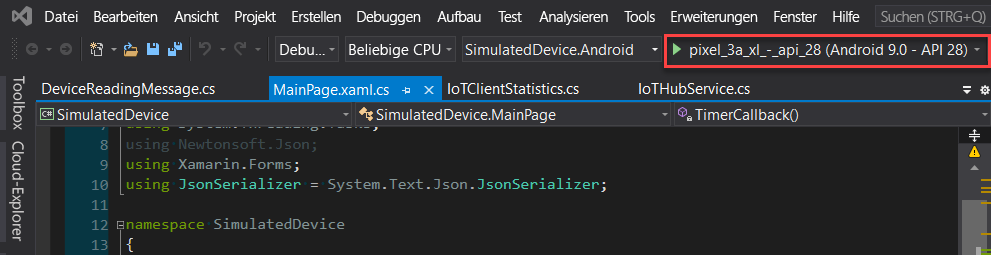
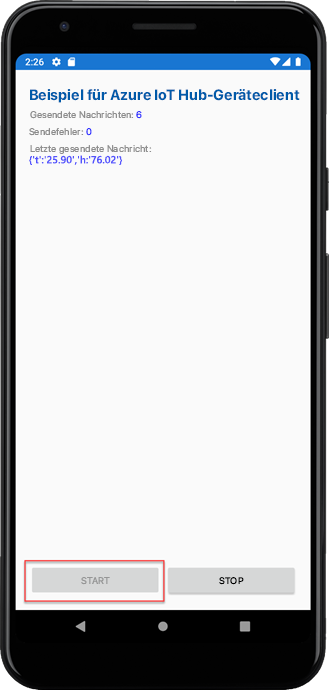

# <a name="quickstart-send-telemetry-from-a-device-to-an-iot-hub-xamarinforms"></a>Schnellstart: Senden von Telemetriedaten von einem Gerät an einen IoT-Hub (Xamarin.Forms)

[!INCLUDE [iot-hub-quickstarts-1-selector](../../includes/iot-hub-quickstarts-1-selector.md)]

IoT Hub ist ein Azure-Dienst, mit dem Sie umfangreiche Telemetriedaten von Ihren Geräten in der Cloud erfassen können, um sie zu speichern oder zu verarbeiten. In diesem Artikel senden Sie Telemetriedaten von einer simulierten Geräteanwendung an IoT Hub. Die Daten können dann über eine Back-End-Anwendung angezeigt werden.

In diesem Artikel wird eine vorgefertigte Xamarin.Forms-Anwendung verwendet, um die Telemetriedaten zu senden. Zum Lesen aus IoT Hub wird ein CLI-Programm verwendet.

[!INCLUDE [cloud-shell-try-it.md](../../includes/cloud-shell-try-it.md)]

Wenn Sie kein Azure-Abonnement besitzen, können Sie ein [kostenloses Konto](https://azure.microsoft.com/free/?WT.mc_id=A261C142F) erstellen, bevor Sie beginnen.


## <a name="prerequisites"></a>Voraussetzungen

- Laden Sie das Codebeispiel aus den [Azure-Beispielen](https://github.com/Azure-Samples/azure-iot-samples-xamarin/archive/master.zip) herunter.

- Die aktuelle Version von [Visual Studio 2019](https://visualstudio.microsoft.com/) oder [Visual Studio für Mac](https://visualstudio.microsoft.com/) mit installierten Xamarin.Forms-Tools. Diese Schnellstartanleitung wurde mit Visual Studio 16.6.0 getestet.

- Stellen Sie sicher, dass Port 8883 in Ihrer Firewall geöffnet ist. Für das Beispielgerät in dieser Schnellstartanleitung wird das MQTT-Protokoll verwendet, das über den Port 8883 kommuniziert. In einigen Netzwerkumgebungen von Unternehmen oder Bildungseinrichtungen ist dieser Port unter Umständen blockiert. Weitere Informationen und Problemumgehungen finden Sie unter [Herstellen einer Verbindung mit IoT Hub (MQTT)](iot-hub-mqtt-support.md#connecting-to-iot-hub).

- Führen Sie den folgenden Befehl aus, um Ihrer Cloud Shell-Instanz die Microsoft Azure IoT-Erweiterung für die Azure-Befehlszeilenschnittstelle hinzuzufügen. Die IoT-Erweiterung fügt der Azure-Befehlszeilenschnittstelle spezifische Befehle für IoT Hub, IoT Edge und IoT Device Provisioning Service (DPS) hinzu.

   ```azurecli-interactive
   az extension add --name azure-iot
   ```

   [!INCLUDE [iot-hub-cli-version-info](../../includes/iot-hub-cli-version-info.md)]

## <a name="create-an-iot-hub"></a>Erstellen eines IoT-Hubs

[!INCLUDE [iot-hub-include-create-hub](../../includes/iot-hub-include-create-hub.md)]

## <a name="register-a-device"></a>Registrieren eines Geräts

Ein Gerät muss bei Ihrer IoT Hub-Instanz registriert sein, um eine Verbindung herstellen zu können. In dieser Schnellstartanleitung verwenden Sie Azure Cloud Shell, um ein simuliertes Gerät zu registrieren.

1. Führen Sie in Azure Cloud Shell den folgenden Befehl aus, um die Geräteidentität zu erstellen.

   **YourIoTHubName**: Ersetzen Sie diesen Platzhalter unten durch den Namen, den Sie für Ihren IoT-Hub ausgewählt haben.

   **myXamarinDevice**: Der Name des Geräts, das Sie registrieren. Es empfiehlt sich, **myXamarinDevice** wie gezeigt zu verwenden. Wenn Sie für Ihr Gerät einen anderen Namen auswählen, müssen Sie diesen innerhalb des gesamten Artikels verwenden und den Gerätenamen in den Beispielanwendungen aktualisieren, bevor Sie sie ausführen.

   ```azurecli-interactive
   az iot hub device-identity create --hub-name {YourIoTHubName} --device-id myXamarinDevice
   ```

1. Führen Sie den folgenden Befehl in Azure Cloud Shell aus, um die _Geräteverbindungszeichenfolge_ für das soeben registrierte Gerät abzurufen:

   **YourIoTHubName**: Ersetzen Sie diesen Platzhalter unten durch den Namen, den Sie für Ihren IoT-Hub ausgewählt haben.

   ```azurecli-interactive
   az iot hub device-identity show-connection-string --hub-name {YourIoTHubName} --device-id myXamarinDevice --output table
   ```

   Notieren Sie sich die Geräteverbindungszeichenfolge, die wie folgt aussieht:

   `HostName={YourIoTHubName}.azure-devices.net;DeviceId=myXamarinDevice;SharedAccessKey={YourSharedAccessKey}`

    Dieser Wert wird später in der Schnellstartanleitung benötigt.

## <a name="send-simulated-telemetry"></a>Senden simulierter Telemetriedaten

Die Beispielanwendung kann unter Windows (über eine UWP-App), auf einem iOS-Gerät oder -Simulator und auf einem Android-Gerät oder -Simulator ausgeführt werden. Es wird eine Verbindung mit einem gerätespezifischen Endpunkt auf Ihrem IoT-Hub hergestellt, und es werden simulierte Telemetriedaten zur Temperatur und Luftfeuchtigkeit gesendet. 

1. Öffnen Sie den Beispielarbeitsbereich in Visual Studio oder Visual Studio für Mac.
2. Erweitern Sie das Projekt **SimulatedDevice**.  
3. Öffnen Sie **IoTHubService.cs** zur Bearbeitung in Visual Studio. 
4. Suchen Sie nach der Variablen **_iotHubConnectionString**, und aktualisieren Sie den Wert mit der zuvor notierten Geräteverbindungszeichenfolge.
5. Speichern Sie die Änderungen. 
6. Führen Sie das Projekt im Geräteemulator oder auf einem echten Gerät aus, indem Sie die Schaltfläche **Kompilieren und ausführen** oder die Taste **F5** (unter Windows) bzw. **BEFEHL+R** (unter macOS) verwenden. 

   

7. Klicken Sie in der im Emulator geöffneten Beispiel-App auf **Starten**.

Der folgende Screenshot zeigt einige Beispielausgaben, während die Anwendung simulierte Telemetriedaten an Ihre IoT Hub-Instanz sendet: 

## <a name="read-the-telemetry-from-your-hub"></a>Lesen der Telemetriedaten aus Ihrem Hub

Die Beispiel-App, die Sie im XCode-Emulator ausgeführt haben, zeigt Daten zu Nachrichten, die vom Gerät gesendet wurden. Die eingehenden Daten können auch über die IoT Hub-Instanz angezeigt werden. Die IoT Hub-CLI-Erweiterung stellt eine Verbindung mit dem dienstseitigen Endpunkt **Events** in Ihrer IoT Hub-Instanz her. Die Erweiterung empfängt die vom simulierten Gerät gesendeten Gerät-zu-Cloud-Nachrichten. Eine IoT Hub-Back-End-Anwendung wird in der Regel in der Cloud ausgeführt, um Gerät-zu-Cloud-Nachrichten zu empfangen und zu verarbeiten.

Führen Sie in Azure Cloud Shell die folgenden Befehle aus, und ersetzen Sie dabei `YourIoTHubName` durch den Namen Ihres IoT-Hubs:

```azurecli-interactive
az iot hub monitor-events --device-id myXamarinDevice --hub-name {YourIoTHubName}
```

Der folgende Screenshot zeigt die Ausgabe, während die Erweiterung die vom simulierten Gerät an den Hub gesendeten Telemetriedaten empfängt:

Der folgende Screenshot zeigt die Art von Telemetriedaten, die in Ihrem lokalen Terminalfenster angezeigt werden: 

## <a name="clean-up-resources"></a>Bereinigen von Ressourcen

[!INCLUDE [iot-hub-quickstarts-clean-up-resources](../../includes/iot-hub-quickstarts-clean-up-resources.md)]

## <a name="next-steps"></a>Nächste Schritte

In dieser Schnellstartanleitung haben Sie einen IoT-Hub eingerichtet, ein Gerät registriert, simulierte Telemetriedaten von einer Xamarin.Forms-Anwendung an den Hub gesendet und die Telemetriedaten vom Hub gelesen. 

Um zu erfahren, wie Sie das simulierte Gerät über eine Back-End-Anwendung steuern, fahren Sie mit der nächsten Schnellstartanleitung fort.

> [!div class="nextstepaction"]
> [Schnellstart: Steuern eines mit einer IoT Hub-Instanz verbundenen Geräts](quickstart-control-device-node.md)
