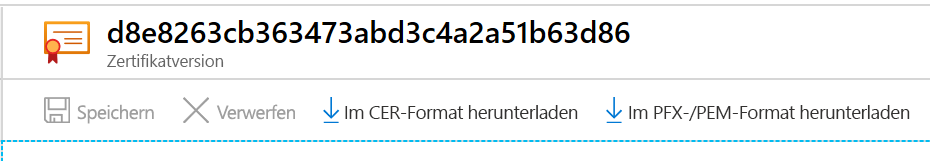

# <a name="export-certificates-from-azure-key-vault"></a>Exportieren von Zertifikaten aus Azure Key Vault

Hier erfahren Sie, wie Sie Zertifikate aus Azure Key Vault exportieren. Sie können Zertifikate über die Azure CLI, mithilfe von Azure PowerShell oder über das Azure-Portal exportieren. 

## <a name="about-azure-key-vault-certificates"></a>Informationen zu Azure Key Vault-Zertifikaten

Mit Azure Key Vault können Sie mühelos digitale Zertifikate für Ihr Netzwerk bereitstellen und verwalten. Außerdem wird die sichere Kommunikation für Anwendungen ermöglicht. Weitere Informationen finden Sie unter [Informationen zu Azure Key Vault-Zertifikaten](./about-certificates.md).

### <a name="composition-of-a-certificate"></a>Zusammensetzung eines Zertifikats

Wenn ein Key Vault-Zertifikat erstellt wird, werden auch ein adressierbarer *Schlüssel* und ein *Geheimnis* gleichen Namens erstellt. Der Azure Key-Schlüssel ermöglicht Schlüsselvorgänge. Das Key Vault-Geheimnis ermöglicht den Abruf des Zertifikatwerts als Geheimnis. Ein Key Vault-Zertifikat enthält auch öffentliche X509-Zertifikatmetadaten. Weitere Informationen finden Sie unter [Zusammensetzung eines Zertifikats](./about-certificates.md#composition-of-a-certificate).

### <a name="exportable-and-non-exportable-keys"></a>Exportierbare und nicht exportierbare Schlüssel

Nach der Erstellung eines Key Vault-Zertifikats kann es aus dem adressierbaren Geheimnis mit dem privaten Schlüssel abgerufen werden. Rufen Sie das Zertifikat im PFX- oder PEM-Format ab.

- **Exportierbar:** Die zum Erstellen des Zertifikats verwendete Richtlinie gibt an, dass der Schlüssel exportierbar ist.
- **Nicht exportierbar:** Die zum Erstellen des Zertifikats verwendete Richtlinie gibt an, dass der Schlüssel nicht exportierbar ist. In diesem Fall ist der private Schlüssel nicht Teil des Werts, wenn er als Geheimnis abgerufen wird.

Unterstützte Schlüsseltypen: RSA, RSA-HSM, EC, EC-HSM, oct ([hier](/rest/api/keyvault/createcertificate/createcertificate#jsonwebkeytype) aufgeführt). Exportierbare Schlüssel sind nur bei RSA und EC zulässig. HSM-Schlüssel sind nicht exportierbar.

Weitere Informationen finden Sie unter [Informationen zu Azure Key Vault-Zertifikaten](./about-certificates.md#exportable-or-non-exportable-key).

## <a name="export-stored-certificates"></a>Exportieren gespeicherter Zertifikate

Sie können gespeicherte Zertifikate in Azure Key Vault über die Azure CLI, mithilfe von Azure PowerShell oder über das Azure-Portal exportieren.

> [!NOTE]
> Fordern Sie nur ein Zertifikatkennwort an, wenn Sie das Zertifikat in den Schlüsseltresor importieren. Key Vault speichert das zugehörige Kennwort nicht. Wenn Sie das Zertifikat exportieren, ist das Kennwort leer.

# <a name="azure-cli"></a>[Azure-Befehlszeilenschnittstelle](#tab/azure-cli)

Verwenden Sie den folgenden Befehl in der Azure CLI, um den **öffentlichen Teil** eines Key Vault-Zertifikats herunterzuladen.

```azurecli
az keyvault certificate download --file
                                 [--encoding {DER, PEM}]
                                 [--id]
                                 [--name]
                                 [--subscription]
                                 [--vault-name]
                                 [--version]
```

Weitere Informationen finden Sie im Artikel mit [Beispielen und Parameterdefinitionen](/cli/azure/keyvault/certificate#az-keyvault-certificate-download).

Beim Herunterladen als Zertifikat erhalten Sie den öffentlichen Teil. Wenn Sie den privaten Schlüssel und die öffentlichen Metadaten benötigen, können Sie das Geheimnis herunterladen.

```azurecli
az keyvault secret download -–file {nameofcert.pfx}
                            [--encoding {ascii, base64, hex, utf-16be, utf-16le, utf-8}]
                            [--id]
                            [--name]
                            [--subscription]
                            [--vault-name]
                            [--version]
```

Weitere Informationen finden Sie im Artikel mit [Parameterdefinitionen](/cli/azure/keyvault/secret#az-keyvault-secret-download).

# <a name="powershell"></a>[PowerShell](#tab/azure-powershell)

Verwenden Sie diesen Befehl in Azure PowerShell, um das Zertifikat mit dem Namen **TestCert01** aus dem Schlüsseltresor mit dem Namen **ContosoKV01** abzurufen. Führen Sie den folgenden Befehl aus, um das Zertifikat als PFX-Datei herunterzuladen. Mit diesen Befehlen wird auf die **SecretId** zugegriffen, und anschließend wird der Inhalt als PFX-Datei gespeichert.

```azurepowershell
$cert = Get-AzKeyVaultCertificate -VaultName "ContosoKV01" -Name "TestCert01"
$secret = Get-AzKeyVaultSecret -VaultName "ContosoKV01" -Name $cert.Name
$secretValueText = '';
$ssPtr = [System.Runtime.InteropServices.Marshal]::SecureStringToBSTR($secret.SecretValue)
try {
    $secretValueText = [System.Runtime.InteropServices.Marshal]::PtrToStringBSTR($ssPtr)
} finally {
    [System.Runtime.InteropServices.Marshal]::ZeroFreeBSTR($ssPtr)
}
$secretByte = [Convert]::FromBase64String($secretValueText)
$x509Cert = new-object System.Security.Cryptography.X509Certificates.X509Certificate2
$x509Cert.Import($secretByte, "", "Exportable,PersistKeySet")
$type = [System.Security.Cryptography.X509Certificates.X509ContentType]::Pfx
$pfxFileByte = $x509Cert.Export($type, $password)

# Write to a file
[System.IO.File]::WriteAllBytes("KeyVault.pfx", $pfxFileByte)
```

Durch diesen Befehl wird die gesamte Zertifikatkette mit privatem Schlüssel exportiert (genau wie beim Import). Das Zertifikat ist kennwortgeschützt.
Weitere Informationen zum Befehl **Get-AzKeyVaultCertificate** und zu den Parametern finden Sie unter [Get-AzKeyVaultCertificate: Beispiel 2](/powershell/module/az.keyvault/Get-AzKeyVaultCertificate).

# <a name="portal"></a>[Portal](#tab/azure-portal)

Wenn Sie im Azure-Portal auf dem Blatt **Zertifikat** ein Zertifikat erstellen oder importieren, erhalten Sie die Benachrichtigung, dass die Erstellung des Zertifikats erfolgreich war. Wählen Sie das Zertifikat und die aktuelle Version aus, um die Downloadoption anzuzeigen.

Wählen Sie zum Herunterladen des Zertifikats **Im CER-Format herunterladen** oder **Im PFX-/PEM-Format herunterladen** aus.



**Exportieren von Azure App Service-Zertifikaten**

Azure App Service-Zertifikate sind eine praktische Möglichkeit, SSL-Zertifikate zu erwerben. Sie können sie Azure-Apps im Portal zuweisen. Nach dem Importieren befinden sich die App Service-Zertifikate unter **Geheimnisse**.

Weitere Informationen finden Sie im Artikel zum [Exportieren von Azure App Service-Zertifikaten](https://social.technet.microsoft.com/wiki/contents/articles/37431.exporting-azure-app-service-certificates.aspx).

---

## <a name="read-more"></a>Weitere Informationen
* [Verschiedene Zertifikatsdateitypen und -definitionen](/archive/blogs/kaushal/various-ssltls-certificate-file-typesextensions)
