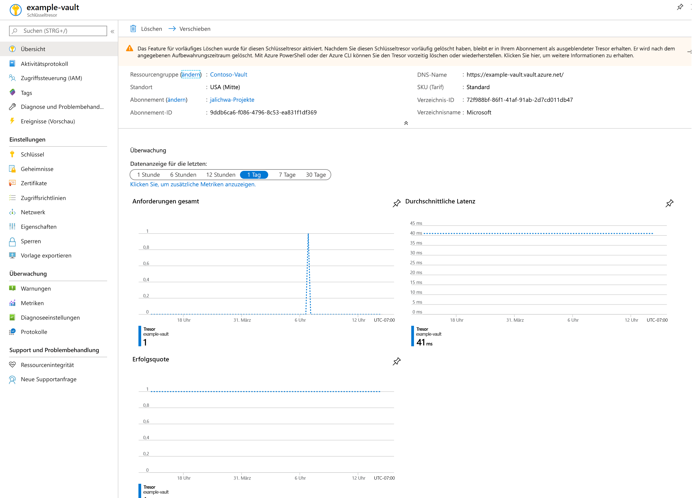
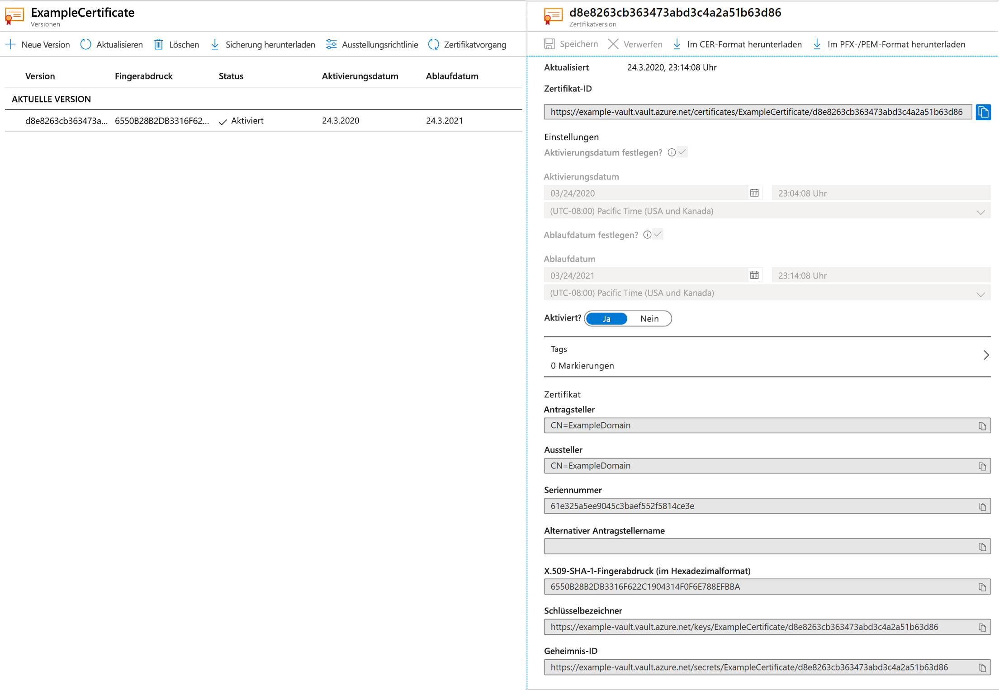

# Schnellstart: Festlegen und Abrufen eines Zertifikats aus Azure Key Vault über das Azure-Portal

Azure Key Vault ist ein Clouddienst, der als sicherer Geheimnisspeicher fungiert. Dadurch können Schlüssel, Kennwörter, Zertifikate und andere Geheimnisse sicher gespeichert werden. Azure Key Vault-Instanzen können über das Azure-Portal erstellt und verwaltet werden. In dieser Schnellstartanleitung erstellen Sie einen Schlüsseltresor und verwenden diesen dann, um ein Zertifikat zu speichern. Weitere Informationen zu Key Vault finden Sie in der [Übersicht](../general/overview.md).

Wenn Sie kein Azure-Abonnement besitzen, können Sie ein [kostenloses Konto](https://azure.microsoft.com/free/?WT.mc_id=A261C142F) erstellen, bevor Sie beginnen.

## Anmelden bei Azure

Melden Sie sich unter https://portal.azure.com beim Azure-Portal an.

## Erstellen eines Tresors

1. Wählen Sie im Menü des Azure-Portals oder auf der **Startseite** die Option **Ressource erstellen** aus.
2. Geben Sie **Key Vault** in das Suchfeld ein.
3. Wählen Sie in der Ergebnisliste **Key Vault** aus.
4. Klicken Sie im Abschnitt „Key Vault“ auf **Erstellen**.
5. Geben Sie im Abschnitt **Schlüsseltresor erstellen** folgende Informationen ein:
    - **Name**: Es ist ein eindeutiger Name erforderlich. Für diese Schnellstartanleitung verwenden wir **Example-Vault**. 
    - **Abonnement**: Wählen Sie ein Abonnement aus.
    - Klicken Sie unter **Ressourcengruppe** auf **Neu erstellen**, und geben Sie einen Ressourcengruppennamen ein.
    - Wählen Sie im Pulldownmenü **Speicherort** einen Speicherort aus.
    - Behalten Sie bei den anderen Optionen die Standardeinstellungen bei.
6. Klicken Sie nach der Angabe der obigen Informationen auf **Erstellen**.

Beachten Sie die beiden folgenden Eigenschaften:

* **Tresorname**: In diesem Beispiel ist das **Example-Vault**. Dieser Name wird noch für andere Schritte benötigt.
* **Tresor-URI**: In diesem Beispiel `https://example-vault.vault.azure.net/`. Anwendungen, die Ihren Tresor über die zugehörige REST-API nutzen, müssen diesen URI verwenden.

An diesem Punkt ist nur Ihr Azure-Konto zum Ausführen von Vorgängen für den neuen Tresor autorisiert.

## Hinzufügen eines Zertifikats zu Key Vault

Um dem Tresor ein Zertifikat hinzuzufügen, sind nur einige zusätzliche Schritte erforderlich. In diesem Fall fügen wir ein selbstsigniertes Zertifikat hinzu, das von einer Anwendung verwendet werden kann. Das Zertifikat heißt **ExampleCertificate**.

1. Wählen Sie auf den Key Vault-Eigenschaftenseiten die Option **Zertifikate** aus.
2. Klicken Sie auf **Generieren/Importieren**.
3. Wählen Sie auf dem Bildschirm **Zertifikat erstellen** folgende Werte aus:
    - **Methode der Zertifikaterstellung**: Generieren.
    - **Zertifikatname**: ExampleCertificate.
    - **Antragsteller:** CN=ExampleDomain
    - Behalten Sie bei den anderen Optionen die Standardwerte bei. Klicken Sie auf **Erstellen**.

Nachdem Sie die Meldung erhalten haben, dass das Zertifikat erfolgreich erstellt wurde, können Sie in der Liste auf das Zertifikat klicken. Daraufhin werden einige der Eigenschaften angezeigt. Wenn Sie auf die aktuelle Version klicken, sehen Sie den Wert, den Sie im vorherigen Schritt angegeben haben.

## Exportieren eines Zertifikats aus Key Vault
Sie können das Zertifikat herunterladen, indem Sie auf eine der Schaltflächen „Im CER-Format herunterladen“ oder „Im PFX-/PEM-Format herunterladen“ klicken. 

## Bereinigen von Ressourcen

Andere Schnellstartanleitungen und Tutorials für Key Vault bauen auf dieser Schnellstartanleitung auf. Falls Sie mit weiteren Schnellstartanleitungen und Tutorials fortfahren möchten, sollten Sie die Ressourcen nicht bereinigen.
Wenn Sie die Ressourcen nicht mehr benötigen, löschen Sie die Ressourcengruppe. Dadurch werden die Key Vault-Instanz und die dazugehörigen Ressourcen gelöscht. So löschen Sie die Ressourcengruppe über das Portal:

1. Geben Sie den Namen Ihrer Ressourcengruppe in das Suchfeld am oberen Rand des Portals ein. Klicken Sie in den Suchergebnissen auf die Ressourcengruppe aus dieser Schnellstartanleitung.
2. Wählen Sie die Option **Ressourcengruppe löschen**.
3. Geben Sie im Feld **GEBEN SIE DEN RESSOURCENGRUPPENNAMEN EIN:** den Namen der Ressourcengruppe ein, und klicken Sie anschließend auf **Löschen**.

## Nächste Schritte

In dieser Schnellstartanleitung haben Sie eine Key Vault-Instanz erstellt und ein Zertifikat darin gespeichert. Weitere Informationen zu Key Vault und zur Integration in Ihre Anwendungen finden Sie in den folgenden Artikeln:

- [Was ist der Azure-Schlüsseltresor?](../general/overview.md)
- [Entwicklerhandbuch zu Azure-Schlüsseltresor](../general/developers-guide.md)
- [Bewährte Methoden zum Verwenden von Key Vault](../general/best-practices.md)
