# Integrieren von Azure Key Vault in Azure Policy

[Azure Policy](../../governance/policy/index.yml) ist ein Governancetool, mit dem Benutzer ihre Azure-Umgebung bedarfsorientiert überwachen und verwalten können. Azure Policy bietet die Möglichkeit, Schutzmaßnahmen für Azure-Ressourcen zu platzieren, um sicherzustellen, dass diese mit den zugewiesenen Richtlinienregeln konform sind. Es ermöglicht es Benutzern, eine Überwachung, Echtzeiterzwingung und Wiederherstellung ihrer Azure-Umgebung auszuführen. Die Ergebnisse von Überwachungen, die per Richtlinie durchgeführt werden, stehen Benutzern in einem Konformitätsdashboard zur Verfügung. Es wird angezeigt, welche Ressourcen und Komponenten konform sind und welche nicht.  Weitere Informationen finden Sie unter [Übersicht über den Azure Policy-Dienst](../../governance/policy/overview.md).

Beispiele für Nutzungsszenarien:

- Sie möchten die Sicherheitsstufe Ihres Unternehmens verbessern, indem Sie Anforderungen in Bezug auf die Mindestschlüsselgrößen und die maximalen Gültigkeitsdauern von Zertifikaten in den Schlüsseltresoren Ihres Unternehmens implementieren, aber Sie wissen nicht, welche Teams konform sind und welche nicht.
- Zurzeit haben Sie keine Lösung, um eine Überwachung in Ihrer Organisation durchzuführen, oder Sie führen manuelle Überwachungen Ihrer Umgebung durch, indem Sie die einzelnen Teams in Ihrer Organisation bitten, ihre Konformität zu melden. Sie suchen nach einer Möglichkeit, diese Aufgabe zu automatisieren, Überwachungen in Echtzeit durchzuführen und die Genauigkeit der Überwachung sicherzustellen.
- Sie möchten die Sicherheitsrichtlinien Ihres Unternehmens erzwingen und verhindern, dass Benutzer selbstsignierte Zertifikate erstellen, Ihnen steht aber keine automatisierte Methode zur Verfügung, um diese Erstellung zu blockieren. 
- Sie möchten einige Anforderungen für Ihre Testteams lockern, aber Sie möchten auch eine strenge Kontrolle über Ihre Produktionsumgebung beibehalten. Sie benötigen eine einfache automatisierte Methode, um die Erzwingung Ihrer Ressourcen zu trennen.
- Sie möchten sicherstellen, dass Sie ein Rollback der Erzwingung neuer Richtlinien durchführen können, falls ein Problem mit der Livewebsite auftritt. Sie benötigen eine One-Click-Lösung, um die Erzwingung der Richtlinie zu deaktivieren. 
- Sie verlassen sich auf eine Drittanbieterlösung zur Überwachung Ihrer Umgebung, und Sie möchten ein internes Microsoft-Angebot verwenden.

## Arten von Richtlinienauswirkungen und Anleitung

**Überwachen**: Wenn die Auswirkung einer Richtlinie auf „Überwachen“ festgelegt ist, verursacht die Richtlinie keine Breaking Changes an Ihrer Umgebung. Sie werden nur auf Komponenten wie z. B. Zertifikate aufmerksam gemacht, die nicht mit den Richtliniendefinitionen innerhalb eines angegebenen Bereichs übereinstimmen. Dabei werden diese Komponenten im Dashboard für die Richtlinienkonformität als nicht konform markiert. Die Überwachung ist Standard, wenn keine Richtlinienauswirkung ausgewählt ist.

**Verweigern:** Wenn die Auswirkung einer Richtlinie auf „Verweigern“ festgelegt ist, blockiert die Richtlinie die Erstellung neuer Komponenten wie z. B. Zertifikaten und blockiert zudem neue Versionen vorhandener Komponenten, die der Richtliniendefinition nicht entsprechen. Vorhandene nicht konforme Ressourcen innerhalb eines Schlüsseltresors sind nicht betroffen. Die Überwachungsfunktionen werden weiterhin ausgeführt.

## Verfügbare integrierte Richtliniendefinitionen

Für Key Vault wurden einige Richtlinien erstellt, die zum Verwalten von Schlüssel-, Zertifikat- und Geheimnisobjekten verwendet werden können. Diese Richtlinien sind integriert. Das bedeutet, dass Sie keinen benutzerdefinierten JSON-Code schreiben müssen, um sie zu aktivieren, und sie sind im Azure-Portal für die Zuweisung verfügbar. Sie können aber weiterhin bestimmte Parameter an die Anforderungen Ihrer Organisation anpassen.

# [Zertifikatrichtlinien](#tab/certificates)

### Zertifikate müssen die angegebene maximale Gültigkeitsdauer aufweisen (Vorschauversion)

Mit dieser Richtlinie können Sie die maximale Gültigkeitsdauer Ihrer Zertifikate verwalten, die im Schlüsseltresor gespeichert sind. In Sachen Sicherheit hat es sich bewährt, die maximale Gültigkeitsdauer der Zertifikate zu beschränken. Wenn ein privater Schlüssel Ihres Zertifikats ohne Erkennung kompromittiert wird, minimiert die Verwendung kurzlebiger Zertifikate den Zeitrahmen für den aktuellen Schaden und reduziert den Wert des Zertifikats für einen Angreifer.

### Zertifikate müssen zulässige Schlüsseltypen verwenden (Vorschauversion)

Mit dieser Richtlinie können Sie den Zertifikattyp einschränken, der in Ihrem Schlüsseltresor vorhanden sein kann. Sie können diese Richtlinie verwenden, um sicherzustellen, dass Ihre privaten Zertifikatschlüssel durch RSA, ECC oder HSM gesichert sind. Sie können aus der folgenden Liste auswählen, welche Zertifikattypen zulässig sind.

- RSA
- RSA - HSM
- ECC
- ECC - HSM

### Zertifikate müssen die angegebenen Aktionstrigger für die Gültigkeitsdauer aufweisen (Vorschauversion)

Diese Richtlinie ermöglicht Ihnen die Verwaltung der Lebensdaueraktion, die für Zertifikate festgelegt wurde, die entweder die innerhalb einer angegebenen Anzahl von Tagen ablaufen oder einen bestimmten Prozentsatz ihrer nutzbaren Lebensdauer erreicht haben.

### Zertifikate müssen von der angegebenen integrierten Zertifizierungsstelle ausgestellt werden (Vorschauversion)

Wenn Sie eine in Key Vault integrierte Zertifizierungsstelle (Digicert oder GlobalSign) verwenden und möchten, dass Benutzer einen oder beide Anbieter verwenden, können Sie diese Richtlinie verwenden, um Ihre Auswahl zu überwachen oder zu erzwingen. Diese Richtlinie kann auch verwendet werden, um die Erstellung von selbstsignierten Zertifikaten im Schlüsseltresor zu überwachen oder zu verweigern.

### Zertifikate müssen von der angegebenen nicht integrierten Zertifizierungsstelle ausgestellt werden (Vorschauversion)

Wenn Sie eine interne Zertifizierungsstelle oder eine nicht in den Schlüsseltresor integrierte Zertifizierungsstelle verwenden und möchten, dass Benutzer eine Zertifizierungsstelle aus einer von Ihnen bereitgestellten Liste verwenden, können Sie diese Richtlinie verwenden, um eine Liste der zulässigen Zertifizierungsstellen anhand des Ausstellernamens zu erstellen. Diese Richtlinie kann auch verwendet werden, um die Erstellung von selbstsignierten Zertifikaten im Schlüsseltresor zu überwachen oder zu verweigern.

### Zertifikate mit Kryptografie für elliptische Kurve müssen zulässige Kurvennamen verwenden (Vorschauversion)

Wenn Sie Kryptografie für elliptische Kurven oder ECC-Zertifikate verwenden, können Sie eine zulässige Liste von Kurvennamen aus der folgenden Liste erstellen. Die Standardoption lässt alle folgenden Kurvennamen zu.

- P-256
- P-256K
- P-384
- P-521

## Zertifikate mit Verwendung von RSA-Kryptografie: Mindestschlüsselgröße für RSA-Zertifikate verwalten (Vorschau)

Wenn Sie RSA-Zertifikate verwenden, können Sie eine Mindestschlüsselgröße für Ihre Zertifikate auswählen. Sie können aus der folgenden Liste eine Option auswählen.

- 2048 Bit
- 3072 Bit
- 4096 Bit

## Zertifikate verwalten, die innerhalb einer angegebenen Anzahl von Tagen ablaufen (Vorschau)

Ihr Dienst kann einen Ausfall erleben, wenn ein Zertifikat, das nicht ausreichend überwacht wird, vor seinem Ablauf nicht rotiert wird. Diese Richtlinie ist wichtig, um sicherzustellen, dass Ihre im Schlüsseltresor gespeicherten Zertifikate überwacht werden. Es wird empfohlen, diese Richtlinie mehrmals mit unterschiedlichen Ablaufschwellenwerten anzuwenden, z. B. mit Schwellenwerten von 180, 90, 60 und 30 Tagen. Diese Richtlinie kann verwendet werden, um den Ablauf von Zertifikaten in Ihrer Organisation zu überwachen und zu überprüfen.

# [Richtlinien für Schlüssel](#tab/keys)

### Keys should not be active for longer than the specified number of days (preview) (Schlüssel dürfen nicht länger als die angegebene Anzahl von Tagen aktiv sein (Vorschauversion))

Wenn Sie sicherstellen möchten, dass Ihre Schlüssel nicht länger als eine angegebene Anzahl von Tagen aktiv waren, können Sie mit dieser Richtlinie die Dauer der Aktivität für Schlüssel überwachen.

**Wenn für Ihren Schlüssel ein Aktivierungsdatum festgelegt ist**, wird mit dieser Richtlinie die Anzahl von Tagen berechnet, die vom **Aktivierungsdatum** des Schlüssels bis zum aktuellen Datum verstrichen sind. Falls die Anzahl von Tagen den von Ihnen festgelegten Schwellenwert überschreitet, wird der Schlüssel als nicht mit der Richtlinie konform gekennzeichnet.

**Wenn für Ihren Schlüssel kein Aktivierungsdatum festgelegt ist**, wird mit dieser Richtlinie die Anzahl von Tagen berechnet, die vom **Erstellungsdatum** des Schlüssels bis zum aktuellen Datum verstrichen sind. Falls die Anzahl von Tagen den von Ihnen festgelegten Schwellenwert überschreitet, wird der Schlüssel als nicht mit der Richtlinie konform gekennzeichnet.

### Keys should be the specified cryptographic type RSA or ECC (preview) (Schlüssel müssen den angegebenen Kryptografietyp RSA oder ECC aufweisen (Vorschauversion))

Mit dieser Richtlinie können Sie den Schlüsseltyp einschränken, der in Ihrem Schlüsseltresor vorhanden sein darf. Sie können mit dieser Richtlinie sicherstellen, dass Ihre Schlüssel per RSA, ECC oder HSM geschützt sind. Sie können aus der folgenden Liste auswählen, welche Zertifikattypen zulässig sind.

- RSA
- RSA - HSM
- ECC
- ECC - HSM

### Keys using elliptic curve cryptography should have the specified curve names (preview) (Für Schlüssel mit Kryptografie für elliptische Kurve (ECC) müssen die angegebenen Kurvennamen verwendet werden (Vorschauversion))

Wenn Sie ECC-Schlüssel (Elliptic Curve Cryptography, Kryptografie für elliptische Kurve) verwenden, können Sie eine zulässige Liste mit Kurvennamen aus der folgenden Liste erstellen. Die Standardoption lässt alle folgenden Kurvennamen zu.

- P-256
- P-256K
- P-384
- P-521

### Keys should have expirations dates set (preview) (Für Schlüssel müssen Ablaufdaten festgelegt sein (Vorschauversion))

Mit dieser Richtlinie werden alle Schlüssel in Ihren Schlüsseltresoren überwacht und die Schlüssel, für die kein Ablaufdatum festgelegt ist, als nicht konform gekennzeichnet. Sie können diese Richtlinie auch verwenden, um die Erstellung von Schlüsseln zu blockieren, für die kein Ablaufdatum festgelegt ist.

### Keys should have more than the specified number of days before expiration (preview) (Schlüssel müssen mehr als die angegebene Anzahl von Tagen vom Ablaufdatum entfernt sein (Vorschauversion))

Wenn sich ein Schlüssel zu nah an seinem Ablaufdatum befindet, kann es bei einer organisationsbedingten Verzögerung der Rotation des Schlüssels zu einem Ausfall kommen. Schlüssel sollten nach einer angegebenen Anzahl von Tagen vor ihrem Ablauf rotiert werden, damit genügend Zeit ist, um auf Fehler reagieren zu können. Mit dieser Richtlinie werden Schlüssel überwacht, die sich zu nah an ihrem Ablaufdatum befinden, und Sie können einen entsprechenden Schwellenwert in Tagen festlegen. Sie können diese Richtlinie auch verwenden, um die Erstellung neuer Schlüssel zu verhindern, die sich zu nah am Ablaufdatum befinden.

### Keys should be backed by a hardware security module (preview) (Schlüssel müssen durch ein Hardwaresicherheitsmodul geschützt sein (Vorschauversion))

Mit einem Hardwaresicherheitsmodul (HSM) werden Schlüssel gespeichert. Hierbei handelt es sich um eine physische Schutzschicht für kryptografische Schlüssel. Der kryptografische Schlüssel kann ein physisches HSM nicht verlassen, sodass dieser einen höheren Schutz als ein Softwareschlüssel bietet. Einige Organisationen verfügen über Konformitätsanforderungen, in denen die Verwendung von HSM-Schlüsseln vorgeschrieben ist. Verwenden Sie diese Richtlinie zum Überwachen von Schlüsseln in einem Ihrer Schlüsseltresore ohne HSM-Schutz. Sie können diese Richtlinie auch verwenden, um die Erstellung neuer Schlüssel zu blockieren, die nicht per HSM geschützt sind. Diese Richtlinie gilt für alle Schlüsseltypen (RSA und ECC).

### Keys using RSA cryptography should have a specified minimum key size (preview) (Schlüssel mit Verwendung von RSA-Kryptografie müssen eine angegebene Mindestgröße für Schlüssel aufweisen (Vorschauversion))

Die Verwendung von kleineren RSA-Schlüsseln ist keine sichere Entwurfsmethode. Unter Umständen gelten für Sie bestimmte Überwachungs- und Zertifizierungsstandards, in denen die Verwendung einer Mindestgröße für Schlüssel vorgeschrieben ist. Mit der folgenden Richtlinie können Sie für Ihren Schlüsseltresor eine Mindestgröße für Schlüssel festlegen. Sie können Schlüssel überwachen, die diese Mindestanforderung nicht erfüllen. Diese Richtlinie kann auch verwendet werden, um die Erstellung neuer Schlüssel zu blockieren, die die Mindestanforderung in Bezug auf die Schlüsselgröße nicht erfüllen.

### Keys should have the specified maximum validity period (preview) (Schlüssel müssen die angegebene maximale Gültigkeitsdauer aufweisen (Vorschauversion))

Hiermit werden die Konformitätsanforderungen Ihrer Organisation verwaltet, indem die maximale Zeitspanne in Tagen angegeben wird, für die ein Schlüssel innerhalb Ihres Schlüsseltresors gültig sein darf. Schlüssel, deren Gültigkeitsdauer den von Ihnen festgelegten Schwellenwert überschreitet, werden als nicht konform gekennzeichnet. Sie können diese Richtlinie auch verwenden, um die Erstellung neuer Schlüssel zu blockieren, deren Ablaufdatum die von Ihnen angegebene maximale Gültigkeitsdauer überschreitet.

# [Richtlinien für Geheimnisse](#tab/secrets)

### Secrets should not be active for longer than the specified number of days (preview) (Geheimnisse dürfen nicht länger als die angegebene Anzahl von Tagen aktiv sein (Vorschauversion))

Wenn Sie sicherstellen möchten, dass Ihre Geheimnisse nicht länger als eine angegebene Anzahl von Tagen aktiv waren, können Sie mit dieser Richtlinie die Dauer der Aktivität für Geheimnisse überwachen.

**Wenn für Ihr Geheimnis ein Aktivierungsdatum festgelegt ist**, wird mit dieser Richtlinie die Anzahl von Tagen berechnet, die vom **Aktivierungsdatum** des Geheimnisses bis zum aktuellen Datum verstrichen sind. Falls die Anzahl von Tagen den von Ihnen festgelegten Schwellenwert überschreitet, wird das Geheimnis als nicht mit der Richtlinie konform gekennzeichnet.

**Wenn für Ihr Geheimnis kein Aktivierungsdatum festgelegt ist**, wird mit dieser Richtlinie die Anzahl von Tagen berechnet, die vom **Erstellungsdatum** des Geheimnisses bis zum aktuellen Datum verstrichen sind. Falls die Anzahl von Tagen den von Ihnen festgelegten Schwellenwert überschreitet, wird das Geheimnis als nicht mit der Richtlinie konform gekennzeichnet.

### Secrets should have content type set (preview) (Für Geheimnisse muss der Inhaltstyp festgelegt werden (Vorschauversion))

Alle Nur-Text- oder codierten Dateien können als Schlüsseltresorgeheimnis gespeichert werden. Es kann aber sein, dass Ihre Organisation andere Rotationsrichtlinien und -einschränkungen für als Schlüssel gespeicherte Kennwörter, Verbindungszeichenfolgen oder Zertifikate festlegen möchte. Anhand eines Tags für den Inhaltstyp können Benutzer sehen, was in einem Geheimnisobjekt gespeichert ist, ohne den Wert des Geheimnisses zu lesen. Sie können diese Richtlinie verwenden, um Geheimnisse zu überwachen, für kein Tag für den Inhaltstyp festgelegt wurde. Darüber hinaus können Sie diese Richtlinie auch verwenden, um die Erstellung neuer Geheimnisse zu verhindern, wenn dafür kein Tag für den Inhaltstyp vorhanden ist.

### Secrets should have expiration date set (preview) (Für Geheimnisse muss ein Ablaufdatum festgelegt werden (Vorschauversion))

Mit dieser Richtlinie werden alle Geheimnisse in Ihrem Schlüsseltresor überwacht und die Geheimnisse, für die kein Ablaufdatum festgelegt ist, als nicht konform gekennzeichnet. Sie können diese Richtlinie auch verwenden, um die Erstellung von Geheimnissen zu blockieren, für die kein Ablaufdatum festgelegt ist.

### Secrets should have more than the specified number of days before expiration (preview) (Geheimnisse müssen mehr als die angegebene Anzahl von Tagen vom Ablaufdatum entfernt sein (Vorschauversion))

Wenn sich ein Geheimnis zu nah an seinem Ablaufdatum befindet, kann es bei einer organisationsbedingten Verzögerung der Rotation des Geheimnisses zu einem Ausfall kommen. Geheimnisse sollten nach einer angegebenen Anzahl von Tagen vor ihrem Ablauf rotiert werden, damit genügend Zeit ist, um auf Fehler reagieren zu können. Mit dieser Richtlinie werden Geheimnisse überwacht, die sich zu nah an ihrem Ablaufdatum befinden, und Sie können einen entsprechenden Schwellenwert in Tagen festlegen. Sie können diese Richtlinie auch verwenden, um die Erstellung neuer Geheimnisse zu verhindern, die sich zu nah am Ablaufdatum befinden.

### Secrets should have the specified maximum validity period (preview) (Geheimnisse müssen die angegebene maximale Gültigkeitsdauer aufweisen (Vorschauversion))

Hiermit werden die Konformitätsanforderungen Ihrer Organisation verwaltet, indem die maximale Zeitspanne in Tagen angegeben wird, für die ein Geheimnis innerhalb Ihres Schlüsseltresors gültig sein darf. Geheimnisse, deren Gültigkeitsdauer den von Ihnen festgelegten Schwellenwert überschreitet, werden als nicht konform gekennzeichnet. Sie können diese Richtlinie auch verwenden, um die Erstellung neuer Geheimnisse zu blockieren, deren Ablaufdatum die von Ihnen angegebene maximale Gültigkeitsdauer überschreitet.

---

## Beispielszenario

Sie verwalten einen Schlüsseltresor mit 100 Zertifikaten, der von mehreren Teams verwendet wird, und Sie möchten sicherstellen, dass keines der Zertifikate im Schlüsseltresor länger als zwei Jahre gültig ist.

1. Sie weisen die Richtlinie **Zertifikate müssen die angegebene maximale Gültigkeitsdauer aufweisen** zu, legen eine maximale Gültigkeitsdauer von 24 Monaten für die Zertifikate fest und legen die Auswirkung der Richtlinie auf „Überwachen“ fest. 
1. Im [Konformitätsbericht im Azure-Portal](#view-compliance-results) sehen Sie, dass 20 Zertifikate nicht konform und länger als zwei Jahre gültig sind. Die restlichen Zertifikate sind konform. 
1. Sie wenden sich an die Besitzer dieser Zertifikate und teilen die neue Sicherheitsanforderung mit, aufgrund derer Zertifikate nicht länger als zwei Jahre gültig sein dürfen. Einige Teams reagieren, und 15 Zertifikate werden mit einer maximalen Gültigkeitsdauer von zwei Jahren oder weniger aktualisiert. Andere Teams reagieren nicht, und Sie verfügen weiterhin über fünf nicht konforme Zertifikate in Ihrem Schlüsseltresor.
1. Sie ändern die Auswirkung der zugewiesenen Richtlinie in „Verweigern“. Die fünf nicht konformen Zertifikate werden nicht widerrufen und funktionieren weiterhin. Sie können jedoch nicht mit einer Gültigkeitsdauer von mehr als zwei Jahren aktualisiert werden. 

## Aktivieren und Verwalten einer Key Vault-Richtlinie über das Azure-Portal

### Auswählen einer Richtliniendefinition

1. Melden Sie sich beim Azure-Portal an. 
1. Suchen Sie in der Suchleiste nach „Richtlinie“, und wählen Sie **Richtlinie**aus.

    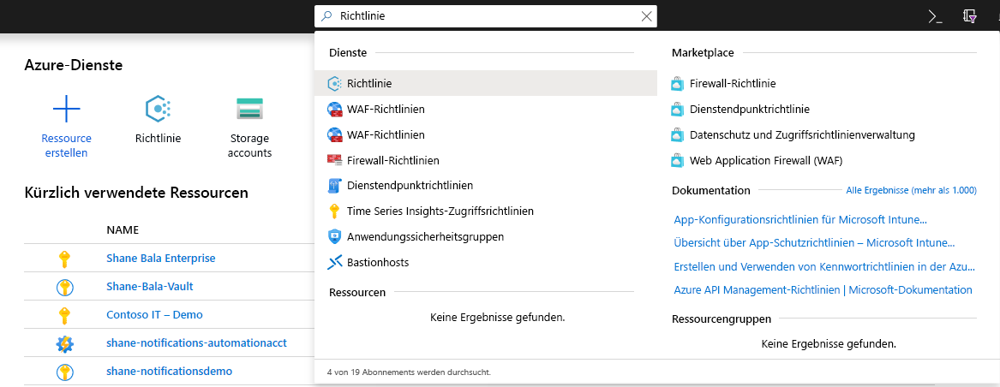

1. Wählen Sie im Fenster „Richtlinie“ die Option **Definitionen** aus.

    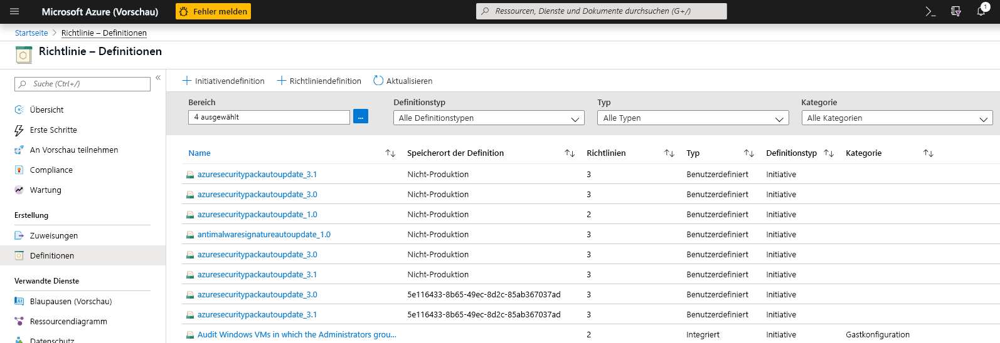

1. Deaktivieren Sie im Kategoriefilter **Alle auswählen**, und wählen Sie **Key Vault** aus. 

    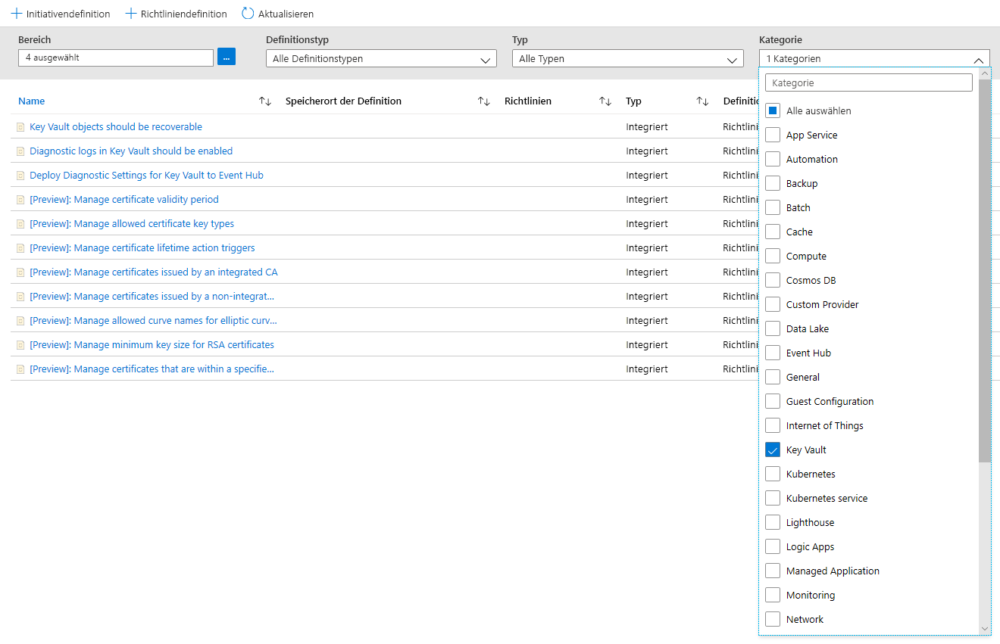

1. Jetzt sollten Ihnen alle Richtlinien angezeigt werden, die für Azure Key Vault für die Public Preview verfügbar sind. Stellen Sie sicher, dass Sie den Abschnitt mit den Richtlinienanweisungen gelesen und verstanden haben, und wählen Sie eine Richtlinie aus, die Sie einem Bereich zuweisen möchten.  

    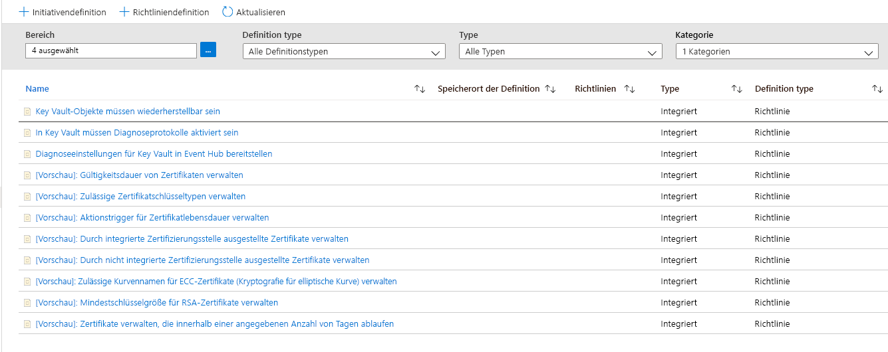

### Zuweisen einer Richtlinie zu einem Bereich 

1. Wählen Sie eine Richtlinie aus, die Sie anwenden möchten. In diesem Beispiel wird die Richtlinie **Gültigkeitsdauer von Zertifikaten verwalten** angezeigt. Klicken Sie oben links auf die Schaltfläche „Zuweisen“.

    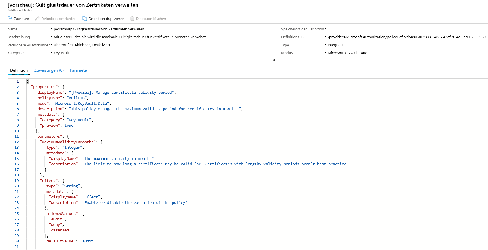
  
1. Wählen Sie das Abonnement aus, für das die Richtlinie gelten soll. Sie können den Gültigkeitsbereich auf nur eine einzelne Ressourcengruppe innerhalb eines Abonnements beschränken. Wenn Sie die Richtlinie auf das gesamte Abonnement anwenden und einige Ressourcengruppen ausschließen möchten, können Sie auch eine Ausschlussliste konfigurieren. Legen Sie den Selektor für die Richtlinienerzwingung auf **Aktiviert** fest, wenn die Auswirkung der Richtlinie (Überwachen oder Verweigern) erfolgen soll, oder auf **Deaktiviert**, um die Auswirkung (Überwachen oder Verweigern) zu deaktivieren. 

    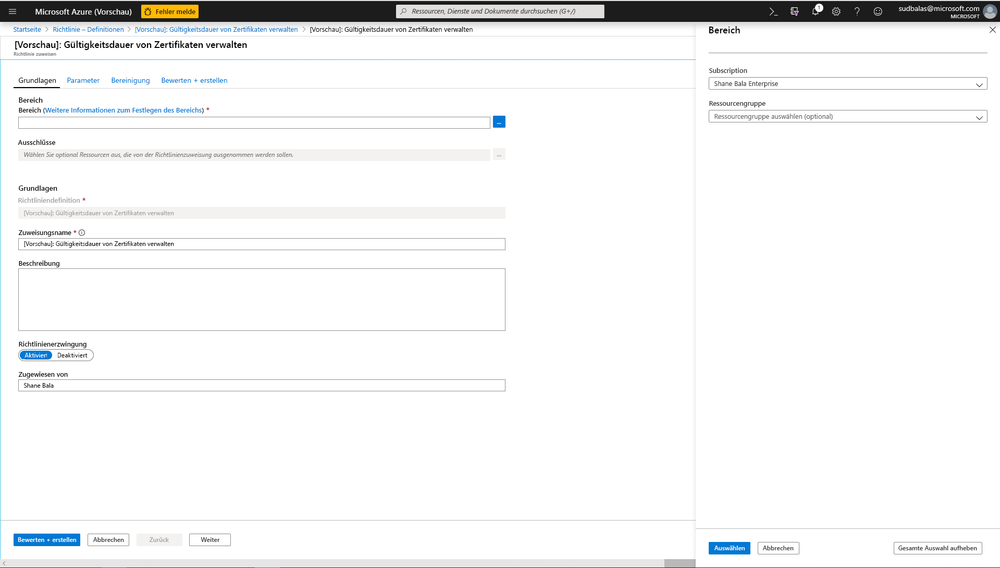

1. Klicken Sie oben auf dem Bildschirm auf die Registerkarte „Parameter“, um die gewünschte maximale Gültigkeitsdauer (in Monaten) festzulegen. Wählen Sie **Überwachen** oder **Verweigern** aus, um die Auswirkung der Richtlinie gemäß der Anleitung in den obigen Abschnitten zu erhalten. Wählen Sie anschließend die Schaltfläche „Überprüfen und erstellen“ aus. 

    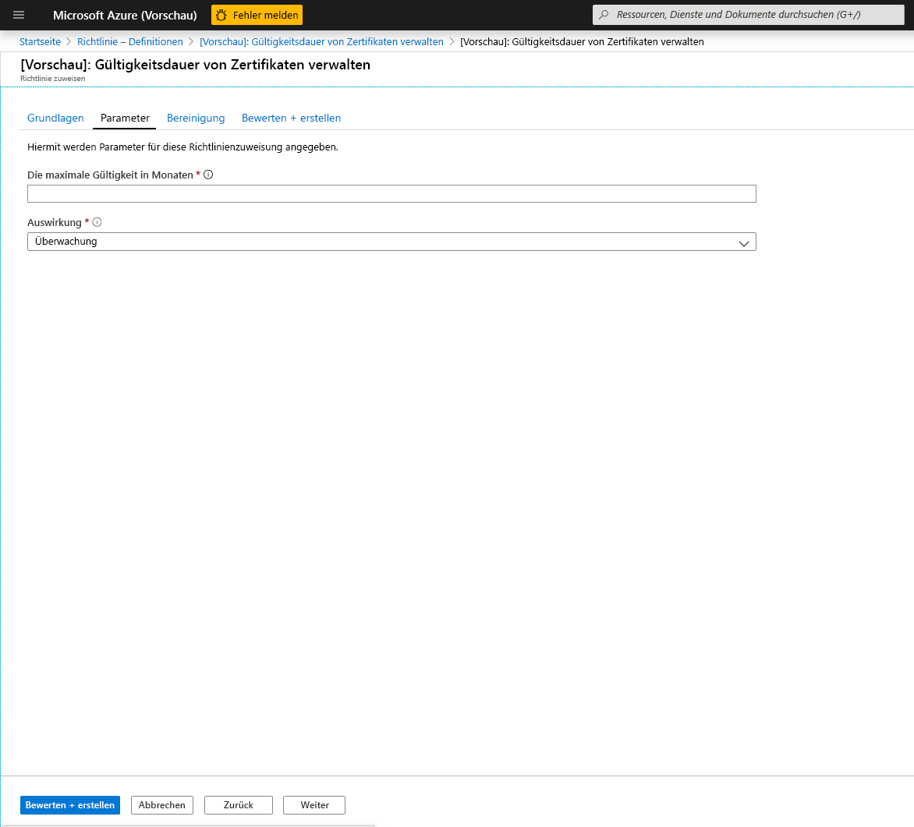

### Anzeigen von Konformitätsergebnissen

1. Wechseln Sie zurück zum Blatt „Richtlinie“, und wählen Sie die Registerkarte „Konformität“ aus. Klicken Sie auf die Richtlinienzuweisung, für die Sie die Konformitätsergebnisse anzeigen möchten.

    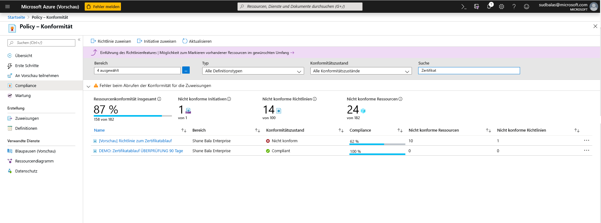

1. Auf dieser Seite können Sie Ergebnisse nach konformen oder nicht konformen Tresoren filtern. Hier sehen Sie eine Liste nicht konformer Schlüsseltresore innerhalb des Gültigkeitsbereichs der Richtlinienzuweisung. Ein Tresor wird als nicht konform eingestuft, wenn eine der Komponenten (Zertifikate) im Tresor nicht konform ist. Sie können einen einzelnen Tresor auswählen, um die einzelnen nicht konformen Komponenten (Zertifikate) anzuzeigen. 

    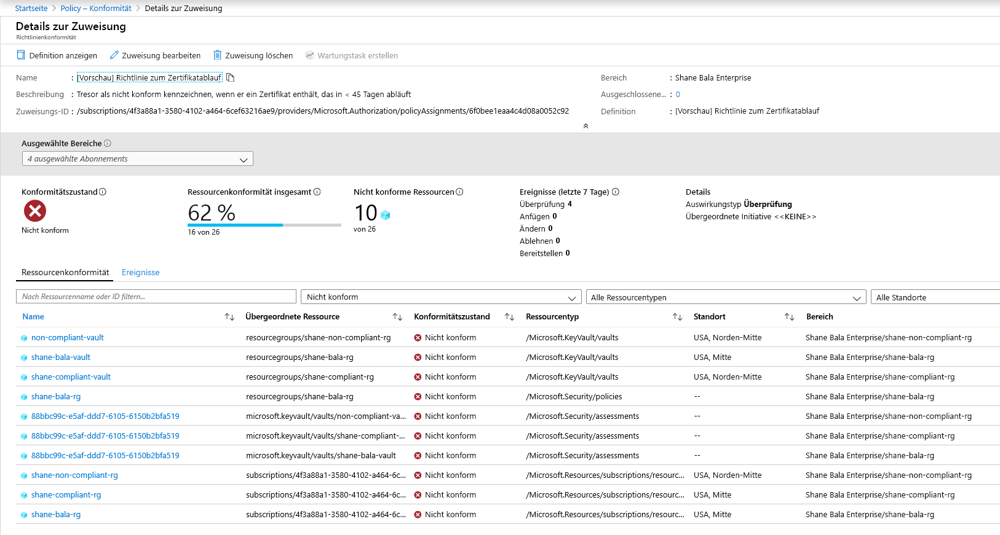

1. Anzeigen des Namens der Komponenten in einem Tresor, die nicht konform sind

    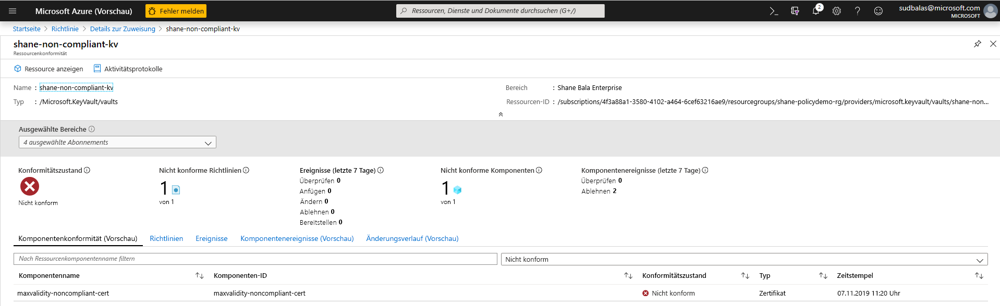

1. Wenn Sie überprüfen müssen, ob den Benutzern die Möglichkeit zum Erstellen von Ressourcen in Key Vault verweigert wird, klicken Sie auf die Registerkarte **Komponentenereignisse (Vorschau)**, um eine Zusammenfassung der verweigerten Zertifikatvorgänge mit dem Anforderer und Zeitstempeln der Anforderungen anzuzeigen. 

    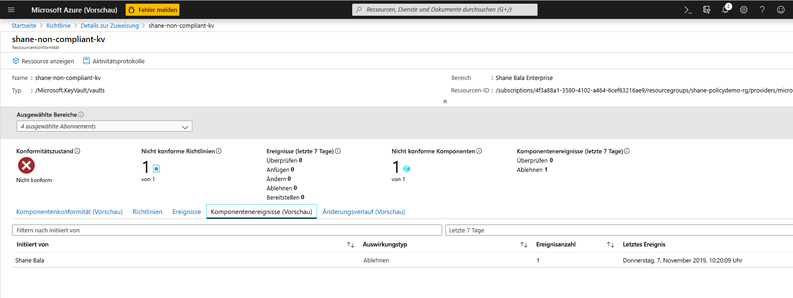

## Funktionseinschränkungen

Beim Zuweisen einer Richtlinie mit der Auswirkung „Verweigern“ kann es im Durchschnitt bis zu 30 Minuten, im ungünstigsten Fall bis zu einer Stunde dauern, bis die Erstellung nicht konformer Ressourcen verweigert wird. Bei der Richtlinienauswertung vorhandener Komponenten in einem Tresor kann es im Durchschnitt bis zu einer Stunde und im ungünstigsten Fall zwei Stunden dauern, bis die Konformitätsergebnisse in der Benutzeroberfläche des Portals angezeigt werden. Wenn die Konformitätsergebnisse als „Nicht gestartet“ angezeigt werden, kann dies auf folgende Gründe zurückzuführen sein:
- Die Richtlinienauswertung ist noch nicht abgeschlossen. Die anfängliche Wartezeit für die Auswertung kann im schlimmsten Fall bis zu zwei Stunden in Anspruch nehmen. 
- Im Gültigkeitsbereich der Richtlinienzuweisung sind keine Schlüsseltresore vorhanden.
- Im Gültigkeitsbereich der Richtlinienzuweisung sind keine Schlüsseltresore mit Zertifikaten vorhanden.

> [!NOTE]
> Für die [Ressourcenanbietermodi](../../governance/policy/concepts/definition-structure.md#resource-provider-modes) von Azure Policy, z. B. für Azure Key Vault, werden Informationen zur Konformität auf der Seite [Komponentenkonformität](../../governance/policy/how-to/get-compliance-data.md#component-compliance) bereitgestellt.

## Nächste Schritte

- Weitere Informationen zu [Azure Policy](../../governance/policy/overview.md)
- Key Vault-Beispiele: [Integrierte Azure Policy-Richtliniendefinitionen: Key Vault](../../governance/policy/samples/built-in-policies.md#key-vault)
