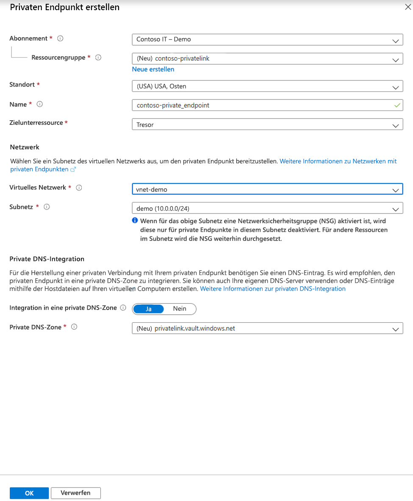

# <a name="integrate-key-vault-with-azure-private-link-preview"></a>Integrieren von Key Vault in Azure Private Link (Vorschau)

Mit dem Azure Private Link-Dienst können Sie über einen privaten Endpunkt in Ihrem virtuellen Netzwerk auf Azure-Dienste wie Azure Key Vault, Azure Storage und Azure Cosmos DB sowie auf in Azure gehostete Kunden-/Partnerdienste zugreifen.

Ein privater Endpunkt in Azure ist eine Netzwerkschnittstelle, die Sie privat und sicher mit einem von Azure Private Link betriebenen Dienst verbindet. Der private Endpunkt verwendet eine private IP-Adresse aus Ihrem VNET und bindet den Dienst dadurch in Ihr VNET ein. Der gesamte für den Dienst bestimmte Datenverkehr kann über den privaten Endpunkt geleitet werden. Es sind also keine Gateways, NAT-Geräte, ExpressRoute-/VPN-Verbindungen oder öffentlichen IP-Adressen erforderlich. Der Datenverkehr zwischen Ihrem virtuellen Netzwerk und dem Dienst wird über das Microsoft-Backbone-Netzwerk übertragen und dadurch vom öffentlichen Internet isoliert. Sie können eine Verbindung mit einer Instanz einer Azure-Ressource herstellen, was ein Höchstmaß an Granularität bei der Zugriffssteuerung ermöglicht.

Weitere Informationen finden Sie unter [Was ist Azure Private Link? (Vorschau)](../private-link/private-link-overview.md).

## <a name="prerequisites"></a>Voraussetzungen

Wenn Sie einen Schlüsseltresor in Azure Private Link (Vorschau) integrieren möchten, benötigen Sie Folgendes:

- Einen Schlüsseltresor
- Ein virtuelles Azure-Netzwerk
- Ein Subnetz in dem virtuellen Netzwerk
- Berechtigungen vom Typ „Besitzer“ oder „Mitwirkender“ für den Schlüsseltresor und für das virtuelle Netzwerk

Der private Endpunkt und das virtuelle Netzwerk müssen sich in der gleichen Region befinden. Wenn Sie über das Portal eine Region für den privaten Endpunkt auswählen, wird automatisch nach virtuellen Netzwerken in dieser Region gefiltert. Der Schlüsseltresor kann sich in einer anderen Region befinden.

Der private Endpunkt verwendet eine private IP-Adresse in Ihrem virtuellen Netzwerk.

## <a name="establish-a-private-link-connection-to-key-vault"></a>Einrichten einer Private Link-Verbindung mit dem Schlüsseltresor

Erstellen Sie zunächst ein virtuelles Netzwerk. Eine entsprechende Anleitung finden Sie unter [Schnellstart: Erstellen eines virtuellen Netzwerks im Azure-Portal](../virtual-network/quick-create-portal.md).

Anschließend können Sie entweder einen neuen Schlüsseltresor erstellen oder eine Private Link-Verbindung mit einem bereits vorhandenen Schlüsseltresor einrichten.

### <a name="create-a-new-key-vault-and-establish-a-private-link-connection"></a>Erstellen eines neuen Schlüsseltresors und Einrichten einer Private Link-Verbindung

Eine Anleitung für die Erstellung eines neuen Schlüsseltresors finden Sie unter [Schnellstart: Festlegen eines Geheimnisses und Abrufen des Geheimnisses aus Azure Key Vault mithilfe des Azure-Portals](quick-create-portal.md).

Wählen Sie nach dem Konfigurieren der Grundeinstellungen des Schlüsseltresors die Registerkarte „Netzwerk“ aus, und gehen Sie wie folgt vor:

1. Wählen Sie auf der Registerkarte „Netzwerk“ das Optionsfeld „Privater Endpunkt (Vorschau)“ aus.
1. Klicken Sie auf die Schaltfläche "+ Hinzufügen", um einen privaten Endpunkt hinzuzufügen.

    
 
1. Wählen Sie auf dem Blatt „Privaten Endpunkt erstellen“ im Feld „Standort“ die Region aus, in der sich Ihr virtuelles Netzwerk befindet. 
1. Geben Sie im Feld „Name“ einen aussagekräftigen Namen an, um den privaten Endpunkt problemlos identifizieren zu können. 
1. Wählen Sie im Dropdownmenü das virtuelle Netzwerk und das Subnetz aus, in denen dieser private Endpunkt erstellt werden soll. 
1. Lassen Sie die Option „In private DNS-Zone integrieren“ unverändert.  
1. Klicken Sie auf „OK“.

    
 
Der konfigurierte private Endpunkt wird nun angezeigt. Sie haben nun die Möglichkeit, diesen privaten Endpunkt zu löschen oder zu bearbeiten. Wählen Sie die Schaltfläche „Bewerten + erstellen“ aus, und erstellen Sie den Schlüsseltresor. Der Bereitstellungsvorgang dauert fünf bis zehn Minuten. 

### <a name="establish-a-private-link-connection-to-an-existing-key-vault"></a>Einrichten einer Private Link-Verbindung mit einem bereits vorhandenen Schlüsseltresor

Wenn Sie bereits über einen Schlüsseltresor verfügen, können Sie wie folgt eine Private Link-Verbindung erstellen:

1. Melden Sie sich beim Azure-Portal an. 
1. Geben Sie auf der Suchleiste den Suchbegriff „Schlüsseltresore“ ein.
1. Wählen Sie in der Liste den Schlüsseltresor aus, dem Sie einen privaten Endpunkt hinzufügen möchten.
1. Wählen Sie unter „Einstellungen“ die Registerkarte „Netzwerk“ aus.
1. Wählen Sie im oberen Seitenbereich die Registerkarte „Private Endpunktverbindungen (Vorschau)“ aus.
1. Wählen Sie im oberen Seitenbereich die Schaltfläche „+ Privater Endpunkt“ aus.

     

Auf diesem Blatt können Sie einen privaten Endpunkt für eine beliebige Azure-Ressource erstellen. Sie können die Dropdownmenüs verwenden, um einen Ressourcentyp und eine Ressource in Ihrem Verzeichnis auszuwählen. Alternativ können Sie unter Verwendung einer Ressourcen-ID eine Verbindung mit einer beliebigen Azure-Ressource herstellen. Lassen Sie die Option „In private DNS-Zone integrieren“ unverändert.  


## <a name="manage-private-link-connection"></a>Verwalten der Private Link-Verbindung

Wenn Sie einen privaten Endpunkt erstellen, muss die Verbindung genehmigt werden. Wenn sich die Ressource, für die Sie einen privaten Endpunkt erstellen, in Ihrem Verzeichnis befindet, können Sie die Verbindungsanforderung selbst genehmigen (vorausgesetzt, Sie verfügen über entsprechende Berechtigungen). Wenn Sie eine Verbindung mit einer Azure-Ressource in einem anderen Verzeichnis herstellen, müssen Sie warten, bis der Besitzer dieser Ressource Ihre Verbindungsanforderung genehmigt hat.

Es gibt vier Möglichkeiten für den Bereitstellungsstatus:

| Aktion des Dienstanbieters | Zustand des privaten Endpunkts des Dienstconsumers | Beschreibung |
|--|--|--|
| Keine | Ausstehend | Die Verbindung wurde manuell erstellt, und die Genehmigung des Besitzers der Private Link-Ressource steht aus. |
| Genehmigen | Genehmigt | Die Verbindung wurde automatisch oder manuell genehmigt und ist zur Verwendung bereit. |
| Ablehnen | Abgelehnt | Die Verbindung wurde vom Besitzer der Private Link-Ressource abgelehnt. |
| Entfernen | Getrennt | Die Verbindung wurde vom Besitzer der Private Link-Ressource entfernt, der private Endpunkt wird informativ und sollte zur Bereinigung gelöscht werden. |
 
###  <a name="how-to-manage-a-private-endpoint-connection-to-key-vault"></a>Verwalten einer privaten Endpunktverbindung mit einem Schlüsseltresor

1. Melden Sie sich beim Azure-Portal an.
1. Geben Sie auf der Suchleiste den Suchbegriff „Schlüsseltresore“ ein.
1. Wählen Sie den Schlüsseltresor aus, den Sie verwalten möchten.
1. Wählen Sie die Registerkarte „Netzwerk“ aus.
1. Sollten ausstehende Verbindungen vorhanden sein, wird in der Liste eine Verbindung mit dem Bereitstellungsstatus „Ausstehend“ angezeigt. 
1. Wählen Sie den privaten Endpunkt aus, den Sie genehmigen möchten.
1. Wählen Sie die Schaltfläche „Genehmigen“ aus.
1. Falls Sie eine Verbindung mit einem privaten Endpunkt ablehnen möchten, wählen Sie die Verbindung aus, und klicken Sie auf die Schaltfläche „Ablehnen“. Dies funktioniert sowohl für ausstehende Anforderungen als auch für bereits vorhandene Verbindungen.

    

## <a name="validate-that-the-private-link-connection-works"></a>Überprüfen, ob die Private Link-Verbindung funktioniert

Vergewissern Sie sich, dass die Ressourcen innerhalb des Subnetzes, in dem sich auch die private Endpunktressource befindet, mit Ihrem Schlüsseltresor eine Verbindung über eine private IP-Adresse herstellen, und dass die Integration in die private DNS-Zone korrekt ist.

Erstellen Sie zunächst einen virtuellen Computer. Eine entsprechende Anleitung finden Sie unter [Schnellstart: Erstellen eines virtuellen Windows-Computers im Azure-Portal](../virtual-machines/windows/quick-create-portal.md).

Gehen Sie auf der Registerkarte „Netzwerk“ wie folgt vor:

1. Geben Sie ein virtuelles Netzwerk und ein Subnetz an. Sie können ein neues virtuelles Netzwerk erstellen oder ein bereits vorhandenes virtuelles Netzwerk auswählen. Vergewissern Sie sich bei Verwendung eines bereits vorhandenen Netzwerks, dass die Region übereinstimmt.
1. Geben Sie eine öffentliche IP-Ressource an.
1. Wählen Sie für „NIC-Netzwerksicherheitsgruppe“ die Option „Keine“ aus.
1. Wählen Sie für den Lastenausgleich „Nein“ aus.

Öffnen Sie die Befehlszeile, und führen Sie den folgenden Befehl aus:

```console
nslookup <your-key-vault-name>.vault.azure.net
```

Wenn Sie den Befehl „ns lookup“ ausführen, um die IP-Adresse eines Schlüsseltresors über einen öffentlichen Endpunkt aufzulösen, sieht das Ergebnis wie folgt aus:

```console
c:\ >nslookup <your-key-vault-name>.vault.azure.net

Non-authoritative answer:
Name:    
Address:  (public IP address)
Aliases:  <your-key-vault-name>.vault.azure.net
```

Wenn Sie den Befehl „ns lookup“ ausführen, um die IP-Adresse eines Schlüsseltresors über einen privaten Endpunkt aufzulösen, sieht das Ergebnis wie folgt aus:

```console
c:\ >nslookup your_vault_name.vault.azure.net

Non-authoritative answer:
Name:    
Address:  10.1.0.5 (private IP address)
Aliases:  <your-key-vault-name>.vault.azure.net
          <your-key-vault-name>.privatelink.vaultcore.azure.net
```

## <a name="limitations-and-design-considerations"></a>Einschränkungen und Entwurfsaspekte

**Preise:** Preisinformationen finden Sie unter [Azure Private Link – Preise](https://azure.microsoft.com/pricing/details/private-link/).

**Einschränkungen:**  Der private Endpunkt für Azure Key Vault befindet sich in der Public Preview-Phase. Dieses Feature steht in allen öffentlichen Azure-Regionen zur Verfügung.

**Maximal zulässige Anzahl privater Endpunkte pro Schlüsseltresor:** 64.

**Maximal zulässige Anzahl von Schlüsseltresoren mit privaten Endpunkten pro Abonnement:** 64.

Weitere Informationen finden Sie unter [Was ist der Azure Private Link-Dienst? – Einschränkungen](../private-link/private-link-service-overview.md#limitations).

## <a name="next-steps"></a>Nächste Schritte

- [Was ist der Azure Private Link-Dienst?](../private-link/private-link-service-overview.md)
- Weitere Informationen zu [Azure Key Vault](key-vault-overview.md)
