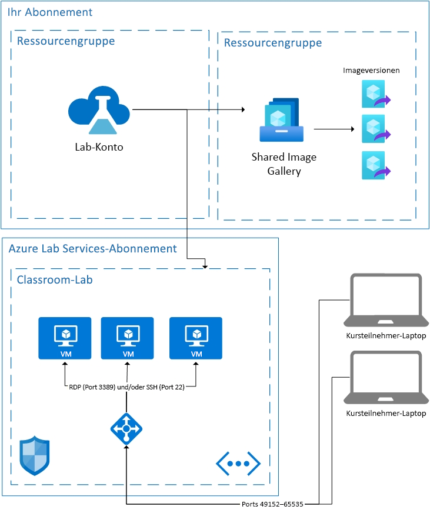

# Grundlegendes zur Architektur in Azure Lab Services

Azure Lab Services ist eine SaaS-Lösung (Software-as-a-Service). Das bedeutet, dass Sie sich nicht um die von Lab Services benötigten Ressourcen kümmern müssen. Dieser Artikel enthält Informationen zu den grundlegenden Ressourcen, die von Lab Services verwendet werden, sowie zur grundlegenden Architektur eines Labs.  

Azure Lab Services bietet einige Bereiche, in denen Sie Ihre eigenen Ressourcen mit Lab Services verwenden können.  Weitere Informationen zur Verwendung von virtuellen Computern in Ihrem eigenen Netzwerk finden Sie unter [Verbinden des Netzwerks Ihres Labs mit einem virtuellen Peernetzwerk in Azure Lab Services](how-to-connect-peer-virtual-network.md).  Informationen zur Wiederverwendung von Images aus einer Shared Image Gallery-Instanz finden Sie unter [Anfügen oder Trennen eines Katalogs mit freigegebenen Images in Azure Lab Services](how-to-attach-detach-shared-image-gallery.md).

Weiter unten sehen Sie die grundlegende Architektur eines Classroom-Labs.  Das Labkonto wird in Ihrem Abonnement gehostet. Die virtuellen Computer der Kursteilnehmer sowie die zur Unterstützung der virtuellen Computer benötigten Ressourcen werden in einem Abonnement gehostet, das sich im Besitz von Lab Services befindet. Im Anschluss erfahren Sie mehr über den Inhalt von Lab Services-Abonnements.

## Gehostete Ressourcen

Die zum Ausführen eines Classroom-Labs erforderlichen Ressourcen werden in einem der von Microsoft verwalteten Azure-Abonnements gehostet.  Die Ressourcen umfassen eine Vorlagen-VM für den Dozenten, einen virtuellen Computer für die einzelnen Kursteilnehmer sowie netzwerkbezogene Elemente wie Lastenausgleich, virtuelles Netzwerk und Netzwerksicherheitsgruppe.  Diese Abonnements werden auf verdächtige Aktivitäten überwacht.  Wichtig: Diese Überwachung wird für die virtuellen Computer extern per VM-Erweiterung oder Netzwerkmusterüberwachung durchgeführt.  Wenn das [Herunterfahren beim Trennen der Verbindung](how-to-enable-shutdown-disconnect.md) aktiviert ist, wird auf dem virtuellen Computer eine Diagnoseerweiterung aktiviert. Durch diese Erweiterung kann Lab Services über das Trennungsereignis für die RDP-Sitzung (Remote Desktop Protocol) informiert werden.

## Virtual Network

Jedes Lab ist durch ein eigenes virtuelles Netzwerk isoliert.  Wenn das Lab über ein [virtuelles Netzwerk mit Peering](how-to-connect-peer-virtual-network.md) verfügt, ist jedes Lab durch ein eigenes Subnetz isoliert.  Kursteilnehmer stellen die Verbindung mit ihrem virtuellen Computer über einen Lastenausgleich her.  Die virtuellen Computer der Kursteilnehmer verfügen über keine öffentliche IP-Adresse, sondern nur über eine private IP-Adresse.  Die Verbindungszeichenfolge für den Kursteilnehmer ist eine Kombination aus der öffentlichen IP-Adresse des Lastenausgleichs und einem zufälligen Port zwischen 49152 und 65535.  Durch Eingangsregeln für den Lastenausgleich wird die Verbindung abhängig vom Betriebssystem entweder an den Port 22 (SSH) oder an den Port 3389 (RDP) des entsprechenden virtuellen Computers weitergeleitet. Durch eine NSG wird externer Datenverkehr an anderen Ports verhindert.

## Zugriffssteuerung für die virtuellen Computer

Von Lab Services wird dafür gesorgt, dass Kursteilnehmer für ihren virtuellen Computer Aktionen wie Starten und Beenden ausführen können.  Außerdem wird der Zugriff auf ihre VM-Verbindungsinformationen gesteuert.

Lab Services übernimmt auch die Registrierung von Kursteilnehmer beim Dienst. Aktuell stehen zwei unterschiedliche Zugriffseinstellungen zur Verfügung: eingeschränkt und nicht eingeschränkt. Weitere Informationen finden Sie im Artikel [Hinzufügen und Verwalten von Labbenutzern](how-to-configure-student-usage.md#send-invitations-to-users). Eingeschränkter Zugriff bedeutet, dass von Lab Services überprüft wird, ob die Kursteilnehmer als Benutzer hinzugefügt wurden, bevor der Zugriff gewährt wird. Nicht eingeschränkter Zugriff bedeutet, dass sich jeder Benutzer registrieren kann, der über den Registrierungslink verfügt (vorausgesetzt, im Lab steht genügend Kapazität zur Verfügung). Der nicht eingeschränkte Zugriff kann bei Hackathons nützlich sein.

Für im Classroom-Lab gehostete virtuelle Computer von Kursteilnehmern werden vom Ersteller des Labs ein Benutzername und ein Kennwort festgelegt.  Alternativ hat der Ersteller des Labs die Möglichkeit, registrierte Kursteilnehmer bei der ersten Anmeldung ein eigenes Kennwort festlegen zu lassen.  

## Nächste Schritte

Weitere Informationen zu verfügbaren Features in Lab Services finden Sie unter [Konzepte von Classroom-Labs](classroom-labs-concepts.md) sowie unter [Einführung in Classroom-Labs](classroom-labs-overview.md).
