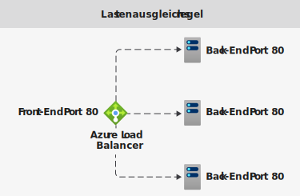
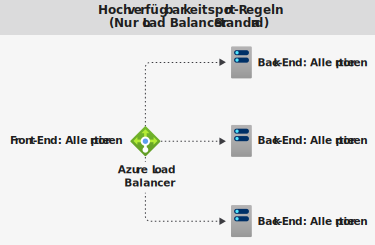
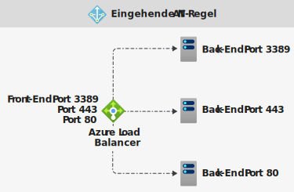

# Azure Load Balancer-Komponenten

Azure Load Balancer umfasst ein paar Hauptkomponenten. Diese Komponenten können in Ihrem Abonnement auf folgende Weise konfiguriert werden:

* Azure-Portal
* Azure CLI
* Azure PowerShell
* Resource Manager-Vorlagen

## Front-End-IP-Konfiguration

Die IP-Adresse Ihres Azure Load Balancers. Sie ist der Kontaktpunkt für Clients. Diese IP-Adressen sind möglich:

- **Öffentliche IP-Adresse**
- **Private IP-Adresse**

Die Art der IP-Adresse bestimmt den **Typ** des erstellten Lastenausgleichs. Wenn Sie eine private IP-Adresse auswählen, wird ein interner Lastenausgleich erstellt. Bei Auswahl einer öffentlichen IP-Adresse wird ein öffentlicher Lastenausgleich erstellt.

|  | Öffentlicher Load Balancer  | Interner Lastenausgleich |
| ---------- | ---------- | ---------- |
| **Front-End-IP-Konfiguration**| Öffentliche IP-Adresse | Private IP-Adresse|
| **Beschreibung** | Bei einem öffentlichen Lastenausgleich werden die öffentliche IP-Adresse und der Port des eingehenden Datenverkehrs der privaten IP-Adresse und dem Port der VM zugeordnet. Für den Antwortdatenverkehr von der VM führt der Lastenausgleich eine Zuordnung in umgekehrter Richtung durch. Sie können bestimmte Typen von Datenverkehr auf verschiedene VMs oder Dienste verteilen, indem Sie Lastenausgleichsregeln anwenden. Sie können zum Beispiel die Netzwerklast von Webanforderungen auf mehrere Webserver verteilen.| Ein interner Lastenausgleich verteilt Datenverkehr auf Ressourcen, die sich in einem virtuellen Netzwerk befinden. Azure schränkt den Zugriff auf die Front-End-IP-Adressen eines virtuellen Netzwerks ein, für die ein Lastausgleich vorgenommen wird. Front-End-IP-Adressen und virtuelle Netzwerke werden nie direkt für einen Internetendpunkt verfügbar gemacht. Interne Branchenanwendungen werden in Azure ausgeführt. Auf sie wird aus Azure oder von lokalen Ressourcen aus zugegriffen. |
| **Unterstützte SKUs** | Basic, Standard | Basic, Standard |

Load Balancer kann über mehrere Front-End-IP-Adressen verfügen. Erfahren Sie mehr zu [mehreren Front-Ends](load-balancer-multivip-overview.md).

## Back-End-Pool

Die Gruppe virtueller Computer oder Instanzen in einer VM-Skalierungsgruppe, von denen die eingehende Anforderung verarbeitet wird. Für eine kosteneffiziente Skalierung zur Bewältigung großer Mengen an eingehendem Datenverkehr empfiehlt es sich in der Regel, dem Back-End-Pool weitere Instanzen hinzuzufügen.

Die Konfiguration des Lastenausgleichs wird automatisch angepasst, wenn Sie Instanzen hoch- oder herunterskalieren. Durch Hinzufügen virtueller Computer zum bzw. Entfernen virtueller Computer aus dem Back-End-Pool wird der Lastenausgleich ohne zusätzliche Vorgänge neu konfiguriert. Der Back-End-Pool wird für jeden beliebigen virtuellen Computer im virtuellen Netzwerk verwendet.

Halten Sie bei der Gestaltung Ihres Back-End-Pools die Anzahl der einzelnen Back-End-Pool-Ressourcen so gering wie möglich, um die Dauer von Verwaltungsvorgängen zu optimieren. Es gibt keinen Unterschied in der Datenebenenleistung oder -skalierung.

## Integritätstests

Mithilfe eines Integritätstest wird der Integritätsstatus der Instanzen im Back-End-Pool ermittelt. Konfigurieren Sie während der Erstellung des Lastenausgleichs einen Integritätstest, den der Lastenausgleich verwenden soll.  Dieser Integritätstest bestimmt, ob eine Instanz fehlerfrei ist und Datenverkehr empfangen kann.

Sie können den gewünschten Fehlerschwellenwert für Ihre Integritätstests definieren. Wenn ein Test nicht reagiert, beendet der Load Balancer das Senden neuer Verbindungen an die fehlerhaften Instanzen. Ein Testfehler wirkt sich nicht auf vorhandene Verbindungen aus. Die Verbindung bleibt so lange bestehen, bis die Anwendung:

- den Flow beendet
- eine Leerlauftimeout auftritt
- der virtuelle Computer heruntergefahren wird

Load Balancer verfügt über verschiedene Integritätstesttypen für Endpunkte: TCP, HTTP und HTTPS. [Erfahren Sie mehr zu Load Balancer-Integritätstests](load-balancer-custom-probe-overview.md).

Vom Load Balancer im Tarif „Basic“ werden keine HTTPS-Tests unterstützt. Vom Load Balancer im Tarif „Basic“ werden alle TCP-Verbindungen (einschließlich aktiver Verbindungen) beendet.

## Lastenausgleichsregeln

Mithilfe einer Lastenausgleichsregel wird definiert, wie eingehender Datenverkehr auf **alle** Instanzen innerhalb des Back-End-Pools verteilt werden soll. Eine Lastenausgleichsregel ordnet mehreren Back-End-IP-Adressen und Ports eine bestimmte Front-End-IP-Konfiguration und einen Port zu.

Verwenden Sie z. B. eine Lastenausgleichsregel für Port 80, um Datenverkehr von Ihrer Front-End-IP-Adresse an Port 80 ihrer Back-End-Instanzen umzuleiten.

  

*Abbildung: Lastenausgleichsregeln*

## Hochverfügbarkeitsports

Eine mit **„protocol - all“ und „port - 0“** konfigurierte Lastenausgleichsregel. 

Diese Regel ermöglicht es, dass eine einzige Regel den Lastenausgleich aller TCP- und UDP-Datenflüsse vornimmt, die an allen Ports einer internen Load Balancer Standard-Instanz eingehen. 

Die Entscheidung über den Lastenausgleich erfolgt pro Datenfluss. Diese Lösung basiert auf der folgenden Verbindung mit fünf Tupeln: 

1. Quell-IP-Adresse
2. Quellport
3. Ziel-IP-Adresse
4. Zielport
5. Protokoll

Die Lastenausgleichsregeln für Hochverfügbarkeitsports unterstützen Sie bei wichtigen Szenarien, z. B. Hochverfügbarkeit und Skalierung für virtuelle Netzwerkgeräte in virtuellen Netzwerken. Das Feature kann hilfreich sein, wenn für eine große Anzahl von Ports ein Lastenausgleich vorgenommen werden muss.

  

*Abbildung: Hochverfügbarkeitsport-Regeln*

Weitere Informationen zu [Hochverfügbarkeitsports](load-balancer-ha-ports-overview.md).

## Eingehende NAT-Regeln

Eine NAT-Regel für eingehenden Datenverkehr leitet eingehenden Datenverkehr, der an eine Kombination aus Front-End-IP-Adresse und Port gesendet wird weiter. Der Datenverkehr wird an einen **bestimmten** virtuellen Computer oder eine Instanz im Back-End-Pool gesendet. Der Portweiterleitung liegt die gleiche hashbasierte Verteilung zugrunde wie dem Lastenausgleich.

Beispielsweise, wenn Sie RDP-Sitzungen (Remote Desktop Protocol, Remotedesktopprotokoll) oder SSH-Sitzungen (Secure Shell) zum Trennen von VM-Instanzen innerhalb eines Back-End-Pools verwenden möchten. Ports können mehrere interne Endpunkte unter derselben Front-End-IP-Adresse zugeordnet werden. Sie können die Front-End-IP-Adressen verwenden, um für Ihre VMs die Remoteverwaltung ohne zusätzliche Jumpbox durchzuführen.

  

*Abbildung: NAT-Regeln für eingehenden Datenverkehr*

NAT-Regeln für eingehenden Datenverkehr im Kontext von Virtual Machine Scale Sets sind NAT-Pools für eingehenden Datenverkehr. Weitere Informationen zu [Load Balancer-Komponenten und VM-Skalierungsgruppen](../virtual-machine-scale-sets/virtual-machine-scale-sets-networking.md#azure-virtual-machine-scale-sets-with-azure-load-balancer).

## Ausgangsregeln

Eine Ausgangsregel konfiguriert die Netzwerkadressenübersetzung (Network Address Translation, NAT) für ausgehenden Datenverkehr für alle virtuellen Computer oder Instanzen, die vom Back-End-Pool identifiziert wurden. Durch diese Regel können Instanzen im Back-End (ausgehend) mit dem Internet oder anderen Endpunkten kommunizieren.

Erfahren Sie mehr zu [ausgehenden Verbindungen und Regeln](load-balancer-outbound-connections.md).

Vom Lastenausgleich im Tarif „Basic“ werden keine Ausgangsregeln unterstützt.

## Nächste Schritte

- Informationen zu den ersten Schritten mit einer Load Balancer-Instanz finden Sie unter [Schnellstart: Erstellen einer Load Balancer Standard-Instanz für den Lastenausgleich virtueller Computer im Azure-Portal](quickstart-load-balancer-standard-public-portal.md).
- Weitere Informationen zu [Azure Load Balancer](load-balancer-overview.md).
- Informieren Sie sich über [öffentliche IP-Adressen](https://docs.microsoft.com/azure/virtual-network/virtual-network-public-ip-address).
- Informieren Sie sich über [private IP-Adressen](https://docs.microsoft.com/azure/virtual-network/virtual-network-ip-addresses-overview-arm#private-ip-addresses).
- Informationen zu [Standard Load Balancer und Verfügbarkeitszonen](load-balancer-standard-availability-zones.md)
- Weitere Informationen zu [Diagnosen für Standard Load Balancer](load-balancer-standard-diagnostics.md).
- Informationen zur [TCP-Zurücksetzung bei Leerlauf](load-balancer-tcp-reset.md).
- Informationen zu [Load Balancer Standard mit Lastenausgleichsregeln für HA-Ports](load-balancer-ha-ports-overview.md)
- Weitere Informationen zu [Netzwerksicherheitsgruppen](../virtual-network/security-overview.md).
- Lesen Sie weitere Informationen zu [Load Balancer-Grenzwerten](https://docs.microsoft.com/azure/azure-resource-manager/management/azure-subscription-service-limits#load-balancer).
- Erfahren Sie mehr über die Verwendung der [Portweiterleitung](https://docs.microsoft.com/azure/load-balancer/tutorial-load-balancer-port-forwarding-portal).
