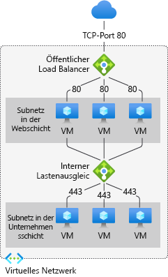
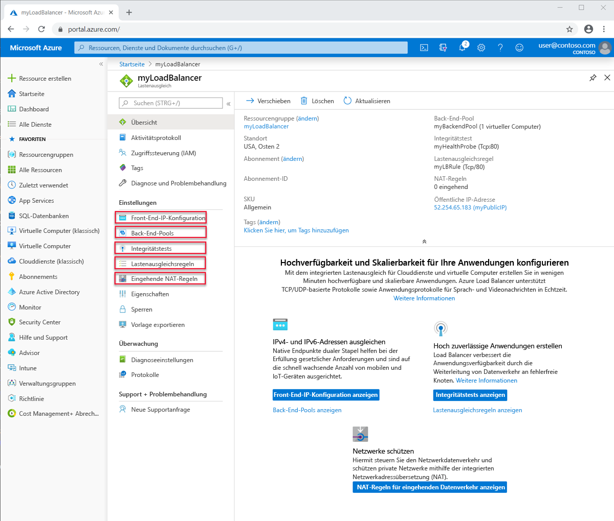

# Azure Load Balancer-Komponenten

Azure Load Balancer enthält mehrere wichtige Komponenten für den Betrieb. Diese Komponenten können in Ihrem Abonnement über das Azure-Portal, die Azure-Befehlszeilenschnittstelle, Azure PowerShell oder Vorlagen konfiguriert werden.

## Front-End-IP-Konfigurationen

Die IP-Adresse des Lastenausgleichs. Sie ist der Kontaktpunkt für Clients. Folgende Adressen sind möglich:

- **Öffentliche IP-Adresse**
- **Private IP-Adresse**

Die Auswahl der IP-Adresse bestimmt den **Typ** des erstellten Lastenausgleichs. Wenn Sie eine private IP-Adresse auswählen, wird ein interner Lastenausgleich erstellt. Bei Auswahl einer öffentlichen IP-Adresse wird ein öffentlicher Lastenausgleich erstellt.

|  | Öffentlicher Load Balancer  | Interner Lastenausgleich |
| ---------- | ---------- | ---------- |
| Front-End-IP-Konfiguration| Öffentliche IP-Adresse | Private IP-Adresse|
| BESCHREIBUNG | Bei einem öffentlichen Lastenausgleich werden die öffentliche IP-Adresse und der Port des eingehenden Datenverkehrs der privaten IP-Adresse und dem Port der VM zugeordnet. Für den Antwortdatenverkehr von der VM führt der Lastenausgleich eine Zuordnung in umgekehrter Richtung durch. Sie können bestimmte Typen von Datenverkehr auf verschiedene VMs oder Dienste verteilen, indem Sie Lastenausgleichsregeln anwenden. Sie können zum Beispiel die Netzwerklast von Webanforderungen auf mehrere Webserver verteilen.| Ein interner Lastenausgleich verteilt Datenverkehr auf Ressourcen, die sich in einem virtuellen Netzwerk befinden. Azure schränkt den Zugriff auf die Front-End-IP-Adressen eines virtuellen Netzwerks ein, für die ein Lastausgleich vorgenommen wird. Front-End-IP-Adressen und virtuelle Netzwerke werden nie direkt für einen Internetendpunkt verfügbar gemacht. Interne Branchenanwendungen werden in Azure ausgeführt. Auf sie wird aus Azure oder von lokalen Ressourcen aus zugegriffen. |
| Unterstützte SKUs | Basic, Standard | Basic, Standard |

## Back-End-Pool

Die Gruppe virtueller Computer oder Instanzen in einer VM-Skalierungsgruppe, von denen die eingehende Anforderung verarbeitet wird. Für eine kosteneffiziente Skalierung zur Bewältigung großer Mengen an eingehendem Datenverkehr empfiehlt es sich in der Regel, dem Back-End-Pool weitere Instanzen hinzuzufügen. 

Die Konfiguration des Lastenausgleichs wird automatisch angepasst, wenn Sie Instanzen hoch- oder herunterskalieren. Durch Hinzufügen virtueller Computer zum bzw. Entfernen virtueller Computer aus dem Back-End-Pool wird der Lastenausgleich ohne zusätzliche Vorgänge neu konfiguriert. Der Back-End-Pool wird für jeden beliebigen virtuellen Computer im virtuellen Netzwerk verwendet. 

Halten Sie bei der Gestaltung Ihres Back-End-Pools die Anzahl der einzelnen Back-End-Pool-Ressourcen so gering wie möglich, um die Dauer von Verwaltungsvorgängen zu optimieren. Es gibt keinen Unterschied in der Datenebenenleistung oder -skalierung.

## Integritätstests

Mithilfe eines Integritätstest wird die Integrität der Instanzen im Back-End-Pool ermittelt. Sie können den gewünschten Fehlerschwellenwert für Ihre Integritätstests definieren. Wenn ein Test nicht reagiert, beendet der Load Balancer das Senden neuer Verbindungen an die fehlerhaften Instanzen. Ein Testfehler wirkt sich nicht auf vorhandene Verbindungen aus. Die Verbindung bleibt so lange bestehen, bis die Anwendung:

- den Flow beendet
- eine Leerlauftimeout auftritt
- der virtuelle Computer heruntergefahren wird

Load Balancer verfügt über verschiedene Integritätstesttypen für Endpunkte:

- TCP
- HTTP
- HTTPS

Vom Lastenausgleich im Tarif „Basic“ werden keine HTTPS-Tests unterstützt. Vom Lastenausgleich im Tarif „Basic“ werden alle TCP-Verbindungen (einschließlich aktiver Verbindungen) beendet.

## Lastenausgleichsregeln

Lastenausgleichsregeln weisen den Lastenausgleich an, welche Aktionen ausgeführt werden sollen. Eine Lastenausgleichsregel ordnet mehreren Back-End-IP-Adressen und Ports eine bestimmte Front-End-IP-Konfiguration und einen Port zu.

## Eingehende NAT-Regeln

NAT-Regeln für eingehenden Datenverkehr leiten Datenverkehr von der Front-End-IP-Adresse an eine Back-End-Instanz im virtuellen Netzwerk weiter. Der Portweiterleitung liegt die gleiche hashbasierte Verteilung zugrunde wie dem Lastenausgleich. 

Ein Beispiel für die Verwendung sind RDP-Sitzungen (Remote Desktop Protocol, Remotedesktopprotokoll) oder SSH-Sitzungen (Secure Shell) zum Trennen von VM-Instanzen innerhalb eines virtuellen Netzwerks. Ports können mehrere interne Endpunkte unter derselben Front-End-IP-Adresse zugeordnet werden. Sie können die Front-End-IP-Adressen verwenden, um für Ihre VMs die Remoteverwaltung ohne zusätzliche Jumpbox durchzuführen.

## Ausgangsregeln

Eine Ausgangsregel konfiguriert die Netzwerkadressenübersetzung (Network Address Translation, NAT) für ausgehenden Datenverkehr für alle virtuellen Computer oder Instanzen, die vom Back-End-Pool identifiziert wurden.

Vom Lastenausgleich im Tarif „Basic“ werden keine Ausgangsregeln unterstützt.

## Nächste Schritte

- Informationen zu den ersten Schritten mit einer Load Balancer-Instanz finden Sie unter [Schnellstart: Erstellen einer Load Balancer Standard-Instanz für den Lastenausgleich virtueller Computer im Azure-Portal](quickstart-load-balancer-standard-public-portal.md).
- Weitere Informationen zu [Azure Load Balancer](load-balancer-overview.md).
- Informieren Sie sich über [öffentliche IP-Adressen](https://docs.microsoft.com/azure/virtual-network/virtual-network-public-ip-address).
- Informieren Sie sich über [private IP-Adressen](https://docs.microsoft.com/azure/virtual-network/virtual-network-ip-addresses-overview-arm#private-ip-addresses).
- Informationen zu [Standard Load Balancer und Verfügbarkeitszonen](load-balancer-standard-availability-zones.md)
- Weitere Informationen zu [Diagnosen für Standard Load Balancer](load-balancer-standard-diagnostics.md).
- Informationen zur [TCP-Zurücksetzung bei Leerlauf](load-balancer-tcp-reset.md).
- Informationen zu [Load Balancer Standard mit Lastenausgleichsregeln für HA-Ports](load-balancer-ha-ports-overview.md)
- Informationen zur Verwendung von [Load Balancer mit mehreren Front-Ends](load-balancer-multivip-overview.md)
- Weitere Informationen zu [Netzwerksicherheitsgruppen](../virtual-network/security-overview.md).
- Informieren Sie sich über [Testtypen](load-balancer-custom-probe-overview.md#types).
- Lesen Sie weitere Informationen zu [Load Balancer-Grenzwerten](https://docs.microsoft.com/azure/azure-resource-manager/management/azure-subscription-service-limits#load-balancer).
- Erfahren Sie mehr über die Verwendung der [Portweiterleitung](https://docs.microsoft.com/azure/load-balancer/tutorial-load-balancer-port-forwarding-portal).
- Erfahren Sie mehr über [Load Balancer-Ausgangsregeln](https://docs.microsoft.com/azure/load-balancer/load-balancer-outbound-rules-overview).
