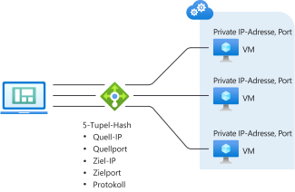
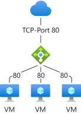
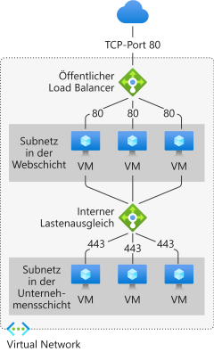

# Komponenten und Einschränkungen von Load Balancer
Azure Load Balancer enthält mehrere wichtige Komponenten für den Betrieb.  Diese Komponenten können in Ihrem Abonnement über das Azure-Portal, die Azure-Befehlszeilenschnittstelle oder über Azure PowerShell konfiguriert werden.  

## Load Balancer-Komponenten

* **Front-End-IP-Konfigurationen**: Die IP-Adresse des Lastenausgleichs. Sie ist der Kontaktpunkt für Clients. Folgende Adressen sind möglich: 

    - **[Öffentliche IP-Adresse](https://docs.microsoft.com/azure/virtual-network/virtual-network-public-ip-address)**
    - **[Private IP-Adresse](https://docs.microsoft.com/azure/virtual-network/virtual-network-ip-addresses-overview-arm#private-ip-addresses)**

* **Back-End-Pool**: Die Gruppe virtueller Computer oder Instanzen in der VM-Skalierungsgruppe, von denen die eingehende Anforderung verarbeitet wird. Für eine kosteneffiziente Skalierung zur Bewältigung großer Mengen an eingehendem Datenverkehr empfiehlt es sich in der Regel, dem Back-End-Pool weitere Instanzen hinzuzufügen. Die Konfiguration von Load Balancer wird automatisch angepasst, wenn Sie Instanzen hoch- oder herunterskalieren. Durch Hinzufügen von virtuellen Computern zum bzw. Entfernen von virtuellen Computern aus dem Back-End-Pool wird Load Balancer ohne zusätzliche Vorgänge neu konfiguriert. Der Back-End-Pool wird für jeden beliebigen virtuellen Computer im virtuellen Netzwerk verwendet. Ein Back-End-Pool kann über bis zu 1.000 Back-End-Instanzen oder IP-Konfigurationen verfügen.
Load Balancer Basic-Instanzen haben einen begrenzten Umfang (Verfügbarkeitsgruppe) und können nur auf maximal 300 IP-Konfigurationen zentral hochskaliert werden. Weitere Informationen zu Grenzwerten finden Sie unter [Load Balancer-Grenzwerte](https://docs.microsoft.com/azure/azure-resource-manager/management/azure-subscription-service-limits#load-balancer). Wenn Sie überlegen, wie Sie Ihren Back-End-Pool gestalten, können Sie die Anzahl der einzelnen Back-End-Pool-Ressourcen so gering wie möglich halten, um die Dauer von Verwaltungsvorgängen weiter zu optimieren. Es gibt keinen Unterschied in der Datenebenenleistung oder -skalierung.
* **Integritätstests**: Mithilfe eines **[Integritätstest](https://docs.microsoft.com/azure/load-balancer/load-balancer-custom-probe-overview)** wird die Integrität der Instanzen im Back-End-Pool ermittelt. Sie können den gewünschten Fehlerschwellenwert für Ihre Integritätstests definieren. Wenn ein Test nicht reagiert, beendet Load Balancer das Senden neuer Verbindungen an die fehlerhaften Instanzen. Ein Testfehler wirkt sich nicht auf vorhandene Verbindungen aus. 
    
    Die Verbindung bleibt so lange bestehen, bis die Anwendung: 
    - den Flow beendet
    - eine Leerlauftimeout auftritt
    - der virtuelle Computer heruntergefahren wird

    Load Balancer verfügt über verschiedene Integritätstesttypen für Endpunkte:
    - TCP
    - HTTP
    - HTTPS (HTTP-Test mit TLS-Wrapper (Transport Layer Security))
     
     Von Load Balancer Basic-Instanzen werden keine HTTPS-Tests unterstützt. Außerdem werden von Load Balancer Basic-Instanzen alle TCP-Verbindungen (einschließlich aktiver Verbindungen) beendet. 
    Weitere Informationen finden Sie unter [Testtypen](load-balancer-custom-probe-overview.md#types).

* **Lastenausgleichsregeln:** Mithilfe von Lastenausgleichsregeln wird gesteuert, welche Aktionen die Load Balancer-Instanz wann ausführen soll. 
* **NAT-Eingangsregeln:** Mit einer NAT-Regel für eingehenden Datenverkehr wird Datenverkehr von einem bestimmten Port einer Front-End-IP-Adresse an einen bestimmten Port einer Back-End-Instanz im virtuellen Netzwerk weitergeleitet. Der **[Portweiterleitung](https://docs.microsoft.com/azure/load-balancer/tutorial-load-balancer-port-forwarding-portal)** liegt die gleiche hashbasierte Verteilung zugrunde wie dem Lastenausgleich. Allgemeine Szenarien für diese Funktion sind RDP- (Remotedesktopprotokoll) oder SSH-Sitzungen (Secure Shell) für einzelne VM-Instanzen in einem Azure Virtual Network. Sie können Ports mehrere interne Endpunkte unter derselben Front-End-IP-Adresse zuordnen. Sie können die Front-End-IP-Adressen verwenden, um für Ihre VMs die Remoteverwaltung ohne zusätzliche Jumpbox durchzuführen.
* **Ausgangsregeln**: Eine **[Ausgangsregel](https://docs.microsoft.com/azure/load-balancer/load-balancer-outbound-rules-overview)** konfiguriert die Netzwerkadressenübersetzung (Network Address Translation, NAT) für ausgehenden Datenverkehr für alle virtuellen Computer oder Instanzen, die vom Back-End-Pool Ihrer Load Balancer Standard-Instanz für die Front-End-Übersetzung identifiziert wurden.
Von Load Balancer Basic-Instanzen werden keine Ausgangsregeln unterstützt.

## Load Balancer-Konzepte

Load Balancer stellt die folgenden grundlegenden Funktionen für TCP und UDP-Anwendungen bereit:

* **Lastenausgleichsalgorithmus:** Mit Azure Load Balancer können Sie eine Lastenausgleichsregel erstellen, nach der Datenverkehr, der beim Front-End eintrifft, auf Back-End-Poolinstanzen verteilt wird. Load Balancer verwendet einen Hashalgorithmus für die Verteilung von eingehenden Datenflüssen (anstelle von Bytes) und schreibt die Header von Datenflüssen an Back-End-Poolinstanzen um. Wenn der Integritätstest einen fehlerfreien Back-End-Endpunkt angibt, ist ein Server verfügbar, der neue Flows empfangen kann.
Standardmäßig wird für Load Balancer ein 5-Tupel-Hash verwendet. 

   Der Hash umfasst Folgendes: 

   - **Quell-IP-Adresse**
   - **Quellport**
   - **Ziel-IP-Adresse**
   - **Zielport**
   - **IP-Protokollnummer zum Zuordnen von Flows zu verfügbaren Servern** 

Sie können eine Affinität zu einer IP-Quelladresse erstellen, indem Sie für eine bestimmte Regel einen 2- oder 3-Tupel-Hash verwenden. Alle Pakete desselben Paketflows treffen bei derselben Instanz hinter dem Front-End mit Lastenausgleich ein. Wenn der Client einen neuen Flow von derselben IP-Quelladresse initiiert, wird der Quellport geändert. Dies kann dazu führen, dass der Datenverkehr aufgrund des 5-Tupel-Hashs an einen anderen Back-End-Endpunkt gesendet wird.
Weitere Informationen finden Sie unter [Konfigurieren des Verteilungsmodus für Azure Load Balancer](./load-balancer-distribution-mode.md). 

In der folgenden Abbildung wird die hashbasierte Verteilung angezeigt:

  

  *Abbildung: Hashbasierte Verteilung*

* **Anwendungsunabhängigkeit und -transparenz**: Load Balancer interagiert nicht direkt mit TCP oder UDP oder der Anwendungsschicht. Alle TCP- oder UDP-Anwendungsszenarien können unterstützt werden. Von Load Balancer werden keine Flows beendet oder angestoßen, es erfolgt keine Interaktion mit der Nutzlast des Flows, und es wird auch keine Gatewayfunktion auf der Anwendungsschicht bereitgestellt. Protokollhandshakes werden immer direkt zwischen dem Client und der Back-End-Poolinstanz durchgeführt. Bei einer Antwort auf einen eingehenden Flow handelt es sich immer um die Antwort eines virtuellen Computers. Wenn der Flow auf dem virtuellen Computer eingeht, wird auch die IP-Adresse der ursprünglichen Quelle gespeichert.
  * Jeder Endpunkt erhält nur über eine VM eine Antwort. Zum Beispiel wird ein TCP-Handshake immer zwischen dem Client und der ausgewählten Back-End-VM ausgeführt. Eine Antwort auf eine Anforderung, die an ein Front-End gesendet wird, wird von einer Back-End-VM generiert. Wenn Sie eine erfolgreiche Überprüfung der Konnektivität für ein Front-End durchführen, bedeutet dies, dass Sie eine End-to-End-Konnektivität für mindestens eine Back-End-VM überprüfen.
  * Anwendungsnutzlasten sind für Load Balancer transparent. Alle UDP- oder TCP-Anwendungen können unterstützt werden.
  * Da der Load Balancer nicht mit der TCP-Nutzlast interagiert und keine TLS-Abladung bereitstellt, können Sie verschlüsselte End-to-End-Szenarien erstellen. Die Verwendung einer Load Balancer-Instanz ermöglicht ein hohes Maß an horizontaler Skalierung für TLS-Anwendungen, indem die TLS-Verbindung auf dem virtuellen Computer selbst beendet wird. Beispielsweise ist die TLS-Funktion zum erstellen von Sitzungsschlüsseln vom Typ und der Nummer der VMs beschränkt, die Sie zum Back-End-Pool hinzufügen.

* **Ausgehende Verbindungen**: Alle ausgehenden Flows von privaten IP-Adressen in Ihrem virtuellen Netzwerk zu öffentlichen IP-Adressen im Internet können in eine Front-End-IP-Adresse von Load Balancer übersetzt werden. Wenn ein öffentliches Front-End per Lastenausgleichsregel an einen virtuellen Back-End-Computer gebunden ist, übersetzt Azure ausgehende Verbindungen in die IP-Adresse des öffentlichen Front-Ends. Diese Konfiguration hat die folgenden Vorteile:
  * Einfache Upgrades und eine Notfallwiederherstellung von Diensten, da das Front-End dynamisch einer anderen Instanz des Diensts zugeordnet werden kann.
  * Vereinfachte Verwaltung von Zugriffssteuerungslisten. Zugriffssteuerungslisten, die als Front-End-IP-Adressen ausgedrückt werden, ändern sich nicht, wenn Dienste zentral hoch- oder herunterskaliert oder erneut bereitgestellt werden. Die Übersetzung von ausgehenden Verbindungen in eine Anzahl von IP-Adressen, die geringer als die Anzahl von Computern ist, verringert den Aufwand für die Implementierung sicherer Empfängerlisten.

  Von Load Balancer Standard wird ein [robuster, skalierbarer und vorhersagbarer SNAT-Algorithmus](load-balancer-outbound-connections.md#snat) verwendet. Berücksichtigen Sie bei der Verwendung von Load Balancer Standard folgende Schlüsselaspekte:

    - Lastenausgleichsregeln folgen der SNAT-Programmierung. Lastenausgleichsregeln sind protokollspezifisch. SNAT ist protokollspezifisch, und dies sollte sich in der Konfiguration wiederfinden, statt einen Nebeneffekt zu erstellen.

    - **Mehrere Front-Ends**: Wenn mehrere Front-Ends verfügbar sind, werden alle Front-Ends verwendet, und jedes Front-End multipliziert die Anzahl verfügbarer SNAT-Ports. Wenn Sie weitere SNAT-Ports benötigen, weil Sie einen hohen Bedarf an ausgehenden Verbindungen erwarten oder bereits feststellen, können Sie auch einen inkrementellen SNAT Portvorrat hinzufügen, indem Sie zusätzliche Front-Ends, Regeln und Back-End-Pools für dieselben Ressourcen der virtuellen Computer konfigurieren.

    - **Steuern, welches Front-End für ausgehende Verbindungen verwendet wird**: Sie können für ein bestimmtes Front-End festlegen, dass es nicht für ausgehende Verbindungen verwendet werden darf. Wenn Sie ausgehende Verbindungen so einschränken möchten, dass sie nur von einer bestimmten Front-End-IP-Adresse stammen, können Sie optional ausgehende SNAT-Ports in der Regel deaktivieren, in der die Zuordnung für ausgehende Verbindungen formuliert ist.

    - **Steuern der ausgehenden Konnektivität**: Szenarien mit ausgehender Konnektivität sind explizit, und ausgehende Konnektivität steht erst zur Verfügung, nachdem sie angegeben wurde. Standard Load Balancer ist im Kontext des virtuellen Netzwerks vorhanden.  Ein virtuelles Netzwerk ist ein isoliertes privates Netzwerk.  Solange es keine Zuordnung zu einer öffentlichen IP-Adresse gibt, sind öffentliche Verbindungen nicht zulässig.  Sie können [VNet-Dienstendpunkte](../virtual-network/virtual-network-service-endpoints-overview.md) erreichen, da sie sich in Ihrem virtuellen Netzwerk befinden und zu diesem lokal sind.  Wenn Sie eine ausgehende Verbindung zu einem Ziel außerhalb Ihres virtuellen Netzwerks herstellen möchten, haben Sie zwei Möglichkeiten:
        - Sie können der Ressource des virtuellen Computers eine öffentliche Standard-SKU-IP-Adresse als öffentliche IP-Adresse auf Instanzebene zuweisen, oder
        - Sie können die Ressource des virtuellen Computers im Back-End-Pool eines öffentlichen Standard Load Balancers platzieren.

        Auf beide Arten werden ausgehende Verbindungen aus dem virtuellen Netzwerk ermöglicht. 

        Wenn Sie _nur_ einen internen Standard Load Balancer mit dem Back-End-Pool verknüpft haben, in dem sich die Ressource des virtuellen Computers befindet, kann Ihr virtueller Computer nur virtuelle Netzwerkressourcen und [VNet-Dienstendpunkte](../virtual-network/virtual-network-service-endpoints-overview.md) erreichen.  Sie können die im vorherigen Abschnitt beschriebenen Schritte ausführen, um ausgehende Verbindungen zu erstellen.

        Ausgehende Verbindungen für eine Ressource eines virtuellen Computers, die keinen Standard-SKUs zugeordnet ist, bleiben ungeändert.

        Lesen Sie die [ausführliche Erläuterung zu ausgehenden Verbindungen](load-balancer-outbound-connections.md).

* **Verfügbarkeitszonen**: Standard Load Balancer unterstützt zusätzliche Funktionen in Regionen, in denen Verfügbarkeitszonen verfügbar sind. Diese Funktionen ergänzen alle Funktionen, die Standard Load Balancer bereitstellt.  Verfügbarkeitszonenkonfigurationen sind für beide Typen (öffentliche und interne Load Balancer Standard-Instanz) verfügbar.
 Ein zonenredundantes Front-End überdauert Zonenfehler und wird von dedizierter Infrastruktur in allen Zonen gleichzeitig versorgt. 
Darüber hinaus können Sie ein Front-End für eine bestimmte Zone garantieren. Ein zonales Front-End ist direkt an die jeweilige Zone gekoppelt und wird nur durch dedizierte Infrastruktur in einer einzelnen Zone versorgt.
Für den Back-End-Pool steht zonenübergreifender Lastenausgleich zur Verfügung, und jede Ressource eines virtuellen Computers in einem virtuellen Netzwerk kann Bestandteil eines Back-End-Pools sein.
Von Load Balancer Basic-Instanzen werden keine Zonen unterstützt.
Weitere Informationen finden Sie unter [Load Balancer Standard und Verfügbarkeitszonen](load-balancer-standard-availability-zones.md) sowie unter [Was sind Verfügbarkeitszonen in Azure?](../availability-zones/az-overview.md).

* **Hochverfügbarkeitsports**: Sie können Lastenausgleichsregeln konfigurieren, damit die Anwendung skaliert werden kann und hohe Zuverlässigkeit bietet. Wenn Sie eine Lastenausgleichsregel für Hochverfügbarkeitsports verwenden, stellt Standard Load Balancer einen Lastausgleich pro Datenfluss an jedem kurzlebigen Port der Front-End-IP-Adresse eines internen Load Balancer Standard bereit.  Das Feature ist auch für andere Szenarien hilfreich, in denen es unpraktisch oder nicht erwünscht ist, einzelne Port anzugeben. Eine Lastenausgleichsregel für Hochverfügbarkeitsports ermöglicht es Ihnen, aktiv-passive oder aktiv-aktive n+1-Szenarien für virtuelle Netzwerkgeräte und jede Anwendung zu erstellen, die große Portbereiche für eingehende Verbindungen erfordert.  Ein Integritätstest kann verwendet werden, um zu bestimmen, welche Back-Ends neue Datenflüsse empfangen sollen.  Sie können eine Netzwerksicherheitsgruppe verwenden, um ein Portbereichsszenario zu emulieren. Von Load Balancer Basic-Instanzen werden keine Hochverfügbarkeitsports unterstützt.
Weitere Informationen finden Sie in der [Übersicht über Hochverfügbarkeitsports](load-balancer-ha-ports-overview.md).
>[!IMPORTANT]
> Wenn Sie beabsichtigen, ein virtuelles Netwerkgerät zu verwenden, fragen Sie Ihren Anbieter danach, ob sein Produkt mit HA-Ports getestet wurde, und befolgen Sie dessen spezielle Anweisungen für die Implementierung. 

* **Mehrere Front-Ends**: Load Balancer unterstützt mehrere Regeln mit mehreren Front-Ends.  Für Standard Load Balancer wird dies auf Szenarien mit ausgehenden Verbindungen erweitert.  Szenarien mit ausgehenden Verbindungen sind im Prinzip die Umkehrung einer Lastenausgleichsregel für eingehende Verbindungen.  Mit der Lastenausgleichsregel für eingehende Verbindungen wird auch eine Zuordnung für ausgehende Verbindungen erstellt. Load Balancer Standard verwendet über eine Lastenausgleichsregel alle Front-Ends, die einer virtuellen Computerressource zugeordnet sind.  Darüber hinaus gibt es einen Parameter in der Lastenausgleichsregel, mit dem Sie eine Lastenausgleichsregel bezüglich ausgehender Verbindungen unterdrücken und bestimmte Front-Ends (oder auch keins) auswählen können.

Zum Vergleich: Basic Load Balancer wählt ein einzelnes Front-End nach dem Zufallsprinzip aus, und es gibt keine Möglichkeit, zu steuern, welches ausgewählt wird.
## Load Balancer-Typen

### Öffentlicher Load Balancer

Bei einem öffentlichen Load Balancer werden die öffentliche IP-Adresse und der Port des eingehenden Datenverkehrs der privaten IP-Adresse und dem Port der VM zugeordnet. Für den Antwortdatenverkehr von der VM führt der Load Balancer eine Zuordnung in umgekehrter Richtung durch. Sie können bestimmte Typen von Datenverkehr auf verschiedene VMs oder Dienste verteilen, indem Sie Lastenausgleichsregeln anwenden. Sie können zum Beispiel die Netzwerklast von Webanforderungen auf mehrere Webserver verteilen.

>[!NOTE]
>Sie können pro Verfügbarkeitsgruppe nur einen öffentlichen Load Balancer und einen internen Load Balancer implementieren.

Die folgende Abbildung zeigt einen Endpunkt für Webdatenverkehr mit Lastenausgleich, der von drei virtuellen Computern für den öffentlichen TCP-Port 80 genutzt wird. Diese drei virtuellen Computer bilden eine Gruppe mit Lastenausgleich.

  

*Abbildung: Durchführen des Lastenausgleichs für Webdatenverkehr mit einem öffentlichen Load Balancer*

Internetclients senden Webseitenanforderungen an die öffentliche IP-Adresse einer Web-App über TCP-Port 80. Azure Load Balancer verteilt die Anforderungen auf die drei VMs in der Gruppe mit Lastenausgleich. Weitere Informationen zu Load Balancer-Algorithmen finden Sie unter [Load Balancer-Konzepte](concepts-limitations.md#load-balancer-concepts).

Standardmäßig verteilt Azure Load Balancer Netzwerkdatenverkehr gleichmäßig auf mehrere Instanzen virtueller Computer. Sie können auch Sitzungsaffinität konfigurieren. Weitere Informationen finden Sie unter [Konfigurieren des Verteilungsmodus für Azure Load Balancer](load-balancer-distribution-mode.md).

###  Interner Load Balancer

Ein interner Lastenausgleich leitet Datenverkehr – im Gegensatz zu einem öffentlichen Lastenausgleich – nur an Ressourcen weiter, die sich innerhalb eines virtuellen Netzwerks befinden oder die für den Zugriff auf die Azure-Infrastruktur ein VPN verwenden. Die Azure-Infrastruktur schränkt den Zugriff auf die Front-End-IP-Adressen eines virtuellen Netzwerks ein, für die ein Lastenausgleich durchgeführt wird. Front-End-IP-Adressen und virtuelle Netzwerke werden nie direkt für einen Internetendpunkt verfügbar gemacht. Interne Branchenanwendungen werden in Azure ausgeführt. Auf sie wird aus Azure oder von lokalen Ressourcen aus zugegriffen.

Ein interner Load Balancer ermöglicht die folgenden Arten von Lastenausgleich:

* **In einem virtuellen Netzwerk:** Lastenausgleich zwischen virtuellen Computern im virtuellen Netzwerk und einer Gruppe von virtuellen Computern, die sich in demselben virtuellen Netzwerk befinden.
* **Für ein standortübergreifendes virtuelles Netzwerk:** Lastenausgleich zwischen lokalen Computern und einer Gruppe von virtuellen Computern, die sich in demselben virtuellen Netzwerk befinden.
* **Für Anwendungen mit mehreren Ebenen:** Lastenausgleich für Anwendungen mit mehreren Ebenen und Internetzugriff, wobei für die Back-End-Ebenen kein Internetzugriff besteht. Die Back-End-Ebenen erfordern einen Lastenausgleich des Datenverkehrs aus einer mit dem Internet verbundenen Ebene. Dies ist in der nächsten Abbildung dargestellt.
* **Für Branchenanwendungen:** Lastenausgleich für Branchenanwendungen, die in Azure ohne zusätzliche Hardware oder Software für den Lastenausgleich gehostet werden. Dieses Szenario enthält lokale Server, die sich in der Gruppe der Computer befinden, für deren Datenverkehr ein Lastenausgleich durchgeführt wird.

  

*Abbildung: Durchführen eines Lastenausgleichs für Anwendungen mit mehreren Ebenen mithilfe eines öffentlichen und eines internen Load Balancers*

##  Vergleich der Load Balancer-SKUs

Der Lastenausgleich unterstützt sowohl Basic- als auch Standard-SKUs. Diese SKUs unterscheiden sich in Bezug auf Skalierung, Features und Preise. Jedes Szenario, das mit dem Load Balancer im Tarif „Basic“ möglich ist, kann auch mit Load Balancer Standard erstellt werden. Die APIs für beide SKUs sind ähnlich, und sie werden über die Spezifikation einer SKU aufgerufen. Die API zur Unterstützung von SKUs für den Lastenausgleich und die öffentliche IP-Adressen ist ab der API-Version `2017-08-01` verfügbar. Beide SKUs verfügen über die gleiche allgemeine API und Struktur.

Die Konfiguration des gesamten Szenarios kann sich je nach SKU leicht unterscheiden. In der Lastenausgleichsdokumentation wird darauf hingewiesen, wenn ein Artikel nur für eine bestimmte SKU gilt. Weitere Informationen zu den Unterschieden finden Sie in der folgenden Tabelle. Weitere Informationen finden Sie unter [Übersicht: Azure Load Balancer Standard](load-balancer-standard-overview.md).

>[!NOTE]
> Microsoft empfiehlt Load Balancer Standard.
Eigenständige virtuelle Computer, Verfügbarkeitsgruppen und VM-Skalierungsgruppen können nur mit einer SKU, nie mit beiden verbunden werden. Die Load Balancer-SKU muss mit der SKU für öffentliche IP-Adressen übereinstimmen, wenn Sie sie mit öffentlichen IP-Adressen verwenden. Load Balancer-SKUs und SKUs für öffentliche IP-Adressen sind nicht änderbar.

[!INCLUDE [comparison table](../../includes/load-balancer-comparison-table.md)]

Weitere Informationen finden Sie unter [Load Balancer-Grenzwerte](https://docs.microsoft.com/azure/azure-resource-manager/management/azure-subscription-service-limits#load-balancer). Lesen Sie für den Standard-Load Balancer auch die ausführlicheren Informationen unter [Übersicht](load-balancer-standard-overview.md), [Preise](https://aka.ms/lbpricing) und [SLA](https://aka.ms/lbsla).

## Einschränkungen

- SKUs sind nicht änderbar. Sie können die SKU einer vorhandenen Ressource nicht ändern.
- Eine Ressource eines eigenständigen virtuellen Computers, eine Verfügbarkeitsgruppenressource oder eine Ressource einer VM-Skalierungsgruppe kann auf eine SKU verweisen, nie auf beide.
- Eine Load Balancer-Regel kann sich nicht über zwei virtuelle Netzwerke erstrecken.  Front-Ends und ihre zugehörigen Back-End-Instanzen müssen sich im gleichen virtuellen Netzwerk befinden.  
- [Vorgänge zum Verschieben von Abonnements](../azure-resource-manager/management/move-resource-group-and-subscription.md) werden für Load Balancer Standard-Instanzen und für öffentliche IP-Ressourcen nicht unterstützt.
- Auf Web-Workerrollen ohne VNET und andere Plattformdienste von Microsoft kann nur von Instanzen aus zugegriffen werden, die sich hinter einer internen Load Balancer Standard-Instanz befinden. Sie können sich nicht darauf verlassen, da der jeweilige Dienst oder die zugrunde liegende Plattform ohne vorherige Ankündigung geändert werden kann. Sie müssen immer davon ausgehen, dass Sie [ausgehende Verbindungen](load-balancer-outbound-connections.md), falls gewünscht, explizit erstellen müssen, wenn Sie nur den internen Standard-Load Balancer verwenden.

- Der Load Balancer ermöglicht den Lastenausgleich und die Portweiterleitung für bestimmte TCP- oder UDP-Protokolle. Für Lastenausgleichsregeln und NAT-Regeln für eingehenden Datenverkehr werden TCP und UDP unterstützt, aber keine anderen IP-Protokolle, z. B. ICMP.

  Der Load Balancer beendet die Nutzlast des UDP- oder TCP-Flows nicht, antwortet nicht darauf und interagiert auch nicht auf andere Weise damit. Es handelt sich nicht um einen Proxy. Die erfolgreiche Überprüfung der Konnektivität mit einem Front-End muss per In-band-Zugriff mit dem gleichen Protokoll erfolgen, das auch in der Lastenausgleichsregel bzw. der NAT-Regel für eingehenden Datenverkehr verwendet wird. Mindestens einer Ihrer virtuellen Computer muss eine Antwort für einen Client generieren, um eine Antwort vom Front-End zu erhalten.

  Wenn Sie keine In-band-Antwort vom Load Balancer-Front-End erhalten, deutet dies darauf hin, dass keine virtuellen Computer antworten konnten. Die Interaktion mit einem Load Balancer-Front-End ist nicht möglich, wenn ein virtueller Computer nicht antworten kann. Dies gilt auch für ausgehende Verbindungen, bei denen die Portmaskierung mit SNAT nur für TCP und UDP unterstützt wird. Für alle anderen IP-Protokolle, z. B. ICMP, tritt ein Fehler auf. Weisen Sie eine öffentliche IP-Adresse auf Instanzebene zu, um dieses Problem zu umgehen. Weitere Informationen finden Sie unter [Grundlagen von SNAT und PAT](load-balancer-outbound-connections.md#snat).

- Interne Load Balancer führen für ausgehende Verbindungen keine Übersetzung für das Front-End eines internen Load Balancers durch, da sich beide im privaten IP-Adressraum befinden. Über öffentliche Load Balancer werden [ausgehende Verbindungen](load-balancer-outbound-connections.md) von privaten IP-Adressen im virtuellen Netzwerk mit öffentlichen IP-Adressen bereitgestellt. Bei internen Load Balancern wird mit diesem Ansatz die potenzielle SNAT-Portüberlastung in einem eindeutigen internen IP-Adressraum vermieden, für den die Übersetzung nicht erforderlich ist.

  Hierbei ergibt sich die folgende Nebenwirkung: Wenn ein von einem virtuellen Computer ausgehender Flow in den Back-End-Pool versucht, einen Flow zum Front-End der internen Load Balancer-Instanz im Pool auszuführen _und_ sich selbst zugewiesen ist, stimmen die beiden Verzweigungen des Flows nicht überein. Aufgrund dieser fehlenden Übereinstimmung tritt für den Flow ein Fehler auf. Der Flow ist erfolgreich, wenn er nicht dem virtuellen Computer im Back-End-Pool zugeordnet ist, die den Flow zum Front-End erstellt hat.

  Wenn der Flow sich selbst zugeordnet ist, geht der ausgehende Flow zum Front-End scheinbar vom virtuellen Computer und der zugehörige eingehende Flow scheinbar vom virtuellen Computer an sich selbst aus. Aus Sicht des Gastbetriebssystems stimmen die eingehenden und ausgehenden Bestandteile desselben Flows innerhalb des virtuellen Computers nicht überein. Der TCP-Stack erkennt nicht, dass es sich bei diesen Hälften um Teile desselben Flows handelt. Die Quelle und das Ziel stimmen nicht überein. Wenn der Flow keinem anderen virtuellen Computer im Back-End-Pool zugeordnet ist, stimmen die Teile des Flows überein, und der virtuelle Computer kann auf den Flow antworten.

  Das Symptom für dieses Szenario sind zeitweilige Verbindungstimeouts, die auftreten, wenn der Flow zu demselben Back-End zurückkehrt, vom dem er ursprünglich stammt. Zu den häufig genutzten Problemumgehungen gehören das Einfügen einer Proxyebene hinter dem internen Load Balancer und das Verwenden von DSR-Stilregeln (Direct Server Return). Weitere Informationen finden Sie unter [Mehrere Front-Ends für Azure Load Balancer](load-balancer-multivip-overview.md).

  Sie können eine interne Load Balancer-Instanz mit dem Proxy eines Drittanbieters kombinieren oder die interne [Application Gateway](../application-gateway/application-gateway-introduction.md)-Instanz für Proxyszenarien mit HTTP/HTTPS verwenden. Es ist zwar möglich, zum Beheben dieses Problems einen öffentlichen Load Balancer zu nutzen, aber das sich ergebende Szenario ist anfällig für [SNAT-Auslastung](load-balancer-outbound-connections.md#snat). Nutzen Sie diesen zweiten Ansatz nur, wenn eine sorgfältige Verwaltung durchgeführt werden kann.

- Im Allgemeinen wird das Weiterleiten von IP-Fragmenten für Lastenausgleichsregeln nicht unterstützt. Die IP-Fragmentierung von UDP- und TCP-Paketen wird für Lastenausgleichsregeln nicht unterstützt. Hochverfügbarkeitsports für Lastenausgleichsregeln können verwendet werden, um vorhandene IP-Fragmente weiterzuleiten. Weitere Informationen finden Sie unter [Übersicht über Hochverfügbarkeitsports](load-balancer-ha-ports-overview.md).

## Nächste Schritte

- Informationen zu den ersten Schritten mit einer Load Balancer-Instanz finden Sie unter [Schnellstart: Erstellen eines Load Balancers im Tarif „Standard“ für den Lastenausgleich virtueller Computer über das Azure-Portal](quickstart-load-balancer-standard-public-portal.md). Dort erfahren Sie, wie Sie eine Load Balancer-Instanz und virtuelle Computer mit einer installierten benutzerdefinierten IIS-Erweiterung erstellen und den Lastenausgleich für die Web-App zwischen den virtuellen Computern vornehmen.
- Weitere Informationen zu [Azure Load Balancer](load-balancer-overview.md).
- Informationen zu [Standard Load Balancer und Verfügbarkeitszonen](load-balancer-standard-availability-zones.md)
- Informationen zu [Integritätstests](load-balancer-custom-probe-overview.md)
- Weitere Informationen zu [Diagnosen für Standard Load Balancer](load-balancer-standard-diagnostics.md).
- Informationen zur Verwendung von [Load Balancer für ausgehende Verbindungen](load-balancer-outbound-connections.md)
- Informationen zu [Ausgangsregeln](load-balancer-outbound-rules-overview.md).
- Informationen zur [TCP-Zurücksetzung bei Leerlauf](load-balancer-tcp-reset.md).
- Informationen zu [Load Balancer Standard mit Lastenausgleichsregeln für HA-Ports](load-balancer-ha-ports-overview.md)
- Informationen zur Verwendung von [Load Balancer mit mehreren Front-Ends](load-balancer-multivip-overview.md)
- Weitere Informationen zu [Netzwerksicherheitsgruppen](../virtual-network/security-overview.md).
