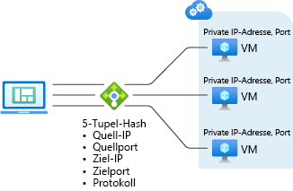

# Azure Load Balancer: Konzepte

Load Balancer verfügt über mehrere Funktionen für UDP- und TCP-Anwendungen. 

## Lastenausgleichsalgorithmus
Sie können eine Lastenausgleichsregel erstellen, um die Verteilung des Datenverkehrs vom Front-End zu einem Back-End-Pool durchzuführen. Azure Load Balancer nutzt einen Hashalgorithmus für die Verteilung von eingehenden Datenflüssen (nicht von Bytes). Load Balancer schreibt die Header von Datenflüssen für Instanzen des Back-End-Pools um. Wenn der Integritätstest einen fehlerfreien Back-End-Endpunkt angibt, ist ein Server verfügbar, der neue Flows empfangen kann.

Standardmäßig wird für Load Balancer ein Fünf-Tupel-Hash verwendet.

Der Hash umfasst Folgendes:

- **Quell-IP-Adresse**
- **Quellport**
- **Ziel-IP-Adresse**
- **Zielport**
- **IP-Protokollnummer zum Zuordnen von Flows zu verfügbaren Servern**

Die Affinität zu einer IP-Quelladresse wird hergestellt, indem ein Zwei- oder Drei-Tupel-Hash verwendet wird. Pakete desselben Datenflusses treffen bei derselben Instanz hinter dem Front-End mit Lastenausgleich ein. 

Der Quellport ändert sich, wenn ein Client einen neuen Datenfluss über dieselbe IP-Quelladresse initiiert. Dies kann dazu führen, dass der Datenverkehr aufgrund des Fünf-Tupel-Hashs an einen anderen Back-End-Endpunkt gesendet wird.
Weitere Informationen finden Sie unter [Konfigurieren des Verteilungsmodus für Azure Load Balancer](./load-balancer-distribution-mode.md).

In der folgenden Abbildung wird die hashbasierte Verteilung angezeigt:

*Abbildung: Hashbasierte Verteilung*

## Anwendungsunabhängigkeit und -transparenz

Load Balancer interagiert nicht direkt mit TCP oder UDP oder der Anwendungsschicht. Alle TCP- oder UDP-Anwendungsszenarien können unterstützt werden. Von Load Balancer werden keine Datenflüsse geschlossen oder initiiert, und es erfolgt keine Interaktion mit der Nutzlast des Datenflusses. Load Balancer verfügt nicht über Gatewayfunktionen auf der Anwendungsschicht. Protokollhandshakes werden immer direkt zwischen dem Client und der Back-End-Poolinstanz durchgeführt. Bei einer Antwort auf einen eingehenden Flow handelt es sich immer um die Antwort eines virtuellen Computers. Wenn der Flow auf dem virtuellen Computer eingeht, wird auch die IP-Adresse der ursprünglichen Quelle gespeichert.

* Jeder Endpunkt erhält über eine VM eine Antwort. Zum Beispiel wird ein TCP-Handshake zwischen dem Client und der ausgewählten Back-End-VM durchgeführt. Eine Antwort auf eine Anforderung, die an ein Front-End gesendet wird, wird von einer Back-End-VM generiert. Wenn Sie eine erfolgreiche Überprüfung der Konnektivität für ein Front-End durchführen, bedeutet dies, dass Sie den Konnektivitätsdurchsatz für mindestens eine Back-End-VM überprüfen.
* Anwendungsnutzlasten sind für das Lastenausgleichsmodul transparent. Alle UDP- oder TCP-Anwendungen können unterstützt werden.
* Da das Lastenausgleichsmodul nicht mit der TCP-Nutzlast interagiert und keine TLS-Abladung bereitstellt, können Sie umfassende verschlüsselte Szenarien erstellen. Die Verwendung eines Lastenausgleichsmoduls ermöglicht ein hohes Maß an Aufskalierung für TLS-Anwendungen, indem die TLS-Verbindung auf dem virtuellen Computer selbst beendet wird. Beispielsweise ist die TLS-Funktion zum erstellen von Sitzungsschlüsseln vom Typ und der Nummer der VMs beschränkt, die Sie zum Back-End-Pool hinzufügen.

## Ausgehende Verbindungen 

Datenflüsse vom Back-End-Pool zu öffentlichen IP-Adressen werden dem Front-End zugeordnet. Azure übersetzt ausgehende Verbindungen an die öffentliche IP-Adresse des Front-Ends basierend auf der Ausgangsregel für den Lastenausgleich. Diese Konfiguration hat die folgenden Vorteile: Einfache Upgrades und eine Notfallwiederherstellung von Diensten, da das Front-End dynamisch einer anderen Instanz des Diensts zugeordnet werden kann. Vereinfachte Verwaltung von Zugriffssteuerungslisten. Zugriffssteuerungslisten, die als Front-End-IP-Adressen ausgedrückt werden, ändern sich nicht, wenn Dienste hoch- oder herunterskaliert oder erneut bereitgestellt werden. Die Übersetzung von ausgehenden Verbindungen in eine Anzahl von IP-Adressen, die geringer als die Anzahl von Computern ist, verringert den Aufwand für die Implementierung sicherer Empfängerlisten. Weitere Informationen zur Übersetzung der Quellnetzwerkadresse (Source Network Address Translation, SNAT) und zu Azure Load Balancer finden Sie unter [SNAT und Azure Load Balancer](load-balancer-outbound-connections.md).

## Verfügbarkeitszonen 

Load Balancer Standard unterstützt zusätzliche Funktionen in Regionen, in denen Verfügbarkeitszonen verfügbar sind. Verfügbarkeitszonenkonfigurationen sind für beide Typen von Load Balancer Standard (öffentlich und intern) verfügbar. Ein zonenredundantes Front-End übersteht Zonenfehler, indem in allen Zonen gleichzeitig dedizierte Infrastruktur genutzt wird. Darüber hinaus können Sie ein Front-End für eine bestimmte Zone garantieren. Ein Zonen-Front-End wird über dedizierte Infrastruktur in einer einzelnen Zone bereitgestellt. Ein zonenübergreifender Lastenausgleich ist für den Back-End-Pool verfügbar. Alle VM-Ressourcen eines virtuellen Netzwerks können Teil eines Back-End-Pools sein. Von Load Balancer Basic-Instanzen werden keine Zonen unterstützt. Weitere Informationen finden Sie unter [Load Balancer Standard und Verfügbarkeitszonen](load-balancer-standard-availability-zones.md) sowie unter [Was sind Verfügbarkeitszonen in Azure?](../availability-zones/az-overview.md).

## Hochverfügbarkeitsports

Sie können Lastenausgleichsregeln für Hochverfügbarkeitsports konfigurieren, damit die Anwendung skaliert werden kann und hohe Zuverlässigkeit bietet. Mit diesen Regeln wird ein Lastenausgleich pro Datenfluss für kurzlebige Ports der Front-End-IP-Adresse des internen Lastenausgleichsmoduls bereitgestellt. Das Feature ist für Fälle nützlich, in denen es unpraktisch oder unerwünscht ist, einzelne Ports anzugeben. Mit Regeln für Hochverfügbarkeitsports können Sie n+1-Szenarien vom Typ „Aktiv/Passiv“ oder „Aktiv-Aktiv“ erstellen. Diese Szenarien gelten für virtuelle Netzwerkgeräte und alle Anwendungen, für die große Bereiche mit Eingangsports erforderlich sind. Ein Integritätstest kann verwendet werden, um zu bestimmen, welche Back-Ends neue Datenflüsse empfangen sollen.  Sie können eine Netzwerksicherheitsgruppe verwenden, um ein Portbereichsszenario zu emulieren. Von Load Balancer Basic-Instanzen werden keine Hochverfügbarkeitsports unterstützt. Lesen Sie die [ausführliche Erläuterung zu HA-Ports](load-balancer-ha-ports-overview.md).

## Mehrere Front-Ends 

Load Balancer unterstützt mehrere Regeln mit mehreren Front-Ends.  Mit Load Balancer Standard ist dies auch für Szenarien mit ausgehenden Verbindungen möglich. Ausgangsregeln stellen die Umkehrung von Eingangsregeln dar. Mit der Ausgangsregel wird eine Zuordnung für ausgehende Verbindungen erstellt. Load Balancer Standard nutzt über eine Lastenausgleichsregel alle Front-Ends, die einer VM-Ressource zugeordnet sind. Darüber hinaus können Sie mit einem Parameter der Lastenausgleichsregel eine Lastenausgleichsregel für ausgehende Verbindungen unterdrücken und bestimmte Front-Ends (oder auch keins) auswählen. Bei Load Balancer Basic wird dagegen nach dem Zufallsprinzip ein Front-End ausgewählt. Es kann nicht gesteuert werden, welches Front-End ausgewählt wird.

## Unverankerte IP

In einigen Anwendungsszenarien ist es eine Priorität bzw. Anforderung, den gleichen Port für mehrere Anwendungsinstanzen auf einer einzelnen VM im Back-End-Pool zu verwenden. Gängige Beispiele für die Portwiederverwendung sind das Clustering für Hochverfügbarkeit, virtuelle Netzwerkgeräte und die Bereitstellung mehrerer TLS-Endpunkte ohne erneute Verschlüsselung. Wenn Sie den Back-End-Port in mehreren Regeln wiederverwenden möchten, müssen Sie in der Regeldefinition Floating IP aktivieren.

**Floating IP** ist die in Azure verwendete Benennung für die Komponente „Direct Server Return (DSR)“. DSR besteht aus zwei Teilen: 

- Datenflusstopologie
- Zuordnungsschema für IP-Adressen

Auf Plattformebene wird Azure Load Balancer immer in einer DSR-Datenflusstopologie betrieben, unabhängig davon, ob Floating IP aktiviert ist. Dies bedeutet, dass der ausgehende Teil eines Datenflusses immer ordnungsgemäß so umgeschrieben wird, dass er direkt wieder an den Ursprung übermittelt wird.
Ohne Floating IP wird von Azure ein herkömmliches Zuordnungsschema für IP-Adressen für den Lastenausgleich (IP-Adresse für VM-Instanzen) verfügbar gemacht, um die Nutzung zu vereinfachen. Durch die Aktivierung von Floating IP wird die Zuordnung der IP-Adressen in die Front-End-IP-Adresse des Lastenausgleichsmoduls geändert, um für zusätzliche Flexibilität zu sorgen. [Hier](load-balancer-multivip-overview.md)erhalten Sie weitere Informationen.

## Einschränkungen

- Floating IP wird für sekundäre IP-Konfigurationen in Szenarien mit internem Lastenausgleich derzeit nicht unterstützt.

- Eine Lastenausgleichsregel kann sich nicht über zwei virtuelle Netzwerke erstrecken.  Front-Ends und ihre Back-End-Instanzen müssen sich im gleichen virtuellen Netzwerk befinden.  

- Auf Webworkerrollen ohne virtuelles Netzwerk und andere Plattformdienste von Microsoft kann nur von Instanzen aus zugegriffen werden, die sich hinter einer internen Load Balancer Standard-Instanz befinden. Verlassen Sie sich nicht auf diese Zugriffsmöglichkeit, da der jeweilige Dienst oder die zugrunde liegende Plattform ohne vorherige Ankündigung geändert werden kann. Falls bei Verwendung einer internen Load Balancer Standard-Instanz Konnektivität in ausgehender Richtung erforderlich ist, muss die [ausgehende Konnektivität](load-balancer-outbound-connections.md) konfiguriert werden.

- Load Balancer ermöglicht den Lastenausgleich und die Portweiterleitung für bestimmte TCP- oder UDP-Protokolle. Für Lastenausgleichsregeln und NAT-Regeln für eingehenden Datenverkehr werden TCP und UDP unterstützt, aber keine anderen IP-Protokolle, z. B. ICMP.

- Für den ausgehenden Datenfluss von einer Back-End-VM zum Front-End einer internen Load Balancer-Instanz tritt ein Fehler auf.

- Das Weiterleiten von IP-Fragmenten wird für Lastenausgleichsregeln nicht unterstützt. Die IP-Fragmentierung von UDP- und TCP-Paketen wird für Lastenausgleichsregeln nicht unterstützt. Hochverfügbarkeitsports für Lastenausgleichsregeln können verwendet werden, um vorhandene IP-Fragmente weiterzuleiten. Weitere Informationen finden Sie unter [Übersicht über Hochverfügbarkeitsports](load-balancer-ha-ports-overview.md).

## Nächste Schritte

- Informationen zu den ersten Schritten mit einer Load Balancer-Instanz finden Sie unter [Schnellstart: Erstellen eines Load Balancers im Tarif „Standard“ für den Lastenausgleich virtueller Computer über das Azure-Portal](quickstart-load-balancer-standard-public-portal.md). Dort erfahren Sie, wie Sie eine Load Balancer-Instanz und virtuelle Computer mit einer installierten benutzerdefinierten IIS-Erweiterung erstellen und den Lastenausgleich für die Web-App zwischen den virtuellen Computern vornehmen.
- Informieren Sie sich über [Azure Load Balancer – Ausgehende Verbindungen](load-balancer-outbound-connections.md).
- Weitere Informationen zu [Azure Load Balancer](load-balancer-overview.md).
- Informationen zu [Integritätstests](load-balancer-custom-probe-overview.md)
- Weitere Informationen zu [Diagnosen für Standard Load Balancer](load-balancer-standard-diagnostics.md).
- Weitere Informationen zu [Netzwerksicherheitsgruppen](../virtual-network/security-overview.md).
