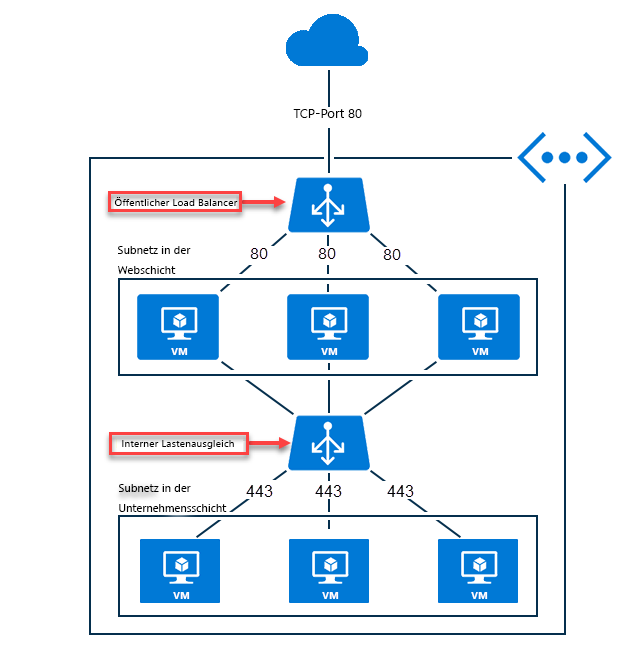

# Was versteht man unter Azure Load Balancer?

*Lastenausgleich* bezieht sich auf die gleichmäßige Verteilung von Last (oder eingehendem Netzwerkdatenverkehr) auf eine Gruppe von Back-End-Ressourcen oder Server. Azure bietet [verschiedene Lastenausgleichsoptionen](https://docs.microsoft.com/azure/architecture/guide/technology-choices/load-balancing-overview) für unterschiedliche Anforderungen. In diesem Dokument wird Azure Load Balancer behandelt.

Azure Load Balancer setzt in der vierten Schicht des OSI-Modells (Open Systems Interconnection) an. Der Dienst ist der zentrale Kontaktpunkt für Clients. Der Lastenausgleich verteilt neue eingehende Datenflüsse, die am Front-End des Lastenausgleichs eintreffen, auf die Instanzen des Back-End-Pools. Diese Datenflüsse richten sich nach den konfigurierten Lastenausgleichsregeln und Integritätstests. Bei den Back-End-Poolinstanzen kann es sich um virtuelle Azure-Computer oder um Instanzen in einer VM-Skalierungsgruppe handeln.

Ein **[öffentlicher Lastenausgleich](./concepts-limitations.md#publicloadbalancer)** kann ausgehende Verbindungen für virtuelle Computer in Ihrem virtuellen Netzwerk bereitstellen. Diese Verbindungen werden durch die Übersetzung der privaten IP-Adressen in öffentliche IP-Adressen hergestellt. Öffentliche Load Balancer-Instanzen werden verwendet, um einen Lastausgleich für den eingehenden Internetdatenverkehr Ihrer virtuellen Computer vorzunehmen.

Ein **[interner (oder privater) Lastenausgleich](./concepts-limitations.md#internalloadbalancer)** wird verwendet, wenn private IP-Adressen nur am Front-End benötigt werden. Interne Lastenausgleichsmodule werden verwendet, um einen Lastausgleich für Datenverkehr innerhalb eines virtuellen Netzwerks vorzunehmen. Auf ein Lastenausgleichs-Front-End kann auch über ein lokales Netzwerk in einem Hybridszenario zugegriffen werden.

  

*Abbildung: Durchführen eines Lastenausgleichs für Anwendungen mit mehreren Ebenen mithilfe eines öffentlichen und eines internen Load Balancers*

Weitere Informationen zu den einzelnen Lastenausgleichskomponenten finden Sie unter [Azure Load Balancer-Komponenten und -Einschränkungen](./concepts-limitations.md).

>[!NOTE]
> Microsoft empfiehlt [Load Balancer Standard](./load-balancer-standard-overview.md).
Eigenständige virtuelle Computer, Verfügbarkeitsgruppen und VM-Skalierungsgruppen können nur mit einer SKU, nie mit beiden verbunden werden. Die Load Balancer-SKU muss mit der SKU für öffentliche IP-Adressen übereinstimmen, wenn Sie sie mit öffentlichen IP-Adressen verwenden. Load Balancer-SKUs und SKUs für öffentliche IP-Adressen sind nicht änderbar.

## Gründe für die Verwendung von Azure Load Balancer
Mit Azure Load Balancer können Sie Ihre Anwendungen skalieren und hochverfügbare Dienste erstellen. Der Lastenausgleich unterstützt Szenarien mit eingehenden und ausgehenden Verbindungen. Der Lastenausgleich sorgt für eine niedrige Wartezeit und einen hohen Durchsatz und kann eine zentrale Skalierung auf Millionen von Datenflüssen für alle TCP- und UDP-Anwendungen durchführen.

Hier sind einige wichtige Szenarien aufgeführt, die Sie mit Azure Load Balancer erreichen können:

- Vornehmen eines Lastausgleichs für **[internen](https://docs.microsoft.com/azure/load-balancer/tutorial-load-balancer-standard-manage-portal)** und **[externen](https://docs.microsoft.com/azure/load-balancer/tutorial-load-balancer-standard-internal-portal)** Datenverkehr auf virtuellen Azure-Computern

- Erhöhen der Verfügbarkeit durch Verteilung von Ressourcen **[innerhalb](https://docs.microsoft.com/azure/load-balancer/tutorial-load-balancer-standard-public-zonal-portal)** von und **[zwischen](https://docs.microsoft.com/azure/load-balancer/tutorial-load-balancer-standard-public-zone-redundant-portal)** Zonen

- Konfigurieren der **[ausgehenden Konnektivität](https://docs.microsoft.com/azure/load-balancer/load-balancer-outbound-connections)** für virtuelle Azure-Computer

- Verwenden von **[Integritätstests](https://docs.microsoft.com/azure/load-balancer/load-balancer-custom-probe-overview)** zur Überwachung von Ressourcen mit Lastenausgleich

- Verwenden der **[Portweiterleitung](https://docs.microsoft.com/azure/load-balancer/tutorial-load-balancer-port-forwarding-portal)** zum Zugreifen auf virtuelle Computer in einem virtuellen Netzwerk basierend auf der öffentlichen IP-Adresse und dem Port

- Aktivieren der Unterstützung für den **[Lastenausgleich](https://docs.microsoft.com/azure/virtual-network/virtual-network-ipv4-ipv6-dual-stack-standard-load-balancer-powershell)** für **[IPv6](https://docs.microsoft.com/azure/virtual-network/ipv6-overview)**

- Nutzen der **[Metriken und Diagnosedaten](https://docs.microsoft.com/azure/load-balancer/load-balancer-standard-diagnostics)** für Azure Load Balancer mit **[Azure Monitor](https://docs.microsoft.com/azure/azure-monitor/overview)**

- Vornehmen eines Lastausgleichs für Dienste an **[mehreren Ports, mehreren IP-Adressen oder beidem](https://docs.microsoft.com/azure/load-balancer/load-balancer-multivip-overview)**

- Verschieben der Ressourcen von **[internen](https://docs.microsoft.com/azure/load-balancer/move-across-regions-internal-load-balancer-portal)** und **[externen](https://docs.microsoft.com/azure/load-balancer/move-across-regions-external-load-balancer-portal)** Lastenausgleichsmodulen zwischen Azure-Regionen

- Vornehmen eines Lastausgleichs für TCP- und UDP-Datenflüsse an allen Ports gleichzeitig mithilfe von **[Hochverfügbarkeitsports](https://docs.microsoft.com/azure/load-balancer/load-balancer-ha-ports-overview)**

## Preise

Die Verwendung von Load Balancer Standard ist kostenpflichtig.

* Anzahl von konfigurierten Lastenausgleichsregeln und Regeln für ausgehenden Datenverkehr. NAT-Regeln für eingehenden Datenverkehr werden nicht in die Gesamtzahl von Regeln eingerechnet.
* Menge der verarbeiteten eingehenden und ausgehenden Daten, unabhängig von den Regeln.

Informationen zu den Preisen für Load Balancer Standard finden Sie unter [Load Balancer – Preise](https://azure.microsoft.com/pricing/details/load-balancer/).

Basic Load Balancer wird kostenlos angeboten.

## SLA

Informationen zur Vereinbarung zum Servicelevel (SLA) für Load Balancer Standard finden Sie unter [SLA für Load Balancer](https://aka.ms/lbsla).

## Nächste Schritte

Informationen zu den ersten Schritten mit einer Load Balancer-Instanz finden Sie unter [Schnellstart: Erstellen einer Load Balancer Standard-Instanz für den Lastenausgleich virtueller Computer im Azure-Portal](quickstart-load-balancer-standard-public-portal.md).

Weitere Informationen zu den Einschränkungen und Komponenten von Azure Load Balancer finden Sie unter [Azure Load Balancer-Komponenten und -Einschränkungen](./concepts-limitations.md).
