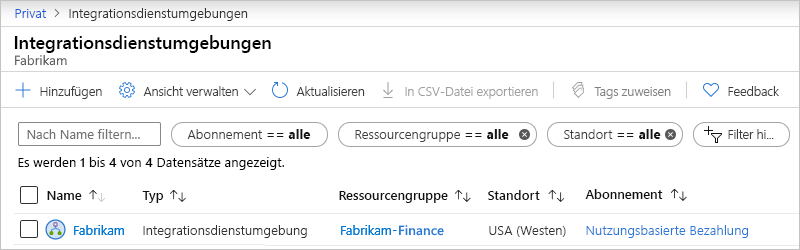
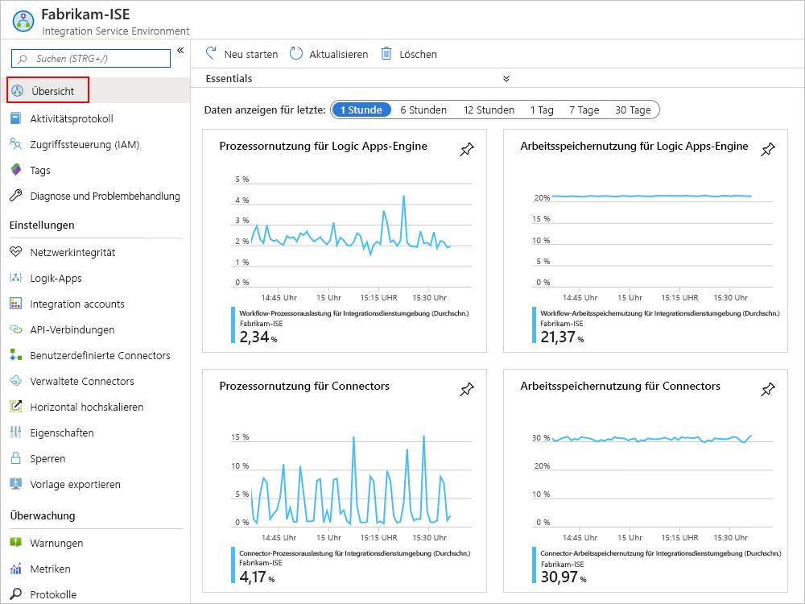
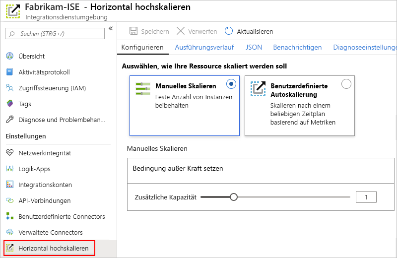
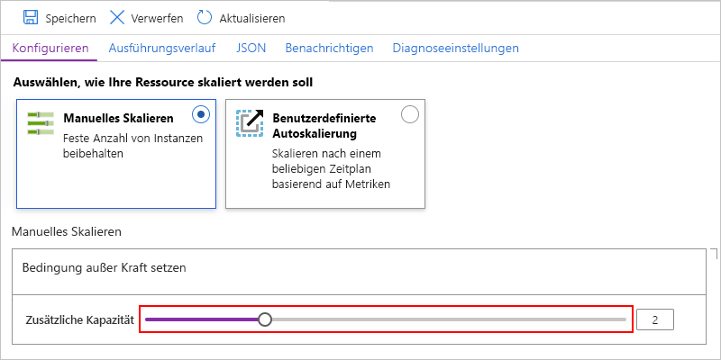
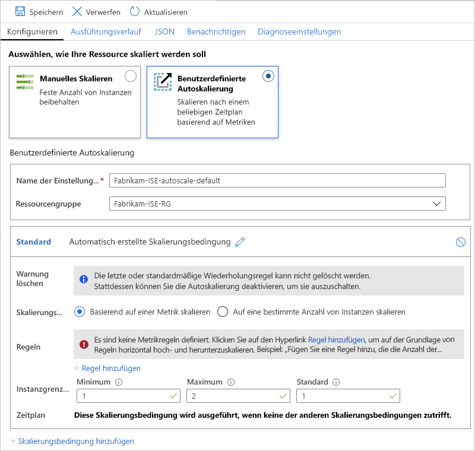

# Verwalten Ihrer Integrationsdienstumgebung (Integration Service Environment, ISE) in Azure Logic Apps

In diesem Artikel wird beschrieben, wie Sie Verwaltungsaufgaben für Ihre [Integrationsdienstumgebung (ISE)](../logic-apps/connect-virtual-network-vnet-isolated-environment-overview.md) ausführen. Beispiel:

* Verwalten von Ressourcen, z. B. Logik-Apps, Verbindungen, Integrationskonten und Connectors in Ihrer ISE.
* Überprüfen der Integrität des Netzwerks Ihrer ISE.
* Hinzufügen von Kapazität, Neustarten oder Löschen der ISE der gemäß den Schritten in diesem Thema. Um diese Artefakte Ihrer ISE hinzuzufügen, lesen Sie [Hinzufügen von Artefakten zu Ihrer Integrationsdienstumgebung](../logic-apps/add-artifacts-integration-service-environment-ise.md).

## Anzeigen Ihrer Integrationsdienstumgebung

1. Melden Sie sich beim [Azure-Portal](https://portal.azure.com) an.

1. Geben Sie im Suchfeld des Portals „Integrationsdienstumgebungen“ ein, und wählen Sie dann **Integrationsdienstumgebungen** aus.

   

1. Wählen Sie in der Ergebnisliste Ihre Integrationsdienstumgebung aus.

   

1. Fahren Sie mit den nächsten Abschnitten fort, um Logik-Apps, Verbindungen, Connectors oder Integrationskonten in Ihrer ISE zu finden.

## Überprüfen der Netzwerkintegrität

Wählen Sie im ISE-Menü unter **Einstellungen** die Option **Netzwerkintegrität** aus. In diesem Bereich wird der Integritätsstatus für Ihre Subnetze und ausgehenden Abhängigkeiten von anderen Diensten angezeigt.

## Verwalten Ihrer Logik-Apps

Sie können die Logik-Apps anzeigen und verwalten, die in ihrer ISE vorhanden sind.

1. Wählen Sie im ISE-Menü unter **Einstellungen** die Option **Logik-Apps** aus.

   

1. Wenn Sie Logik-Apps entfernen möchten, die Sie nicht mehr in Ihrer ISE benötigen, markieren Sie diese Logik-Apps und wählen dann **Löschen** aus. Um den Löschvorgang zu bestätigen, wählen Sie **Ja** aus.

> [!NOTE]
> Wenn Sie eine untergeordnete Logik-App löschen und neu erstellen, müssen Sie die übergeordnete Logik-App erneut speichern. Die neu erstellte untergeordnete App besitzt andere Metadaten.
> Wenn Sie die übergeordnete Logik-App nach dem erneuten Erstellen der untergeordneten App nicht erneut speichern, schlagen ihre Aufrufe der untergeordneten Logik-App mit dem Fehler „Nicht autorisiert“ fehl. Dieses Verhalten gilt für über- und untergeordnete Logik-Apps, z. B. solche, die Artefakte in Integrationskonten verwenden oder Azure-Funktionen aufrufen.

## Verwalten von API-Verbindungen

Sie können die Verbindungen anzeigen und verwalten, die von den Logik-Apps erstellt wurden, die in ihrer ISE ausgeführt werden.

1. Wählen Sie im ISE-Menü unter **Einstellungen** die Option **API-Verbindungen** aus.

   

1. Um Verbindungen zu entfernen, die Sie in Ihrer ISE nicht mehr benötigen, markieren Sie diese Verbindungen und wählen dann **Löschen** aus. Um den Löschvorgang zu bestätigen, wählen Sie **Ja** aus.

## Verwalten der ISE-Connectors

Sie können die API-Connectors anzeigen und verwalten, die für Ihre ISE bereitgestellt werden.

1. Wählen Sie im ISE-Menü unter **Einstellungen** die Option **Verwaltete Connectors** aus.

   

1. Um Connectors zu entfernen, die Sie in Ihrer ISE nicht mehr zur Verfügung stellen möchten, markieren Sie diese Connectors und wählen dann **Löschen** aus. Um den Löschvorgang zu bestätigen, wählen Sie **Ja** aus.

## Verwalten benutzerdefinierter Connectors

Sie können die benutzerdefinierten Connectors anzeigen und verwalten, die Sie für Ihre ISE bereitgestellt haben.

1. Wählen Sie im ISE-Menü unter **Einstellungen** die Option **Benutzerdefinierte Connectors** aus.

   

1. Um benutzerdefinierte Connectors zu entfernen, die Sie in Ihrer ISE nicht mehr benötigen, markieren Sie diese Connectors und wählen dann **Löschen** aus. Um den Löschvorgang zu bestätigen, wählen Sie **Ja** aus.

## Verwalten von Integrationskonten

1. Wählen Sie im ISE-Menü unter **Einstellungen** die Option **Integrationskonten** aus.

   

1. Um nicht mehr benötigte Integrationskonten aus Ihrer ISE zu entfernen, wählen Sie diese Integrationskonten und dann **Löschen** aus.

## Hinzufügen von ISE-Kapazität

Die Premium-ISE-Basiseinheit hat eine feste Kapazität. Falls Sie mehr Durchsatz benötigen, können Sie also entweder während der Erstellung oder danach weitere Skalierungseinheiten hinzufügen. Die Developer-SKU verfügt nicht über die Funktion zum Hinzufügen von Skalierungseinheiten.

1. Navigieren Sie im [Azure-Portal](https://portal.azure.com) zu Ihrer ISE.

1. Wählen Sie im Menü Ihrer ISE **Übersicht** aus, um Nutzungs- und Leistungsmetriken für Ihre ISE anzuzeigen.

   

1. Wählen Sie unter **Einstellungen** die Option **Aufskalieren** aus. Wählen Sie im Bereich **Konfigurieren** unter den folgenden Optionen aus:

   * [**Manuelles Skalieren**](#manual-scale): Skalieren auf Grundlage der Anzahl der Verarbeitungseinheiten, die Sie verwenden möchten.
   * [**Benutzerdefinierte Autoskalierung**](#custom-autoscale): Skalieren auf Grundlage von Leistungsmetriken durch Auswählen unter verschiedenen Kriterien und Angeben der Schwellenwertbedingungen zur Erfüllung dieser Kriterien.

   

### Manuelles Skalieren

1. Nachdem Sie **Manuelle Skalierung** ausgewählt haben, wählen Sie für **Zusätzliche Kapazität** die Anzahl der Skalierungseinheiten aus, die Sie verwenden möchten.

   

1. Klicken Sie auf **Speichern**, wenn Sie fertig sind.

### Benutzerdefinierte Autoskalierung

1. Nachdem Sie **Benutzerdefinierte Autoskalierung** als **Name der Einstellung für die Autoskalierung** ausgewählt haben, geben Sie einen Namen für Ihre Einstellung an, und wählen Sie optional die Azure-Ressourcengruppe aus, zu der die Einstellung gehört.

   

1. Wählen Sie als **Standard**bedingung entweder **Basierend auf einer Metrik skalieren** oder **Auf eine bestimmte Anzahl von Instanzen skalieren** aus.

   * Wenn Sie die instanzbasierte Option auswählen, geben Sie die Anzahl der Verarbeitungseinheiten ein, wobei es sich um einen Wert zwischen 0 und 10 handelt.

   * Wenn Sie die metrikbasierte Option verwenden, befolgen Sie die nachstehenden Schritte:

     1. Wählen Sie im Abschnitt **Regeln** die Option **Regel hinzufügen** aus.

     1. Richten Sie im Bereich **Horizontal hochskalieren** Ihre Kriterien und die entsprechenden Maßnahmen beim Auslösen der Regel ein.

     1. Geben Sie als **Instanzgrenzwerte** folgende Werte an:

        * **Minimum**: Die Mindestanzahl der zu verwendenden Verarbeitungseinheiten.
        * **Maximum**: Die Höchstanzahl der zu verwendenden Verarbeitungseinheiten.
        * **Standard:** Falls Probleme beim Lesen der Ressourcenmetriken auftreten, und die aktuelle Kapazität unterhalb der Standardkapazität liegt, wird von der automatischen Skalierung das horizontale Hochskalieren auf den Standardwert von Verarbeitungseinheiten durchgeführt. Wenn die aktuelle Kapazität jedoch die Standardkapazität überschreitet, wird die automatische Abskalierung nicht aktiviert.

1. Um eine weitere Bedingung hinzuzufügen, wählen Sie **Skalierungsbedingung hinzufügen** aus.

1. Speichern Sie Ihre Änderungen, wenn Sie mit den Einstellungen für die automatische Skalierung fertig sind.

## Neustarten der ISE

Wenn Sie Ihren DNS-Server oder die DNS-Servereinstellungen ändern, müssen Sie die ISE neu starten, damit die ISE diese Änderungen übernehmen kann. Das Neustarten einer Premium-SKU-ISE führt aufgrund der Redundanz, und weil die Komponenten während der Wiederverwendung nacheinander neu starten, nicht zu Ausfallzeiten. Bei einer Developer-SKU-ISE treten jedoch Ausfallzeiten auf, da keine Redundanz vorhanden ist. Weitere Informationen finden Sie unter [ISE-SKUs](../logic-apps/connect-virtual-network-vnet-isolated-environment-overview.md#ise-level).

1. Navigieren Sie im [Azure-Portal](https://portal.azure.com) zu Ihrer ISE.

1. Wählen Sie im ISE-Menü **Übersicht** aus. Wählen Sie auf der Symbolleiste „Übersicht“ **Neu starten** aus.

   

## ISE löschen

Bevor Sie eine ISE löschen, die Sie nicht mehr benötigen, oder eine Azure-Ressourcengruppe, die eine ISE enthält, überprüfen Sie, ob keine Richtlinien oder Sperren in der Azure-Ressourcengruppe vorhanden sind, die diese Ressourcen enthält, oder in Ihrem virtuellen Azure-Netzwerk, da diese Elemente das Löschen blockieren können.

Nachdem Sie Ihre ISE gelöscht haben, müssen Sie möglicherweise bis zu 9 Stunden warten, bevor Sie versuchen können, Ihr virtuelles Azure-Netzwerk oder Ihre Subnetze zu löschen.

## Nächste Schritte

* [Hinzufügen von Ressourcen zu Ihrer Integrationsdienstumgebung (Integration Service Environment, ISE) in Azure Logic Apps](../logic-apps/add-artifacts-integration-service-environment-ise.md)