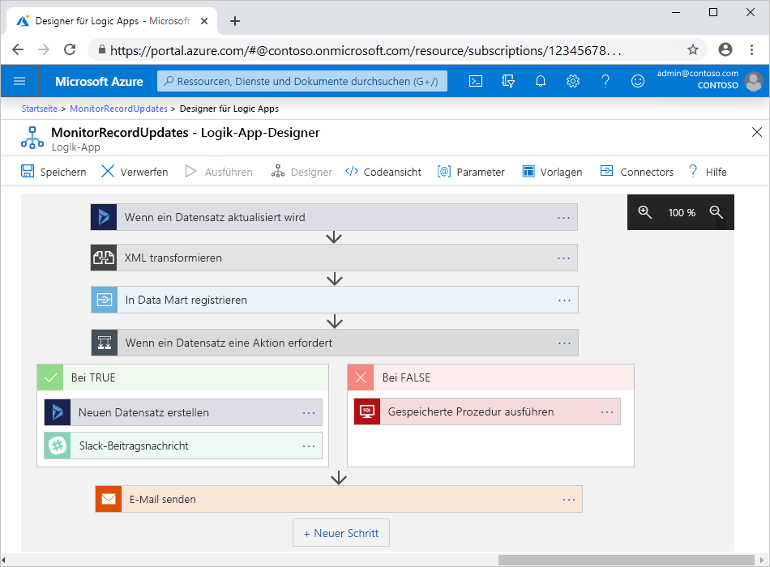

# Was ist Azure Logic Apps?

[Logic Apps](https://azure.microsoft.com/services/logic-apps) ist eine cloudbasierte Plattform, mit der Sie [automatisierte Workflows](#logic-app-concepts) für die Integration von Apps, Daten, Diensten und Systemen erstellen und ausführen können. Mithilfe dieser Plattform können Sie einfacher und schneller hochgradig skalierbare Integrationslösungen für Unternehmens- und B2B-Szenarien (Business-to-Business) erstellen. Als Mitglied der [Azure Integration Services](https://azure.microsoft.com/product-categories/integration/) bietet Logic Apps Ihnen eine einfachere Möglichkeit, ältere, moderne und innovative Systeme über Cloud-, lokale und Hybridumgebungen hinweg zu verbinden.

Die folgende Liste enthält lediglich einige Beispielaufgaben, Geschäftsprozesse und Workloads, die Sie mit dem Logic Apps-Dienst automatisieren können:

* Planen und Senden von E-Mail-Benachrichtigungen mit Office 365, wenn ein bestimmtes Ereignis eintritt, z. B. eine neue Datei wird hochgeladen.
* Weiterleiten und Verarbeiten von Kundenbestellungen in lokalen Systemen und Clouddiensten
* Verschieben von hochgeladenen Dateien von einem SFTP- oder FTP-Server in Azure Storage
* Überwachen von Tweets, Analysieren der Stimmung und Erstellen von Warnungen oder Aufgaben für zu prüfende Elemente

> [!VIDEO https://channel9.msdn.com/Blogs/Azure/Introducing-Azure-Logic-Apps/player]

Um einen sicheren Zugriff zu gewährleisten und Vorgänge in Echtzeit für verschiedene Datenquellen ausführen zu können, steht ein [ständig wachsender Katalog](/connectors/connector-reference/connector-reference-logicapps-connectors) mit [von Microsoft verwalteten Connectors](#logic-app-concepts) zur Verfügung. Das Angebot umfasst unter anderem Folgendes:

* Azure-Dienste wie Blob Storage und Service Bus
* Office-Dienste wie Outlook, Excel und SharePoint
* Datenbankserver wie SQL und Oracle
* Unternehmenssysteme wie SAP und IBM MQ
* Dateifreigaben wie FTP und SFTP

Sie können [integrierte Trigger und Aktionen](#logic-app-concepts) verwenden, die nativ innerhalb des Logic Apps-Diensts ausgeführt werden, um mit einem beliebigen Dienstendpunkt zu kommunizieren, Ihren eigenen Code auszuführen, Ihren Workflow zu strukturieren oder Daten zu bearbeiten. Zu den integrierten Triggern zählen beispielsweise „Anforderung“, „HTTP“ und „Serie“. Zu den integrierten Aktionen zählen „Bedingung“, „For each“, „JavaScript-Code ausführen“ und Vorgänge, die in Azure gehostete Azure-Funktionen, Web-Apps oder API-Apps aufrufen, sowie andere Logic Apps-Workflows.

Für B2B-Integrationsszenarien enthält Logic Apps Funktionen von [BizTalk Server](/biztalk/core/introducing-biztalk-server). Sie können ein [Integrationskonto](logic-apps-enterprise-integration-create-integration-account.md) erstellen, in dem Sie Handelspartner, Vereinbarungen, Schemas, Zuordnungen und andere B2B-Artefakte definieren. Wenn Sie dieses Konto mit einer Logik-App verknüpfen, können Sie Workflows erstellen, die diese Artefakte verwenden und Nachrichten über Protokolle wie AS2, EDIFACT, X12 und RosettaNet austauschen.

Weitere Informationen dazu, wie Workflows auf Apps, Daten, Dienste und Systeme zugreifen und mit ihnen arbeiten können, finden Sie in der folgenden Dokumentation:

* [Connectors für Azure Logic Apps](../connectors/apis-list.md)
* [Integrierte Trigger und Aktionen für Azure Logic Apps](../connectors/built-in.md)
* [Verwaltete Connectors für Azure Logic Apps](../connectors/managed.md)
* [B2B-Unternehmensintegrationslösungen mit Azure Logic Apps und dem Enterprise Integration Pack](logic-apps-enterprise-integration-overview.md)

## Schlüsselbegriffe

* **Workflow:** Eine Reihe von Schritten zum Definieren einer Aufgabe oder eines Prozesses – beginnend mit einem einzelnen Trigger und gefolgt von mindestens einer Aktion.

* **Trigger:** Der erste Schritt, durch den jeder Workflow gestartet wird. Gibt die Bedingung an, die erfüllt sein muss, damit Aktionen im Workflow ausgeführt werden. Ein Triggerereignis kann beispielsweise der Eingang einer E-Mail in Ihrem Posteingang oder die Erkennung einer neuen Datei in einem Speicherkonto sein.

* **Aktion:** Jeder weitere Schritt, der nach dem Trigger folgt und einen Vorgang in einem Workflow ausführt.

* **Verwalteter Connector:** Eine von Microsoft verwaltete REST-API für den Zugriff auf eine bestimmte App bzw. auf Daten, einen Dienst oder ein System. Bei den meisten verwalteten Connectors muss zunächst eine Verbindung in Ihrem Workflow erstellt und Ihre Identität authentifiziert werden, um den jeweiligen Connector verwenden zu können.

  Sie können beispielsweise einen Workflow mit einem Trigger starten oder eine Aktion für Azure Blob Storage, Office 365, Salesforce oder SFTP-Server einschließen. Weitere Informationen finden Sie unter [Verwaltete Connectors für Azure Logic Apps](../connectors/managed.md).

* **Integrierter Trigger oder integrierte Aktion:** Ein nativ ausgeführter Logic Apps-Vorgang, der es ermöglicht, den Zeitplan oder die Struktur Ihres Workflows zu steuern, Ihren eigenen Code auszuführen, Daten zu verwalten oder zu bearbeiten oder andere Aufgaben in Ihrem Workflow auszuführen. Die meisten integrierten Vorgänge sind keinem Dienst oder System zugeordnet. Bei vielen ist es auch nicht erforderlich, zuerst eine Verbindung in Ihrem Workflow zu erstellen und Ihre Identität zu authentifizieren. Integrierte Vorgänge stehen auch für einige Dienste, Systeme und Protokolle zur Verfügung – etwa für Azure Functions, Azure API Management und Azure App Service.

  Mithilfe des Triggers „Serie“ lässt sich beispielsweise fast jeder Workflow basierend auf einem Zeitplan starten. Sie können aber auch den Trigger „Anforderung“ verwenden, damit Ihr Workflow erst gestartet wird, wenn er aufgerufen wird. Weitere Informationen finden Sie unter [Integrierte Trigger und Aktionen für Azure Logic Apps](../connectors/built-in.md).

* **Logik-App**: Die Azure-Ressource, die zum Erstellen eines Workflows erstellt werden soll. Basierend auf den Anforderungen Ihres Szenarios und denen Ihrer Lösung können Sie Logik-Apps erstellen, die entweder in der mehr- oder einzelinstanzenfähigen Logic Apps-Dienstumgebung oder in einer Integrationsdienstumgebung ausgeführt werden. Weitere Informationen finden Sie unter [Hostumgebungen für Logik-Apps](#host-environments).

## Funktionsweise von Logik-Apps

In einer Logik-App beginnt jeder Workflow immer mit einem einzelnen [Trigger](#logic-app-concepts). Ein Trigger wird ausgelöst, wenn eine Bedingung erfüllt ist – also beispielsweise, wenn ein bestimmtes Ereignis eintritt oder wenn Daten bestimmte Kriterien erfüllen. Viele Trigger verfügen über [Planungsfunktionen](../logic-apps/concepts-schedule-automated-recurring-tasks-workflows.md), mit denen die Häufigkeit der Workflowausführung gesteuert wird. Auf den Trigger folgt mindestens eine [Aktion](#logic-app-concepts) zum Ausführen von Vorgängen, durch die beispielsweise Daten, die den Workflow durchlaufen, verarbeitet, behandelt oder konvertiert werden oder die den nächsten Schritt des Workflows einleiten.

Der folgende Workflow beginnt beispielsweise mit einem Dynamics-Trigger, der über die integrierte Bedingung **Wenn ein Datensatz aktualisiert wird** verfügt. Die Aktionen umfassen das Transformieren von XML, das Aufrufen einer Web-App, die Daten aktualisiert, das Auswerten einer Bedingung, die steuert, welche Aktionen ausgeführt werden sollen, und das Senden einer E-Mail-Benachrichtigung mit den Ergebnissen. Wenn der Trigger ein Ereignis erkennt, das die Bedingung erfüllt, wird der Trigger ausgelöst, und die Aktionen im Workflow werden gestartet. Bei jeder Auslösung des Triggers wird durch den Logic Apps-Dienst eine Workflowinstanz zum Ausführen der Aktionen erstellt.

Workflows können visuell mithilfe des Designers für Logik-Apps im Azure-Portal, in Visual Studio Code oder in Visual Studio erstellt werden. Jeder Workflow verfügt auch über eine zugrunde liegende Definition, die mithilfe von JavaScript Object Notation (JSON) beschrieben wird. Wenn Sie möchten, können Sie Workflows bearbeiten, indem Sie diese JSON-Definition ändern. Für einige Erstellungs- und Verwaltungsaufgaben werden von Logic Apps auch Azure PowerShell- und Azure CLI-Befehle unterstützt. Für die automatisierte Bereitstellung werden von Logic Apps Azure Resource Manager-Vorlagen unterstützt.

## Hostumgebungen

Basierend auf Ihren Szenario- und Lösungsanforderungen können Sie Logik-Apps erstellen, die sich hinsichtlich der Logic Apps-Dienstumgebung unterscheiden, in der sie ausgeführt werden, sowie in der Art, wie Workflows Ressourcen verwenden. In der folgenden Tabelle sind diese Unterschiede kurz zusammengefasst.

| Umgebung | [Preismodell](logic-apps-pricing.md) | BESCHREIBUNG |
|-------------|----------------------------------------|-------------|
| Azure Logic Apps (mehrinstanzenfähig) | Verbrauch | Eine Logik-App kann nur einen Workflow haben. 

Workflows von verschiedenen Logik-Apps auf *mehreren Mandanten* nutzen dieselben Ressourcen für die Verarbeitung (Compute), den Speicher, das Netzwerk usw. |
| Azure Logic Apps [(einzelinstanzenfähig (Vorschau))](logic-apps-overview-preview.md) | [Vorschau](logic-apps-overview-preview.md#pricing-model) | Eine Logik-App kann über mehrere Workflows verfügen. 

Workflows von *derselben Logik-App auf einem einzelnen Mandanten* nutzen dieselben Ressourcen für die Verarbeitung (Compute), den Speicher, das Netzwerk usw. |
| [Integrationsdienstumgebung (Integration Service Environment, ISE)](connect-virtual-network-vnet-isolated-environment-overview.md) | Fest | Eine Logik-App kann nur einen Workflow haben. 

Workflows von anderen Logik-Apps *in derselben Umgebung* nutzen dieselben Ressourcen für die Verarbeitung (Compute), den Speicher, das Netzwerk usw. |
||||

Logik-Apps, die in Logic Apps-Dienstumgebungen gehostet werden, weisen ebenfalls unterschiedliche Grenzwerte auf. Weitere Informationen finden Sie unter [Grenzwerte in Logic Apps](logic-apps-limits-and-config.md) und [Grenzwerte in Logic Apps (Vorschau)](logic-apps-overview-preview.md#limits).

## Gründe für die Verwendung von Logic Apps

Die Logic Apps-Integrationsplattform bietet vordefinierte, von Microsoft verwaltete API-Connectors sowie integrierte Vorgänge, sodass Sie Apps, Daten, Dienste und Systeme einfacher und schneller verbinden und integrieren können. Sie können sich stärker auf das Entwerfen und Implementieren der Geschäftslogik und -funktionalität Ihrer Lösung konzentrieren, anstatt sich damit zu beschäftigen, wie der Zugriff auf Ihre Ressourcen erfolgen kann.

Normalerweise müssen Sie keinerlei Code schreiben. Wenn Sie jedoch Code schreiben müssen, können Sie mithilfe von [Azure Functions](../azure-functions/functions-overview.md) Codeausschnitte erstellen und diesen Code aus Ihrem Workflow ausführen. Sie können auch Codeausschnitte erstellen, die in Ihrem Workflow ausgeführt werden, indem Sie die [**Inlinecode**-Aktion](logic-apps-add-run-inline-code.md) verwenden. Wenn Ihr Workflow mit Ereignissen von Azure-Diensten, benutzerdefinierten Apps oder anderen Lösungen interagieren muss, können Sie Ereignisse mithilfe von [Azure Event Grid](../event-grid/overview.md) überwachen, weiterleiten und veröffentlichen.

Logic Apps wird vollständig von Microsoft Azure verwaltet, sodass Sie sich keine Gedanken über das Hosten, Skalieren, Verwalten, Überwachen und Pflegen Ihrer mit diesen Diensten erstellten Lösungen machen müssen. Wenn Sie diese Funktionen verwenden, um [„serverlose“" Apps und Lösungen](../logic-apps/logic-apps-serverless-overview.md) zu erstellen, können Sie sich ganz auf die Geschäftslogik und -funktionalität konzentrieren. Für diese Dienste wird eine automatische Skalierung durchgeführt, um Ihre Anforderungen zu erfüllen, Integrationen zu beschleunigen und Sie beim Erstellen von stabilen Cloud-Apps mit wenig bis gar keinem Code zu unterstützen.

Lesen Sie diese [Kundenberichte](https://aka.ms/logic-apps-customer-stories), um zu erfahren, wie andere Unternehmen ihre Flexibilität verbessert haben und sich stärker auf ihr Kerngeschäft konzentrieren können, indem sie Logic Apps mit anderen Azure-Diensten und Microsoft-Produkten kombiniert haben.

Die folgenden Abschnitte enthalten weitere Informationen zu den Funktionen und Vorteilen in Logic Apps:

#### Visuelles Erstellen und Bearbeiten von Workflows mit benutzerfreundlichen Tools

Einsparen von Zeit und Vereinfachen komplexer Prozesse durch Verwendung der visuellen Entwurfstools in Logic Apps. Erstellen Ihrer Workflows von Anfang bis Ende durch Verwendung des Designers für Logik-Apps im Azure-Portal, in Visual Studio Code oder in Visual Studio. Starten Sie Ihren Workflow einfach mit einem Trigger, und fügen Sie eine beliebige Anzahl von Aktionen über den [Katalog mit Connectors](/connectors/connector-reference/connector-reference-logicapps-connectors) hinzu.

Wenn Sie eine mehrinstanzenfähige Logik-App erstellen, können Sie schneller beginnen, wenn Sie [einen Workflow aus dem Vorlagenkatalog erstellen](../logic-apps/logic-apps-create-logic-apps-from-templates.md). Diese Vorlagen sind für gängige Workflowmuster verfügbar und reichen von einfacher Konnektivität für SaaS-Apps (Software-as-a-Service) bis zu erweiterten B2B-Lösungen und „Just-for-fun“-Vorlagen.

#### Verbinden von unterschiedlichen Systemen über verschiedene Umgebungen hinweg

Einige Muster und Prozesse sind leicht zu beschreiben, lassen sich im Code aber nur schwer implementieren. Die Logic Apps-Plattform unterstützt Sie dabei, unterschiedliche Systeme nahtlos über Cloud-, lokale und Hybridumgebungen hinweg zu verbinden. Beispielsweise können Sie eine Cloudmarketinglösung mit einem lokalen Abrechnungssystem verbinden oder das Messaging für APIs und Systeme mittels Azure Service Bus zentralisieren. Logic Apps stellt eine schnelle, zuverlässige und einheitliche Möglichkeit zum Bereitstellen von wiederverwendbaren und rekonfigurierbaren Lösungen für diese Szenarien dar.

#### Einmal schreiben, häufig wiederverwenden

Erstellen Sie Ihre Logik-Apps als Azure Resource Manager-Vorlagen, sodass Sie Bereitstellungen über mehrere Umgebungen und Regionen hinweg [einrichten und automatisieren](../logic-apps/logic-apps-azure-resource-manager-templates-overview.md) können.

#### Erstklassige Unterstützung für Unternehmensintegration und B2B-Szenarien

Unternehmen und Organisationen kommunizieren auf elektronischem Wege über Nachrichtenprotokolle und -formate miteinander, die zwar alle dem Branchenstandard entsprechen, aber unterschiedlicher Art sein können, z.B. EDIFACT, AS2, X12 und RosettaNet. Mithilfe der von Logic Apps unterstützten [Unternehmensintegrationsfunktionen](../logic-apps/logic-apps-enterprise-integration-overview.md) können Sie Workflows erstellen, die von Handelspartnern verwendete Nachrichtenformate in Formate transformieren, die die Systeme Ihrer Organisation interpretieren und verarbeiten können. Mit Logic Apps wird dieser Nachrichtenaustausch reibungslos und sicher durchgeführt, indem Verschlüsselungen und digitale Signaturen verwendet werden.

Sie können mit Ihren aktuellen Systemen und Diensten klein beginnen und dann Schritt für Schritt in Ihrem persönlichen Tempo wachsen. Wenn Sie bereit sind, hilft Ihnen die Logic Apps-Plattform beim Implementieren und Hochskalieren auf anspruchsvollere Integrationsszenarien, indem diese und weitere Funktionen genutzt werden:

* Integrieren und Erstellen mit [Microsoft BizTalk Server](/biztalk/core/introducing-biztalk-server), [Azure Service Bus](../service-bus-messaging/service-bus-messaging-overview.md), [Azure Functions](../azure-functions/functions-overview.md), [Azure API Management](../api-management/api-management-key-concepts.md) und mehr.
* Austauschen von Nachrichten mithilfe der Protokolle [EDIFACT](../logic-apps/logic-apps-enterprise-integration-edifact.md), [AS2](../logic-apps/logic-apps-enterprise-integration-as2.md), [X12](../logic-apps/logic-apps-enterprise-integration-x12.md) und [RosettaNet](logic-apps-enterprise-integration-rosettanet.md).
* Verarbeiten von [XML-Nachrichten](../logic-apps/logic-apps-enterprise-integration-xml.md) und [Flatfiles](../logic-apps/logic-apps-enterprise-integration-flatfile.md).
* Erstellen eines [Integrationskontos](./logic-apps-enterprise-integration-create-integration-account.md), um B2B-Artefakte wie [Handelspartner](../logic-apps/logic-apps-enterprise-integration-partners.md), [Vereinbarungen](../logic-apps/logic-apps-enterprise-integration-agreements.md), [Transformationszuordnungen](../logic-apps/logic-apps-enterprise-integration-maps.md), [Validierungsschemas](../logic-apps/logic-apps-enterprise-integration-schemas.md) und mehr zu speichern und zu verwalten.

Wenn Sie beispielsweise Microsoft BizTalk Server nutzen, können Ihre Workflows über den [BizTalk Server-Connector](../connectors/managed.md#on-premises-connectors) mit Ihrer BizTalk Server-Instanz kommunizieren. Danach können Sie dann mithilfe von [Integrationskonto-Connectors](../connectors/managed.md#integration-account-connectors) BizTalk-ähnliche Vorgänge in Ihrem Workflow erweitern oder ausführen. In der anderen Richtung kann BizTalk Server unter Verwendung des [Microsoft BizTalk Server Adapter für Logic Apps](https://www.microsoft.com/download/details.aspx?id=54287) mit Ihren Workflows kommunizieren. Informieren Sie sich darüber, wie Sie für Ihre BizTalk Server-Instanz den [BizTalk Server Adapter einrichten und nutzen](/biztalk/core/logic-app-adapter).

#### Integrierte Erweiterbarkeit

Wenn kein geeigneter Connector zum Ausführen des gewünschten Codes verfügbar ist, können Sie Ihre eigenen Codeausschnitte erstellen und aus Ihrem Workflow aufrufen, indem Sie [Azure Functions](../azure-functions/functions-overview.md) verwenden. Alternativ können Sie Ihre eigenen [APIs](../logic-apps/logic-apps-create-api-app.md) und [benutzerdefinierten Connectors](../logic-apps/custom-connector-overview.md) erstellen, die Sie aus Ihren Workflows aufrufen können.

#### Zugreifen auf Ressourcen in virtuellen Azure-Netzwerken

Workflows von Logik-Apps können auf geschützte Ressourcen zugreifen, z. B. virtuelle Computer (VMs) und andere Systeme oder Dienste, die sich in einem [virtuellen Azure-Netzwerk](../virtual-network/virtual-networks-overview.md) befinden, wenn Sie eine [*Integrationsdienstumgebung* (Integration Service Environment, ISE)](../logic-apps/connect-virtual-network-vnet-isolated-environment-overview.md) erstellen. Eine ISE ist eine dedizierte Instanz des Logic Apps-Diensts, die dedizierte Ressourcen verwendet und getrennt vom globalen mehrinstanzenfähigen Logic Apps-Dienst ausgeführt wird.

Das Ausführen von Logik-Apps als eigene dedizierte Instanz trägt dazu bei, mögliche Auswirkungen anderer Azure-Mandanten auf die Leistung von Apps zu verringern. Dies ist auch als [„Noisy Neighbors“-Problem](https://en.wikipedia.org/wiki/Cloud_computing_issues#Performance_interference_and_noisy_neighbors) bekannt. Eine ISE bietet darüber hinaus die folgenden Vorteile:

* Ihre eigenen statischen IP-Adressen. Diese sind gesondert von den statischen IP-Adressen, die von den Logik-Apps im mehrinstanzenfähigen Dienst gemeinsam verwendet werden. Sie können auch eine einzelne öffentliche, statische und vorhersagbare ausgehende IP-Adresse für die Kommunikation mit Zielsystemen einrichten. Auf diese Weise müssen Sie nicht für jede ISE an den Zielsystemen extra Firewallzugänge einrichten.

* Höhere Grenzwerte für Ausführungsdauer, Speicheraufbewahrung, Durchsatz, Zeitlimits für HTTP-Anforderungen und -Antworten, Nachrichtengröße und benutzerdefinierte Connectoranforderungen. Weitere Informationen finden Sie unter [Grenzwerte und Konfiguration für Azure Logic Apps](../logic-apps/logic-apps-limits-and-config.md).

Wenn Sie eine ISE erstellen, *injiziert* Azure diese ISE bzw. stellt sie in Ihrem virtuellen Azure-Netzwerk bereit. Anschließend können Sie diese ISE als Speicherort für Logik-Apps und Integrationskonten verwenden, die Zugriff benötigen. Weitere Informationen zum Erstellen einer ISE finden Sie unter [Verbinden mit Azure Virtual Networks über Azure Logic Apps](../logic-apps/connect-virtual-network-vnet-isolated-environment.md).

#### Preisoptionen

Jeder Logik-App-Typ, der sich hinsichtlich der Funktionen und wo er ausgeführt wird (mehrinstanzenfähig, einzelinstanzenfähig, Integrationsdienstumgebung) unterscheidet, verfügt über ein anderes [Preismodell](../logic-apps/logic-apps-pricing.md). Beispielsweise verwenden mehrinstanzenfähige Logik-Apps nutzungsbasierte Preise, während Logik-Apps in einer Integrationsdienstumgebung feste Preise verwenden. Erfahren Sie mehr über [Preise und Verbrauchseinheiten](../logic-apps/logic-apps-pricing.md) für Logic Apps.

## Wie unterscheidet sich Logic Apps von Functions, WebJobs und Power Automate?

All diese Diensten helfen Ihnen, unterschiedliche Systeme zu verbinden und zusammenzuführen. Jeder Dienst hat bestimmte Vorteile, sodass eine Kombination der jeweiligen Funktionen die beste Möglichkeit darstellt, schnell ein skalierbares, Integrationssystem mit vollem Funktionsumfang zu erstellen. Weitere Informationen finden Sie unter [Wählen zwischen Logic Apps, Functions, WebJobs und Power Automate](../azure-functions/functions-compare-logic-apps-ms-flow-webjobs.md).

## Erste Schritte

Bevor Sie mit Azure Logic Apps beginnen können, benötigen Sie ein Azure-Abonnement. Falls Sie kein Abonnement besitzen, können Sie sich [für ein kostenloses Azure-Konto registrieren](https://azure.microsoft.com/free/). Andernfalls können Sie diese [Schnellstartanleitung zum Erstellen Ihrer ersten Logik-App](../logic-apps/quickstart-create-first-logic-app-workflow.md) ausprobieren. Darin wird beschrieben, wie damit neuer Inhalt auf einer Website per RSS-Feed überwacht und beim Erscheinen von neuem Inhalt E-Mails gesendet werden.

## Weitere Ressourcen

Informieren Sie sich in diesen Einführungsvideos eingehender über die Logic Apps-Plattform:

> [!VIDEO https://channel9.msdn.com/Shows/Azure-Friday/Go-serverless-Enterprise-integration-with-Azure-Logic-Apps/player]
>
> [!VIDEO https://channel9.msdn.com/Shows/Azure-Friday/Connect-and-extend-your-mainframe-to-the-cloud-with-Logic-Apps/player]

## Nächste Schritte

* [Schnellstart: Erstellen Ihres ersten Logik-App-Workflows](../logic-apps/quickstart-create-first-logic-app-workflow.md)
* Informationen zu [serverlosen Lösungen mit Azure](../logic-apps/logic-apps-serverless-overview.md)
* Informationen zur [B2B-Integration mit dem Enterprise Integration Pack](../logic-apps/logic-apps-enterprise-integration-overview.md)
