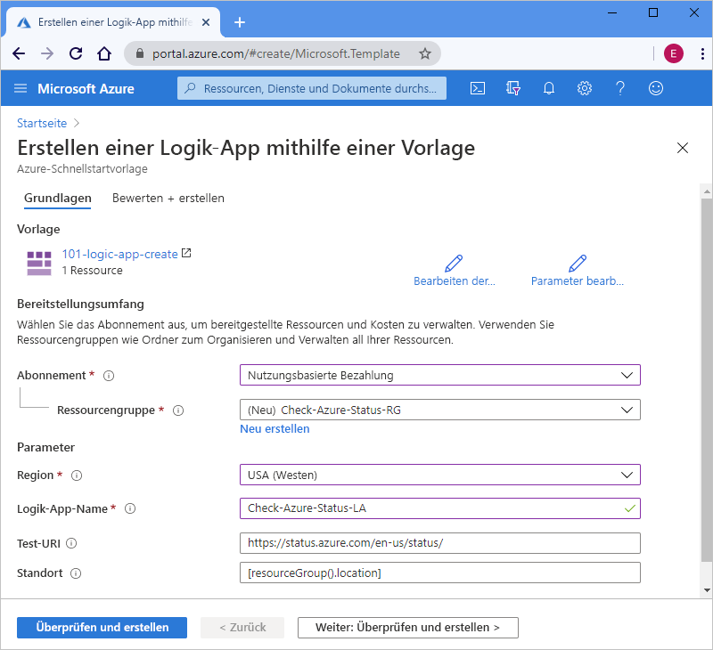

# <a name="quickstart-create-and-deploy-a-logic-app-workflow-by-using-an-arm-template"></a>Schnellstart: Erstellen und Bereitstellen eines Logik-App-Workflows mithilfe einer ARM-Vorlage

Bei [Azure Logic Apps](../logic-apps/logic-apps-overview.md) handelt es sich um einen Clouddienst, mit dem Sie automatisierte Workflows erstellen und ausführen können, die Daten, Apps, cloudbasierte Dienste und lokale Systeme integrieren, indem Sie aus [Hunderten von Connectors](/connectors/connector-reference/connector-reference-logicapps-connectors) auswählen. In dieser Schnellstartanleitung wird in erster Linie die Bereitstellung einer Azure Resource Manager-Vorlage (ARM-Vorlage) zum Erstellen einer einfachen Logik-App erörtert, die den Status für Azure nach einem stündlichen Zeitplan überprüft. 

[!INCLUDE [About Azure Resource Manager](../../includes/resource-manager-quickstart-introduction.md)]

Wenn Ihre Umgebung die Voraussetzungen erfüllt und Sie mit der Verwendung von ARM-Vorlagen vertraut sind, klicken Sie auf die Schaltfläche **In Azure bereitstellen**. Die Vorlage wird im Azure-Portal geöffnet.

[](https://portal.azure.com/#create/Microsoft.Template/uri/https%3a%2f%2fraw.githubusercontent.com%2fAzure%2fazure-quickstart-templates%2fmaster%2f101-logic-app-create%2fazuredeploy.json)

## <a name="prerequisites"></a>Voraussetzungen

Falls Sie über kein Azure-Abonnement verfügen, können Sie ein [kostenloses Azure-Konto erstellen](https://azure.microsoft.com/free/?WT.mc_id=A261C142F), bevor Sie beginnen.

## <a name="review-the-template"></a>Überprüfen der Vorlage

In dieser Schnellstartanleitung wird die Vorlage [**Logik-App erstellen**](https://azure.microsoft.com/resources/templates/101-logic-app-create/) verwendet, die Sie im [Azure-Schnellstartvorlagen-Katalog](https://azure.microsoft.com/resources/templates) finden können, die aber zu lang ist, um sie hier wiederzugeben. Stattdessen können Sie die Datei [„azuredeploy.json“](https://github.com/Azure/azure-quickstart-templates/blob/master/101-logic-app-create/azuredeploy.json) der Schnellstartvorlage im Vorlagenkatalog überprüfen.

Mit der Schnellstartvorlage wird ein Logik-App-Workflow erstellt, der den Wiederholungstrigger (Recurrence) verwendet, der auf die stündliche Ausführung festgelegt ist, sowie eine [*integrierte* HTTP-Aktion](../connectors/built-in.md), die eine URL aufruft, die den Status für Azure zurückgibt. Eine integrierte Aktion ist für die Azure Logic Apps-Plattform nativ.

Diese Vorlage erstellt die folgenden Azure-Ressource:

* [**Microsoft.Logic/workflows**](/azure/templates/microsoft.logic/workflows), die den Workflow für eine Logik-App erstellt.

Weitere Schnellstartvorlagen für Azure Logic Apps finden Sie in den [Microsoft.Logic](https://azure.microsoft.com/resources/templates/?resourceType=Microsoft.Logic)-Vorlagen im Katalog.

<a name="deploy-template"></a>

## <a name="deploy-the-template"></a>Bereitstellen der Vorlage

Befolgen Sie die Option, die Sie zum Bereitstellen der Schnellstartvorlage verwenden möchten:

| Option | BESCHREIBUNG |
|--------|-------------|
| [Azure portal](../logic-apps/quickstart-create-deploy-azure-resource-manager-template.md?tabs=azure-portal#deploy-template) | Wenn Ihre Azure-Umgebung die Voraussetzungen erfüllt und Sie mit der Verwendung von ARM-Vorlagen vertraut sind, helfen Ihnen diese Schritte bei der direkten Anmeldung bei Azure und beim Öffnen der Schnellstartvorlage im Azure-Portal. Weitere Informationen finden Sie unter [Bereitstellen von Ressourcen mit ARM-Vorlagen und Azure-Portal](../azure-resource-manager/templates/deploy-portal.md). |
| [Azure-Befehlszeilenschnittstelle](../logic-apps/quickstart-create-deploy-azure-resource-manager-template.md?tabs=azure-cli#deploy-template) | Die Azure-Befehlszeilenschnittstelle (Azure CLI) setzt sich aus Befehlen zum Erstellen und Verwalten von Azure-Ressourcen zusammen. Um diese Befehle auszuführen, benötigen Sie Azure CLI, Version 2.6 oder höher. Geben Sie zum Überprüfen Ihrer CLI-Version `az --version` ein. Weitere Informationen finden Sie in den folgenden Themen: <p><p>- [Was ist die Azure CLI?](/cli/azure/what-is-azure-cli) <br>- [Erste Schritte mit der Azure CLI](/cli/azure/get-started-with-azure-cli) |
| [Azure PowerShell](../logic-apps/quickstart-create-deploy-azure-resource-manager-template.md?tabs=azure-powershell#deploy-template) | Azure PowerShell bietet eine Reihe von Cmdlets, die das Azure Resource Manager-Modell für die Verwaltung von Azure-Ressourcen verwenden. Weitere Informationen finden Sie in den folgenden Themen: <p><p>- [Übersicht über Azure PowerShell](/powershell/azure/azurerm/overview) <br>- [Einführung in das Az-Modul von Azure PowerShell](/powershell/azure/new-azureps-module-az) <br>- [Erste Schritte mit Azure PowerShell](/powershell/azure/get-started-azureps) |
| [REST-API für Azure-Ressourcenverwaltung](../logic-apps/quickstart-create-deploy-azure-resource-manager-template.md?tabs=rest-api#deploy-template) | Azure bietet REST-APIs (Representational State Transfer), bei denen es sich um Dienstendpunkte handelt, die HTTP-Vorgänge (Methoden) unterstützen, die Sie zum Erstellen, Abrufen, Aktualisieren oder Löschen des Zugriffs auf Dienstressourcen verwenden. Weitere Informationen finden Sie unter [Erste Schritte mit der Azure-REST-API](/rest/api/azure/). |
|||

<a name="deploy-azure-portal"></a>

#### <a name="portal"></a>[Portal](#tab/azure-portal)

1. Wählen Sie die folgende Abbildung aus, um sich mit Ihrem Azure-Konto anzumelden und die Schnellstartvorlage im Azure-Portal zu öffnen:

   [](https://portal.azure.com/#create/Microsoft.Template/uri/https%3a%2f%2fraw.githubusercontent.com%2fAzure%2fazure-quickstart-templates%2fmaster%2f101-logic-app-create%2fazuredeploy.json)

1. Geben Sie im Portal auf der Seite **Logik-App mithilfe einer Vorlage erstellen** diese Werte ein, oder wählen Sie sie aus:

   | Eigenschaft | Wert | Beschreibung |
   |----------|-------|-------------|
   | **Abonnement** | <*Name des Azure-Abonnements*> | Der Name des zu verwendenden Azure-Abonnements |
   | **Ressourcengruppe** | <*Name der Azure-Ressourcengruppe*> | Der Name für eine neue oder vorhandene Azure-Ressourcengruppe. In diesem Beispiel wird `Check-Azure-Status-RG` verwendet. |
   | **Region** | <*Azure-Region*> | Die für Ihre Logik-App zu verwendende Azure-Rechenzentrumsregion. In diesem Beispiel wird `West US` verwendet. |
   | **Name der Logik-App** | <*logic-app-name*> | Der für Ihre Logik-App zu verwendende Name. In diesem Beispiel wird `Check-Azure-Status-LA` verwendet. |
   | **Test-URI** | <*test-URI*> | Der URI, der vom Dienst aufgerufen werden soll, basierend auf einem bestimmten Zeitplan. In diesem Beispiel wird `https://status.azure.com/en-us/status/` verwendet, wobei es sich um die Azure-Statusseite handelt. |
   | **Location** |  <*Azure-region-for-all-resources*> | Die Azure-Region, die für alle Ressourcen verwendet werden soll, wenn sie vom Standardwert abweicht. Dieses Beispiel nutzt den Standardwert `[resourceGroup().location]`, bei dem es sich um den Standort der Ressourcengruppe handelt. |
   ||||

   Im Folgenden sehen Sie, wie die Seite mit den in diesem Beispiel verwendeten Werten aussieht:

   

1. Wählen Sie abschließend **Überprüfen + erstellen** aus.

1. Fahren Sie mit den Schritten in [Überprüfen bereitgestellter Ressourcen](#review-deployed-resources) fort.

#### <a name="cli"></a>[BEFEHLSZEILENSCHNITTSTELLE (CLI)](#tab/azure-cli)

```azurecli-interactive
read -p "Enter a project name name to use for generating resource names:" projectName &&
read -p "Enter the location, such as 'westus':" location &&
templateUri="https://raw.githubusercontent.com/Azure/azure-quickstart-templates/master/101-logic-app-create/azuredeploy.json" &&
resourceGroupName="${projectName}rg" &&
az group create --name $resourceGroupName --location "$location" &&
az deployment group create --resource-group $resourceGroupName --template-uri  $templateUri &&
echo "Press [ENTER] to continue ..." &&
read
```

Weitere Informationen finden Sie in den folgenden Themen:

* [Azure CLI: az deployment group](/cli/azure/deployment/group)
* [Bereitstellen von Ressourcen mit ARM-Vorlagen und der Azure CLI](../azure-resource-manager/templates/deploy-cli.md)

#### <a name="powershell"></a>[PowerShell](#tab/azure-powershell)

```azurepowershell-interactive
$projectName = Read-Host -Prompt "Enter a project name to use for generating resource names"
$location = Read-Host -Prompt "Enter the location, such as 'westus'"
$templateUri = "https://raw.githubusercontent.com/Azure/azure-quickstart-templates/master/101-logic-app-create/azuredeploy.json"

$resourceGroupName = "${projectName}rg"

New-AzResourceGroup -Name $resourceGroupName -Location "$location"
New-AzResourceGroupDeployment -ResourceGroupName $resourceGroupName -TemplateUri $templateUri

Read-Host -Prompt "Press [ENTER] to continue ..."
```

Weitere Informationen finden Sie in den folgenden Themen:

* [Azure PowerShell: New-AzResourceGroup](/powershell/module/az.resources/new-azresourcegroup)
* [Azure PowerShell: New-AzResourceGroupDeployment](/powershell/module/az.resources/new-azresourcegroupdeployment)
* [Bereitstellen von Ressourcen mit ARM-Vorlagen und Azure PowerShell](../azure-resource-manager/templates/deploy-powershell.md)

#### <a name="rest-api"></a>[REST-API](#tab/rest-api)

1. Wenn Sie keine vorhandene Azure-Ressourcengruppe verwenden möchten, erstellen Sie eine neue Ressourcengruppe, indem Sie diese Syntax für die Anforderung befolgen, die Sie an die REST-API für die Ressourcenverwaltung senden:

   ```http
   PUT https://management.azure.com/subscriptions/{subscriptionId}/resourcegroups/{resourceGroupName}?api-version=2019-10-01
   ```

   | Wert | BESCHREIBUNG |
   |-------|-------------|
   | `subscriptionId`| Die GUID für das zu verwendende Azure-Abonnement. |
   | `resourceGroupName` | Der Name der zu erstellenden Azure-Ressourcengruppe. In diesem Beispiel wird `Check-Azure-Status-RG` verwendet. |
   |||

   Beispiel:

   ```http
   PUT https://management.azure.com/subscriptions/xxxxXXXXxxxxXXXXX/resourcegroups/Check-Azure-Status-RG?api-version=2019-10-01
   ```

   Weitere Informationen finden Sie in den folgenden Themen:

   * [Azure-REST-API-Referenz: Aufrufen von Azure-REST-APIs](/rest/api/azure/)
   * [REST-API für Ressourcenverwaltung: Ressourcengruppen: Erstellen oder Aktualisieren](/rest/api/resources/resourcegroups/createorupdate).

1. Befolgen Sie zum Bereitstellen der Schnellstartvorlage in Ihrer Ressourcengruppe diese Syntax für die Anforderung, die Sie an die REST-API für die Ressourcenverwaltung senden:

   ```http
   PUT https://management.azure.com/subscriptions/{subscriptionId}/resourcegroups/{resourceGroupName}/providers/Microsoft.Resources/deployments/{deploymentName}?api-version=2019-10-01
   ```

   | Wert | BESCHREIBUNG |
   |-------|-------------|
   | `subscriptionId`| Die GUID für das zu verwendende Azure-Abonnement. |
   | `resourceGroupName` | Der Name der zu verwendenden Azure-Ressourcengruppe. In diesem Beispiel wird `Check-Azure-Status-RG` verwendet. |
   | `deploymentName` | Der Name, der für Ihre Bereitstellung verwendet werden soll. In diesem Beispiel wird `Check-Azure-Status-LA` verwendet. |
   |||

   Beispiel:

   ```http
   PUT https://management.azure.com/subscriptions/xxxxXXXXxxxxXXXXX/resourcegroups/Check-Azure-Status-RG/providers/Microsoft.Resources/deployments/Check-Azure-Status-LA?api-version=2019-10-01
   ```

   Weitere Informationen finden Sie unter [REST-API füpr die Ressourcenverwaltung: Bereitstellungen: Erstellen oder Aktualisieren](/rest/api/resources/deployments/createorupdate).

1. Um die für die Bereitstellung zu verwendenden Werte anzugeben, z. B. die Azure-Region und Links zur Schnellstartvorlage und der [Parameterdatei](../azure-resource-manager/templates/template-parameters.md), die die Werte enthält, die die Schnellstartvorlage bei der Bereitstellung verwenden soll, befolgen Sie diese Syntax für den Anforderungstext, den Sie an die REST-API für die Ressourcenverwaltung senden:

   ```json
   {
      "location": "{Azure-region}",
      "properties": {
         "templateLink": {
            "uri": "{quickstart-template-URL}",
            "contentVersion": "1.0.0.0"
         },
         "parametersLink": {
            "uri": "{quickstart-template-parameter-file-URL}",
            "contentVersion": "1.0.0.0"
         },
         "mode": "Incremental"
      }
   }
   ```

   | Eigenschaft | Wert | BESCHREIBUNG |
   |----------|-------|-------------|
   | `location`| <*Azure-Region*> | Die für die Bereitstellung zu verwendende Azure-Region. In diesem Beispiel wird `West US` verwendet. |
   | `templateLink` : `uri` | <*quickstart-template-URL*> | Der URL-Speicherort für die Schnellstartvorlage, die für die Bereitstellung verwendet werden soll: <p><p>`https://raw.githubusercontent.com/Azure/azure-quickstart-templates/master/101-logic-app-create/azuredeploy.json`. |
   | `parametersLink` : `uri` | <*quickstart-template-parameter-file-URL*> | Der URL-Speicherort für die Parameterdatei der Schnellstartvorlage, die für die Bereitstellung verwendet werden soll: <p><p>`https://raw.githubusercontent.com/Azure/azure-quickstart-templates/master/101-logic-app-create/azuredeploy.parameters.json` <p><p>Weitere Informationen zur Resource Manager-Parameterdatei finden Sie unter diesen Themen: <p><p>- [Erstellen einer Resource Manager-Parameterdatei](../azure-resource-manager/templates/parameter-files.md) <br>- [Tutorial: Verwenden von Parameterdateien zum Bereitstellen Ihrer ARM-Vorlage](../azure-resource-manager/templates/template-tutorial-use-parameter-file.md) |
   | `mode` | <*deployment-mode*> | Entweder ein inkrementelles Update oder ein vollständiges Update ausführen. In diesem Beispiel wird `Incremental` verwendet, wobei es sich um den Standardwert handelt. Weitere Informationen finden Sie unter [Azure Resource Manager-Bereitstellungsmodi](../azure-resource-manager/templates/deployment-modes.md). |
   |||

   Beispiel:

   ```json
   {
      "location": "West US",
      "properties": {
         "templateLink": {
            "uri": "https://raw.githubusercontent.com/Azure/azure-quickstart-templates/master/101-logic-app-create/azuredeploy.json",
            "contentVersion": "1.0.0.0"
         },
         "parametersLink": {
            "uri": "https://raw.githubusercontent.com/Azure/azure-quickstart-templates/master/101-logic-app-create/azuredeploy.parameters.json",
            "contentVersion": "1.0.0.0"
         },
         "mode": "Incremental"
      }
   }
   ```

Weitere Informationen finden Sie in den folgenden Themen:

* [REST-API für Ressourcenverwaltung](/rest/api/resources/)
* [Bereitstellen von Ressourcen mit ARM-Vorlagen und Resource Manager-REST-API](../azure-resource-manager/templates/deploy-rest.md)

---

<a name="review-deployed-resources"></a>

## <a name="review-deployed-resources"></a>Überprüfen der bereitgestellten Ressourcen

Zum Anzeigen der Logik-App können Sie das Azure-Portal verwenden, ein Skript ausführen, das Sie mit Azure CLI oder Azure PowerShell erstellen, oder die Logik-App-REST-API verwenden.

### <a name="portal"></a>[Portal](#tab/azure-portal)

1. Geben Sie im Suchfeld des Azure-Portals den Namen Ihrer Logik-App ein, der in diesem Beispiel `Check-Azure-Status-LA` lautet. Wählen Sie in der Ergebnisliste ihre Logik-App aus.

1. Suchen Sie im Azure-Portal nach Ihrer Logik-App, bei der es sich in diesem Beispiel um `Check-Azure-Status-RG` handelt.

1. Wenn der Logik-App-Designer geöffnet wird, überprüfen Sie die von der Schnellstartvorlage erstellte Logik-App.

1. Um die Logik-App zu testen, wählen Sie auf der Symbolleiste des Designers **Ausführen** aus.

### <a name="cli"></a>[BEFEHLSZEILENSCHNITTSTELLE (CLI)](#tab/azure-cli)

```azurecli-interactive
echo "Enter your logic app name:" &&
read logicAppName &&
az logic workflow show --name $logicAppName &&
echo "Press [ENTER] to continue ..."
```

Weitere Informationen finden Sie unter [Azure CLI: az logic workflow show](/cli/azure/ext/logic/logic/workflow#ext-logic-az-logic-workflow-show).

### <a name="powershell"></a>[PowerShell](#tab/azure-powershell)

```azurepowershell-interactive
$logicAppName = Read-Host -Prompt "Enter your logic app name"
Get-AzLogicApp -Name $logicAppName
Write-Host "Press [ENTER] to continue..."
```

Weitere Informationen finden Sie unter [Azure PowerShell: Get-AzLogicApp](/powershell/module/az.logicapp/get-azlogicapp).

### <a name="rest-api"></a>[REST-API](#tab/rest-api)

```http
GET https://management.azure.com/subscriptions/{subscriptionId}/resourceGroups/{resourceGroupName}/providers/Microsoft.Logic/workflows/{workflowName}?api-version=2016-06-01
```

| Wert | BESCHREIBUNG |
|-------|-------------|
| `subscriptionId`| Die GUID für das Azure-Abonnement, unter dem Sie die Schnellstartvorlage bereitgestellt haben. |
| `resourceGroupName` | Der Name der Azure-Ressourcengruppe, in der Sie die Schnellstartvorlage bereitgestellt haben. In diesem Beispiel wird `Check-Azure-Status-RG` verwendet. |
| `workflowName` | Der Name für die Logik-App, die Sie bereitgestellt haben. In diesem Beispiel wird `Check-Azure-Status-LA` verwendet. |
|||

Beispiel:

```http
GET https://management.azure.com/subscriptions/xxxxXXXXxxxxXXXXX/resourceGroups/Check-Azure-Status-RG/providers/Microsoft.Logic/workflows/Check-Azure-Status-LA?api-version=2016-06-01
```

Weitere Informationen finden Sie unter [Logic Apps-REST-API: Workflows: Abrufen](/rest/api/logic/workflows/get).

---

## <a name="clean-up-resources"></a>Bereinigen von Ressourcen

Falls Sie mit weiteren Schnellstartanleitungen und Tutorials fortfahren möchten, sollten Sie diese Ressourcen behalten. Wenn die Logik-App nicht mehr benötigen, löschen Sie die Ressourcengruppe, indem Sie entweder das Azure-Portal, die Azure CLI, Azure PowerShell oder die Resource Manager-REST-API verwenden.

### <a name="portal"></a>[Portal](#tab/azure-portal)

1. Suchen Sie im Azure-Portal die Ressourcengruppe, die Sie löschen möchten, und wählen Sie sie aus. In diesem Beispiel handelt es sich um `Check-Azure-Status-RG`.

1. Wählen Sie im Ressourcengruppenmenü **Übersicht** aus, falls noch nicht geschehen. Wählen Sie auf der Seite „Übersicht“ die Option **Ressourcengruppe löschen** aus.

1. Geben Sie zur Bestätigung den Namen der Ressourcengruppe ein.

Weitere Informationen finden Sie unter [Ressourcengruppe löschen](../azure-resource-manager/management/delete-resource-group.md?tabs=azure-portal#delete-resource-group).

### <a name="cli"></a>[BEFEHLSZEILENSCHNITTSTELLE (CLI)](#tab/azure-cli)

```azurecli-interactive
echo "Enter your resource group name:" &&
read resourceGroupName &&
az group delete --name $resourceGroupName &&
echo "Press [ENTER] to continue ..."
```

Weitere Informationen finden Sie unter [Azure CLI: az group delete](/cli/azure/group#az_group_delete).

### <a name="powershell"></a>[PowerShell](#tab/azure-powershell)

```azurepowershell-interactive
$resourceGroupName = Read-Host -Prompt "Enter the resource group name"
Remove-AzResourceGroup -Name $resourceGroupName
Write-Host "Press [ENTER] to continue..."
```

Weitere Informationen finden Sie unter [Azure PowerShell: Remove-AzResourceGroup](/powershell/module/azurerm.resources/remove-azurermresourcegroup).

### <a name="rest-api"></a>[REST-API](#tab/rest-api)

```http
DELETE https://management.azure.com/subscriptions/{subscriptionId}/resourcegroups/{resourceGroupName}?api-version=2019-10-01
```

| Wert | BESCHREIBUNG |
|-------|-------------|
| `subscriptionId`| Die GUID für das Azure-Abonnement, unter dem Sie die Schnellstartvorlage bereitgestellt haben. |
| `resourceGroupName` | Der Name der Azure-Ressourcengruppe, in der Sie die Schnellstartvorlage bereitgestellt haben. In diesem Beispiel wird `Check-Azure-Status-RG` verwendet. |
|||

Beispiel:

```http
GET https://management.azure.com/subscriptions/xxxxXXXXxxxxXXXXX/resourceGroups/Check-Azure-Status-RG?api-version=2019-10-01
```

Weitere Informationen finden Sie unter [REST-API füpr die Ressourcenverwaltung: Ressourcengruppen: Löschen](/rest/api/resources/resourcegroups/delete).

---

## <a name="next-steps"></a>Nächste Schritte

> [!div class="nextstepaction"]
> [Tutorial: Erstellen und Bereitstellen Ihrer ersten ARM-Vorlage](../azure-resource-manager/templates/template-tutorial-create-first-template.md)
