# Schnellstart: Erstellen Ihres ersten automatisierten Integrationsworkflows mit Azure Logic Apps – Azure-Portal

In dieser Schnellstartanleitung werden die grundlegenden allgemeinen Konzepte vorgestellt, auf denen das Erstellen Ihres ersten Workflows mithilfe von [Azure Logic Apps](logic-apps-overview.md) beruht. Dazu gehören z.B. das Erstellen einer leeren Logik-App, das Hinzufügen eines Triggers und einer Aktion sowie das anschließende Testen Ihrer Logik-App. In diesem Schnellstart erstellen Sie eine Logik-App, die den RSS-Feed einer Website regelmäßig auf neue Elemente überprüft. Wenn neue Elemente vorhanden sind, sendet die Logik-App eine E-Mail für jedes Element. Am Ende entspricht Ihre Logik-App grob dem folgenden Workflow:

Für dieses Szenario benötigen Sie ein Azure-Abonnement oder müssen sich [für ein kostenloses Azure-Konto registrieren](https://azure.microsoft.com/free/?WT.mc_id=A261C142F). Darüber hinaus ist ein E-Mail-Konto von einem von Azure Logic Apps unterstützten Dienst wie Office 365 Outlook, Outlook.com oder Gmail erforderlich. Weitere unterstützte E-Mail-Dienste finden Sie im [Artikel zu den Connectors](/connectors/). Die Logik-App verwendet in diesem Beispiel ein Geschäfts-, Schul- oder Unikonto. Wenn Sie einen anderen E-Mail-Dienst verwenden, sind die allgemeinen Schritte identisch, doch kann die Benutzeroberfläche geringfügig abweichen.

> [!IMPORTANT]
> Wenn Sie den Gmail-Connector verwenden möchten, können nur G-Suite-Geschäftskonten diesen Connector ohne Einschränkung in Logik-Apps verwenden. Wenn Sie über ein Gmail-Consumerkonto verfügen, können Sie diesen Connector nur mit bestimmten von Google genehmigten Diensten verwenden, oder Sie können [eine Google-Client-App erstellen, die für die Authentifizierung mit Ihrem Gmail-Connector verwendet werden soll](/connectors/gmail/#authentication-and-bring-your-own-application). Weitere Informationen finden Sie unter [Datensicherheit und Datenschutzrichtlinien für Google-Connectors in Azure Logic Apps](../connectors/connectors-google-data-security-privacy-policy.md).

## Erstellen Ihrer Logik-App

1. Melden Sie sich mit den Anmeldeinformationen Ihres Azure-Kontos beim [Azure-Portal](https://portal.azure.com) an.

1. Geben Sie in das Suchfeld des Azure-Portals `logic apps` ein, und klicken Sie auf **Logic Apps**.

   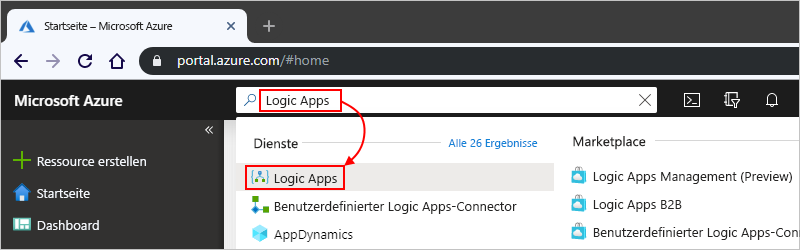

1. Wählen Sie auf der Seite **Logic Apps** die Option **Hinzufügen** aus.

   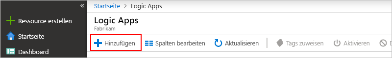

1. Geben Sie im Bereich **Logik-App** Details zu Ihrer Logik-App wie nachfolgend gezeigt ein.

   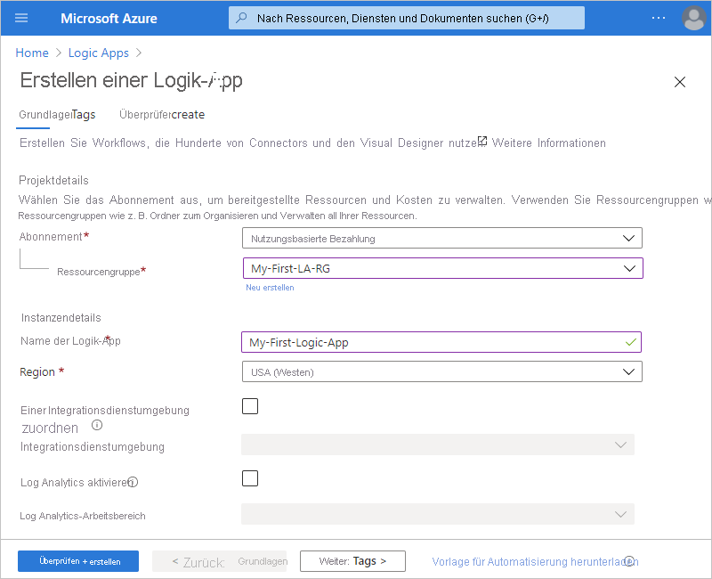

   | Eigenschaft | Wert | BESCHREIBUNG |
   |----------|-------|-------------|
   | **Name** | <*logic-app-name*> | Der Name Ihrer Logik-App, der regionsübergreifend eindeutig sein muss und nur Buchstaben, Ziffern, Bindestriche (`-`), Unterstriche (`_`), Klammern (`(`, `)`) und Punkte (`.`) enthalten darf. In diesem Beispiel wird „My-First-Logic-App“ verwendet. |
   | **Abonnement** | <*Name des Azure-Abonnements*> | Der Name Ihres Azure-Abonnements |
   | **Ressourcengruppe** | <*Name der Azure-Ressourcengruppe*> | Der Name der [Azure-Ressourcengruppe](../azure-resource-manager/management/overview.md), der regionsübergreifend eindeutig sein muss, und die zum Organisieren verwandter Ressourcen verwendet wird. In diesem Beispiel wird „My-First-LA-RG“ verwendet. |
   | **Location** | <*Azure-Region*> | Die Region, in der die Informationen zu Ihrer Logik-App gespeichert werden sollen. In diesem Beispiel wird „USA, Westen“ verwendet. |
   | **Log Analytics** | Aus | Behalten Sie die Einstellung **Aus** für die Diagnoseprotokollierung bei. |
   ||||

1. Wählen Sie, wenn Sie bereit sind, **Überprüfen + erstellen** aus. Bestätigen Sie die von Ihnen angegebenen Details, und wählen Sie **Erstellen** aus.

1. Nachdem Azure Ihre App erfolgreich bereitgestellt hat, wählen Sie **Zu Ressource wechseln** aus.

   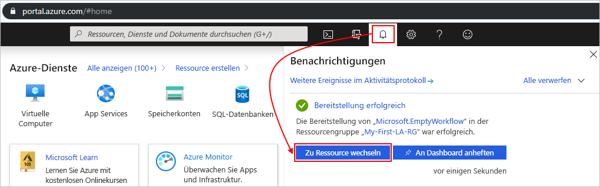

   Sie können zum Suchen und Auswählen Ihrer Logik-App auch den Namen in das Suchfeld eingeben.

   Der Logik-App-Designer wird geöffnet, und es wird eine Seite mit einem Einführungsvideo und häufig verwendeten Triggern angezeigt. Wählen Sie unter **Vorlagen** die Option **Leere Logik-App**.

   

Fügen Sie als Nächstes einen [Trigger](../logic-apps/logic-apps-overview.md#logic-app-concepts) hinzu, der bei einem neuen RSS-Feedelement ausgelöst wird. Jede Logik-App muss mit einem Trigger beginnen, der ausgelöst wird, wenn ein bestimmtes Ereignis eintritt oder eine bestimmte Bedingung erfüllt wird. Bei jeder Auslösung des Triggers erstellt die Azure Logic Apps-Engine eine Logik-App-Instanz, mit der Ihr Workflow gestartet und ausgeführt wird.

## Hinzufügen des RSS-Triggers

1. Wählen Sie im **Logik-App-Designer** unterhalb des Suchfelds die Option **Alle** aus.

1. Um den RSS-Connector zu suchen, geben Sie `rss` in das Suchfeld ein. Wählen Sie aus der Triggerliste den RSS-Trigger **Beim Veröffentlichen eines Feedelements** aus.

   

1. Geben Sie die Informationen für Ihren Trigger wie in diesem Schritt beschrieben an:

   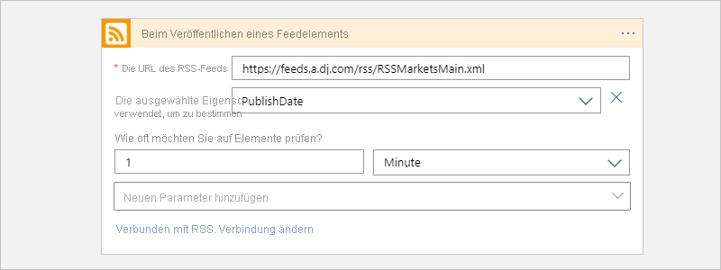

   | Eigenschaft | Wert | BESCHREIBUNG |
   |----------|-------|-------------|
   | **Die URL des RSS-Feeds** | <*RSS-feed-URL*> | Der Link für den RSS-Feed, den Sie überwachen möchten. Dieses Beispiel verwendet den RSS-Feed des Wall Street Journals unter `https://feeds.a.dj.com/rss/RSSMarketsMain.xml`, doch wenn Sie möchten, können Sie Ihre eigene RSS-Feed-URL verwenden. |
   | **Intervall** | 1 | Die Anzahl von Warteintervallen zwischen Überprüfungen |
   | **Frequency** | Minute | Die Zeiteinheit für die Intervalle zwischen Überprüfungen. |
   ||||

   Das Intervall und die Häufigkeit definieren zusammen den Zeitplan für den Trigger Ihrer Logik-App. Diese Logik-App überprüft den Feed minütlich.

1. Klicken Sie auf die Titelleiste des Triggers, um die Triggerdetails vorerst auszublenden.

   

1. Speichern Sie Ihre Logik-App. Wählen Sie auf der Symbolleiste des Designers **Speichern** aus.

Ihre Logik-App befindet sich jetzt im Livemodus, aber es wird vorerst nur der RSS-Feed überprüft. Fügen Sie daher eine Aktion hinzu, die reagiert, wenn der Trigger ausgelöst wird.

## Hinzufügen der Aktion „E-Mail senden“

Fügen Sie nun eine [Aktion](../logic-apps/logic-apps-overview.md#logic-app-concepts) hinzu, die eine E-Mail sendet, wenn im RSS-Feed ein neues Element erscheint.

1. Wählen Sie unterhalb des Triggers **Beim Veröffentlichen eines Feedelements** die Option **+ Neuer Schritt** aus.

   

1. Wählen Sie unterhalb von **Aktion auswählen** und unterhalb des Suchfelds die Option **Alle** aus.

1. Geben Sie im Suchfeld `send an email` ein, um Connectors zu finden, die diese Aktion anbieten. Um die Liste der Aktionen nach einer bestimmten App oder einem Dienst zu filtern, können Sie zuerst die App oder den Dienst auswählen.

   Wenn Sie z. B. ein Geschäfts-, Schul- oder Unikonto von Microsoft verwenden und Office 365 Outlook verwenden möchten, wählen Sie **Office 365 Outlook** aus. Oder wenn Sie ein persönliches Microsoft-Konto verwenden, können Sie „Outlook.com“ auswählen. Dieses Beispiel fährt mit Office 365 Outlook fort:

   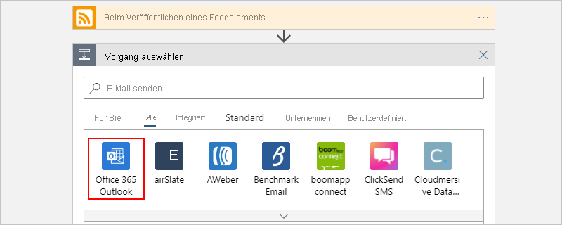

   Sie können die gewünschte zu verwendende Aktion jetzt leichter finden und auswählen, z. B. `send an email`:

   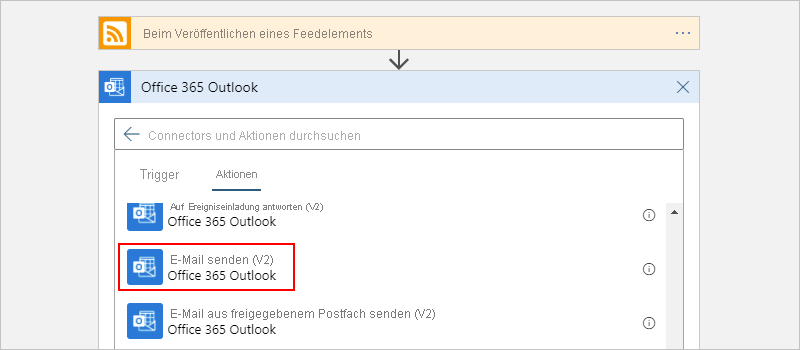

1. Wenn der ausgewählte E-Mail-Connector Sie auffordert, Ihre Identität zu authentifizieren, führen Sie diesen Schritt jetzt aus, um eine Verbindung zwischen Ihrer Logik-App und Ihrem E-Mail-Dienst herzustellen.

   > [!NOTE]
   > In diesem speziellen Beispiel authentifizieren Sie Ihre Identität manuell. Connectors, die eine Authentifizierung erfordern, unterscheiden sich jedoch in Hinsicht auf die jeweils unterstützten Authentifizierungstypen. Außerdem stehen Optionen bereit, mit denen Sie die Handhabung der Authentifizierung einrichten können. Wenn Sie beispielsweise Azure Resource Manager-Vorlagen für die Bereitstellung verwenden, können Sie Eingaben, die Sie häufig oder einfach ändern möchten (z. B. Verbindungsinformationen), parametrisieren und die Sicherheit dafür erhöhen. Weitere Informationen finden Sie in den folgenden Themen:
   >
   > * [Vorlagenparameter für die Bereitstellung](../logic-apps/logic-apps-azure-resource-manager-templates-overview.md#template-parameters)
   > * [Autorisieren von OAuth-Verbindungen](../logic-apps/logic-apps-deploy-azure-resource-manager-templates.md#authorize-oauth-connections)
   > * [Authentifizieren des Zugriffs mit verwalteten Identitäten](../logic-apps/create-managed-service-identity.md)
   > * [Authentifizieren von Verbindungen für die Logik-App-Bereitstellung](../logic-apps/logic-apps-azure-resource-manager-templates-overview.md#authenticate-connections)

1. Geben Sie in der Aktion **E-Mail senden** die Informationen an, die in E-Mail aufgenommen werden sollen.

   1. Geben Sie im Feld **An** die E-Mail-Adresse des Empfängers ein. Zu Testzwecken können Sie hier Ihre E-Mail-Adresse angeben.

      Ignorieren Sie vorerst die angezeigte Liste **Dynamischen Inhalt hinzufügen**. Wenn Sie in einige Bearbeitungsfelder klicken, wird diese Liste mit verfügbaren Ausgaben des vorherigen Schritts angezeigt, die Sie als Eingaben für die aktuelle Aktion verwenden können.

   1. Geben Sie im Feld **Betreff** den folgenden Text mit einem nachstehenden Leerzeichen ein: `New RSS item: `.

      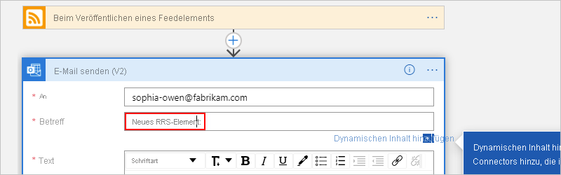

   1. Wählen Sie in der Liste **Dynamischen Inhalt hinzufügen** den Eintrag **Feedtitel** aus, der vom Trigger „Beim Veröffentlichen eines Feedelements“ ausgegeben wird, der Ihnen den RSS-Elementtitel zur Verwendung verfügbar macht.

      

      > [!TIP]
      > Wählen Sie in der Liste dynamischer Inhalt, wenn keine Ausgaben des Triggers „Beim Veröffentlichen eines Feedelements“ angezeigt werden, neben der Kopfzeile der Aktion **Mehr anzeigen** aus.
      > 
      > 

      Wenn der Vorgang abgeschlossen ist, sieht der Betreff der E-Mail wie in diesem Beispiel aus:

      

      Wenn im Designer eine For each-Schleife angezeigt wird, haben Sie ein Token für ein Array ausgewählt, etwa das Token **categories-Item**. Für diese Art von Token fügt der Designer automatisch diese Schleife für die Aktion hinzu, die auf das Token verweist. Auf diese Weise führt Ihre Logik-App die gleiche Aktion für jedes Arrayelement durch. Wählen Sie zum Entfernen der Schleife auf der Titelleiste der Schleife die **Auslassungspunkte** ( **...** ) und dann **Löschen** aus.

   1. Geben Sie im Feld **Text** den folgenden Text ein, und wählen Sie die folgenden Token für den E-Mail-Text aus. Drücken Sie UMSCHALT+EINGABETASTE, um in einem Bearbeitungsfeld leere Zeilen hinzuzufügen.

      

      | Eigenschaft | BESCHREIBUNG |
      |----------|-------------|
      | **Feedtitel** | Der Titel des Elements |
      | **Feed veröffentlicht am** | Datum und Uhrzeit der Elementveröffentlichung |
      | **Link zum primären Feed** | Die URL für das Element |
      |||

1. Speichern Sie Ihre Logik-App.

Testen Sie als Nächstes Ihre Logik-App.

## Ausführen Ihrer Logik-App

Wählen Sie auf der Symbolleiste des Designers die Option **Ausführen** aus, um Ihre Logik-App manuell zu starten. Oder warten Sie, bis Ihre Logik-App den RSS-Feed gemäß dem festgelegten Zeitplan (minütlich) überprüft.

Falls der RSS-Feed über neue Elemente verfügt, sendet Ihre Logik-App für jedes neue Element eine E-Mail. Andernfalls wartet Ihre Logik mit einer erneuten Prüfung bis zum nächsten Intervall. Überprüfen Sie Ihren Ordner mit den Junk-E-Mails, falls Sie keine E-Mails erhalten.

Im Anschluss sehen Sie eine Beispiel-E-Mail, die von dieser Logik-App gesendet wird.

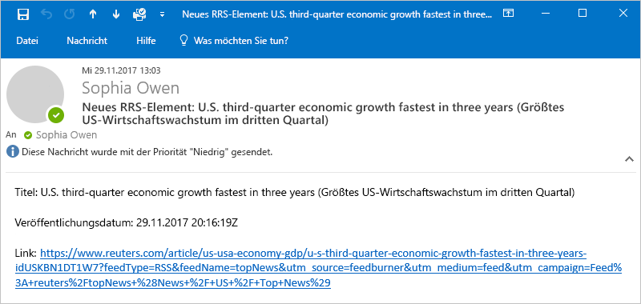

Aus technischer Sicht passiert Folgendes: Wenn der Trigger den RSS-Feed prüft und neue Elemente findet, wird der Trigger ausgelöst, und die Azure Logic Apps-Engine erstellt eine Instanz Ihres Logik-App-Workflows, mit der Aktionen im Workflow ausgeführt werden. Falls der Trigger keine neuen Elemente findet, wird er nicht ausgelöst und überspringt das Instanziieren des Workflows.

Herzlichen Glückwunsch! Sie haben Ihre erste Logik-App über das Azure-Portal erstellt und ausgeführt.

## Bereinigen von Ressourcen

Wenn Sie dieses Beispiel nicht mehr benötigen, löschen Sie die Ressourcengruppe mit Ihrer Logik-App und den dazugehörigen Ressourcen.

1. Geben Sie in das Azure-Suchfeld `resource groups` ein, und wählen Sie dann **Ressourcengruppen** aus.

   

1. Suchen Sie die Ressourcengruppe Ihrer Logik-App, und wählen Sie sie aus. Wählen Sie im Bereich **Übersicht** die Option **Ressourcengruppe löschen** aus.

   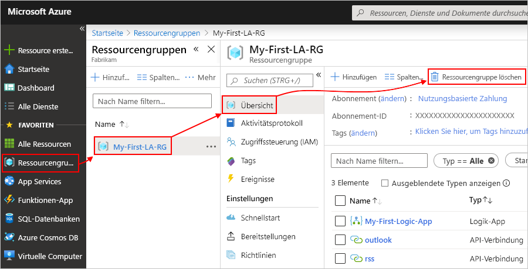

1. Wenn der Bestätigungsbereich angezeigt wird, geben Sie den Ressourcengruppennamen ein, und wählen Sie **Löschen** aus.

   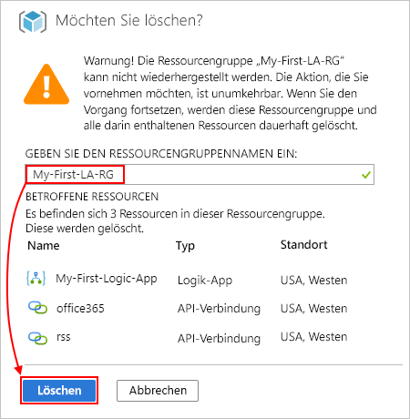

> [!NOTE]
> Wenn Sie eine Logik-App löschen, werden keine neuen Ausführungen instanziiert. Alle in Bearbeitung befindlichen und ausstehenden Ausführungen werden abgebrochen. Bei Tausenden von Ausführungen kann der Abbruch möglicherweise erhebliche Zeit in Anspruch nehmen.

## Nächste Schritte

In dieser Schnellstartanleitung haben Sie Ihre erste Logik-App erstellt, die gemäß einem festgelegten Zeitplan (minütlich) nach RSS-Updates sucht und eine Aktion ausführt (E-Mail senden), wenn ein Update vorhanden ist. Weitere Informationen finden Sie im folgenden Tutorial, in dem komplexere zeitplanbasierte Workflows erstellt werden:

> [!div class="nextstepaction"]
> [Überprüfen der Verkehrslage mit einer planerbasierten Logik-App](../logic-apps/tutorial-build-schedule-recurring-logic-app-workflow.md)
