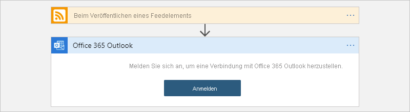

# Schnellstart: Erstellen eines Integrationsworkflows mit Mandanten-fähigen Azure Logic Apps und dem Azure-Portal

Dieser Schnellstart zeigt, wie Sie einen automatisierten Beispielworkflow erstellen, der zwei Dienste integriert, einen RSS-Feed für eine Website und ein E-Mail-Konto, wenn Sie [Azure Logic Apps](logic-apps-overview.md) mit *mehreren Mandanten* verwenden. Dieses Beispiel ist zwar cloudbasiert, von Logic Apps werden jedoch auch Workflows unterstützt, die Apps, Daten, Dienste und Systeme in der Cloud, in lokalen Umgebungen und in Hybridumgebungen miteinander verbinden. Weitere Informationen zum Multi-Mandanten- versus Einzel-Mandanten-Modell finden Sie unter [Einzel-Mandant versus Multi-Mandant und Integrationsdienstumgebung](single-tenant-overview-compare.md).

In diesem Beispiel wird ein Workflow mit RSS-Connector und Office 365 Outlook-Connector erstellt. Der RSS-Connector verfügt über einen Trigger, durch den basierend auf einem Zeitplan ein RSS-Feed überprüft wird. Der Office 365 Outlook-Connector verfügt über eine Aktion, durch die für jedes neue Element eine E-Mail gesendet wird. Die Connectors in diesem Beispiel sind nur zwei von [Hunderten von Connectors](/connectors/connector-reference/connector-reference-logicapps-connectors), die Sie in einem Workflow verwenden können.

Der folgende Screenshot zeigt den allgemeinen Beispielworkflow:

Im Rahmen dieser Schnellstartanleitung werden folgende grundlegende Schritte vermittelt:

* Erstellen einer Logik-App-Ressource, die in der Logic Apps-Dienstumgebung mit mehreren Mandanten ausgeführt wird
* Auswählen der leeren Logik-App-Vorlage
* Hinzufügen eines Triggers, der angibt, wann der Workflow ausgeführt werden soll
* Hinzufügen einer Aktion, durch die eine Aufgabe ausgeführt wird, nachdem der Trigger ausgelöst wurde
* Ausführen Ihres Workflows

Informationen zum Erstellen und Verwalten einer Logik-App mit anderen Tools finden Sie in den folgenden Logic Apps-Schnellstartanleitungen:

* [Erstellen und Verwalten von Logik-Apps in Visual Studio Code](quickstart-create-logic-apps-visual-studio-code.md)
* [Erstellen und Verwalten von Logik-Apps in Visual Studio](quickstart-create-logic-apps-with-visual-studio.md)
* [Erstellen und Verwalten von Logik-Apps mit der Azure-Befehlszeilenschnittstelle (Azure CLI)](quickstart-logic-apps-azure-cli.md)

## Voraussetzungen

* Wenn Sie nicht über ein Azure-Abonnement verfügen, können Sie sich [für ein kostenloses Azure-Konto registrieren](https://azure.microsoft.com/free/?WT.mc_id=A261C142F), bevor Sie beginnen.

* Ein E-Mail-Konto eines mit Azure Logic Apps kompatiblen Diensts (z. B. Office 365 Outlook oder Outlook.com). Informationen zu anderen unterstützten E-Mail-Anbietern finden Sie in den [Connectors für Logic Apps](/connectors/connector-reference/connector-reference-logicapps-connectors).

  > [!NOTE]
  > Der [Gmail-Connector](/connectors/gmail/) kann nur von G-Suite-Konten ohne Einschränkung in Azure Logic Apps verwendet werden. Wenn Sie über ein Gmail-Consumerkonto verfügen, können Sie diesen Connector nur mit bestimmten von Google genehmigten Diensten verwenden, sofern Sie keine [Google-Client-App für die Authentifizierung mit Ihrem Gmail-Connector erstellen](/connectors/gmail/#authentication-and-bring-your-own-application). Weitere Informationen finden Sie unter [Datensicherheit und Datenschutzrichtlinien für Google-Connectors in Azure Logic Apps](../connectors/connectors-google-data-security-privacy-policy.md).

* Falls Sie über eine Firewall verfügen, durch die der Datenverkehr auf bestimmte IP-Adressen beschränkt wird, richten Sie Ihre Firewall so ein, dass der Zugriff für IP-Adressen, die vom Logic Apps-Dienst in der Azure-Region Ihrer Logik-App genutzt werden, in [eingehender](logic-apps-limits-and-config.md#inbound) *und* in [ausgehender](logic-apps-limits-and-config.md#outbound) Richtung zugelassen wird.

  In diesem Beispiel werden auch die [von Microsoft verwalteten](../connectors/managed.md) RRS- und Office 365 Outlook-Connectors verwendet. Für diese Connectors muss Ihre Firewall so eingerichtet werden, dass der Zugriff für *alle* [ausgehenden IP-Adressen des verwalteten Connectors](logic-apps-limits-and-config.md#outbound) in der Azure-Region der Logik-App zugelassen wird.

## Erstellen einer Logik-App-Ressource

1. Melden Sie sich mit Ihrem Azure-Konto beim [Azure-Portal](https://portal.azure.com) an.

1. Geben Sie `logic apps` in das Azure-Suchfeld ein, und wählen Sie **Logic Apps** aus.

   

1. Wählen Sie auf der Seite **Logic Apps** die Option **Hinzufügen** > **Verbrauch** aus.

   Dadurch wird eine Logik-App-Ressource erstellt, die in der Logic Apps-Dienstumgebung mit mehreren Mandanten ausgeführt wird und [Modell für nutzungsbasierte Preise](logic-apps-pricing.md) verwendet.

   

1. Geben Sie im Bereich **Logik-App** die grundlegenden Details und Einstellungen für Ihre Logik-App an. Erstellen Sie eine neue [Ressourcengruppe](../azure-resource-manager/management/overview.md#terminology) für diese exemplarische Logik-App.

   | Eigenschaft | Wert | BESCHREIBUNG |
   |----------|-------|-------------|
   | **Abonnement** | <*Name des Azure-Abonnements*> | Der Name Ihres Azure-Abonnements. |
   | **Ressourcengruppe** | <*Name der Azure-Ressourcengruppe*> | Der Name der [Azure-Ressourcengruppe](../azure-resource-manager/management/overview.md#terminology). Dieser Name muss regionsübergreifend eindeutig sein. In diesem Beispiel wird „My-First-LA-RG“ verwendet. |
   | **Name der Logik-App** | <*logic-app-name*> | Der Name Ihrer Logik-App, der regionsübergreifend eindeutig sein muss. In diesem Beispiel wird „My-First-Logic-App“ verwendet. 

**Wichtig:** Der Name darf nur Buchstaben, Ziffern, Bindestriche (`-`), Unterstriche (`_`), Klammern (`(`, `)`) und Punkte (`.`) enthalten.  |
   | **Region** | <*Azure-Region*> | Die Azure-Rechenzentrumsregion, in der die Informationen Ihrer App gespeichert werden sollen. In diesem Beispiel wird „USA, Westen“ verwendet. |
   | **Einer Integrationsdienstumgebung zuordnen** | Aus | Wählen Sie diese Option nur aus, wenn Sie diese Logik-App in einer [Integrationsdienstumgebung](connect-virtual-network-vnet-isolated-environment-overview.md) bereitstellen möchten. Lassen Sie sie in diesem Beispiel deaktiviert. |
   | **Aktivieren von Log Analytics** | Aus | Wählen Sie diese Option nur aus, wenn Sie die Diagnoseprotokollierung aktivieren möchten. Lassen Sie sie in diesem Beispiel deaktiviert. |
   ||||

   

1. Wählen Sie, wenn Sie bereit sind, **Überprüfen + erstellen** aus. Überprüfen Sie auf der Überprüfungsseite Ihre Angaben, und wählen Sie **Erstellen** aus.

## Auswählen der leeren Vorlage

1. Nachdem Azure Ihre App erfolgreich bereitgestellt hat, wählen Sie **Zu Ressource wechseln** aus. Alternativ können Sie den Namen Ihrer Logik-App in das Suchfeld von Azure eingeben und Ihre Logik-App auswählen.

   

   Der Logik-App-Designer wird geöffnet, und es wird eine Seite mit einem Einführungsvideo und häufig verwendeten Triggern angezeigt.

1. Wählen Sie unter **Vorlagen** die Option **Leere Logik-App**.

   

   Nachdem Sie die Vorlage ausgewählt haben, wird im Designer eine leere Workflowoberfläche angezeigt.

## Hinzufügen des Triggers

Ein Workflow beginnt immer mit einem einzelnen [Trigger](../logic-apps/logic-apps-overview.md#how-do-logic-apps-work). Dieser dient zum Angeben der Bedingung, die erfüllt sein muss, damit Aktionen im Workflow ausgeführt werden. Bei jeder Auslösung des Triggers wird durch den Logic Apps-Dienst eine Workflowinstanz zum Ausführen der Aktionen erstellt. Wird der Trigger nicht ausgelöst, wird weder eine Instanz erstellt noch eine Instanz ausgeführt. Zum Starten eines Workflows stehen verschiedenste Trigger zur Auswahl.

In diesem Beispiel wird ein RSS-Trigger verwendet, durch den basierend auf einem Zeitplan ein RSS-Feed überprüft wird. Ist ein neues Element im Feed vorhanden, wird der Trigger ausgelöst, und eine neue Workflowinstanz wird gestartet. Sind seit der letzten Überprüfung mehrere neue Elemente hinzugekommen, wird der Trigger für jedes Element ausgelöst, und für jedes Element wird eine separate neue Workflowinstanz ausgeführt.

1. Wählen Sie im **Designer für Logik-Apps** unterhalb des Suchfelds die Option **Alle** aus.

1. Geben Sie `rss` in das Suchfeld ein, um nach dem RSS-Trigger zu suchen. Wählen Sie in der Liste **Trigger** den RSS-Trigger **Beim Veröffentlichen eines Feedelements** aus.

   

1. Geben Sie in den Triggerdetails folgende Informationen an:

   | Eigenschaft | Erforderlich | Wert | BESCHREIBUNG |
   |----------|----------|-------|-------------|
   | **Die URL des RSS-Feeds** | Ja | <*RSS-feed-URL*> | Die URL des zu überwachenden RSS-Feeds. 

In diesem Beispiel wird der RSS-Feed des Wall Street Journal unter `https://feeds.a.dj.com/rss/RSSMarketsMain.xml` verwendet. Sie können aber einen beliebigen RSS-Feed ohne erforderliche HTTP-Autorisierung verwenden. Wählen Sie einen RSS-Feed mit häufigen Veröffentlichungen aus, um ihn problemlos testen zu können. |
   | **Chosen property will be used to determine** (Bestimmung durch ausgewählte Eigenschaft) | Nein | PublishDate | Die ausgewählte Eigenschaft, anhand der bestimmt wird, welche Elemente neu sind. |
   | **Intervall** | Ja | 1 | Die Anzahl von Warteintervallen zwischen Feedüberprüfungen. 

In diesem Beispiel wird `1` als Intervall verwendet. |
   | **Frequency** | Ja | Minute | Die Einheit der Frequenz für die einzelnen Intervalle. 

In diesem Beispiel wird `Minute` als Frequenz verwendet. |
   |||||

   

1. Reduzieren Sie die Detailanzeige des Triggers vorerst, indem Sie in seine Titelleiste klicken.

   

1. Speichern Sie Ihre Logik-App, wenn Sie so weit sind. Sie wird dann umgehend im Azure-Portal live geschaltet. Wählen Sie auf der Symbolleiste des Designers **Speichern** aus.

   Durch den Trigger wird zunächst nur der RSS-Feed überprüft. Daher müssen Sie eine Aktion hinzufügen, die definiert, was passieren soll, wenn der Trigger ausgelöst wird.

## Hinzufügen einer Aktion

Nach einem Trigger folgt eine [Aktion](../logic-apps/logic-apps-overview.md#logic-app-concepts), um einen Vorgang im Workflow auszuführen. Bei jeder Aktion können die Ausgaben aus dem vorherigen Schritt herangezogen werden. Der vorherige Schritt kann entweder der Trigger oder eine andere Aktion sein. Sie können aus vielen verschiedenen Aktionen wählen, mehrere Aktionen bis zum [Grenzwert pro Workflow](logic-apps-limits-and-config.md#definition-limits) hinzufügen und sogar unterschiedliche Aktionspfade erstellen.

Durch die in diesem Beispiel verwendete Office 365 Outlook-Aktion wird bei jeder Auslösung des Triggers für ein neues RSS-Feedelement eine E-Mail gesendet. Sind seit der letzten Überprüfung mehrere neue Elemente hinzugekommen, erhalten Sie mehrere E-Mails.

1. Wählen Sie unterhalb des Triggers **Beim Veröffentlichen eines Feedelements** die Option **+ Neuer Schritt** aus.

   

1. Wählen Sie unter **Vorgang auswählen** unterhalb des Suchfelds die Option **Alle** aus.

1. Geben Sie im Suchfeld `send an email` ein, um Connectors zu finden, die diese Aktion anbieten. Sie können die Liste **Aktionen** nach einer bestimmten App oder nach einem bestimmten Dienst filtern, indem Sie zunächst die App oder den Dienst auswählen.

   Wenn Sie also beispielsweise über ein Geschäfts-, Schul- oder Unikonto von Microsoft verfügen und Office 365 Outlook verwenden möchten, wählen Sie **Office 365 Outlook** aus. Wenn Sie über ein persönliches Microsoft-Konto verfügen, wählen Sie **Outlook.com** aus. In diesem Beispiel wird Office 365 Outlook verwendet.

   > [!NOTE]
   > Wenn Sie in Ihrem Workflow einen anderen unterstützten E-Mail-Dienst verwenden, sieht die Benutzeroberfläche möglicherweise etwas anders aus. Die grundlegenden Konzepte für das Herstellen einer Verbindung mit einem anderen E-Mail-Dienst bleiben aber unverändert.

   

   Nun können die gewünschte Aktion (beispielsweise **E-Mail senden**) leichter finden und auswählen:

   

1. Sollte für den ausgewählten E-Mail-Dienst eine Aufforderung zur Anmeldung und Authentifizierung Ihrer Identität angezeigt werden, führen Sie diesen Schritt jetzt aus.

   Bei vielen Connectors muss zunächst eine Verbindung hergestellt und Ihre Identität authentifiziert werden, um fortfahren zu können.

   

   > [!NOTE]
   > In diesem Beispiel wird die manuelle Authentifizierung für die Verbindungsherstellung mit Office 365 Outlook gezeigt. Von anderen Diensten werden jedoch unter Umständen andere Authentifizierungsarten unterstützt oder verwendet. Die Verbindungsauthentifizierung kann je nach Szenario auf unterschiedliche Weise gehandhabt werden.
   > 
   > Wenn Sie also beispielsweise Azure Resource Manager-Vorlagen für die Bereitstellung verwenden, können Sie die Sicherheit für sich häufig ändernde Eingaben erhöhen, indem Sie Werte wie etwa Verbindungsdetails parametrisieren. Weitere Informationen finden Sie in diesen Themen:
   >
   > * [Vorlagenparameter für die Bereitstellung](../logic-apps/logic-apps-azure-resource-manager-templates-overview.md#template-parameters)
   > * [Autorisieren von OAuth-Verbindungen](../logic-apps/logic-apps-deploy-azure-resource-manager-templates.md#authorize-oauth-connections)
   > * [Authentifizieren des Zugriffs mit verwalteten Identitäten](../logic-apps/create-managed-service-identity.md)
   > * [Authentifizieren von Verbindungen für die Logik-App-Bereitstellung](../logic-apps/logic-apps-azure-resource-manager-templates-overview.md#authenticate-connections)

1. Geben Sie in der Aktion **E-Mail senden** die Informationen an, die in E-Mail aufgenommen werden sollen.

   1. Geben Sie im Feld **An** die E-Mail-Adresse des Empfängers ein. Verwenden Sie für dieses Beispiel Ihre E-Mail-Adresse.

      > [!NOTE]
      > Die Liste **Dynamischen Inhalt hinzufügen** wird angezeigt, wenn Sie auf das Feld **An** oder auf andere Eingabefelder für bestimmte Eingabetypen klicken. In dieser Liste werden alle Ausgaben aus vorherigen Schritten angezeigt, die Sie als Eingaben für die aktuelle Aktion auswählen können. Sie können diese Liste vorerst ignorieren. Die Liste mit dynamischen Inhalten wird im nächsten Schritt verwendet.

   1. Geben Sie im Feld **Betreff** den Betreff der E-Mail ein. Geben Sie für dieses Beispiel den folgenden Text mit einem nachgestellten Leerzeichen ein: `New RSS item: `

      

   1. Wählen Sie in der Liste **Dynamischen Inhalt hinzufügen** unter **Beim Veröffentlichen eines Feedelements** die Option **Feedtitel** aus.

      Der Feedtitel ist eine Triggerausgabe, die auf den Titel des RSS-Elements verweist. Diese Ausgabe wird in Ihrer E-Mail verwendet, um den Titel des RSS-Elements anzugeben.

      

      > [!TIP]
      > Wählen Sie in der Liste mit den dynamischen Inhalten neben der Kopfzeile der Aktion die Option **Mehr anzeigen** aus, wenn keine Ausgaben des Triggers **Beim Veröffentlichen eines Feedelements** angezeigt werden.
      > 
      > 

      Wenn der Vorgang abgeschlossen ist, sieht der Betreff der E-Mail wie in diesem Beispiel aus:

      

      > [!NOTE]
      > Wenn im Designer eine Schleife vom Typ **For each** erscheint, haben Sie eine Ausgabe ausgewählt, die auf ein Array verweist (beispielsweise die Eigenschaft **categories-Item**). Bei diesem Ausgabetyp wird die Aktion, durch die auf die Ausgabe verwiesen wird, automatisch in eine Schleife vom Typ **For each** eingeschlossen. Dadurch wird von Ihrem Workflow die gleiche Aktion für jedes Arrayelement ausgeführt. 
      >
      > Wählen Sie zum Entfernen der Schleife auf der Titelleiste der Schleife die Schaltfläche mit den Auslassungspunkten ( **...** ) und anschließend **Löschen** aus.

   1. Geben Sie im Feld **Text** Inhalt für den E-Mail-Text ein.
   
      In diesem Beispiel enthält der Text die folgenden Eigenschaften mit jeweils einer vorangestellten Beschreibung. Drücken Sie UMSCHALT+EINGABETASTE, um in einem Bearbeitungsfeld leere Zeilen hinzuzufügen.

      | Beschreibung | Eigenschaft | BESCHREIBUNG |
      |------------------|----------|-------------|
      | `Title:` | **Feedtitel** | Der Titel des Elements |
      | `Date published:` | **Feed veröffentlicht am** | Datum und Uhrzeit der Elementveröffentlichung |
      | `Link:` | **Link zum primären Feed** | Die URL für das Element |
      ||||

      

1. Speichern Sie Ihre Logik-App. Wählen Sie auf der Symbolleiste des Designers **Speichern** aus.

## Ausführen Ihres Workflows

Um zu überprüfen, ob der Workflow ordnungsgemäß ausgeführt wird, können Sie warten, bis der RSS-Feed durch den Trigger basierend auf dem festgelegten Zeitplan überprüft wird. Alternativ können Sie den Workflow auch manuell ausführen, indem Sie auf der Symbolleiste des Designers für Logik-Apps die Option **Ausführen** auswählen, wie im folgenden Screenshot zu sehen: 

Wenn der RSS-Feed über neue Elemente verfügt, wird für jedes neue Element eine E-Mail gesendet. Andernfalls wird bis zum nächsten Intervall gewartet und der RSS-Feed dann erneut überprüft. 

Der folgende Screenshot zeigt eine vom Beispielworkflow gesendete Beispiel-E-Mail. Die E-Mail enthält die Details aus den einzelnen ausgewählten Triggerausgaben sowie die jeweils eingeschlossenen Beschreibungen.

## Behandeln von Problemen

Sollten Sie wider Erwarten keine E-Mails von dem Workflow erhalten, gehen Sie wie folgt vor:

* Überprüfen Sie den Junk- bzw. Spam-Ordner Ihres E-Mail-Kontos, um sicherzustellen, dass die Nachricht nicht fälschlicherweise herausgefiltert wurde.
* Vergewissern Sie sich, dass für den von Ihnen verwendeten RSS-Feed seit der letzten geplanten oder manuellen Überprüfung Elemente veröffentlicht wurden.

## Bereinigen von Ressourcen

Bereinigen Sie nach Abschluss dieser Schnellstartanleitung die exemplarische Logik-App und alle zugehörigen Ressourcen, indem Sie die für dieses Beispiel erstellte Ressourcengruppe löschen.

1. Geben Sie in das Azure-Suchfeld `resource groups` ein, und wählen Sie dann **Ressourcengruppen** aus.

   

1. Suchen Sie die Ressourcengruppe Ihrer Logik-App, und wählen Sie sie aus. Wählen Sie im Bereich **Übersicht** die Option **Ressourcengruppe löschen** aus.

   

1. Wenn der Bestätigungsbereich angezeigt wird, geben Sie den Ressourcengruppennamen ein, und wählen Sie **Löschen** aus.

   

## Nächste Schritte

In dieser Schnellstartanleitung haben Sie Ihren ersten Logik-App-Workflow im Azure-Portal erstellt, um einen RSS-Feed zu überprüfen und für jedes neue Element eine E-Mail zu senden. Informationen zu anspruchsvolleren geplanten Workflows finden Sie im folgenden Tutorial:

> [!div class="nextstepaction"]
> [Überprüfen der Verkehrslage mit einer planerbasierten Logik-App](../logic-apps/tutorial-build-schedule-recurring-logic-app-workflow.md)
