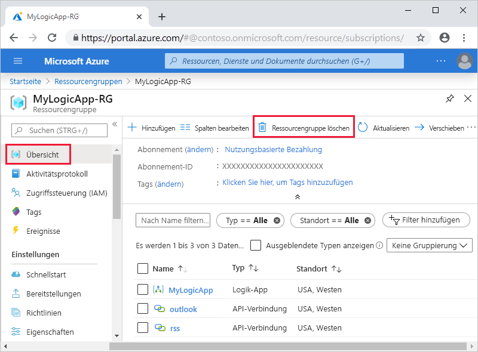

# Schnellstart: Erstellen von automatisierten Aufgaben, Prozessen und Workflows mit Azure Logic Apps – Visual Studio

Mit [Azure Logic Apps](../logic-apps/logic-apps-overview.md) und Visual Studio können Sie Workflows zur Automatisierung von Aufgaben und Prozessen für die Integration von Apps, Daten, Systemen und Diensten in Unternehmen und Organisationen erstellen. In diesem Schnellstart wird veranschaulicht, wie Sie diese Workflows entwerfen und erstellen, indem Sie in Visual Studio Logik-Apps erstellen und diese Apps über Azure bereitstellen. Sie können diese Aufgaben zwar auch im Azure-Portal durchführen, aber mit Visual Studio können Sie Ihre Logik-Apps der Quellcodeverwaltung hinzufügen, unterschiedliche Versionen veröffentlichen und Azure Resource Manager-Vorlagen für verschiedene Bereitstellungsumgebungen erstellen.

Wenn Sie mit Azure Logic Apps noch nicht vertraut sind und sich nur über die grundlegenden Konzepte informieren möchten, hilft Ihnen der [Schnellstart zur Erstellung einer Logik-App im Azure-Portal](../logic-apps/quickstart-create-first-logic-app-workflow.md) weiter. Der Logik-App-Designer funktioniert im Azure-Portal und in Visual Studio ähnlich.

In diesem Schnellstart erstellen Sie die gleiche Logik-App wie im Schnellstart zum Azure-Portal, allerdings mit Visual Studio. Sie können sich auch darüber informieren, wie Sie [eine Beispiel-App in Visual Studio Code erstellen](quickstart-create-logic-apps-visual-studio-code.md) und [Logik-Apps über die Azure-Befehlszeilenschnittstelle (Azure Command-Line Interface, Azure CLI) erstellen und verwalten](quickstart-logic-apps-azure-cli.md). Mit dieser Logik-App wird der RSS-Feed einer Website überwacht und eine E-Mail für jedes neue Element in diesem Feed gesendet. Ihre fertige Logik-App ähnelt diesem allgemeinen Workflow:

## Voraussetzungen

* Ein Azure-Konto und ein Azure-Abonnement. Falls Sie kein Abonnement besitzen, können Sie sich [für ein kostenloses Azure-Konto registrieren](https://azure.microsoft.com/free/). Wenn Sie über ein Azure Government-Abonnement verfügen, führen Sie [diese zusätzlichen Schritte](#azure-government) aus, um Visual Studio für Azure Government Cloud einzurichten.

* Laden Sie diese Tools herunter, und installieren Sie sie, falls sie noch nicht vorhanden sind:

  * [Visual Studio 2019, 2017 oder 2015 – Community Edition oder höher](https://aka.ms/download-visual-studio). In diesem Schnellstart wird Visual Studio Community 2017.

    > [!IMPORTANT]
    > Stellen Sie beim Installieren von Visual Studio 2019 oder 2017 sicher, dass Sie die Workload **Azure-Entwicklung** auswählen.

  * [Microsoft Azure SDK für .NET (2.9.1 oder höher)](https://azure.microsoft.com/downloads/). Weitere Informationen zu [Azure SDK für .NET](/dotnet/azure/intro).

  * [Azure PowerShell](https://github.com/Azure/azure-powershell#installation)

  * Die neuesten Azure Logic Apps-Tools für die Visual Studio-Erweiterung der gewünschten Version:

    * [Visual Studio 2019](https://aka.ms/download-azure-logic-apps-tools-visual-studio-2019)

    * [Visual Studio 2017](https://aka.ms/download-azure-logic-apps-tools-visual-studio-2017)

    * [Visual Studio 2015](https://aka.ms/download-azure-logic-apps-tools-visual-studio-2015)
  
    Sie können die Azure Logic Apps-Tools entweder direkt vom Visual Studio Marketplace herunterladen und installieren oder sich über das [Installieren dieser Erweiterung aus Visual Studio](/visualstudio/ide/finding-and-using-visual-studio-extensions) informieren. Achten Sie darauf, dass Sie Visual Studio nach Abschluss der Installation neu starten.

* Internetzugriff bei Verwendung des eingebetteten Logik-App-Designers

  Für den Designer ist eine Internetverbindung zum Erstellen von Ressourcen in Azure und zum Lesen von Eigenschaften und Daten von Connectors in Ihrer Logik-App erforderlich.

* Ein von Logic Apps unterstütztes E-Mail-Konto, z.B. Outlook für Microsoft 365, Outlook.com oder Gmail. Informationen zu Connectors anderer Anbieter finden Sie in [dieser Liste](/connectors/). In diesem Beispiel wird Office 365 Outlook verwendet. Bei Verwendung eines anderen Anbieters sind die Schritte im Großen und Ganzen identisch, aber die Benutzeroberfläche weicht ggf. etwas ab.

  > [!IMPORTANT]
  > Wenn Sie den Gmail-Connector verwenden möchten, können nur G-Suite-Geschäftskonten diesen Connector ohne Einschränkung in Logik-Apps verwenden. Wenn Sie über ein Gmail-Consumerkonto verfügen, können Sie diesen Connector nur mit bestimmten von Google genehmigten Diensten verwenden, oder Sie können [eine Google-Client-App erstellen, die für die Authentifizierung mit Ihrem Gmail-Connector verwendet werden soll](/connectors/gmail/#authentication-and-bring-your-own-application). Weitere Informationen finden Sie unter [Datensicherheit und Datenschutzrichtlinien für Google-Connectors in Azure Logic Apps](../connectors/connectors-google-data-security-privacy-policy.md).

* Falls Ihre Logik-App über eine Firewall kommunizieren muss, mit der der Datenverkehr auf bestimmte IP-Adressen beschränkt wird, muss Folgendes sichergestellt sein: In der Firewall muss der Zugriff für IP-Adressen, die vom Logic Apps-Dienst oder der Runtime in der Azure-Region Ihrer Logik-App genutzt werden, in [eingehender](logic-apps-limits-and-config.md#inbound) *und* [ausgehender](logic-apps-limits-and-config.md#outbound) Richtung zugelassen sein. Falls für Ihre Logik-App auch [verwaltete Connectors](../connectors/managed.md), z. B. Office 365 Outlook-Connector oder SQL-Connector, oder [benutzerdefinierte Connectors](/connectors/custom-connectors/) verwendet werden, muss in der Firewall in der Azure-Region Ihrer Logik-App zusätzlich der Zugriff für *alle* [ausgehenden IP-Adressen des verwalteten Connectors](logic-apps-limits-and-config.md#outbound) zulässig sein.

## Einrichten von Visual Studio für Azure Government

### Visual Studio 2017

Sie können die [Visual Studio-Erweiterung „Azure Environment Selector“ (Azure-Umgebungsauswahl)](https://devblogs.microsoft.com/azuregov/introducing-the-azure-environment-selector-visual-studio-extension/) verwenden, die Sie im [Visual Studio Marketplace](https://marketplace.visualstudio.com/items?itemName=SteveMichelotti.AzureEnvironmentSelector) herunterladen und installieren können.

### Visual Studio 2019

Wenn Sie Azure Government-Abonnements in Azure Logic Apps verwenden möchten, müssen Sie [Visual Studio einen Ermittlungsendpunkt für Azure Government Cloud hinzufügen](../azure-government/documentation-government-connect-vs.md). *Bevor Sie sich jedoch mit Ihrem Azure Government-Konto bei Visual Studio anmelden*, müssen Sie die JSON-Datei umbenennen, die nach dem Hinzufügen des Ermittlungsendpunkts generiert wird. Gehen Sie dazu wie folgt vor:

1. Schließen Sie Visual Studio.

1. Suchen Sie die generierte JSON-Datei mit dem Namen `Azure U.S. Government-A3EC617673C6C70CC6B9472656832A26.Configuration` am folgenden Speicherort:

   `%localappdata%\.IdentityService\AadConfigurations`
 
1. Benennen Sie die JSON-Datei in `AadProvider.Configuration.json` um.

1. Starten Sie Visual Studio neu.

1. Fahren Sie mit den Schritten für die Anmeldung mit Ihrem Azure Government-Konto fort.

Wenn Sie dieses Setup zurücksetzen möchten, löschen Sie die JSON-Datei am folgenden Speicherort, und starten Sie Visual Studio neu:

`%localappdata%\.IdentityService\AadConfigurations\AadProvider.Configuration.json`

## Erstellen eines Azure-Ressourcengruppenprojekts

Erstellen Sie zunächst ein [Azure-Ressourcengruppenprojekt](../azure-resource-manager/templates/create-visual-studio-deployment-project.md). Informieren Sie sich über [Azure-Ressourcengruppen und -Ressourcen](../azure-resource-manager/management/overview.md).

1. Starten Sie Visual Studio. Melden Sie sich mit Ihrem Azure-Konto an.

1. Wählen Sie im Menü **Datei** die Option **Neu** > **Projekt**. (Tastatur: STRG + UMSCHALT + N)

   

1. Wählen Sie unter **Installiert** die Option **Visual C#** oder **Visual Basic**. Wählen Sie **Cloud** > **Azure-Ressourcengruppe**. Geben Sie Ihrem Projekt einen Namen, z.B.:

   

   > [!NOTE]
   > Ressourcengruppennamen dürfen nur Buchstaben, Ziffern, Punkte (`.`), Unterstriche (`_`), Bindestriche (`-`) und Klammern (`(`, `)`) enthalten, dürfen jedoch nicht auf einen Punkt (`.`) *enden*.
   >
   > Wenn **Cloud** oder **Azure-Ressourcengruppe** nicht angezeigt wird, vergewissern Sie sich, dass das Azure SDK für Visual Studio installiert ist.

   Führen Sie diese Schritte aus, wenn Sie Visual Studio 2019 verwenden:

   1. Wählen Sie im Feld **Neues Projekt erstellen** das Projekt **Azure-Ressourcengruppe** für Visual C# oder Visual Basic aus. Wählen Sie **Weiter** aus.

   1. Geben Sie einen Namen für die gewünschte Azure-Ressourcengruppe und andere Projektinformationen an. Klicken Sie auf **Erstellen**.

1. Wählen Sie in der Vorlagenliste die Vorlage **Logik-App** aus. Klicken Sie auf **OK**.

   

   Nachdem Visual Studio Ihr Projekt erstellt hat, wird der Projektmappen-Explorer geöffnet, und Ihre Projektmappe wird angezeigt. In Ihrer Projektmappe wird in der Datei **LogicApp.json** nicht nur die Logik-App-Definition gespeichert, sondern sie dient auch als Azure Resource Manager-Vorlage, die Sie für die Bereitstellung verwenden können.

   

## Erstellen einer leeren Logik-App

Wenn Sie über Ihr Azure-Ressourcengruppenobjekt verfügen, erstellen Sie Ihre Logik-App mit der Vorlage **Leere Logik-App**.

1. Öffnen Sie im Projektmappen-Explorer das Kontextmenü der Datei **LogicApp.json**. Wählen Sie **Öffnen mit Logik-App-Designer** aus. (Tastatur: STRG + L)

   

   > [!TIP]
   > Sollte dieser Befehl in Visual Studio 2019 nicht zur Verfügung stehen, überprüfen Sie, ob Sie über die neuesten Updates für Visual Studio verfügen.

   Visual Studio fordert Sie zur Angabe Ihres Azure-Abonnements und einer Azure-Ressourcengruppe auf, um Ressourcen für Ihre Logik-App und Verbindungen zu erstellen und bereitzustellen.

1. Wählen Sie für **Abonnement** Ihr Azure-Abonnement aus. Wählen Sie für **Ressourcengruppe** die Option **Neu erstellen** aus, um eine weitere Azure-Ressourcengruppe zu erstellen.

   

   | Einstellung | Beispielwert | BESCHREIBUNG |
   | ------- | ------------- | ----------- |
   | Benutzerkonto | Fabrikam   sophia-owen@fabrikam.com | Das Konto, das Sie bei der Anmeldung bei Visual Studio verwendet haben |
   | **Abonnement** | Nutzungsbasierte Bezahlung   (sophia-owen@fabrikam.com) | Name für Ihr Azure-Abonnement und das zugeordnete Konto |
   | **Ressourcengruppe** | MyLogicApp-RG   (USA, Westen) | Azure-Ressourcengruppe und Standort zum Speichern und Bereitstellen der Ressourcen Ihrer Logik-App |
   | **Location** | **Identisch mit Ressourcengruppe** | Der Standorttyp und der jeweilige Standort für die Bereitstellung der Logik-App. Der Standorttyp ist entweder eine Azure-Region oder eine vorhandene [Integrationsdienstumgebung](connect-virtual-network-vnet-isolated-environment.md). 
Behalten Sie bei diesem Schnellstart die Einstellung **Region** für den Standorttyp bei, und legen Sie den Standort auf **Identisch mit Ressourcengruppe** fest. 
**Hinweis**: Nachdem Sie Ihr Ressourcengruppenprojekt erstellt haben, können Sie [den Standorttyp und den Standort ändern](manage-logic-apps-with-visual-studio.md#change-location), doch wirkt sich ein anderer Standorttyp auf verschiedene Weise auf Ihre Logik-App aus. |
   ||||

1. Der Logik-App-Designer öffnet eine Seite mit einem Einführungsvideo und häufig verwendeten Triggern. Scrollen Sie nach unten am Video und den Triggern vorbei zu **Vorlagen**, und wählen Sie **Leere Logik-App** aus.

   

## Erstellen eines Logik-App-Workflows

Fügen Sie als Nächstes einen RSS-[Trigger](../logic-apps/logic-apps-overview.md#logic-app-concepts) hinzu, der bei einem neuen Feedelement ausgelöst wird. Jede Logik-App beginnt mit einem Trigger, der ausgelöst wird, wenn bestimmte Kriterien erfüllt sind. Bei jeder Auslösung des Triggers erstellt die Logic Apps-Engine eine Logik-App-Instanz zur Ausführung Ihres Workflows.

1. Wählen Sie im Logik-App-Designer unterhalb des Suchfelds **Alle** aus. Geben Sie im Suchfeld „rss“ ein. Wählen Sie in der Triggerliste den folgenden Trigger aus: **Beim Veröffentlichen eines Feedelements**

   

1. Sobald der Trigger im Designer angezeigt wird, führen Sie zum Abschließen der Logik-App-Erstellung die Workflowschritte im [Schnellstart für das Azure-Portal](../logic-apps/quickstart-create-first-logic-app-workflow.md#add-rss-trigger) aus, und kehren Sie dann zu diesem Artikel zurück. Anschließend sieht Ihre Logik-App in etwa wie im folgenden Beispiel aus:

   

1. Speichern Sie Ihre Visual Studio-Projektmappe. (Tastatur: STRG+S)

## Bereitstellen der Logik-App in Azure

Bevor Sie Ihre Logik-App ausführen und testen können, müssen Sie sie über Visual Studio in Azure bereitstellen.

1. Wählen Sie im Projektmappen-Explorer im Kontextmenü Ihres Projekts die Option **Bereitstellen** > **Neu**. Melden Sie sich nach Aufforderung mit Ihrem Azure-Konto an.

   

1. Behalten Sie für diese Bereitstellung das Azure-Standardabonnement, die Ressourcengruppe und andere Einstellungen bei. Klicken Sie auf **Bereitstellen**.

   

1. Wenn das Feld **Parameter bearbeiten** angezeigt wird, geben Sie einen Ressourcennamen für Ihre Logik-App an. Speichern Sie die Einstellungen.

   

   Wenn die Bereitstellung gestartet wird, wird der Bereitstellungsstatus Ihrer App im Fenster **Ausgabe** von Visual Studio angezeigt. Falls der Status nicht angezeigt wird, können Sie die Liste **Ausgabe anzeigen von** öffnen und Ihre Azure-Ressourcengruppe auswählen.

   

   Wenn Ihre ausgewählten Connectors eine Eingabe von Ihnen benötigen, wird im Hintergrund ein PowerShell-Fenster geöffnet, das zur Eingabe von erforderlichen Kennwörtern oder geheimen Schlüsseln auffordert. Nachdem Sie diese Informationen eingegeben haben, wird die Bereitstellung fortgesetzt.

   

   Nach Abschluss der Bereitstellung befindet sich Ihre Logik-App im Azure-Portal im Livezustand und wird gemäß Ihrem angegebenen Zeitplan (jede Minute) ausgeführt. Wenn der Trigger neue Feedelemente erkennt, wird er ausgelöst, sodass eine Workflowinstanz erstellt wird, welche die Aktionen Ihrer Logik-App ausführt. Ihre Logik-App sendet für jedes neue Element eine E-Mail. Falls der Trigger keine neuen Elemente findet, wird er nicht ausgelöst und überspringt das Instanziieren des Workflows. Dann wartet Ihre Logik mit einer erneuten Prüfung bis zum nächsten Intervall.

   Hier sind Beispiele für E-Mails angegeben, die von dieser Logik-App gesendet werden. Überprüfen Sie Ihren Ordner mit den Junk-E-Mails, falls Sie keine E-Mails erhalten.

   

Glückwunsch! Sie haben den Buildvorgang und die Bereitstellung Ihrer Logik-App mit Visual Studio erfolgreich durchgeführt. Informationen zur Verwaltung Ihrer Logik-App und des dazugehörigen Ausführungsverlaufs finden Sie unter [Verwalten von Logik-Apps mit Visual Studio](../logic-apps/manage-logic-apps-with-visual-studio.md).

## Hinzufügen einer neuen Logik-App

Wenn Sie über ein vorhandenes Azure-Ressourcengruppenprojekt verfügen, können Sie eine leere Logik-App im Fenster mit der JSON-Gliederung dem Projekt hinzufügen.

1. Öffnen Sie im Projektmappen-Explorer die Datei `<logic-app-name>.json`.

1. Wählen Sie im Menü **Ansicht** die Option **Weitere Fenster** > **JSON-Gliederung** aus.

1. Wählen Sie am oberen Rand des Fensters mit der JSON-Gliederung die Option **Ressource hinzufügen** aus, um der Vorlagendatei eine Ressource hinzuzufügen. Sie können auch im Fenster mit der JSON-Gliederung das Kontextmenü **Ressourcen** öffnen und **Neue Ressource hinzufügen** auswählen.

   

1. Suchen Sie im Dialogfeld **Ressource hinzufügen** im Suchfeld nach `logic app`, und wählen Sie **Logik-App** aus. Benennen Sie Ihre Logik-App, und wählen Sie **Hinzufügen** aus.

   

## Bereinigen von Ressourcen

Wenn Sie mit Ihrer Logik-App fertig sind, löschen Sie die Ressourcengruppe mit Ihrer Logik-App und den dazugehörigen Ressourcen.

1. Melden Sie sich am [Azure-Portal](https://portal.azure.com) mit demselben Konto an, das Sie zum Erstellen Ihrer Logik-App verwendet haben.

1. Wählen Sie im Menü des Azure-Portals die Option **Ressourcengruppen** aus, oder suchen Sie auf einer beliebigen Seite nach **Ressourcengruppen**, und wählen Sie diese Option anschließend aus. Wählen Sie die Ressourcengruppe Ihrer Logik-App aus.

1. Wählen Sie auf der Seite **Übersicht** die Option **Ressourcengruppe löschen** aus. Geben Sie zur Bestätigung den Ressourcengruppennamen ein, und wählen Sie **Löschen** aus.

   

1. Löschen Sie die Visual Studio-Projektmappe von Ihrem lokalen Computer.

## Nächste Schritte

In diesem Artikel haben Sie Ihre Logik-App mit Visual Studio erstellt, bereitgestellt und ausgeführt. Die folgenden Artikel enthalten Informationen zur Verwaltung und Durchführung der erweiterten Bereitstellung für Logik-Apps mit Visual Studio:

> [!div class="nextstepaction"]
> [Verwalten von Logik-Apps mit Visual Studio](../logic-apps/manage-logic-apps-with-visual-studio.md)
