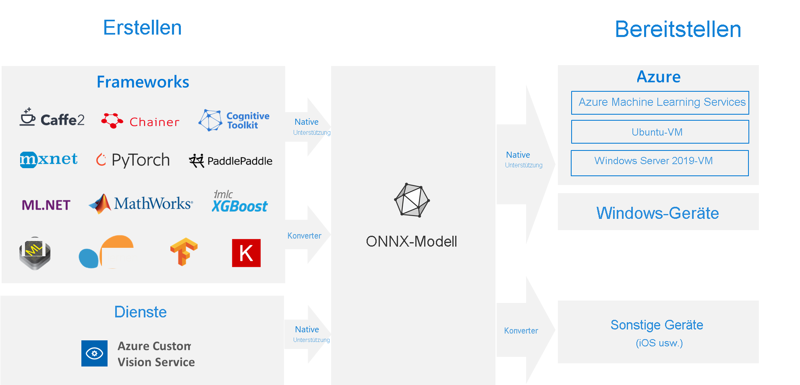

# <a name="onnx-and-azure-machine-learning-create-and-accelerate-ml-models"></a>ONNX und Azure Machine Learning: Erstellen und Beschleunigen von ML-Modellen

Erfahren Sie, wie der Einsatz von [Open Neural Network Exchange](https://onnx.ai) (ONNX) zur Optimierung des Rückschlusses Ihres Machine Learning-Modells beitragen kann. Rückschlüsse oder Modellbewertungen stellen die Phase dar, in der das bereitgestellte Modell für die Vorhersage verwendet wird (meist für Produktionsdaten). 

Die Optimierung von Machine Learning-Modellen hinsichtlich Rückschlüssen (oder Modellbewertungen) ist schwierig, da Sie das Modell und die Rückschlussbibliothek so anpassen müssen, dass sie das Beste aus den Möglichkeiten der Hardware machen. Das Problem wird extrem kompliziert, wenn Sie eine optimale Leistung auf verschiedenen Arten von Plattformen (Cloud/Edge, CPU/GPU usw.) erzielen möchten, da jede davon unterschiedliche Fähigkeiten und Eigenschaften hat. Die Komplexität steigt, wenn Sie Modelle aus einer Vielzahl von Frameworks haben, die auf einer Vielzahl von Plattformen ausgeführt werden müssen. Es ist sehr zeitaufwendig, die verschiedenen Kombinationen von Frameworks und Hardware zu optimieren. Eine Lösung, die ein einmaliges Training in Ihrem bevorzugten Framework und die Ausführung überall in der Cloud oder am Edge ermöglicht, ist erforderlich. An dieser Stelle tritt ONNX auf den Plan.

Microsoft und eine Gruppe von Partnern haben ONNX als offenen Standard für die Darstellung von Machine Learning-Modellen entwickelt. Modelle aus [zahlreichen Frameworks](https://onnx.ai/supported-tools) wie TensorFlow, PyTorch, SciKit-Learn, Keras, Chainer, MXNet, MATLAB und SparkML können exportiert oder in das ONNX-Standardformat konvertiert werden. Sobald die Modelle im ONNX-Format vorliegen, können sie auf einer Vielzahl von Plattformen und Geräten ausgeführt werden.

Die [ONNX-Runtime](https://onnxruntime.ai) ist eine leistungsstarke Rückschluss-Engine für die Bereitstellung von ONNX-Modellen in der Produktionsumgebung. Sie wurde für Cloud und Edge optimiert und funktioniert unter Linux, Windows und Mac. Sie ist zwar in C++ geschrieben, kann aber dank APIs für C, Python, C#, Java und JavaScript (Node.js) in einer Vielzahl von Umgebungen verwendet werden. Die ONNX-Runtime unterstützt sowohl DNN-Modelle als auch herkömmliche ML-Modelle und kann mit Beschleunigern für unterschiedliche Hardware integriert werden. Hierzu zählen unter anderem TensorRT (NVIDIA-GPUs), OpenVINO (Intel-Prozessoren) und DirectML (Windows). Durch den Einsatz der ONNX-Runtime können Sie von den umfangreichen Optimierungen, Tests und laufenden Verbesserungen für Produktionsumgebungen profitieren.

Die ONNX-Runtime kommt in weit verbreiteten Microsoft-Diensten wie Bing, Office und Azure Cognitive Services zum Einsatz. Leistungssteigerungen hängen zwar von einer Reihe von Faktoren ab, aber diese Microsoft-Dienste konnten bei der __CPU einen Leistungszuwachs um durchschnittlich das Doppelte__ verzeichnen. Neben Azure Machine Learning-Diensten wird die ONNX-Runtime auch in anderen Produkten ausgeführt, von denen Machine Learning-Workloads unterstützt werden. Hierzu zählen unter anderem:
+ Windows: Die Runtime ist im Rahmen von [Windows Machine Learning](/windows/ai/windows-ml/) in Windows integriert und wird auf mehreren hundert Millionen Geräten ausgeführt. 
+ Azure SQL-Produktfamilie: Nutzen Sie native Bewertungen für Daten in [Azure SQL Edge](../azure-sql-edge/onnx-overview.md) und [Azure SQL Managed Instance](../azure-sql/managed-instance/machine-learning-services-overview.md).
+ ML.NET: [Führen Sie ONNX-Modelle in ML.NET aus.](/dotnet/machine-learning/tutorials/object-detection-onnx)


[](././media/concept-onnx/onnx.png#lightbox)

## <a name="get-onnx-models"></a>Abrufen von ONNX-Modellen

Es gibt verschiedene Möglichkeiten, an ONNX-Modelle zu gelangen:
+ Trainieren eines neuen ONNX-Modells in Azure Machine Learning (wie in den Beispielen am Ende dieses Artikels gezeigt) oder Verwenden von [Funktionen für automatisiertes maschinelles Lernen](concept-automated-ml.md#automl--onnx)
+ Konvertieren eines vorhandenen Modells aus einem anderen Format in ONNX (siehe die [Tutorials](https://github.com/onnx/tutorials)) 
+ Herunterladen eines vorab trainierten ONNX-Modells aus dem [ONNX Modell Zoo](https://github.com/onnx/models)
+ Generieren eines benutzerdefinierten ONNX-Modells über [Azure Custom Vision Service](../cognitive-services/custom-vision-service/index.yml) 

Viele Modelle, z.B. zur Bildklassifizierung, Objekterkennung und Textverarbeitung, können als ONNX-Modelle abgebildet werden. Sollte bei Ihnen ein Problem mit einem nicht erfolgreich konvertierbaren Modell auftreten, melden Sie dies im GitHub-Repository des verwendeten Konverters. Sie können Ihr bestehendes Formatmodell weiter verwenden, bis das Problem behoben ist.

## <a name="deploy-onnx-models-in-azure"></a>Bereitstellen von ONNX-Modellen in Azure

Mit Azure Machine Learning können Sie Ihre ONNX-Modelle bereitstellen, verwalten und überwachen. Wenn Sie den [Standardbereitstellungsworkflow](concept-model-management-and-deployment.md) und ONNX Runtime verwenden, können Sie einen REST-Endpunkt erstellen, der in der Cloud gehostet wird. Sehen Sie sich am Ende dieses Artikels ein Beispiel für ein Jupyter Notebook an, um es selbst auszuprobieren. 

### <a name="install-and-use-onnx-runtime-with-python"></a>Installieren und Verwenden der ONNX-Runtime mit Python

Python-Pakete für die ONNX-Runtime stehen auf [PyPi.org](https://pypi.org) ([CPU](https://pypi.org/project/onnxruntime), [GPU](https://pypi.org/project/onnxruntime-gpu)) zur Verfügung. Lesen Sie vor der Installation die [Systemanforderungen](https://github.com/Microsoft/onnxruntime#system-requirements). 

 Führen Sie zum Installieren der ONNX-Runtime für Python einen der folgenden Befehle aus: 
```python   
pip install onnxruntime       # CPU build
pip install onnxruntime-gpu   # GPU build
```

Um ONNX Runtime in Ihrem Python-Skript aufzurufen, verwenden Sie den folgenden Code:    
```python
import onnxruntime
session = onnxruntime.InferenceSession("path to model")
```

In der dem Modell beiliegenden Dokumentation finden Sie in der Regel die Ein- und Ausgaben für die Verwendung des Modells. Sie können auch ein Visualisierungstool wie [Netron](https://github.com/lutzroeder/Netron) einsetzen, um das Modell anzuzeigen. Die ONNX-Runtime kann zudem verwendet werden, um Metadaten, Eingaben und Ausgaben des Modells abzufragen:    
```python
session.get_modelmeta()
first_input_name = session.get_inputs()[0].name
first_output_name = session.get_outputs()[0].name
```

Um Rückschlüsse zu Ihrem Modell zu erhalten, verwenden Sie `run` und übergeben die Liste der Ausgaben, die zurückgegeben werden sollen (lassen Sie sie leer, falls alle gewünscht sind), und eine Zuordnung der Eingabewerte. Als Ergebnis erhalten Sie eine Liste der Ausgaben.  
```python
results = session.run(["output1", "output2"], {
                      "input1": indata1, "input2": indata2})
results = session.run([], {"input1": indata1, "input2": indata2})
```

Die vollständige API-Referenz zu Python finden Sie im Dokument zur [Referenzdokumentation zu ONNX Runtime](https://aka.ms/onnxruntime-python).    

## <a name="examples"></a>Beispiele
Beispiele für Python-Notebooks, von denen ONNX-Modelle erstellt und bereitgestellt werden, finden Sie unter [how-to-use-azureml/deployment/onnx](https://github.com/Azure/MachineLearningNotebooks/blob/master/how-to-use-azureml/deployment/onnx).

[!INCLUDE [aml-clone-in-azure-notebook](../../includes/aml-clone-for-examples.md)]

Beispiele für die Verwendung in anderen Sprachen finden Sie im [GitHub-Repository für die ONNX-Runtime](https://github.com/microsoft/onnxruntime/tree/master/samples).

## <a name="more-info"></a>Weitere Informationen

Erfahren Sie mehr über **ONNX**, oder leisten Sie einen Beitrag zum Projekt:
+ [ONNX-Projektwebsite](https://onnx.ai)
+ [ONNX-Code auf GitHub](https://github.com/onnx/onnx)

Erfahren Sie mehr über die **ONNX-Runtime**, oder leisten Sie einen Beitrag zum Projekt:
+ [Website des ONNX-Runtime-Projekts](https://onnxruntime.ai)
+ [ONNX Runtime-GitHub-Repository](https://github.com/Microsoft/onnxruntime)