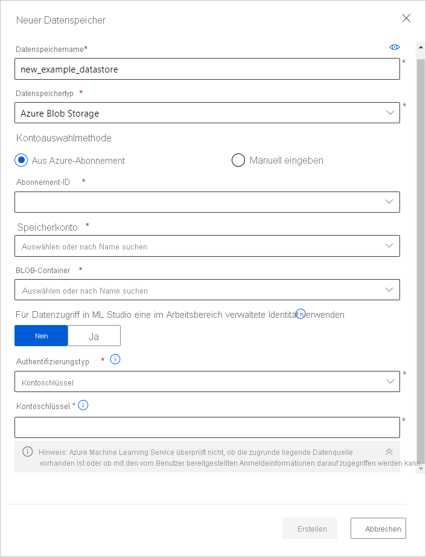

# <a name="connect-to-azure-storage-services"></a>Herstellen einer Verbindung mit Azure-Speicherdiensten
[!INCLUDE [aml-applies-to-basic-enterprise-sku](../../includes/aml-applies-to-basic-enterprise-sku.md)]

In diesem Artikel erfahren Sie, wie Sie **über Azure Machine Learning-Datenspeicher eine Verbindung mit Azure-Speicherdiensten herstellen**. In Datenspeichern werden Verbindungsinformationen wie Ihre Abonnement-ID und die Tokenautorisierung in Ihrer mit dem Arbeitsbereich verknüpften [Key Vault](https://azure.microsoft.com/services/key-vault/)-Instanz gespeichert, damit Sie sicher auf Ihren Speicher zuzugreifen können, ohne diese Informationen in Ihren Skripts hartcodieren zu müssen. 

**Für nicht unterstützte Speicherlösungen** sowie zur Einsparung von Kosten für ausgehende Daten bei ML-Experimenten sollten Sie [Ihre Daten in eine unterstützte Azure-Speicherlösung verschieben](#move).  Aus diesen [Azure-Speicherlösungen](#matrix) können Sie Datenspeicher erstellen. 

Informationen dazu, welche Rolle Datenspeicher im Workflow für den Datenzugriff in Azure Machine Learning spielen, finden Sie im Artikel [Datenzugriff in Azure Machine Learning](concept-data.md#data-workflow).

## <a name="prerequisites"></a>Voraussetzungen

Sie benötigen Folgendes:
- Ein Azure-Abonnement. Wenn Sie nicht über ein Azure-Abonnement verfügen, können Sie ein kostenloses Konto erstellen, bevor Sie beginnen. Probieren Sie die [kostenlose oder kostenpflichtige Version von Azure Machine Learning](https://aka.ms/AMLFree) aus.

- Ein Azure-Speicherkonto mit einem [Azure-Blobcontainer](https://docs.microsoft.com/azure/storage/blobs/storage-blobs-overview) oder einer [Azure-Dateifreigabe](https://docs.microsoft.com/azure/storage/files/storage-files-introduction).

- Das [Azure Machine Learning SDK für Python](https://docs.microsoft.com/python/api/overview/azure/ml/intro?view=azure-ml-py), oder greifen Sie auf [Azure Machine Learning-Studio](https://ml.azure.com/) zu.

- Ein Azure Machine Learning-Arbeitsbereich.
  
  Sie können wahlweise [einen Azure Machine Learning-Arbeitsbereich erstellen](how-to-manage-workspace.md) oder mithilfe des Python SDKs einen vorhandenen verwenden. Importieren Sie die Klasse `Workspace` und `Datastore`, und laden Sie Ihre Abonnementinformationen mit der Funktion `from_config()` aus der Datei `config.json`. Diese Funktion durchsucht standardmäßig das aktuelle Verzeichnis nach der JSON-Datei. Sie können jedoch auch einen Pfadparameter angeben, um mit `from_config(path="your/file/path")` auf die Datei zu verweisen.

   ```Python
   import azureml.core
   from azureml.core import Workspace, Datastore
        
   ws = Workspace.from_config()
   ```
<a name="matrix"></a>

## <a name="supported-data-storage-service-types"></a>Unterstützte Diensttypen für Datenspeicher

Datenspeicher unterstützen derzeit das Speichern von Verbindungsinformationen in den Speicherdiensten, die in der folgenden Matrix aufgeführt sind.

| Speichertyp&nbsp; | Authentifizierungstyp&nbsp; | [Azure&nbsp;Machine&nbsp;Learning Studio](https://ml.azure.com/) | [Azure&nbsp;Machine&nbsp;Learning&nbsp; Python-SDK](https://docs.microsoft.com/python/api/overview/azure/ml/intro?view=azure-ml-py) |  [Azure&nbsp;Machine&nbsp;Learning CLI](reference-azure-machine-learning-cli.md) | [Azure&nbsp;Machine&nbsp;Learning&nbsp;-REST-API](https://docs.microsoft.com/rest/api/azureml/) | VS-Code
---|---|---|---|---|---|---
[Azure&nbsp;Blob&nbsp;Storage](https://docs.microsoft.com/azure/storage/blobs/storage-blobs-overview)| Kontoschlüssel <br> SAS-Token | ✓ | ✓ | ✓ |✓ |✓
[Azure-Dateifreigabe&nbsp;&nbsp;](https://docs.microsoft.com/azure/storage/files/storage-files-introduction)| Kontoschlüssel <br> SAS-Token | ✓ | ✓ | ✓ |✓|✓
[Azure&nbsp;Data Lake&nbsp;Storage Gen&nbsp;1](https://docs.microsoft.com/azure/data-lake-store/)| Dienstprinzipal| ✓ | ✓ | ✓ |✓|
[Azure&nbsp;Data Lake&nbsp;Storage Gen&nbsp;2](https://docs.microsoft.com/azure/storage/blobs/data-lake-storage-introduction)| Dienstprinzipal| ✓ | ✓ | ✓ |✓|
[Azure&nbsp;SQL-Datenbank](https://docs.microsoft.com/azure/sql-database/sql-database-technical-overview)&nbsp;| SQL-Authentifizierung <br>Dienstprinzipal| ✓ | ✓ | ✓ |✓|
[Azure&nbsp;PostgreSQL](https://docs.microsoft.com/azure/postgresql/overview) | SQL-Authentifizierung| ✓ | ✓ | ✓ |✓|
[Azure&nbsp;Database&nbsp;for&nbsp;MySQL](https://docs.microsoft.com/azure/mysql/overview) | SQL-Authentifizierung|  | ✓* | ✓* |✓*|
[Databricks-Dateisystem](https://docs.microsoft.com/azure/databricks/data/databricks-file-system)&nbsp;&nbsp;| Keine Authentifizierung | | ✓** | ✓ ** |✓** |

* MySQL wird nur für die Pipeline [DataTransferStep](https://docs.microsoft.com/python/api/azureml-pipeline-steps/azureml.pipeline.steps.datatransferstep?view=azure-ml-py) unterstützt. <br>
** Databricks wird nur für die Pipeline [DatabricksStep](https://docs.microsoft.com/python/api/azureml-pipeline-steps/azureml.pipeline.steps.databricks_step.databricksstep?view=azure-ml-py) unterstützt.

### <a name="storage-guidance"></a>Leitfaden für Speicher

Es wird empfohlen, einen Datenspeicher für einen [Azure-Blobcontainer](https://docs.microsoft.com/azure/storage/blobs/storage-blobs-introduction) zu erstellen. Für Blobs stehen sowohl der Standard- als auch der Premiumspeicher zur Verfügung. Der Premiumspeicher ist zwar teurer, ermöglicht aber höhere Durchsätze. Dies kann sich vor allem bei einem Training mit einem großen Dataset positiv auf die Ausführungsgeschwindigkeit auswirken. Informationen zu den Kosten für Speicherkonten finden Sie unter [Azure-Preisrechner](https://azure.microsoft.com/pricing/calculator/?service=machine-learning-service).

[Azure Data Lake Storage Gen2](https://docs.microsoft.com/azure/storage/blobs/data-lake-storage-introduction?toc=/azure/storage/blobs/toc.json) baut auf Azure Blob Storage auf und ist für Big Data-Analysen in Unternehmen ausgelegt. Ein wesentlicher Bestandteil von Data Lake Storage Gen2 ist das Hinzufügen eines [hierarchischen Namespace](https://docs.microsoft.com/azure/storage/blobs/data-lake-storage-namespace) zum Blobspeicher. Der hierarchische Namespace organisiert Objekte/Dateien in einer Hierarchie von Verzeichnissen für den effizienten Datenzugriff.

Wenn Sie einen Arbeitsbereich erstellen, werden ein Azure-Blobcontainer und eine Azure-Dateifreigabe automatisch im Arbeitsbereich registriert. Sie erhalten die Namen `workspaceblobstore` und `workspacefilestore`. `workspaceblobstore` dient zum Speichern von Arbeitsbereichsartefakten und Ihren Protokollen zu Experimenten mit maschinellem Lernen. `workspacefilestore` dient zum Speichern von Notebooks und R-Skripts, die über [Computeinstanzen](https://docs.microsoft.com/azure/machine-learning/concept-compute-instance#accessing-files) autorisiert werden. Der Container `workspaceblobstore` wird als Standarddatenspeicher festgelegt und kann nicht aus dem Arbeitsbereich gelöscht werden.

> [!IMPORTANT]
> Azure Machine Learning-Designer (Vorschau) erstellt automatisch einen Datenspeicher namens **azureml_globaldatasets**, wenn Sie ein Beispiel auf der Designerstartseite öffnen. Dieser Datenspeicher enthält nur Beispieldatasets. Verwenden Sie diesen Datenspeicher **nicht** für den Zugriff auf vertrauliche Daten.
> 

<a name="access"></a>

## <a name="create-and-register-datastores"></a>Erstellen und Registrieren von Datenspeichern

Wenn Sie eine Azure-Speicherlösung als Datenspeicher registrieren, erstellen Sie diesen Datenspeicher automatisch und registrieren ihn in einem bestimmten Arbeitsbereich. Sie können Datenspeicher über das [Python-SDK](#python-sdk) oder über [Azure Machine Learning-Studio](#azure-machine-learning-studio) in einem Arbeitsbereich registrieren.

>[!IMPORTANT]
> Im Rahmen des ersten Erstellungs- und Registrierungsvorgangs des Datenspeichers überprüft Azure Machine Learning, ob der zugrunde liegende Speicherdienst vorhanden ist und der vom Benutzer zur Verfügung gestellte Prinzipal (Benutzername, Dienstprinzipal oder SAS-Token) Zugriff auf diesen Speicher hat. Bei Datenspeichern von Azure Data Lake Storage Gen1 und 2 erfolgt diese Überprüfung jedoch erst später, wenn Datenzugriffsmethoden wie [`from_files()`](https://docs.microsoft.com/python/api/azureml-core/azureml.data.dataset_factory.filedatasetfactory?view=azure-ml-py) oder [`from_delimited_files()`](https://docs.microsoft.com/python/api/azureml-core/azureml.data.dataset_factory.tabulardatasetfactory?view=azure-ml-py#from-parquet-files-path--validate-true--include-path-false--set-column-types-none--partition-format-none-) aufgerufen werden. 
<br><br>
Nach dem Erstellen des Datenspeichers wird diese Überprüfung nur noch für Methoden ausgeführt, die Zugriff auf den zugrunde liegenden Speichercontainer benötigen, und **nicht** bei jedem Abruf von Datenspeicherobjekten. Beispielsweise erfolgt eine Überprüfung, wenn Sie Dateien aus Ihrem Datenspeicher herunterladen möchten. Wenn Sie jedoch nur den Standarddatenspeicher ändern möchten, findet keine Überprüfung statt.

### <a name="python-sdk"></a>Python SDK

Alle Registriermethoden befinden sich in der [`Datastore`](https://docs.microsoft.com/python/api/azureml-core/azureml.core.datastore(class)?view=azure-ml-py)-Klasse und weisen das Format `register_azure_*` auf.
> [!IMPORTANT]
> Wenn Sie einen Datenspeicher für Speicherkonten in einem virtuellen Netzwerk erstellen möchten, lesen Sie den Abschnitt „Zugreifen auf Daten in einem virtuellen Netzwerk“.

Die Informationen, die Sie zum Auffüllen der `register_azure_*()`-Methode benötigen, finden Sie im [Azure-Portal](https://portal.azure.com).

* Der Datenspeichername darf nur Kleinbuchstaben, Ziffern und Unterstriche enthalten. 

* Wenn Sie beabsichtigen, einen Kontoschlüssel oder ein SAS-Token für die Authentifizierung zu verwenden, wählen Sie im linken Bereich **Speicherkonten** und dann das Speicherkonto aus, das Sie registrieren möchten. 
  * Die Seite **Übersicht** enthält Informationen wie den Kontonamen und den Namen des Containers oder der Dateifreigabe. 
      1. Wechseln Sie für Kontoschlüssel zu **Kontoschlüssel** im Bereich **Einstellungen**. 
      1. Für SAS-Token wechseln Sie zu **Shared Access Signatures** im Bereich **Einstellungen**.

* Wenn Sie einen Dienstprinzipal für die Authentifizierung verwenden möchten, navigieren Sie zu Ihren **App-Registrierungen**, und wählen Sie die gewünschte App aus. 
    * Auf der entsprechenden Übersichtsseite werden erforderliche Informationen wie Mandanten-ID und Client-ID angezeigt.

> [!IMPORTANT]
> Aus Sicherheitsgründen müssen möglicherweise Ihre Zugriffsschlüssel für ein Azure Storage-Konto geändert werden (Kontoschlüssel oder SAS-Token). Synchronisieren Sie in diesem Fall unbedingt die neuen Anmeldeinformationen mit Ihrem Arbeitsbereich und den damit verbundenen Datenspeichern. Eine Anleitung zum Synchronisieren Ihrer aktualisierten Anmeldeinformationen finden Sie [hier](how-to-change-storage-access-key.md). 

In den folgenden Beispielen wird gezeigt, wie Sie einen Azure-Blobcontainer, eine Azure-Dateifreigabe und Azure Data Lake Storage Generation 2 als Datenspeicher registrieren können. Bei den in diesen Beispielen verwendeten Parametern handelt es sich um die **erforderlichen Parameter** zum Erstellen und Registrieren eines Datenspeichers. 

In der [Referenzdokumentation für die zugehörigen `register_azure_*`-Methoden](https://docs.microsoft.com/python/api/azureml-core/azureml.core.datastore.datastore?view=azure-ml-py#methods) finden Sie Informationen zum Erstellen von Datenspeichern für andere Speicherdienste sowie zu optionalen Parametern für diese Methoden.

#### <a name="blob-container"></a>BLOB-Container

Um einen Azure-Blobcontainer als Datenspeicher zu registrieren, verwenden Sie [`register_azure_blob_container()`](https://docs.microsoft.com/python/api/azureml-core/azureml.core.datastore(class)?view=azure-ml-py#register-azure-blob-container-workspace--datastore-name--container-name--account-name--sas-token-none--account-key-none--protocol-none--endpoint-none--overwrite-false--create-if-not-exists-false--skip-validation-false--blob-cache-timeout-none--grant-workspace-access-false--subscription-id-none--resource-group-none-).

Der folgende Code erstellt den Datenspeicher `blob_datastore_name` und registriert ihn im Arbeitsbereich `ws`. Dieser Datenspeicher greift auf den `my-container-name`-Blobcontainer im `my-account-name`-Speicherkonto zu und verwendet dazu den angegebenen Zugriffsschlüssel des Kontos.

```Python
blob_datastore_name='azblobsdk' # Name of the datastore to workspace
container_name=os.getenv("BLOB_CONTAINER", "<my-container-name>") # Name of Azure blob container
account_name=os.getenv("BLOB_ACCOUNTNAME", "<my-account-name>") # Storage account name
account_key=os.getenv("BLOB_ACCOUNT_KEY", "<my-account-key>") # Storage account access key

blob_datastore = Datastore.register_azure_blob_container(workspace=ws, 
                                                         datastore_name=blob_datastore_name, 
                                                         container_name=container_name, 
                                                         account_name=account_name,
                                                         account_key=account_key)
```
Wenn Ihr Blobcontainer sich in einem virtuellen Netzwerk befindet, fügen Sie den Parameter `skip_validation=True` zu Ihrer Methode [`register_azure_blob_container()`](https://docs.microsoft.com/python/api/azureml-core/azureml.core.datastore(class)?view=azure-ml-py#register-azure-blob-container-workspace--datastore-name--container-name--account-name--sas-token-none--account-key-none--protocol-none--endpoint-none--overwrite-false--create-if-not-exists-false--skip-validation-false--blob-cache-timeout-none--grant-workspace-access-false--subscription-id-none--resource-group-none-) hinzu. 

#### <a name="file-share"></a>Dateifreigabe

Um einen eine Azure-Dateifreigabe als Datenspeicher zu registrieren, verwenden Sie [`register_azure_file_share()`](https://docs.microsoft.com/python/api/azureml-core/azureml.core.datastore(class)?view=azure-ml-py#register-azure-file-share-workspace--datastore-name--file-share-name--account-name--sas-token-none--account-key-none--protocol-none--endpoint-none--overwrite-false--create-if-not-exists-false--skip-validation-false-). 

Der folgende Code erstellt den Datenspeicher `file_datastore_name` und registriert ihn im Arbeitsbereich `ws`. Dieser Datenspeicher greift auf die `my-fileshare-name`-Dateifreigabe im `my-account-name`-Speicherkonto zu und verwendet dazu den angegebenen Zugriffsschlüssel des Kontos.

```Python
file_datastore_name='azfilesharesdk' # Name of the datastore to workspace
file_share_name=os.getenv("FILE_SHARE_CONTAINER", "<my-fileshare-name>") # Name of Azure file share container
account_name=os.getenv("FILE_SHARE_ACCOUNTNAME", "<my-account-name>") # Storage account name
account_key=os.getenv("FILE_SHARE_ACCOUNT_KEY", "<my-account-key>") # Storage account access key

file_datastore = Datastore.register_azure_file_share(workspace=ws,
                                                     datastore_name=file_datastore_name, 
                                                     file_share_name=file_share_name, 
                                                     account_name=account_name,
                                                     account_key=account_key)
```
Wenn Ihre Dateifreigabe sich in einem virtuellen Netzwerk befindet, fügen Sie den Parameter `skip_validation=True` zu Ihrer Methode [`register_azure_file_share()`](https://docs.microsoft.com/python/api/azureml-core/azureml.core.datastore(class)?view=azure-ml-py#register-azure-file-share-workspace--datastore-name--file-share-name--account-name--sas-token-none--account-key-none--protocol-none--endpoint-none--overwrite-false--create-if-not-exists-false--skip-validation-false-) hinzu. 

#### <a name="azure-data-lake-storage-generation-2"></a>Azure Data Lake Storage Generation 2

Für einen Datenspeicher von Azure Data Lake Storage Generation 2 (ADLS Gen 2) verwenden Sie [register_azure_data_lake_gen2()](https://docs.microsoft.com/python/api/azureml-core/azureml.core.datastore.datastore?view=azure-ml-py#register-azure-data-lake-gen2-workspace--datastore-name--filesystem--account-name--tenant-id--client-id--client-secret--resource-url-none--authority-url-none--protocol-none--endpoint-none--overwrite-false-), um einen Datenspeicher für Anmeldeinformationen zu registrieren, der mit einem Azure DataLake Gen 2-Speicher mit [Dienstprinzipalberechtigungen](https://docs.microsoft.com/azure/active-directory/develop/howto-create-service-principal-portal) verbunden ist. Damit Sie Ihren Dienstprinzipal nutzen können, müssen Sie [Ihre Anwendung registrieren](https://docs.microsoft.com/azure/active-directory/develop/app-objects-and-service-principals) und dem Dienstprinzipal die Zugriffsberechtigung *Leser von Speicherblobdaten* zuweisen. Erfahren Sie mehr über die [für ADLS Gen 2 eingerichtete Zugriffssteuerung](https://docs.microsoft.com/azure/storage/blobs/data-lake-storage-access-control). 

Der folgende Code erstellt den Datenspeicher `adlsgen2_datastore_name` und registriert ihn im Arbeitsbereich `ws`. Dieser Datenspeicher greift auf das Dateisystem `test` im `account_name`-Speicherkonto zu und verwendet dazu die bereitgestellten Anmeldeinformationen des Dienstprinzipals.

```python 
adlsgen2_datastore_name = 'adlsgen2datastore'

subscription_id=os.getenv("ADL_SUBSCRIPTION", "<my_subscription_id>") # subscription id of ADLS account
resource_group=os.getenv("ADL_RESOURCE_GROUP", "<my_resource_group>") # resource group of ADLS account

account_name=os.getenv("ADLSGEN2_ACCOUNTNAME", "<my_account_name>") # ADLS Gen2 account name
tenant_id=os.getenv("ADLSGEN2_TENANT", "<my_tenant_id>") # tenant id of service principal
client_id=os.getenv("ADLSGEN2_CLIENTID", "<my_client_id>") # client id of service principal
client_secret=os.getenv("ADLSGEN2_CLIENT_SECRET", "<my_client_secret>") # the secret of service principal

adlsgen2_datastore = Datastore.register_azure_data_lake_gen2(workspace=ws,
                                                             datastore_name=adlsgen2_datastore_name,
                                                             account_name=account_name, # ADLS Gen2 account name
                                                             filesystem='test', # ADLS Gen2 filesystem
                                                             tenant_id=tenant_id, # tenant id of service principal
                                                             client_id=client_id, # client id of service principal
                                                             client_secret=client_secret) # the secret of service principal
```

### <a name="azure-machine-learning-studio"></a>Azure Machine Learning Studio 

Erstellen Sie einen neuen Datenspeicher in wenigen Schritten in Azure Machine Learning-Studio:

> [!IMPORTANT]
> Wenn sich Ihr Datenspeicherkonto in einem virtuellen Netzwerk befindet, sind zusätzliche Konfigurationsschritte erforderlich, um sicherzustellen, dass von Studio auf Ihre Daten zugegriffen werden kann. Stellen Sie wie unter [Machine Learning Studio] (how-to-enable-virtual-network.md#machine-learning-studio) beschrieben sicher, dass die erforderlichen Konfigurationsschritte ausgeführt wurden. 

1. Melden Sie sich bei [Azure Machine Learning Studio](https://ml.azure.com/) an.
1. Wählen Sie im linken Bereich unter **Verwalten** die Option **Datenspeicher** aus.
1. Wählen Sie **+ Neuer Datenspeicher** aus.
1. Füllen Sie das Formular für einen neuen Datenspeicher aus. Das Formular aktualisiert sich ausgehend von den ausgewählten Optionen für den Azure-Speichertyp und den Authentifizierungstyp intelligent selbst.
  
Die Informationen, die Sie zum Auffüllen des Formulars benötigen, finden Sie im [Azure-Portal](https://portal.azure.com). Wählen Sie im linken Bereich **Speicherkonten** und dann das Speicherkonto aus, das Sie registrieren möchten. Die Seite **Übersicht** enthält Informationen wie den Kontonamen und den Namen des Containers oder der Dateifreigabe. 

* Zum Abrufen von Authentifizierungselementen, wie dem Kontoschlüssel oder dem SAS-Token, navigieren Sie im Bereich **Einstellungen** zu **Zugriffsschlüssel**. 

* Wechseln Sie für Dienstprinzipalelemente wie Mandanten-ID und Kunden-ID zu Ihren **App-Registrierungen**, und wählen Sie die zu verwendenden Apps aus. Die entsprechende **Übersichtsseite** enthält diese Punkte. 

> [!IMPORTANT]
> Aus Sicherheitsgründen müssen möglicherweise Ihre Zugriffsschlüssel für ein Azure Storage-Konto geändert werden (Kontoschlüssel oder SAS-Token). Synchronisieren Sie in diesem Fall unbedingt die neuen Anmeldeinformationen mit Ihrem Arbeitsbereich und den damit verbundenen Datenspeichern. Eine Anleitung zum Synchronisieren Ihrer aktualisierten Anmeldeinformationen finden Sie [hier](how-to-change-storage-access-key.md). 

Das folgende Beispiel zeigt, wie das Formular aussieht, wenn Sie einen **Azure-Blobdatenspeicher** erstellen: 
    


### <a name="vs-code"></a>VS-Code

Sie können Datenspeicher mithilfe der Azure Machine Learning-VS Code-Erweiterung erstellen und verwalten. Weitere Informationen finden Sie unter [Datastores](how-to-manage-resources-vscode.md#datastores).

<a name="get"></a>

## <a name="get-datastores-from-your-workspace"></a>Abrufen von Datenspeichern aus Ihrem Arbeitsbereich

Verwenden Sie die statische Methode [`get()`](https://docs.microsoft.com/python/api/azureml-core/azureml.core.datastore(class)?view=azure-ml-py#get-workspace--datastore-name-) mit der `Datastore`-Klasse, um einen bestimmten Datenspeicher im aktuellen Arbeitsbereich zu registrieren:

```Python
# Get a named datastore from the current workspace
datastore = Datastore.get(ws, datastore_name='your datastore name')
```
Um die Liste der in einem bestimmten Arbeitsbereich registrierten Datenspeicher abzurufen, können Sie die [`datastores`](https://docs.microsoft.com/python/api/azureml-core/azureml.core.workspace%28class%29?view=azure-ml-py#datastores)-Eigenschaft für ein Arbeitsbereichsobjekt verwenden:

```Python
# List all datastores registered in the current workspace
datastores = ws.datastores
for name, datastore in datastores.items():
    print(name, datastore.datastore_type)
```

Über diese Zeile rufen Sie den Standarddatenspeicher des Arbeitsbereichs ab:

```Python
datastore = ws.get_default_datastore()
```
Mithilfe des folgenden Codes können Sie den Standarddatenspeicher ändern. Diese Option wird nur über das SDK unterstützt. 

```Python
 ws.set_default_datastore(new_default_datastore)
```

<a name="up-and-down"></a>
## <a name="upload-and-download-data"></a>Hochladen und Herunterladen von Daten

Die in den folgenden Beispielen beschriebenen [`upload()`](https://docs.microsoft.com/python/api/azureml-core/azureml.data.azure_storage_datastore.azureblobdatastore?view=azure-ml-py#upload-src-dir--target-path-none--overwrite-false--show-progress-true-)- und [`download()`](https://docs.microsoft.com/python/api/azureml-core/azureml.data.azure_storage_datastore.azureblobdatastore?view=azure-ml-py#download-target-path--prefix-none--overwrite-false--show-progress-true-)-Methoden sind für die [AzureBlobDatastore](https://docs.microsoft.com/python/api/azureml-core/azureml.data.azure_storage_datastore.azureblobdatastore?view=azure-ml-py)- und [AzureFileDatastore](https://docs.microsoft.com/python/api/azureml-core/azureml.data.azure_storage_datastore.azurefiledatastore?view=azure-ml-py)-Klassen bestimmt und werden identisch ausgeführt.

> [!NOTE]
> Uploads in AzureDataLakeGen2-Datenspeicher werden derzeit nicht unterstützt.

### <a name="upload"></a>Upload

Laden Sie entweder ein Verzeichnis oder einzelne Dateien mit dem Python SDK in den Datenspeicher hoch:

```Python
datastore.upload(src_dir='your source directory',
                 target_path='your target path',
                 overwrite=True,
                 show_progress=True)
```

Der Parameter `target_path` gibt den Speicherort in der Dateifreigabe (oder im Blobcontainer) für den Upload an. Standardmäßig wird `None`verwendet, sodass die Daten in das Stammverzeichnis hochgeladen werden. Bei `overwrite=True` werden alle in `target_path` vorhandenen Daten überschrieben.

Alternativ können Sie eine Liste einzelner Dateien mithilfe der `upload_files()`-Methode in den Datenspeicher hochladen.

### <a name="download"></a>Download

Laden Sie die Daten aus einem Datenspeicher in Ihr lokales Dateisystem herunter.

```Python
datastore.download(target_path='your target path',
                   prefix='your prefix',
                   show_progress=True)
```

Der Parameter `target_path` ist der Speicherort des lokalen Verzeichnisses, in das die Daten heruntergeladen werden sollen. Um einen Pfad zu dem Ordner in der Dateifreigabe (oder im Blobcontainer) für den Download anzugeben, geben Sie diesen Pfad mit `prefix` an. Wenn `prefix` gleich `None` ist, werden alle Inhalte Ihrer Dateifreigabe (oder Ihres Blobcontainers) heruntergeladen.

<a name="train"></a>

## <a name="access-your-data-during-training"></a>Zugreifen auf Ihre Daten während des Trainings

Um mit Daten in Ihren Datenspeichern zu interagieren oder Daten in einem nutzbaren Objekt für Machine Learning-Aufgaben zu packen, z. B. zum Training, [erstellen Sie ein Azure Machine Learning-Dataset](how-to-create-register-datasets.md). Datasets stellen Funktionen bereit, die Tabellendaten Daten in einen Pandas-oder Spark-Datenrahmen laden. Mithilfe von Datasets können Sie auch Dateien beliebiger Formate aus Azure Blob Storage, Azure Files, Azure Data Lake Storage Gen1, Azure Data Lake Storage Gen2, Azure SQL-Datenbank und Azure Database for PostgreSQL herunterladen oder einbinden. [Erfahren Sie mehr über das Trainieren mit Datasets](how-to-train-with-datasets.md).

### <a name="accessing-source-code-during-training"></a>Zugreifen auf den Quellcode während des Trainings

Azure Blob Storage verfügt über eine höhere Durchsatzgeschwindigkeit als die Azure-Dateifreigabe und wird auf eine hohe Anzahl parallel gestarteter Aufträge skaliert. Aus diesem Grund empfiehlt es sich, Ausführungen so zu konfigurieren, dass für die Übertragung von Quellcodedateien Blobspeicher verwendet wird.

Im folgenden Codebeispiel wird in der Laufzeitkonfiguration angegeben, welcher Blobdatenspeicher für Quellcodeübertragungen verwendet werden soll.

```python 
# workspaceblobstore is the default blob storage
run_config.source_directory_data_store = "workspaceblobstore" 
```

## <a name="access-data-during-scoring"></a>Zugreifen auf Daten während der Bewertung

Azure Machine Learning bietet mehrere Möglichkeiten, Ihre Modelle zur Bewertung zu verwenden. Einige dieser Methoden bieten keinen Zugriff auf Datenspeicher. Verwenden Sie die folgende Tabelle, um zu verstehen, welche Methoden Ihnen ermöglichen, während der Bewertung auf Datenspeicher zuzugreifen:

| Methode | Datenspeicherzugriff | BESCHREIBUNG |
| ----- | :-----: | ----- |
| [Batchvorhersage](how-to-use-parallel-run-step.md) | ✔ | Treffen Sie asynchron Vorhersagen für große Datenmengen. |
| [Webdienst](how-to-deploy-and-where.md) | &nbsp; | Stellen Sie Modelle als Webdienste bereit. |
| [Azure IoT Edge-Modul](how-to-deploy-and-where.md) | &nbsp; | Stellen Sie Modelle auf IoT Edge-Geräten bereit. |

Für Situationen, in denen das SDK keinen Zugriff auf Datenspeicher bietet, können Sie möglicherweise benutzerdefinierten Code mit dem entsprechenden Azure-SDK erstellen, um auf die Daten zuzugreifen. Das [Azure Storage SDK für Python](https://github.com/Azure/azure-storage-python) ist beispielsweise eine Clientbibliothek, mit der Sie auf in Blobs oder Dateien gespeicherte Daten zugreifen können.


## <a name="access-data-in-a-virtual-network"></a>Zugreifen auf Daten in einem virtuellen Netzwerk

Wenn sich Ihr Speicher hinter einem virtuellen Netzwerk befindet, sind zusätzliche Konfigurationsschritte erforderlich, damit von Ihrem Arbeitsbereich und Ihrem Datenspeicher auf Ihre Daten zugegriffen werden kann. Weitere Informationen zur Verwendung von Datenspeichern und Datasets in virtuellen Netzwerken finden Sie unter [Verwenden von Datenspeichern und Datasets](how-to-enable-virtual-network.md#use-datastores-and-datasets).

<a name="move"></a>

## <a name="move-data-to-supported-azure-storage-solutions"></a>Verschieben von Daten in unterstützte Azure Storage-Lösungen

Azure Machine Learning unterstützt den Zugriff auf Daten aus Azure Blob Storage, Azure Files, Azure Data Lake Storage Gen1, Azure Data Lake Storage Gen2, einer Azure SQL-Datenbank und Azure Database for PostgreSQL. Wenn Sie einen nicht unterstützten Speicher verwenden, wird empfohlen, Ihre Daten mithilfe von [Azure Data Factory und diesen Schritten](https://docs.microsoft.com/azure/data-factory/quickstart-create-data-factory-copy-data-tool) in unterstützte Azure-Speicherlösungen zu verschieben. Durch das Verschieben von Daten auf einen unterstützten Speicher können Sie bei Machine Learning-Experimenten Kosten für die Datenausgabe sparen. 

Azure Data Factory bietet eine effiziente und robuste Datenübertragung mit mehr als 80 vorkonfigurierten Connectors ohne zusätzliche Kosten. Diese Connectors umfassen Azure-Datendienste, lokale Datenquellen, Amazon S3 und Redshift sowie Google BigQuery.

## <a name="next-steps"></a>Nächste Schritte

* [Erstellen eines Azure Machine Learning-Datasets](how-to-create-register-datasets.md)
* [Trainieren eines Modells](how-to-train-ml-models.md)
* [Bereitstellen eines Modells](how-to-deploy-and-where.md)
