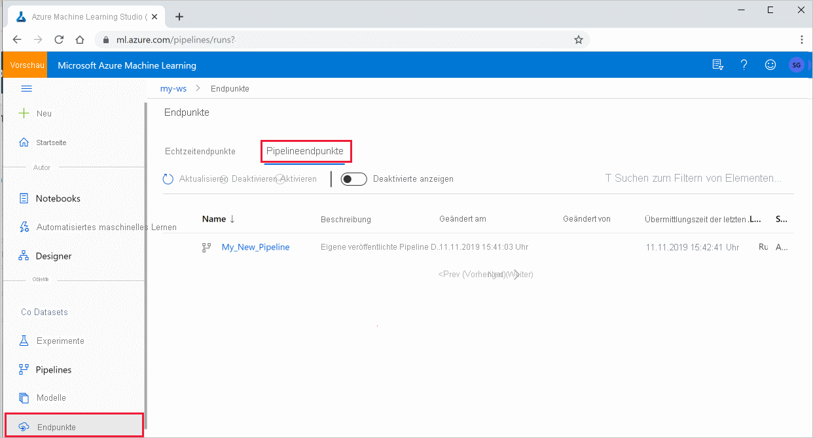

# <a name="publish-and-track-machine-learning-pipelines"></a>Veröffentlichen und Nachverfolgen von Pipelines des maschinellen Lernens


In diesem Artikel erfahren Sie, wie Sie eine Pipeline des maschinellen Lernens für Ihre Kollegen oder Kunden freigeben.

Pipelines des maschinellen Lernens sind wiederverwendbare Workflows für Aufgaben beim maschinellem Lernen. Ein Vorteil von Pipelines ist die verstärkte Kollaboration. Sie können auch Versionspipelines verwenden, mit denen Kunden das aktuelle Modell verwenden können, während Sie an einer neuen Version arbeiten. 

## <a name="prerequisites"></a>Voraussetzungen

* Erstellen Sie einen [Azure Machine Learning-Arbeitsbereich](how-to-manage-workspace.md), der Ihre gesamten Pipelineressourcen aufnehmen soll.

* [Konfigurieren Sie Ihre Entwicklungsumgebung](how-to-configure-environment.md) für die Installation des Azure Machine Learning SDK, oder verwenden Sie eine [Azure Machine Learning-Computeinstanz](concept-compute-instance.md) mit bereits installiertem SDK.

* Erstellen Sie eine Pipeline des maschinellen Lernens, und führen Sie sie aus, z. B. durch Befolgen der Schritte im [Tutorial: Erstellen einer Azure Machine Learning-Pipeline für die Batchbewertung](tutorial-pipeline-batch-scoring-classification.md). Weitere Optionen finden Sie unter [Erstellen und Ausführen von Pipelines des maschinellen Lernens mit dem Azure Machine Learning SDK](how-to-create-your-first-pipeline.md).

## <a name="publish-a-pipeline"></a>Veröffentlichen einer Pipeline

Sobald Sie eine Pipeline eingerichtet haben, können Sie eine Pipeline so veröffentlichen, dass sie mit unterschiedlichen Eingaben ausgeführt wird. Damit der REST-Endpunkt einer bereits veröffentlichten Pipeline Parameter akzeptiert, müssen Sie die Pipeline so konfigurieren, dass sie verschiedene `PipelineParameter`-Objekte als Argumente verwendet.

1. Um einen Pipelineparameter zu erstellen, verwenden Sie ein [PipelineParameter](/python/api/azureml-pipeline-core/azureml.pipeline.core.graph.pipelineparameter?preserve-view=true&view=azure-ml-py)-Objekt mit einem Standardwert.

   ```python
   from azureml.pipeline.core.graph import PipelineParameter
   
   pipeline_param = PipelineParameter(
     name="pipeline_arg",
     default_value=10)
   ```

2. Fügen Sie dieses `PipelineParameter`-Objekt als Parameter zu einem der Schritte in der Pipeline wie folgt hinzu:

   ```python
   compareStep = PythonScriptStep(
     script_name="compare.py",
     arguments=["--comp_data1", comp_data1, "--comp_data2", comp_data2, "--output_data", out_data3, "--param1", pipeline_param],
     inputs=[ comp_data1, comp_data2],
     outputs=[out_data3],
     compute_target=compute_target,
     source_directory=project_folder)
   ```

3. Veröffentlichen Sie diese Pipeline, die beim Aufruf einen Parameter akzeptiert.

   ```python
   published_pipeline1 = pipeline_run1.publish_pipeline(
        name="My_Published_Pipeline",
        description="My Published Pipeline Description",
        version="1.0")
   ```

## <a name="run-a-published-pipeline"></a>Ausführen einer veröffentlichten Pipeline

Alle veröffentlichten Pipelines weisen einen REST-Endpunkt auf. Mit dem Pipelineendpunkt können Sie eine Ausführung der Pipeline von beliebigen externen Systemen aus auslösen, einschließlich Clients, die nicht Python verwenden. Dieser Endpunkt ermöglicht „verwaltete Wiederholbarkeit“ in Szenarien für die Batchbewertung und für erneutes Training.

> [!IMPORTANT]
> Wenn mit der rollenbasierte Zugriffssteuerung (Role-Based Access Control, RBAC) den Zugriff auf Ihre Pipeline verwalten, [legen Sie die Berechtigungen für Ihr Pipelineszenario fest (Training oder Bewertung)](how-to-assign-roles.md#q-what-are-the-permissions-needed-to-perform-some-common-scenarios-in-the-azure-machine-learning-service).

Zum Aufrufen der Ausführung der vorhergehenden Pipeline benötigen Sie ein Headertoken für die Azure Active Directory-Authentifizierung. Das Abrufen eines solchen Tokens wird in der Referenz zur [AzureCliAuthentication-Klasse](/python/api/azureml-core/azureml.core.authentication.azurecliauthentication?preserve-view=true&view=azure-ml-py) und im Notebook [Authentifizierung in Azure Machine Learning](https://aka.ms/pl-restep-auth) beschrieben.

```python
from azureml.pipeline.core import PublishedPipeline
import requests

response = requests.post(published_pipeline1.endpoint,
                         headers=aad_token,
                         json={"ExperimentName": "My_Pipeline",
                               "ParameterAssignments": {"pipeline_arg": 20}})
```

Das `json`-Argument für die POST-Anforderung muss für den `ParameterAssignments`-Schlüssel ein Wörterbuch enthalten, das die Pipelineparameter und deren Werte enthält. Außerdem kann das `json`-Argument die folgenden Schlüssel enthalten:

| Schlüssel | Beschreibung |
| --- | --- | 
| `ExperimentName` | Der Name des Experiments, das diesem Endpunkt zugeordnet ist. |
| `Description` | Freihandtext, der den Endpunkt beschreibt. | 
| `Tags` | Freiform-Schlüssel-Wert-Paare, die zum Bezeichnen und Kommentieren von Anforderungen verwendet werden können.  |
| `DataSetDefinitionValueAssignments` | Wörterbuch zum Ändern von Datasets ohne erneutes Training (siehe nachfolgende Beschreibung). | 
| `DataPathAssignments` | Wörterbuch zum Ändern von Datenpfaden ohne erneutes Training (siehe nachfolgende Beschreibung) | 

### <a name="run-a-published-pipeline-using-c"></a>Ausführen einer veröffentlichten Pipeline mit C# 

Der folgende Code zeigt, wie eine Pipeline asynchron von C# aus aufgerufen wird. Der partielle Codeausschnitt zeigt nur die Aufrufstruktur und ist nicht Teil eines Microsoft-Beispiels. Es zeigt keine vollständigen Klassen oder die Fehlerbehandlung. 

```csharp
[DataContract]
public class SubmitPipelineRunRequest
{
    [DataMember]
    public string ExperimentName { get; set; }

    [DataMember]
    public string Description { get; set; }

    [DataMember(IsRequired = false)]
    public IDictionary<string, string> ParameterAssignments { get; set; }
}

// ... in its own class and method ... 
const string RestEndpoint = "your-pipeline-endpoint";

using (HttpClient client = new HttpClient())
{
    var submitPipelineRunRequest = new SubmitPipelineRunRequest()
    {
        ExperimentName = "YourExperimentName", 
        Description = "Asynchronous C# REST api call", 
        ParameterAssignments = new Dictionary<string, string>
        {
            {
                // Replace with your pipeline parameter keys and values
                "your-pipeline-parameter", "default-value"
            }
        }
    };

    string auth_key = "your-auth-key"; 
    client.DefaultRequestHeaders.Authorization = new AuthenticationHeaderValue("Bearer", auth_key);

    // submit the job
    var requestPayload = JsonConvert.SerializeObject(submitPipelineRunRequest);
    var httpContent = new StringContent(requestPayload, Encoding.UTF8, "application/json");
    var submitResponse = await client.PostAsync(RestEndpoint, httpContent).ConfigureAwait(false);
    if (!submitResponse.IsSuccessStatusCode)
    {
        await WriteFailedResponse(submitResponse); // ... method not shown ...
        return;
    }

    var result = await submitResponse.Content.ReadAsStringAsync().ConfigureAwait(false);
    var obj = JObject.Parse(result);
    // ... use `obj` dictionary to access results
}
```

### <a name="run-a-published-pipeline-using-java"></a>Ausführen einer veröffentlichten Pipeline mit Java

Der folgende Code zeigt einen Aufruf einer Pipeline, die eine Authentifizierung erfordert (weitere Informationen finden Sie unter [Einrichten der Authentifizierung für Azure Machine Learning-Ressourcen und -Workflows](how-to-setup-authentication.md)). Wenn Ihre Pipeline öffentlich bereitgestellt wird, benötigen Sie die Aufrufe, die zu `authKey` führen, nicht. Der partielle Codeausschnitt zeigt weder eine Java-Klasse noch Bausteine für die Ausnahmebehandlung. Der Code verwendet `Optional.flatMap` für die Verkettung von Funktionen, die ein leeres `Optional` zurückgeben können. Die Verwendung von `flatMap` verkürzt und verdeutlicht den Code, aber beachten Sie, dass `getRequestBody()` Ausnahmen abfängt.

```java
import java.net.URI;
import java.net.http.HttpClient;
import java.net.http.HttpRequest;
import java.net.http.HttpResponse;
import java.util.Optional;
// JSON library
import com.google.gson.Gson;

String scoringUri = "scoring-endpoint";
String tenantId = "your-tenant-id";
String clientId = "your-client-id";
String clientSecret = "your-client-secret";
String resourceManagerUrl = "https://management.azure.com";
String dataToBeScored = "{ \"ExperimentName\" : \"My_Pipeline\", \"ParameterAssignments\" : { \"pipeline_arg\" : \"20\" }}";

HttpClient client = HttpClient.newBuilder().build();
Gson gson = new Gson();

HttpRequest tokenAuthenticationRequest = tokenAuthenticationRequest(tenantId, clientId, clientSecret, resourceManagerUrl);
Optional<String> authBody = getRequestBody(client, tokenAuthenticationRequest);
Optional<String> authKey = authBody.flatMap(body -> Optional.of(gson.fromJson(body, AuthenticationBody.class).access_token);;
Optional<HttpRequest> scoringRequest = authKey.flatMap(key -> Optional.of(scoringRequest(key, scoringUri, dataToBeScored)));
Optional<String> scoringResult = scoringRequest.flatMap(req -> getRequestBody(client, req));
// ... etc (`scoringResult.orElse()`) ... 

static HttpRequest tokenAuthenticationRequest(String tenantId, String clientId, String clientSecret, String resourceManagerUrl)
{
    String authUrl = String.format("https://login.microsoftonline.com/%s/oauth2/token", tenantId);
    String clientIdParam = String.format("client_id=%s", clientId);
    String resourceParam = String.format("resource=%s", resourceManagerUrl);
    String clientSecretParam = String.format("client_secret=%s", clientSecret);

    String bodyString = String.format("grant_type=client_credentials&%s&%s&%s", clientIdParam, resourceParam, clientSecretParam);

    HttpRequest request = HttpRequest.newBuilder()
        .uri(URI.create(authUrl))
        .POST(HttpRequest.BodyPublishers.ofString(bodyString))
        .build();
    return request;
}

static HttpRequest scoringRequest(String authKey, String scoringUri, String dataToBeScored)
{
    HttpRequest request = HttpRequest.newBuilder()
        .uri(URI.create(scoringUri))
        .header("Authorization", String.format("Token %s", authKey))
        .POST(HttpRequest.BodyPublishers.ofString(dataToBeScored))
        .build();
    return request;

}

static Optional<String> getRequestBody(HttpClient client, HttpRequest request) {
    try {
        HttpResponse<String> response = client.send(request, HttpResponse.BodyHandlers.ofString());
        if (response.statusCode() != 200) {
            System.out.println(String.format("Unexpected server response %d", response.statusCode()));
            return Optional.empty();
        }
        return Optional.of(response.body());
    }catch(Exception x)
    {
        System.out.println(x.toString());
        return Optional.empty();
    }
}

class AuthenticationBody {
    String access_token;
    String token_type;
    int expires_in;
    String scope;
    String refresh_token;
    String id_token;
    
    AuthenticationBody() {}
}
```

### <a name="changing-datasets-and-datapaths-without-retraining"></a>Ändern von Datasets und Datenpfaden ohne erneutes Training

Möglicherweise möchten Sie unterschiedliche Datasets und Datenpfade trainieren und rückschließen. Beispielsweise möchten Sie vielleicht mit einem kleineren Dataset trainieren, aber Rückschlüsse auf das gesamte Dataset ziehen. Sie wechseln Datasets mit dem `DataSetDefinitionValueAssignments`-Schlüssel im `json`-Argument der Anforderung. Sie wechseln Datenpfade mit `DataPathAssignments`. Die Vorgehensweise für beides ist ähnlich:

1. Erstellen Sie im Pipelinedefinitionsskript einen `PipelineParameter` für das Dataset. Erstellen Sie eine `DatasetConsumptionConfig` oder einen `DataPath` aus dem `PipelineParameter`:

    ```python
    tabular_dataset = Dataset.Tabular.from_delimited_files('https://dprepdata.blob.core.windows.net/demo/Titanic.csv')
    tabular_pipeline_param = PipelineParameter(name="tabular_ds_param", default_value=tabular_dataset)
    tabular_ds_consumption = DatasetConsumptionConfig("tabular_dataset", tabular_pipeline_param)
    ```

1. Greifen Sie in Ihrem ML-Skript mit `Run.get_context().input_datasets` auf das dynamisch angegebene Dataset zu:

    ```python
    from azureml.core import Run
    
    input_tabular_ds = Run.get_context().input_datasets['tabular_dataset']
    dataframe = input_tabular_ds.to_pandas_dataframe()
    # ... etc ...
    ```

    Beachten Sie, dass das ML-Skript auf den für die `DatasetConsumptionConfig` angegebenen Wert (`tabular_dataset`) und nicht auf den Wert des `PipelineParameter` (`tabular_ds_param`) zugreift.

1. Legen Sie im Pipelinedefinitionsskript die `DatasetConsumptionConfig` als Parameter für `PipelineScriptStep` fest:

    ```python
    train_step = PythonScriptStep(
        name="train_step",
        script_name="train_with_dataset.py",
        arguments=["--param1", tabular_ds_consumption],
        inputs=[tabular_ds_consumption],
        compute_target=compute_target,
        source_directory=source_directory)
    
    pipeline = Pipeline(workspace=ws, steps=[train_step])
    ```

1. Verwenden Sie `DataSetDefinitionValueAssignments`, um Datasets dynamisch im rückschließenden REST-Aufruf zu wechseln:
    
    ```python
    tabular_ds1 = Dataset.Tabular.from_delimited_files('path_to_training_dataset')
    tabular_ds2 = Dataset.Tabular.from_delimited_files('path_to_inference_dataset')
    ds1_id = tabular_ds1.id
    d22_id = tabular_ds2.id
    
    response = requests.post(rest_endpoint, 
                             headers=aad_token, 
                             json={
                                "ExperimentName": "MyRestPipeline",
                               "DataSetDefinitionValueAssignments": {
                                    "tabular_ds_param": {
                                        "SavedDataSetReference": {"Id": ds1_id #or ds2_id
                                    }}}})
    ```

Die Notebooks [Showcasing Dataset and PipelineParameter](https://github.com/Azure/MachineLearningNotebooks/blob/master/how-to-use-azureml/machine-learning-pipelines/intro-to-pipelines/aml-pipelines-showcasing-dataset-and-pipelineparameter.ipynb) und [Showcasing DataPath and PipelineParameter](https://github.com/Azure/MachineLearningNotebooks/blob/master/how-to-use-azureml/machine-learning-pipelines/intro-to-pipelines/aml-pipelines-showcasing-datapath-and-pipelineparameter.ipynb) enthalten umfassende Beispiele für diese Technik.

## <a name="create-a-versioned-pipeline-endpoint"></a>Erstellen eines Pipelineendpunkts mit Versionsangabe

Sie können einen Pipelineendpunkt erstellen, hinter dem sich mehrere veröffentlichte Pipelines befinden. Dieses Verfahren stellt einen festen REST-Endpunkt bereit, wenn Sie Ihre ML-Pipelines durchlaufen und aktualisieren.

```python
from azureml.pipeline.core import PipelineEndpoint

published_pipeline = PipelineEndpoint.get(workspace=ws, name="My_Published_Pipeline")
pipeline_endpoint = PipelineEndpoint.publish(workspace=ws, name="PipelineEndpointTest",
                                            pipeline=published_pipeline, description="Test description Notebook")
```

## <a name="submit-a-job-to-a-pipeline-endpoint"></a>Übermitteln eines Auftrags an einen Pipelineendpunkt

Sie können einen Auftrag an die Standardversion eines Pipelineendpunkts übermitteln:

```python
pipeline_endpoint_by_name = PipelineEndpoint.get(workspace=ws, name="PipelineEndpointTest")
run_id = pipeline_endpoint_by_name.submit("PipelineEndpointExperiment")
print(run_id)
```

Sie können einen Auftrag auch an eine bestimmte Version übermitteln:

```python
run_id = pipeline_endpoint_by_name.submit("PipelineEndpointExperiment", pipeline_version="0")
print(run_id)
```

Das gleiche Ergebnis kann mit der REST-API erreicht werden:

```python
rest_endpoint = pipeline_endpoint_by_name.endpoint
response = requests.post(rest_endpoint, 
                         headers=aad_token, 
                         json={"ExperimentName": "PipelineEndpointExperiment",
                               "RunSource": "API",
                               "ParameterAssignments": {"1": "united", "2":"city"}})
```

## <a name="use-published-pipelines-in-the-studio"></a>Verwenden von veröffentlichten Pipelines in Studio

Sie können über Studio auch eine veröffentlichte Pipeline ausführen:

1. Melden Sie sich bei [Azure Machine Learning Studio](https://ml.azure.com) an.

1. [Zeigen Sie den Arbeitsbereich an](how-to-manage-workspace.md#view).

1. Klicken Sie links auf **Endpunkte**.

1. Wählen Sie oben **Pipelineendpunkte** aus.
 

1. Wählen Sie eine bestimmte Pipeline aus, um einen Pipelineendpunkt auszuführen, zu nutzen oder die Ergebnisse früherer Ausführungen des Pipelineendpunkts zu überprüfen.

## <a name="disable-a-published-pipeline"></a>Deaktivieren einer veröffentlichten Pipeline

Um eine Pipeline aus der Liste der veröffentlichten Pipelines auszublenden, deaktivieren Sie sie in Studio oder über das SDK:

```python
# Get the pipeline by using its ID from Azure Machine Learning studio
p = PublishedPipeline.get(ws, id="068f4885-7088-424b-8ce2-eeb9ba5381a6")
p.disable()
```

Sie können sie mit `p.enable()` wieder aktivieren. Weitere Informationen finden Sie in der Referenz zur [PublishedPipeline-Klasse](/python/api/azureml-pipeline-core/azureml.pipeline.core.publishedpipeline?preserve-view=true&view=azure-ml-py).

## <a name="next-steps"></a>Nächste Schritte

- Verwenden Sie [diese Jupyter-Notebooks auf GitHub](https://aka.ms/aml-pipeline-readme), um die Pipelines für maschinelles Lernen eingehender zu erkunden.
- Hinweise zu den Paketen [azureml-pipelines-core](/python/api/azureml-pipeline-core/?preserve-view=true&view=azure-ml-py) und [azureml-pipelines-steps](/python/api/azureml-pipeline-steps/?preserve-view=true&view=azure-ml-py) finden Sie in der SDK-Referenzhilfe.
- Tipps zum Debuggen und zur Problembehandlung von Pipelines finden Sie in der [Schrittanleitung](how-to-debug-pipelines.md).