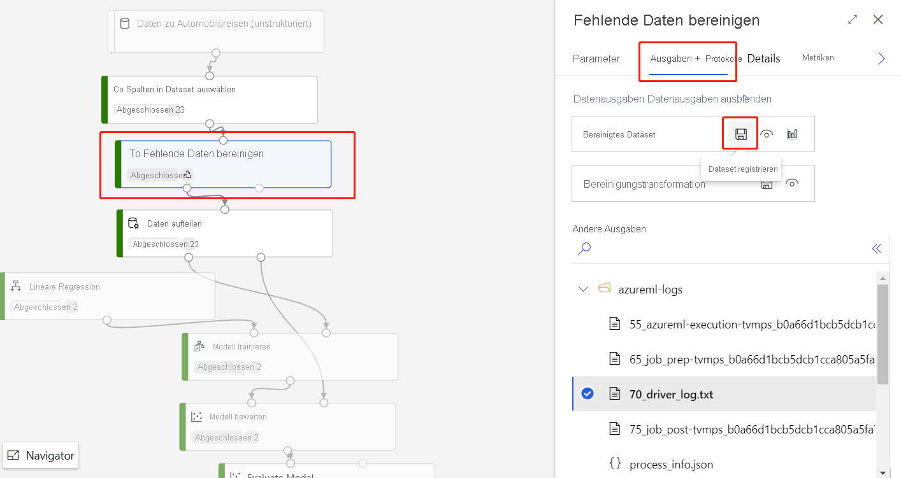
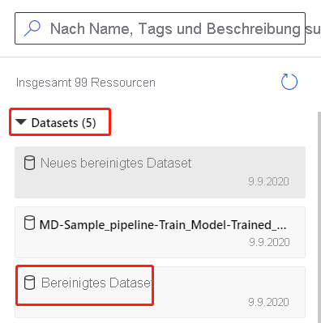

# Importieren von Daten in den Azure Machine Learning-Designer (Vorschauversion)

In diesem Artikel erfahren Sie, wie Sie Ihre eigenen Daten in den Designer importieren, um benutzerdefinierte Lösungen zu erstellen. Es gibt zwei Möglichkeiten, wie Sie Daten in den Designer importieren können: 

* **Azure Machine Learning-Datasets** – Registrieren Sie [Datasets](concept-data.md#datasets) in Azure Machine Learning, um erweiterte Features zu aktivieren, die Sie bei der Verwaltung Ihrer Daten unterstützen.
* **Modul „Daten importieren“** – Verwenden Sie das Modul [Daten importieren](algorithm-module-reference/import-data.md), um direkt auf Daten aus Onlinedatenquellen zuzugreifen.

## Verwenden von Azure Machine Learning-Datasets

Es wird empfohlen, dass Sie [Datasets](concept-data.md#datasets) verwenden, um Daten in den Designer zu importieren. Wenn Sie ein Dataset registrieren, können Sie die erweiterten Datenfeatures wie [Versionsverwaltung und Nachverfolgung](how-to-version-track-datasets.md) und [Datenüberwachung](how-to-monitor-datasets.md) in vollem Umfang nutzen.

### Registrieren eines Datasets

Sie können vorhandene Datasets [programmgesteuert mit dem SDK](how-to-create-register-datasets.md#use-the-sdk) oder [visuell im Azure Machine Learning Studio](how-to-create-register-datasets.md#use-the-ui) registrieren.

Sie können auch die Ausgabe für jedes Designermodul als Dataset registrieren.

1. Wählen Sie das Modul aus, das die zu registrierenden Daten ausgibt.

1. Wählen Sie im Bereich „Eigenschaften“ die Option **Ausgaben** > **Dataset registrieren** aus.

    

### Verwenden eines Datasets

Ihre registrierten Datasets finden Sie in der Modulpalette unter **Datasets** > **Meine Datasets**. Um ein Dataset zu verwenden, ziehen Sie es per Drag & Drop auf die Pipelinecanvas. Verbinden Sie dann den Ausgabeport des Datasets mit anderen Modulen der Palette.

> [!NOTE]
> Der Designer unterstützt derzeit nur die Verarbeitung [Tabellendatasets](how-to-create-register-datasets.md#dataset-types). Wenn Sie [Dateidatasets](how-to-create-register-datasets.md#dataset-types) verwenden möchten, verwenden Sie das Azure Machine Learning SDK, das für Python und R verfügbar ist.

## Importieren von Daten mit dem Modul „Daten importieren“

Obwohl wir empfehlen, dass Sie Datasets zum Importieren von Daten verwenden, können Sie auch das Modul [Daten importieren](algorithm-module-reference/import-data.md) verwenden. Das Modul „Daten importieren“ überspringt die Registrierung Ihres Datasets in Azure Machine Learning und importiert Daten direkt aus einem [Datenspeicher](concept-data.md#datastores) oder einer HTTP-URL.

Ausführliche Informationen zur Verwendung des Moduls „Daten importieren“ finden Sie auf der [Referenzseite für den Datenimport](algorithm-module-reference/import-data.md).

> [!NOTE]
> Wenn das Dataset zu viele Spalten enthält, kann der folgende Fehler auftreten: „Fehler bei der Überprüfung aufgrund von Größenbeschränkung“. Um dies zu vermeiden, [registrieren Sie das Dataset in der Dataset-Schnittstelle](how-to-create-register-datasets.md#use-the-ui).

## Unterstützte Quellen

Dieser Abschnitt listet die vom Designer unterstützten Datenquellen auf. Die Daten kommen entweder aus einem Datenspeicher oder aus einem [Tabellendataset](how-to-create-register-datasets.md#dataset-types) in den Designer.

### Datenspeicherquellen
Eine Liste der unterstützten Datenspeicherquellen finden Sie unter [Zugreifen auf Daten in Azure Storage-Diensten](how-to-access-data.md#supported-data-storage-service-types).

### Tabellendatasetquellen

Der Designer unterstützt Tabellendatasets, die aus den folgenden Quellen erstellt wurden:
 * Durch Trennzeichen getrennte Dateien
 * JSON-Dateien
 * Parquet-Dateien
 * SQL-Abfragen

## Datentypen

Der Designer erkennt intern die folgenden Datentypen:

* String
* Integer
* Decimal
* Boolean
* Date

Der Designer verwendet einen internen Datentyp, um Daten zwischen Modulen zu übertragen. Mit dem Modul [Convert to Dataset](algorithm-module-reference/convert-to-dataset.md) (In Dataset konvertieren) können Sie Daten explizit in das data table-Format konvertieren. Jedes Modul, das andere Formate als das interne Format akzeptiert, konvertiert die Daten im Hintergrund vor der Übergabe an das nächste Modul.

## Dateneinschränkungen

Die Module im Designer sind durch die Größe des Computeziels begrenzt. Für größere Datasets sollten Sie eine größere Azure Machine Learning-Computeressource verwenden. Weitere Informationen zum Machine Learning-Computing finden Sie unter [Was sind Computeziele in Azure Machine Learning?](concept-compute-target.md#azure-machine-learning-compute-managed).

## Zugreifen auf Daten in einem virtuellen Netzwerk

Wenn sich Ihr Arbeitsbereich in einem virtuellen Netzwerk befindet, müssen Sie zusätzliche Konfigurationsschritte ausführen, um die Daten im Designer visuell darzustellen. Weitere Informationen zur Verwendung von Datenspeichern und Datasets in virtuellen Netzwerken finden Sie unter [Netzwerkisolation während Training und Rückschluss mit privaten virtuellen Netzwerken](how-to-enable-virtual-network.md#machine-learning-studio).

## Nächste Schritte

Erfahren Sie mehr über die Grundlagen des Designers mit [Tutorial: Prognostizieren von Automobilpreisen mit dem Designer](tutorial-designer-automobile-price-train-score.md).
