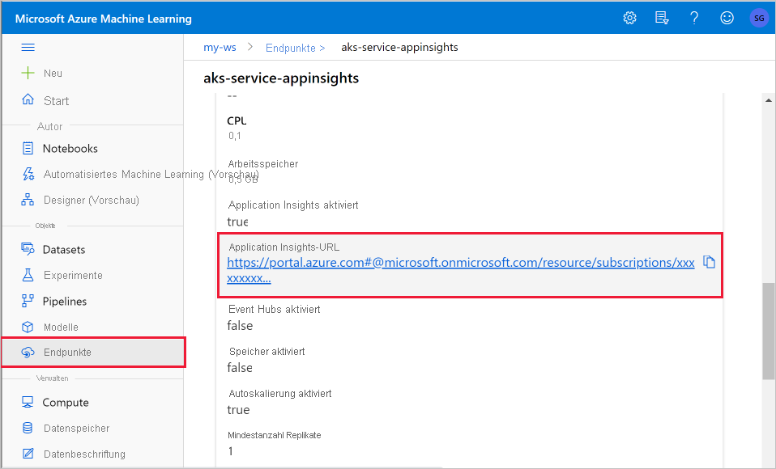
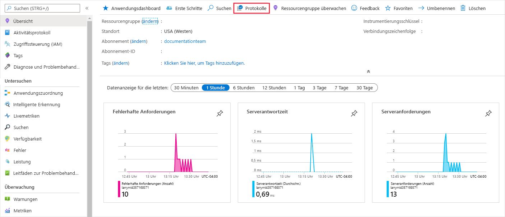
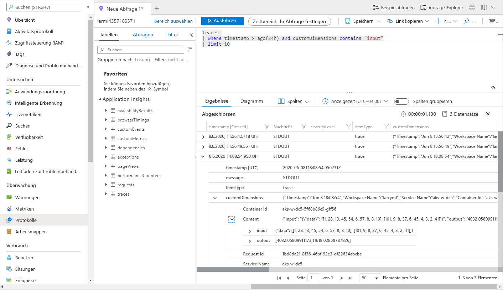

# <a name="monitor-and-collect-data-from-ml-web-service-endpoints"></a>Überwachen und Erfassen von Daten von ML-Webdienst-Endpunkten


In diesem Artikel erfahren Sie, wie Sie Daten von Modellen erfassen, die in Webdienst-Endpunkten in Azure Kubernetes Service (AKS) oder Azure Container Instances (ACI) bereitgestellt wurden. Verwenden Sie [Azure Application Insights](../azure-monitor/app/app-insights-overview.md), um die folgenden Daten von einem Endpunkt zu erfassen:
* Ausgabedaten
* Antworten
* Anforderungsraten, Antwortzeiten und Fehlerraten
* Abhängigkeitsraten, Antwortzeiten und Fehlerraten
* Ausnahmen

Im Notebook [enable-app-insights-in-production-service.ipynb](https://github.com/Azure/MachineLearningNotebooks/blob/master/how-to-use-azureml/deployment/enable-app-insights-in-production-service/enable-app-insights-in-production-service.ipynb) werden die in diesem Artikel behandelten Konzepte veranschaulicht.
 
[!INCLUDE [aml-clone-in-azure-notebook](../../includes/aml-clone-for-examples.md)]
 
## <a name="prerequisites"></a>Voraussetzungen

* Ein Azure-Abonnement. Testen Sie die [kostenlose oder kostenpflichtige Version von Azure Machine Learning](https://aka.ms/AMLFree).

* Ein Azure Machine Learning-Arbeitsbereich, ein lokales Verzeichnis mit Ihren Skripts und das Azure Machine Learning SDK für Python müssen installiert sein. Weitere Informationen finden Sie unter [Konfiguration einer Entwicklungsumgebung](how-to-configure-environment.md).

* Ein trainiertes Modell für maschinelles Lernen. Weitere Informationen finden Sie im Tutorial zum [Trainieren eines Imageklassifizierungsmodells](tutorial-train-models-with-aml.md).

<a name="python"></a>

## <a name="configure-logging-with-the-python-sdk"></a>Konfigurieren der Protokollierung mit dem Python SDK

In diesem Abschnitt erfahren Sie, wie Sie die Application Insights-Protokollierung mit dem Python SDK aktivieren. 

### <a name="update-a-deployed-service"></a>Aktualisieren eines bereitgestellten Diensts

Führen Sie die folgenden Schritte aus, um einen vorhandenen Webdienst zu aktualisieren:

1. Suchen Sie den Dienst in Ihrem Arbeitsbereich. Der Wert für `ws` ist der Name des Arbeitsbereichs.

    ```python
    from azureml.core.webservice import Webservice
    aks_service= Webservice(ws, "my-service-name")
    ```
2. Aktualisieren Sie Ihren Dienst, und aktivieren Sie Azure Application Insights.

    ```python
    aks_service.update(enable_app_insights=True)
    ```

### <a name="log-custom-traces-in-your-service"></a>Protokollieren von benutzerdefinierten Ablaufverfolgungen in Ihrem Dienst

> [!IMPORTANT]
> Azure Application Insights protokolliert nur Nutzlasten von bis zu 64 KB. Bei Erreichen dieses Grenzwerts treten unter Umständen Fehler auf (etwa aufgrund von unzureichendem Arbeitsspeicher), oder es werden ggf. keine Informationen protokolliert. Sind die Daten, die Sie protokollieren möchten, größer als 64 KB, speichern Sie sie stattdessen in Blob Storage, wie unter [Sammeln von Daten für Modelle in der Produktion](how-to-enable-data-collection.md) beschrieben.
>
> In komplexeren Situationen wie der Modellnachverfolgung in einer AKS-Bereitstellungwird die Verwendung einer Drittanbieterbibliothek wie [OpenCensus](https://opencensus.io) empfohlen.

Um benutzerdefinierte Ablaufverfolgungen zu protokollieren, führen Sie den Standardbereitstellungsprozess für AKS oder ACI im Dokument [Wie und wo Modelle bereitgestellt werden](how-to-deploy-and-where.md) aus. Führen Sie dann die folgenden Schritte aus:

1. Aktualisieren Sie die Bewertungsdatei, indem Sie print-Anweisungen hinzufügen, um Daten während des Rückschließens an Application Insights zu senden. Um komplexere Informationen wie etwa die Anforderungsdaten und die Antwort zu protokollieren, verwenden Sie eine JSON-Struktur. 

    Mit der folgenden Beispieldatei `score.py` werden die Initialisierung des Modells, die Ein- und Ausgabe während des Rückschließens sowie die Zeit protokolliert, zu der Fehler auftreten.

    
    ```python
    import pickle
    import json
    import numpy 
    from sklearn.externals import joblib
    from sklearn.linear_model import Ridge
    from azureml.core.model import Model
    import time

    def init():
        global model
        #Print statement for appinsights custom traces:
        print ("model initialized" + time.strftime("%H:%M:%S"))
        
        # note here "sklearn_regression_model.pkl" is the name of the model registered under the workspace
        # this call should return the path to the model.pkl file on the local disk.
        model_path = Model.get_model_path(model_name = 'sklearn_regression_model.pkl')
        
        # deserialize the model file back into a sklearn model
        model = joblib.load(model_path)
    

    # note you can pass in multiple rows for scoring
    def run(raw_data):
        try:
            data = json.loads(raw_data)['data']
            data = numpy.array(data)
            result = model.predict(data)
            # Log the input and output data to appinsights:
            info = {
                "input": raw_data,
                "output": result.tolist()
                }
            print(json.dumps(info))
            # you can return any datatype as long as it is JSON-serializable
            return result.tolist()
        except Exception as e:
            error = str(e)
            print (error + time.strftime("%H:%M:%S"))
            return error
    ```

2. Aktualisieren Sie die Dienstkonfiguration, und stellen Sie sicher, dass Sie Application Insights aktivieren.
    
    ```python
    config = Webservice.deploy_configuration(enable_app_insights=True)
    ```

3. Erstellen Sie ein Image, und stellen Sie es in AKS oder ACI bereit. Weitere Informationen finden Sie unter [Bereitstellen von Modellen mit dem Azure Machine Learning Service](how-to-deploy-and-where.md).


### <a name="disable-tracking-in-python"></a>Deaktivieren der Nachverfolgung in Python

Verwenden Sie den folgenden Code, um Azure Application Insights zu deaktivieren:

```python 
## replace <service_name> with the name of the web service
<service_name>.update(enable_app_insights=False)
```

<a name="studio"></a>

## <a name="configure-logging-with-azure-machine-learning-studio"></a>Konfigurieren der Protokollierung mit Azure Machine Learning Studio

Sie können Azure Application Insights auch in Azure Machine Learning Studio aktivieren. Sobald Ihr Modell als Webdienst bereitgestellt werden kann, führen Sie die folgenden Schritte aus, um Application Insights zu aktivieren:

1. Melden Sie sich unter https://ml.azure.com bei Studio an.
1. Navigieren Sie zu **Modelle**, und wählen Sie das bereitzustellende Modell aus.
1. Wählen Sie **+ Bereitstellen** aus.
1. Füllen Sie das Formular **Modell bereitstellen** aus.
1. Erweitern Sie das Menü **Erweitert**.

    
1. Aktivieren Sie **Application Insights-Diagnose und -Datensammlung aktivieren**.

    

## <a name="view-metrics-and-logs"></a>Anzeigen von Metriken und Protokollen

### <a name="query-logs-for-deployed-models"></a>Abfragen von Protokollen für bereitgestellte Modelle

Protokolle von Echtzeitendpunkten sind Kundendaten. Sie können die `get_logs()`-Funktion verwenden, um Protokolle aus einem zuvor bereitgestellten Webdienst abzurufen. Die Protokolle können ausführliche Informationen zu allen Fehlern enthalten, die während der Bereitstellung aufgetreten sind.

```python
from azureml.core import Workspace
from azureml.core.webservice import Webservice

ws = Workspace.from_config()

# load existing web service
service = Webservice(name="service-name", workspace=ws)
logs = service.get_logs()
```

Wenn Sie über mehrere Mandanten verfügen, müssen Sie vor `ws = Workspace.from_config()` ggf. den folgenden Code für die Authentifizierung hinzufügen:

```python
from azureml.core.authentication import InteractiveLoginAuthentication
interactive_auth = InteractiveLoginAuthentication(tenant_id="the tenant_id in which your workspace resides")
```

### <a name="view-logs-in-the-studio"></a>Anzeigen von Protokollen in Studio

Azure Application Insights speichert die Dienstprotokolle in der gleichen Ressourcengruppe wie der Azure Machine Learning-Arbeitsbereich. Führen Sie die folgenden Schritte aus, um die Daten mit Studio anzuzeigen:

1. Wechseln Sie zu Ihrem Azure Machine Learning-Arbeitsbereich im [Studio](https://ml.azure.com/).
1. Wählen Sie **Endpunkte**.
1. Testen Sie den bereitgestellten Dienst.
1. Wählen Sie den Link **Application Insights-URL** aus.

    [](././media/how-to-enable-app-insights/appinsightsloc.png#lightbox)

1. Wählen Sie in Application Insights auf der Registerkarte **Übersicht** oder im Abschnitt __Überwachung__ die Option __Protokolle__ aus.

    [](./media/how-to-enable-app-insights/overview.png#lightbox)

1. Wenn Sie protokollierte Informationen aus der Datei „score.py“ anzeigen möchten, sehen Sie sich die Tabelle __traces__ an. Mit der folgenden Abfrage wird nach Protokollen gesucht, bei denen der Wert __input__ protokolliert wurde:

    ```kusto
    traces
    | where customDimensions contains "input"
    | limit 10
    ```

   [](././media/how-to-enable-app-insights/model-data-trace.png#lightbox)

Weitere Informationen zur Verwendung von Azure Application Insights finden Sie unter [Was ist Application Insights?](../azure-monitor/app/app-insights-overview.md)

## <a name="web-service-metadata-and-response-data"></a>Meta- und -Antwortdaten eines Webdiensts

> [!IMPORTANT]
> Azure Application Insights protokolliert nur Nutzlasten von bis zu 64 KB. Bei Erreichen dieses Grenzwerts treten unter Umständen Fehler auf (etwa aufgrund von unzureichendem Arbeitsspeicher), oder es werden ggf. keine Informationen protokolliert.

Zum Protokollieren von Informationen zu Webdienstanforderungen fügen Sie der Datei „score.py“ `print`-Anweisungen hinzu. Jede `print`-Anweisung erstellt einen Eintrag in der Application Insights-Ablaufverfolgungstabelle unter der Meldung `STDOUT`. Application Insights speichert die Ausgaben der `print`-Anweisungen in `customDimensions` und in der Ablaufverfolgungstabelle `Contents`. Durch Ausgeben von JSON-Zeichenfolgen wird in der Ablaufverfolgungsausgabe unter `Contents` eine hierarchische Datenstruktur generiert.

## <a name="export-data-for-retention-and-processing"></a>Exportieren von Daten für die Aufbewahrung und die Verarbeitung

>[!Important]
> Azure Application Insights unterstützt nur Exporte in einen Blobspeicher. Weitere Informationen zu den Beschränkungen dieser Implementierung finden Sie unter [Exportieren von Telemetriedaten aus App Insights](../azure-monitor/app/export-telemetry.md#continuous-export-advanced-storage-configuration).

Verwenden Sie den [fortlaufenden Export](../azure-monitor/app/export-telemetry.md) von Application Insights, um Daten in ein Blobspeicherkonto zu exportieren, für das Sie die Aufbewahrungseinstellungen definieren können. Application Insights exportiert die Daten im JSON-Format. 

:::image type="content" source="media/how-to-enable-app-insights/continuous-export-setup.png" alt-text="Fortlaufendem Export":::

## <a name="next-steps"></a>Nächste Schritte

In diesem Artikel haben Sie gelernt, wie Sie die Protokollierung aktivieren und Protokolle für Webdienst-Endpunkte anzeigen. In den folgenden Artikeln werden die nächsten Schritte erläutert:


* [Bereitstellen eines Modells in einem AKS-Cluster](./how-to-deploy-azure-kubernetes-service.md)

* [Bereitstellen eines Modells in Azure Container Instances](./how-to-deploy-azure-container-instance.md)

* [MLOps: Verwalten, Bereitstellen und Überwachen von Modellen mit Azure Machine Learning](./concept-model-management-and-deployment.md) erfahren Sie, wie Sie von Modellen in der Produktion erfasste Daten nutzen. Solche Daten können Sie dabei unterstützen, Ihren Machine Learning-Prozess kontinuierlich zu verbessern.