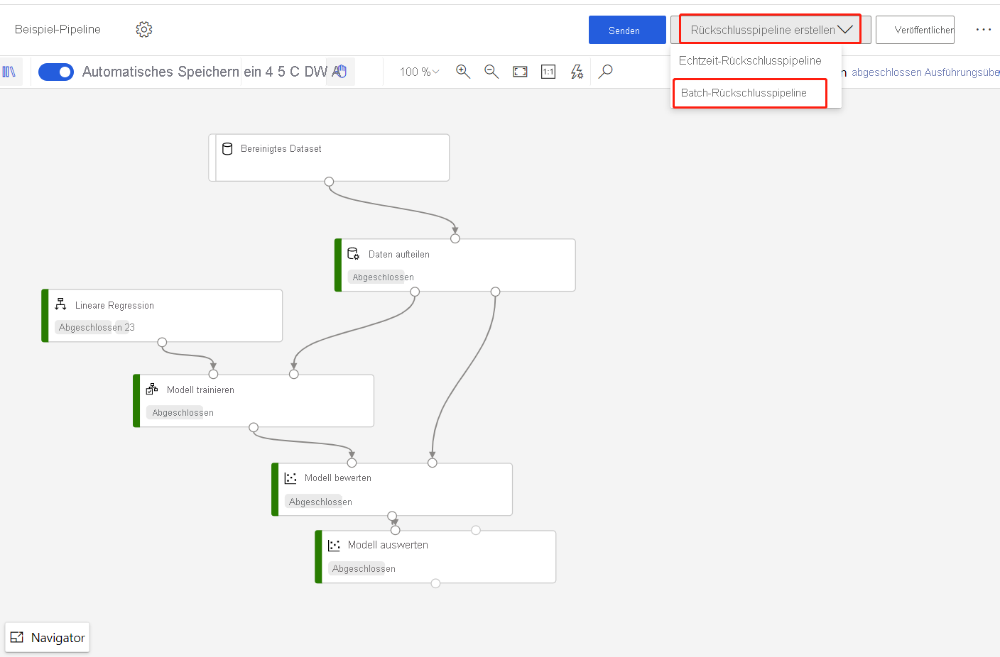

# Ausführen von Batchvorhersagen mit dem Azure Machine Learning-Designer

In diesem Artikel erfahren Sie, wie Sie den Designer zum Erstellen einer Batchvorhersagepipeline verwenden können. Mithilfe der Batchvorhersage können Sie kontinuierlich große Datasets bei Bedarf mit einem Webdienst bewerten, der von jeder HTTP-Bibliothek ausgelöst werden kann.

In dieser Anleitung erfahren Sie, wie Sie die folgenden Aufgaben ausführen:

> [!div class="checklist"]
> * Erstellen und Veröffentlichen einer Batchrückschlusspipeline
> * Nutzen eines Pipelineendpunkts
> * Verwalten von Endpunktversionen

Informationen zum Einrichten von Batchbewertungsdiensten mit dem SDK finden Sie in der begleitenden [Anleitung](./tutorial-pipeline-batch-scoring-classification.md).

## Voraussetzungen

Diese Anleitung geht davon aus, dass Sie bereits über eine Trainingspipeline verfügen. Eine Einführung in den Designer finden Sie im [ersten Teil des Designer-Tutorials](tutorial-designer-automobile-price-train-score.md). 

[!INCLUDE [machine-learning-missing-ui](../../includes/machine-learning-missing-ui.md)]

## Erstellen einer Batchrückschlusspipeline

Zum Erstellen einer Rückschlusspipeline muss Ihre Trainingspipeline mindestens einmal ausgeführt werden.

1. Wechseln Sie zur Registerkarte **Designer** in Ihrem Arbeitsbereich.

1. Wählen Sie die Trainingspipeline aus, mit der das Modell trainiert wird, mit dem Sie eine Vorhersage treffen möchten.

1. **Übermitteln** der Pipeline

    

Nachdem die Trainingspipeline ausgeführt wurde, können Sie nun eine Batchrückschlusspipeline erstellen.

1. Wählen Sie neben **Übermitteln** die neue Dropdownliste **Rückschlusspipeline erstellen** aus.

1. Wählen Sie **Batchrückschlusspipeline** aus.

    
    
Das Ergebnis ist eine standardmäßige Batchrückschlusspipeline. 

### Hinzufügen eines Pipelineparameters

Um Vorhersagen für neue Daten zu erstellen, können Sie entweder manuell ein anderes Dataset in dieser Pipelineentwurfsansicht verbinden oder einen Parameter für Ihr Dataset erstellen. Mit Parametern können Sie das Verhalten des Batchrückschlussprozesses zur Laufzeit ändern.

In diesem Abschnitt erstellen Sie einen Datasetparameter, um ein anderes Dataset anzugeben, für das Vorhersagen gemacht werden sollen.

1. Wählen Sie das Datasetmodul aus.

1. Rechts neben der Canvas wird ein Bereich angezeigt. Wählen Sie am unteren Rand des Bereichs die Option **Als Pipelineparameter festlegen** aus.
   
    Geben Sie einen Namen für den Parameter ein, oder akzeptieren Sie den Standardwert.

    > [!div class="mx-imgBorder"]
    > 

## Veröffentlichen Ihrer Batchrückschlusspipeline

Jetzt sind Sie bereit, die Rückschlusspipeline bereitzustellen. Dadurch wird die Pipeline bereitgestellt und anderen zur Nutzung zur Verfügung gestellt.

1. Wählen Sie die Schaltfläche **Veröffentlichen** aus.

1. Erweitern Sie im angezeigten Dialogfeld die Dropdownliste für **PipelineEndpoint**, und wählen Sie **Neuer PipelineEndpoint** aus.

1. Geben Sie einen Endpunktnamen und eine optionale Beschreibung an.

    Unten im Dialogfeld wird der von Ihnen konfigurierte Parameter mit einem Standardwert der während des Trainings verwendeten Datensatz-ID angezeigt.

1. Wählen Sie **Veröffentlichen**.

## Nutzen eines Endpunkts

Jetzt verfügen Sie über eine veröffentlichte Pipeline mit einem Datasetparameter. Die Pipeline verwendet das trainierte Modell, das in der Trainingspipeline erstellt wurde, um das von Ihnen als Parameter bereitgestellte Dataset zu bewerten.

### Übermitteln einer Pipelineausführung 

In diesem Abschnitt richten Sie eine manuelle Pipelineausführung ein und ändern den Pipelineparameter, um neue Daten zu bewerten. 

1. Nachdem die Bereitstellung abgeschlossen ist, wechseln Sie zum Abschnitt **Endpunkte**.

1. Wählen Sie **Pipelineendpunkte** aus.

1. Wählen Sie den Namen des von Ihnen erstellten Endpunkts aus.

1. Wählen Sie **Veröffentlichte Pipelines** aus.

    Auf diesem Bildschirm werden alle unter diesem Endpunkt veröffentlichten Pipelines angezeigt.

1. Wählen Sie die veröffentlichte Pipeline aus.

    Auf der Seite mit den Pipelinedetails finden Sie ausführliche Informationen zum Ausführungsverlauf und zur Verbindungszeichenfolge für die Pipeline. 
    
1. Wählen Sie **Übermitteln** aus, um eine manuelle Ausführung der Pipeline zu erstellen.

    
    
1. Ändern Sie den Parameter, um ein anderes Dataset zu verwenden.
    
1. Wählen Sie **Übermitteln** aus, um die Pipeline auszuführen.

### Verwenden des REST-Endpunkts

Informationen zur Verwendung von Pipelineendpunkten und der veröffentlichten Pipeline finden Sie im Abschnitt **Endpunkte**.

Den REST-Endpunkt eines Pipelineendpunkts finden Sie im Bereich der Ausführungsübersicht. Wenn Sie den Endpunkt aufrufen, nutzen Sie seine standardmäßig veröffentlichte Pipeline.

Sie können eine veröffentlichte Pipeline auch auf der Seite **Veröffentlichte Pipelines** nutzen. Wenn Sie eine veröffentlichte Pipeline auswählen, finden Sie den REST-Endpunkt der Pipeline im Panel zur **Übersicht über die veröffentliche Pipeline** rechts neben dem Diagramm. 

Sie benötigen einen OAuth 2.0-Authentifizierungsheader vom Typ Bearer, um einen REST-Aufruf auszuführen. Weitere Informationen zum Einrichten der Authentifizierung für Ihren Arbeitsbereich und zum Erstellen eines parametrisierten REST-Aufrufes finden Sie im folgenden [Tutorialabschnitt](tutorial-pipeline-batch-scoring-classification.md#publish-and-run-from-a-rest-endpoint).

## Versionsverwaltungsendpunkte

Der Designer ordnet jeder nachfolgenden Pipeline, die Sie an einem Endpunkt veröffentlichen, eine Version zu. Sie können die auszuführende Pipelineversion als Parameter in Ihrem REST-Aufruf angeben. Wenn Sie keine Versionsnummer angeben, wird der Designer die Standardpipeline verwenden.

Wenn Sie eine Pipeline veröffentlichen, können Sie auswählen, dass sie zur neuen Standardpipeline für diesen Endpunkt wird.

Sie können auch eine neue Standardpipeline auf der Registerkarte **Veröffentlichte Pipelines** Ihres Endpunkts festlegen.

## Einschränkungen

Wenn Sie in Ihrer Trainingspipeline Änderungen vornehmen, müssen Sie die Trainingspipeline erneut übermitteln, die Rückschlusspipeline **aktualisieren** und die Rückschlusspipeline erneut ausführen.

Beachten Sie, dass nur Modelle in der Rückschlusspipeline aktualisiert werden. Die Datentransformation wird dagegen nicht aktualisiert.

Wenn Sie die aktualisierte Transformation in der Rückschlusspipeline verwenden möchten, müssen Sie die Transformationsausgabe des Transformationsmoduls als Dataset registrieren.

Ersetzen Sie dann manuell das Modul **TD-** in der Rückschlusspipeline durch das registrierte Dataset.

Anschließend können Sie die Rückschlusspipeline mit dem aktualisierten Modell und der aktualisierten Transformation übermitteln und veröffentlichen.

## Nächste Schritte

Zum Trainieren und Bereitstellen eines Regressionsmodells befolgen Sie die Schritte im Designer-[Tutorial](tutorial-designer-automobile-price-train-score.md).
''
