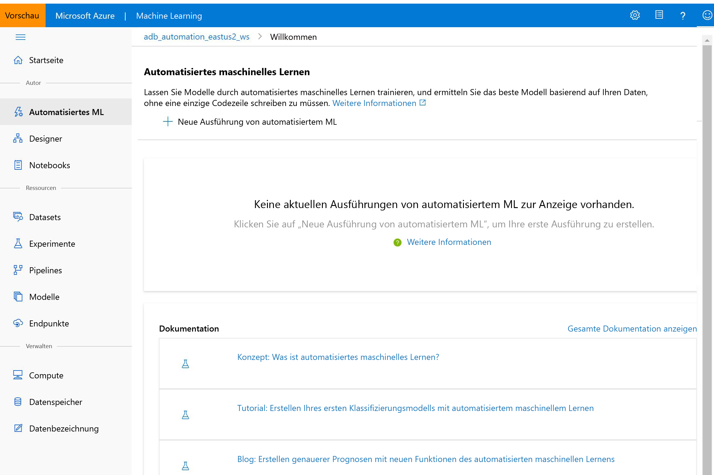

# Was ist Azure Machine Learning Studio?

In diesem Artikel erfahren Sie mehr über Azure Machine Learning Studio, das Webportal für Data Scientist-Entwickler in [Azure Machine Learning](overview-what-is-azure-ml.md). In Studio werden codefreie Umgebungen und Code First-Umgebungen zu einer inklusiven Data Science-Plattform kombiniert.

In diesem Artikel wird Folgendes behandelt:
>[!div class="checklist"]
> - [Erstellen von Machine Learning-Projekten](#author-machine-learning-projects) in Studio
> - [Verwalten von Assets und Ressourcen](#manage-assets-and-resources) in Studio
> - Unterschiede zwischen [Azure Machine Learning Studio und Machine Learning Studio (Classic)](#ml-studio-classic-vs-azure-machine-learning-studio)

Es wird empfohlen, den neuesten Browser zu verwenden, der mit Ihrem Betriebssystem kompatibel ist. Die folgenden Browser werden unterstützt:
  * Microsoft Edge (Die neueste Version von Microsoft Edge. Keine ältere Microsoft Edge-Version.)
  * Safari (neueste Version, nur auf Mac)
  * Chrome (neueste Version)
  * Firefox (neueste Version)

## Erstellen von Machine Learning-Projekten

Studio bietet abhängig vom Projekttyp und von der Erfahrung der Benutzer verschiedene Erstellungsumgebungen.

+ **Notebooks**

  Schreiben Sie eigenen Code, und führen Sie ihn auf verwalteten [Jupyter Notebook-Servern](how-to-run-jupyter-notebooks.md) aus, die direkt in Studio integriert sind. 

:::image type="content" source="media/overview-what-is-azure-ml-studio/notebooks.gif" alt-text="Screenshot: Schreiben und Ausführen von Code in einem Notebook":::

+ **Azure Machine Learning-Designer**

  Verwenden Sie den Designer zum Trainieren und Bereitstellen von Machine Learning-Modellen, ohne Code schreiben zu müssen. Verschieben Sie Datasets und Module per Drag & Drop, um ML-Pipelines zu erstellen. Probieren Sie das [Tutorial zum Designer](tutorial-designer-automobile-price-train-score.md) aus.

    

+ **Benutzeroberfläche für automatisiertes maschinelles Lernen**

  Informieren Sie sich darüber, wie Sie mit einer benutzerfreundlichen Oberfläche [automatisierte ML-Experimente](tutorial-first-experiment-automated-ml.md) erstellen. 

  

+ **Datenbeschriftung**

    Verwenden Sie die [Azure Machine Learning-Datenbeschriftung](how-to-create-labeling-projects.md), um Datenbeschriftungsprojekte effizient zu koordinieren.

## Verwalten von Assets und Ressourcen

Verwalten Sie Ihre Machine Learning-Assets direkt im Browser. Assets werden im gleichen Arbeitsbereich zwischen dem SDK und Studio freigegeben, um eine einheitliche Oberfläche bereitzustellen. Verwenden Sie Studio für die Verwaltung folgender Elemente:

- Modelle
- Datasets
- Datenspeicher
- Computeressourcen
- Notebooks
- Experimente
- Ausführungsprotokolle
- Pipelines 
- Pipelineendpunkte

Selbst wenn Sie ein erfahrener Entwickler sind, kann Studio die Verwaltung von Arbeitsbereichsressourcen vereinfachen.

## ML Studio (Classic) und Azure Machine Learning Studio

**ML Studio (Classic)** wurde 2015 veröffentlicht und war der erste Drag & Drop-Generator für maschinelles Lernen. 

Bei **ML Studio (Classic)** handelt sich um einen eigenständigen Dienst, der nur eine visuelle Umgebung bietet. Studio (Classic) funktioniert nicht mit Azure Machine Learning.

**Azure Machine Learning** ist ein separater und modernisierter Dienst, der eine umfassende Data Science-Plattform bereitstellt. Er unterstützt sowohl den Code First-Ansatz als auch Umgebungen mit wenig Code.

**Azure Machine Learning Studio** ist ein Webportal *in* Azure Machine Learning, das Optionen mit wenig Code und ohne Code für die Projekterstellung und Ressourcenverwaltung enthält. 

Neuen Benutzern wird empfohlen, **Azure Machine Learning** anstelle von ML Studio (Classic) zu wählen, um die aktuellen Data Science-Tools nutzen zu können. Wenn Sie ML Studio (Classic) bereits nutzen, ziehen Sie die [Migration zu Azure Machine Learning](classic/migrate-overview.md) in Erwägung.

Nachfolgend sind einige Vorteile der Umstellung auf Azure Machine Learning aufgeführt:

- Skalierbare Computecluster für umfangreiche Trainings
- Unternehmenssicherheit und -governance
- Interoperabilität mit gängigen Open Source-Tools
- End-to-End-MLOps

### Funktionsvergleiche

[!INCLUDE [aml-compare-classic](../../includes/machine-learning-compare-classic-aml.md)]

## Problembehandlung

* **Fehlende Benutzeroberflächenelemente in Studio** Die rollenbasierte Zugriffssteuerung in Azure kann verwendet werden, um Aktionen einzuschränken, die Sie mit Azure Machine Learning durchführen können. Diese Einschränkungen können verhindern, dass Benutzeroberflächenelemente in Azure Machine Learning Studio angezeigt werden. Wenn Ihnen z. B. eine Rolle zugewiesen wurde, mit der Sie keine Compute-Instanz erstellen können, wird die Option zum Erstellen einer Compute-Instanz nicht in Studio angezeigt. Weitere Informationen finden Sie unter [Verwalten von Benutzern und Rollen](how-to-assign-roles.md).

## Nächste Schritte

Sehen Sie sich [Studio](https://ml.azure.com) an, oder informieren Sie sich in den folgenden Tutorials ausführlicher über die verschiedenen Erstellungsoptionen:  

- + [Erste Schritte in Ihrer eigenen Entwicklungsumgebung](tutorial-1st-experiment-sdk-setup-local.md)
  + [Verwenden von Jupyter-Notebooks auf einer Compute-Instanz zum Trainieren und Bereitstellen von Modellen](tutorial-1st-experiment-sdk-setup.md)
  + [Tutorial: Erstellen eines Klassifizierungsmodells mit automatisiertem maschinellem Lernen in Azure Machine Learning](tutorial-first-experiment-automated-ml.md)  
  + [Tutorial: Prognostizieren von Automobilpreisen mit dem Designer (Vorschau)](tutorial-designer-automobile-price-train-score.md)
  + [Verwenden von Azure Machine Learning Studio in einem virtuellen Netzwerk](how-to-enable-studio-virtual-network.md)