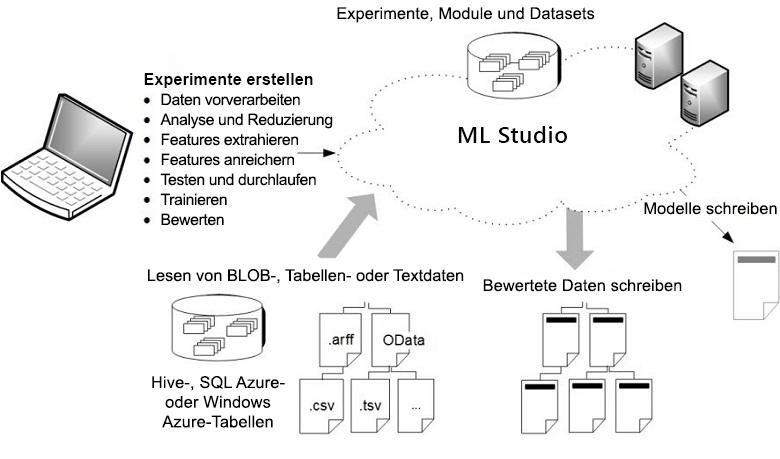

# Welche Möglichkeiten bietet Machine Learning Studio (Classic)?

**BETRIFFT:** Machine Learning Studio (Classic) [Azure Machine Learning](../compare-azure-ml-to-studio-classic.md)

[!INCLUDE [Designer notice](../../../includes/designer-notice.md)]

Machine Learning Studio (Classic) ist ein Drag & Drop-Tool, mit dem Sie Machine Learning-Modelle erstellen, testen und bereitstellen können. Bei Studio (Classic) werden Modelle als Webdienste veröffentlicht, die von benutzerdefinierten Apps oder BI-Tools wie Excel problemlos genutzt werden können.

## Der interaktive Arbeitsbereich von Studio (Classic)

Für die Entwicklung eines prädiktiven Analysemodells verwendet man typischerweise Daten aus einer oder mehreren Quellen, transformiert und analysiert diese Daten mithilfe verschiedener Datenbearbeitungen und Statistikfunktionen und generiert einen Ergebnissatz. Das Entwickeln eines solchen Modells ist ein iterativer Prozess. Sie ändern die verschiedenen Funktionen und deren Parameter, und die Ergebnisse nähern sich an, bis Sie der Ansicht sind, dass Sie ein trainiertes, effektives Modell erreicht haben.

Azure Machine Learning Studio (Classic) stellt Ihnen einen interaktiven, visuellen Arbeitsbereich zur Verfügung, in dem Sie ein Vorhersageanalysemodell ganz einfach entwickeln, testen und durchlaufen können. Dazu ziehen Sie ***Datasets*** und ***Analysemodule*** per Drag & Drop auf eine interaktive Canvas und verbinden sie zu einem ***Experiment***, das Sie dann in Machine Learning Studio (klassisch) ausführen. Für die Iteration des Modelldesigns bearbeiten Sie das Experiment, speichern ggf. eine Kopie und führen es erneut aus. Wenn Sie bereit sind, können Sie Ihr ***Trainingsexperiment*** in ein ***Vorhersageexperiment*** konvertieren und anschließend als ***Webdienst*** veröffentlichen, damit andere Benutzer auf das Modell zugreifen können.

Es ist keinerlei Programmierung erforderlich. Sie müssen lediglich Datasets und Module auf der grafischen Benutzeroberfläche miteinander verbinden, um Ihr Predictive Analytics-Modell zu erstellen.

## Herunterladen des Übersichtsdiagramms für ML Studio (Classic)
Laden Sie das **Diagramm mit der Übersicht über die Funktionen von Microsoft ML Studio (Classic)** herunter, und verschaffen Sie sich einen allgemeinen Überblick über die Funktionen von Machine Learning Studio (Classic). Drucken Sie das Diagramm in Tabloid-Größe (28 x 43 cm, 11 x 17 Zoll) aus, um schnell darauf zugreifen zu können.

**Laden Sie das Diagramm hier herunter: [Übersicht über die Funktionen von Microsoft Machine Learning Studio (Classic)](https://download.microsoft.com/download/C/4/6/C4606116-522F-428A-BE04-B6D3213E9E52/ml_studio_overview_v1.1.pdf)**

## Komponenten eines Studio-Experiments (klassisch)
Ein Experiment besteht auf Datasets, die Daten für Analysemodule bereitstellen, die Sie miteinander verbinden und so ein Vorhersagemodell konstruieren. Ein gültiges Experiment hat spezifisch folgende Eigenschaften:

* Das Experiment besteht aus mindestens einem Dataset und einem Modul.
* Datasets können nur mit Modulen verbunden sein.
* Module können entweder mit Datasets oder mit anderen Modulen verbunden sein.
* Alle Eingangsports für Module müssen eine Verbindung zum Datenfluss aufweisen.
* Alle erforderlichen Parameter der einzelnen Module müssen festgelegt sein.

Sie können ein Experiment von Grund auf neu erstellen, oder Sie können ein vorhandenes Beispielexperiment als Vorlage verwenden. Weitere Informationen finden Sie unter [Kopieren von Beispielexperimenten zum Erstellen neuer Machine Learning-Experimente](sample-experiments.md).

Ein Beispiel für die Erstellung eines Experiments finden Sie unter [Schnellstart: Erstellen Ihres ersten Data Science-Experiments in Machine Learning Studio (Classic)](create-experiment.md).

Eine ausführlichere exemplarische Vorgehensweise zum Erstellen einer Lösung für Vorhersageanalysen finden Sie unter [Tutorial 1: Vorhersagen des Kreditrisikos: Azure Machine Learning Studio (Classic)](tutorial-part1-credit-risk.md).

### Datasets
Bei einem Dataset handelt es sich um Daten, die in Machine Learning Studio (klassisch) hochgeladen wurden, damit sie für den Modellierungsprozess zur Verfügung stehen. Machine Learning Studio (klassisch) enthält eine Reihe von Beispieldatasets, mit denen Sie experimentieren können. Bei Bedarf können Sie außerdem weitere Datasets hochladen. Hier einige Beispiele der enthaltenen Datasets:

* **MPG-Daten für verschiedene Autos**: Meilen-pro-Gallone-Werte für Autos, die anhand der Anzahl von Zylindern, Motorleistung usw. aufgeführt sind.
* **Brustkrebsdaten:** diagnostische Brustkrebsdaten.
* **Waldbranddaten:** Größe von Waldbränden im nordöstlichen Portugal.

Beim Erstellen eines Experiments können Sie links neben dem Arbeitsbereich aus der Liste der Datasets auswählen.

Eine Liste der in Machine Learning Studio (Classic) enthaltenen Beispieldatasets finden Sie unter [Verwenden von Beispieldatasets in Azure Machine Learning Studio (Classic)](use-sample-datasets.md).

### Module
Ein Modul ist ein Algorithmus, den Sie auf Ihre Daten anwenden können. Machine Learning Studio (Classic) hat eine Reihe von Modulen, die von Funktionen für die Dateneinspeisung bis zu Trainings-, Bewertungs- und Überprüfungsvorgängen reichen. Hier einige Beispiele der enthaltenen Module:

* [In ARFF konvertieren:][convert-to-arff] Konvertiert ein serialisiertes .NET-Dataset in ARFF (Attribute-Relation File Format).
* [Elementare Statistiken berechnen:][elementary-statistics] Berechnet elementare Statistiken wie Mittelwert, Standardabweichung usw.
* [Lineare Regression:][linear-regression] Erstellt ein lineares Regressionsmodell, das auf einem Modell für den Onlinegradientenabstieg beruht.
* [Bewertungsmodell:][score-model] Bewertet ein trainiertes Klassifizierungs- oder Regressionsmodell.

Beim Erstellen eines Experiments können Sie links neben dem Arbeitsbereich aus der Liste der Module auswählen.

Ein Modul kann eine Reihe von Parametern haben, die Sie zum Konfigurieren der internen Algorithmen des Moduls einsetzen können. Wenn Sie ein Modul im Arbeitsbereich auswählen, werden dessen Parameter rechts neben dem Arbeitsbereich im Bereich **Eigenschaften** angezeigt. Sie können die Parameter in diesem Bereich zur Abstimmung Ihres Modells verändern.

Hilfe zur Navigation durch die umfassende Bibliothek verfügbarer Machine Learning-Algorithmen finden Sie unter [Auswählen von Algorithmen für Azure Machine Learning](algorithm-choice.md).

## Bereitstellen eines Predictive Analytics-Webdiensts
Wenn Ihr Predictive Analytics-Modell bereit ist, können Sie es als Webdienst direkt von Machine Learning Studio (klassisch) aus bereitstellen. Weitere Informationen zu diesem Verfahren finden Sie unter [Bereitstellen eines Azure Machine Learning-Webdiensts](deploy-a-machine-learning-web-service.md).

## Nächste Schritte
Die Grundlagen von Predictive Analytics und maschinellem Lernen werden anhand einer [Schritt-für-Schritt-Schnellstartanleitung](create-experiment.md) und mithilfe von [Beispielen](sample-experiments.md) vermittelt.

<!-- Module References -->
[convert-to-arff]: https://msdn.microsoft.com/library/azure/62d2cece-d832-4a7a-a0bd-f01f03af0960/
[elementary-statistics]: https://msdn.microsoft.com/library/azure/3086b8d4-c895-45ba-8aa9-34f0c944d4d3/
[linear-regression]: https://msdn.microsoft.com/library/azure/31960a6f-789b-4cf7-88d6-2e1152c0bd1a/
[score-model]: https://msdn.microsoft.com/library/azure/401b4f92-e724-4d5a-be81-d5b0ff9bdb33/
