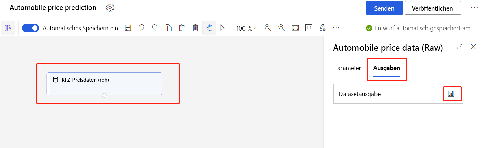
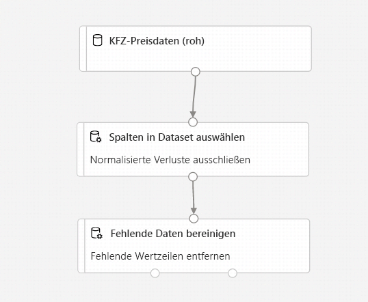
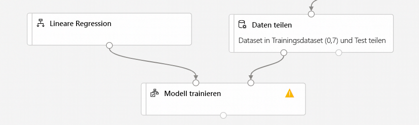
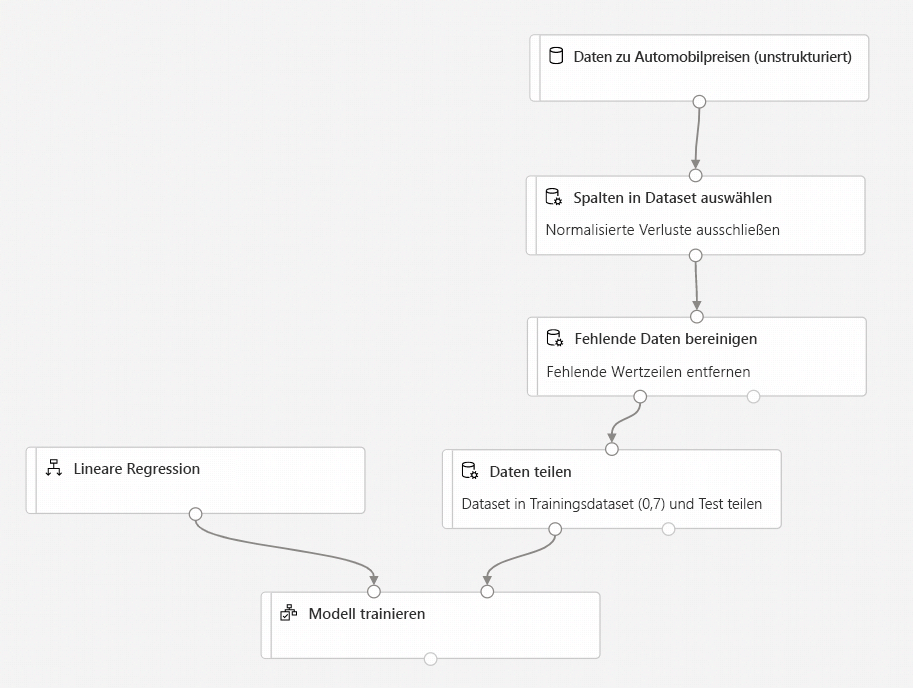
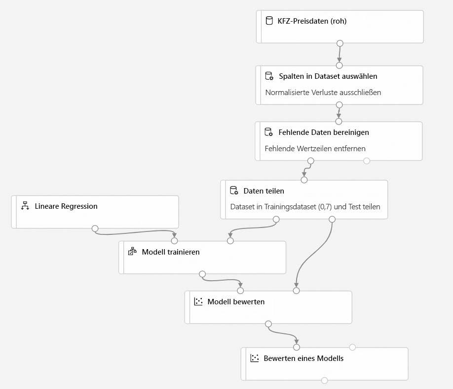
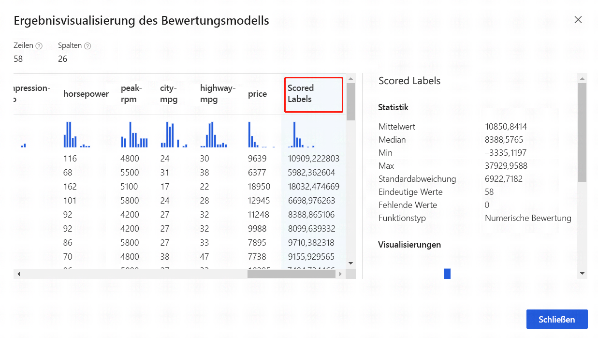

# Tutorial: Prognostizieren von Automobilpreisen mit dem Designer (Vorschau)
[!INCLUDE [applies-to-skus](../../includes/aml-applies-to-enterprise-sku.md)]

In diesem zweiteiligen Tutorial erfahren Sie, wie Sie mithilfe des Designers von Azure Machine Learning ein Machine Learning-Modell trainieren und bereitstellen, das den Preis eines beliebigen Autos prognostiziert. Bei dem Designer handelt es sich um ein Drag & Drop-Tool, mit dem Sie ganz ohne Programmieraufwand Machine Learning-Modelle erstellen können.

Im ersten Teil des Tutorials lernen Sie Folgendes:

> [!div class="checklist"]
> * Erstellen einer neuen Pipeline
> * Importieren von Daten
> * Aufbereiten von Daten
> * Trainieren eines Machine Learning-Modells
> * Auswerten eines Machine Learning-Modells

Im [zweiten Teil](tutorial-designer-automobile-price-deploy.md) des Tutorials stellen Sie Ihr Modell als Echtzeit-Rückschlussendpunkt bereit, um damit den Preis eines beliebigen Autos basierend auf den von Ihnen an die Lösung gesendeten technischen Spezifikationen zu prognostizieren. 

> [!NOTE]
>Eine fertige Version dieses Tutorials ist als Beispielpipeline verfügbar.
>
>Diese finden Sie im Designer in Ihrem Arbeitsbereich. Wählen Sie im Abschnitt **Neue Pipeline** die Option **Sample 1 - Regression: Automobile Price Prediction(Basic)** (Beispiel 1: Regression: Automobilpreisvorhersage (Standard)) aus.

## Erstellen einer neuen Pipeline

Azure Machine Learning-Pipelines fassen mehrere Machine Learning- und Datenverarbeitungsschritte in einer einzelnen Ressource zusammen. Pipelines ermöglichen die Strukturierung, Verwaltung und Wiederverwendung komplexer Machine Learning-Workflows für verschiedene Projekte und Benutzer.

Für die Erstellung einer Azure Machine Learning-Pipeline benötigen Sie einen Azure Machine Learning-Arbeitsbereich. In diesem Abschnitt erfahren Sie, wie Sie diese beiden Ressourcen erstellen.

### Erstellen eines neuen Arbeitsbereichs

Um den Designer verwenden zu können, benötigen Sie zunächst einen Azure Machine Learning-Arbeitsbereich. Der Arbeitsbereich ist die Ressource der obersten Ebene für Azure Machine Learning und bietet einen zentralen Ort für die Arbeit mit allen Artefakten, die Sie in Azure Machine Learning erstellen.

Wenn Sie über einen Azure Machine Learning-Arbeitsbereich mit einer Enterprise Edition verfügen, können Sie [mit dem nächsten Abschnitt fortfahren](#create-the-pipeline).

[!INCLUDE [aml-create-portal](../../includes/aml-create-in-portal-enterprise.md)]

### Erstellen der Pipeline

1. Melden Sie sich bei <a href="https://ml.azure.com?tabs=jre" target="_blank">ml.azure.com</a> an, und wählen Sie den gewünschten Arbeitsbereich aus.

1. Wählen Sie **Designer** aus.

    

1. Wählen Sie **Easy-to-use prebuilt modules** (Benutzerfreundliche vorgefertigte Module) aus.

1. Wählen Sie im oberen Bereich der Canvas den Standardpipelinenamen **Pipeline-Created-on** aus. Ändern Sie den Namen in *Automobile price prediction* (Automobilpreisvorhersage). Der Name muss nicht eindeutig sein.

## Festlegen des Standardcomputeziels

Ein Pipeline wird auf einem Computeziel ausgeführt. Dabei handelt es sich um eine an Ihren Arbeitsbereich angefügte Computeressource. Nachdem Sie ein Computeziel erstellt haben, können Sie es für künftige Ausführungen wiederverwenden.

Sie können ein **Standardcomputeziel** für die gesamte Pipeline festlegen, wodurch jedes Modul standardmäßig das gleiche Computeziel verwendet. Sie können aber auch modulspezifische Computeziele angeben.

1. Wählen Sie im oberen Bereich der Canvas neben dem Namen der Pipeline das **Zahnradsymbol**  aus, um den Bereich **Einstellungen** zu öffnen.

1. Wählen Sie rechts neben der Canvas im Bereich **Einstellungen** die Option **Computeziel auswählen** aus.

    Falls Sie bereits über ein verfügbares Computeziel verfügen, können Sie es auswählen, um diese Pipeline auszuführen.

    > [!NOTE]
    > Im Designer können nur Experimente für Azure Machine Learning Compute-Ziele ausgeführt werden. Andere Computeziele werden nicht angezeigt.

1. Geben Sie einen Namen für die Computeressource ein.

1. Wählen Sie **Speichern** aus.

    > [!NOTE]
    > Die Erstellung einer Computeressource dauert etwa fünf Minuten. Nach der Erstellung der Ressource können Sie sie wiederverwenden und diese Wartezeit in künftigen Ausführungen vermeiden.
    >
    > Eine im Leerlauf befindliche Computeressource wird automatisch auf 0 Knoten skaliert, um Kosten zu sparen. Wenn Sie sie nach einer Verzögerung erneut verwenden, müssen Sie unter Umständen etwa fünf Minuten warten, bis sie wieder hochskaliert wurde.

## Daten importieren

Im Designer stehen mehrere Beispieldatasets zur Verfügung, mit denen Sie experimentieren können. Verwenden Sie für dieses Tutorial **Automobile Price Data (Raw)** (Automobilpreisdaten (Rohdaten)). 

1. Links neben der Pipelinecanvas befindet sich eine Palette mit Datasets und Modulen. Wählen Sie **Datasets** aus, und sehen Sie sich die verfügbaren Beispieldatasets im Abschnitt **Beispiele** an.

1. Wählen Sie das Dataset **Automobile Price Data (Raw)** (Automobilpreisdaten (Rohdaten)) aus, und ziehen Sie es auf die Canvas.

   

### Visualisieren der Daten

Sie können die Daten visualisieren, um sich mit dem zu verwendenden Dataset vertraut zu machen.

1. Wählen Sie das Modul **Automobile price data (Raw)** (Automobilpreisdaten (Rohdaten)) aus.

1. Wählen Sie rechts neben der Canvas im Bereich mit den Moduldetails die Option **Ausgaben und Protokolle** aus.

1. Wählen Sie das Diagrammsymbol aus, um die Daten zu visualisieren.

    

1. Wählen Sie die verschiedenen Spalten im Datenfenster aus, um Informationen zur jeweiligen Spalte zu erhalten.

    Jede Zeile steht für ein Fahrzeug, und die Variablen, die den einzelnen Fahrzeugen zugeordnet sind, werden als Spalten angezeigt. Es gibt 205 Zeilen und 26 Spalten in diesem Dataset.

## Vorbereiten von Daten

Für Datasets ist vor der Analyse in der Regel eine Vorverarbeitung erforderlich. Bei der Untersuchung des Datasets sind Ihnen unter Umständen einige fehlende Werte aufgefallen. Damit das Modell die Daten korrekt analysieren kann, müssen diese fehlenden Werte bereinigt werden.

### Entfernen einer Spalte

Wenn Sie ein Modell trainieren, müssen Sie etwas gegen fehlende Daten tun. In diesem Dataset fehlen in der Spalte **normalized-losses** zahlreiche Werte. Daher schließen wir diese Spalte ganz aus dem Modell aus.

1. Erweitern Sie in der Modulpalette auf der linken Seite der Canvas den Abschnitt **Datentransformation**, und suchen Sie nach dem Modul **Select Columns in Dataset** (Spalten im Dataset auswählen).

1. Ziehen Sie das Modul **Select Columns in Dataset** (Spalten im Dataset auswählen) auf die Canvas. Legen Sie das Modul unter dem Datasetmodul ab.

1. Verbinden Sie das Dataset **Automobile price data (Raw)** (Automobilpreisdaten (Rohdaten)) mit dem Modul **Select Columns in Dataset** (Spalten in Dataset auswählen). Ziehen Sie eine Linie vom Ausgabeport des Datasets zum Eingabeport von **Select Columns in Dataset** (Spalten im Dataset auswählen) – also von dem kleinen Kreis am unteren Rand des Datasets auf der Canvas zu dem kleinen Kreis am oberen Rand des Moduls.

    > [!TIP]
    > Um einen Datenfluss für Ihre Pipeline zu erstellen, verbinden Sie den Ausgabeport eines Moduls mit dem Eingabeport eines anderen Moduls.
    >

    

1. Wählen Sie das Modul **Select Columns in Dataset** aus.

1. Wählen Sie rechts neben der Canvas im Bereich mit den Moduldetails die Option **Spalte bearbeiten** aus.

1. Erweitern Sie neben **Einschließen** die Dropdownliste **Spaltennamen**, und wählen Sie **Alle Spalten** aus.

1. Wählen Sie **+** aus, um eine neue Regel hinzuzufügen.

1. Wählen Sie in den Dropdownmenüs die Optionen **Ausschließen** und **Spaltennamen** aus.
    
1. Geben Sie *normalized-losses* in das Textfeld ein.

1. Wählen Sie rechts unten **Speichern** aus, um die Spaltenauswahl zu schließen.

    

1. Wählen Sie das Modul **Select Columns in Dataset** aus. 

1. Wählen Sie rechts neben der Canvas im Bereich mit den Moduldetails das Textfeld **Kommentar** aus, und geben Sie *Exclude normalized losses* (Normalisierte Verluste ausschließen) ein.

    Kommentare werden im Diagramm angezeigt, um Sie bei der Strukturierung Ihrer Pipeline zu unterstützen.

### Fehlende Daten bereinigen

Auch nach dem Entfernen der Spalte **normalized-losses** weist Ihr Dataset noch fehlende Werte auf. Die restlichen fehlenden Daten können mithilfe des Moduls **Clean Missing Data** (Fehlende Daten bereinigen) entfernt werden.

> [!TIP]
> Die Bereinigung fehlender Werte in den Eingabedaten wird bei den meisten Modulen im Designer vorausgesetzt.

1. Erweitern Sie in der Modulpalette auf der linken Seite der Canvas den Abschnitt **Datentransformation**, und suchen Sie nach dem Modul **Clean Missing Data** (Fehlende Daten bereinigen).

1. Ziehen Sie das Modul **Clean Missing Data** (Fehlende Daten bereinigen) auf die Pipelinecanvas. Verbinden Sie es mit dem Modul **Select Columns in Dataset** (Spalten im Dataset auswählen). 

1. Wählen Sie das Modul **Clean Missing Data** (Fehlende Daten bereinigen) aus.

1. Wählen Sie rechts neben der Canvas im Bereich mit den Moduldetails die Option **Spalte bearbeiten** aus.

1. Erweitern Sie im angezeigten Fenster **Columns to be cleaned** (Zu bereinigende Spalten) das Dropdownmenü neben **Einschließen**. Wählen Sie **Alle Spalten** aus.

1. Wählen Sie **Speichern** aus.

1. Wählen Sie rechts neben der Canvas im Bereich mit den Moduldetails unter **Cleaning mode** (Bereinigungsmodus) die Option **Remove entire row** (Gesamte Zeile entfernen) aus.

1. Wählen Sie rechts neben der Canvas im Bereich mit den Moduldetails das Textfeld **Kommentar** aus, und geben Sie *Remove missing value rows* (Zeilen mit fehlenden Werten entfernen) ein. 

    Ihre Pipeline sollte nun in etwa wie folgt aussehen:
    
    

## Trainieren eines Machine Learning-Modells

Nachdem Sie nun über die Module für die Datenverarbeitung verfügen, können Sie die Trainingsmodule einrichten.

Da Sie einen Preis (also eine Zahl) vorhersagen möchten, können Sie einen Regressionsalgorithmus verwenden. In diesem Beispiel verwenden Sie ein lineares Regressionsmodell.

### Teilen der Daten

Das Aufteilen von Daten ist eine gängige Aufgabe beim maschinellen Lernen. Ihre Daten werden in zwei separate Datasets aufgeteilt: eins zum Trainieren des Modells und eins zum Testen der Ergebnisqualität des Modells.

1. Erweitern Sie in der Modulpalette den Abschnitt **Datentransformation**, und suchen Sie nach dem Modul **Split Data** (Daten aufteilen).

1. Ziehen Sie das Modul **Split Data** (Daten aufteilen) auf die Pipelinecanvas.

1. Verbinden Sie den linken Port des Moduls **Clean Missing Data** (Fehlende Daten bereinigen) mit dem Modul **Split Data** (Daten aufteilen).

    > [!IMPORTANT]
    > Achten Sie darauf, dass der linke Ausgabeport von **Clean Missing Data** (Fehlende Daten bereinigen) mit **Split Data** (Daten aufteilen) verbunden ist. Der linke Port enthält die bereinigten Daten. Der rechte Port enthält die verworfenen Daten.

1. Wählen Sie das Modul **Split Data** (Daten aufteilen) aus.

1. Legen Sie rechts neben der Canvas im Bereich mit den Moduldetails die Option **Fraction of rows in the first output dataset** (Anteil der Zeilen im ersten Ausgabedataset) auf „0,7“ fest.

    Mit dieser Option werden 70 Prozent der Daten zum Trainieren des Modells und 30 Prozent zum Testen verwendet. Auf das Dataset mit den 70 Prozent kann über den linken Ausgabeport zugegriffen werden. Die restlichen Daten sind über den rechten Ausgabeport verfügbar.

1. Wählen Sie rechts neben der Canvas im Bereich mit den Moduldetails das Textfeld **Kommentar** aus, und geben Sie *Split the dataset into training set (0.7) and test set (0.3)* (Dataset in Trainingssatz (0,7) und Testsatz (0,3) unterteilen) ein.

### Trainieren des Modells

Trainieren Sie das Modell, indem Sie ein Dataset mit Preis bereitstellen. Durch den Algorithmus wird ein Modell erstellt, das die Beziehung zwischen den Features und dem Preis aus den Trainingsdaten erklärt.

1. Erweitern Sie in der Modulpalette den Abschnitt **Machine Learning-Algorithmen**.
    
    Mit dieser Option werden verschiedene Kategorien von Modulen angezeigt, die Sie zur Initialisierung von Lernalgorithmen verwenden können.

1. Wählen Sie **Regression** > **Linear Regression** (Lineare Regression) aus, und ziehen Sie sie auf die Pipelinecanvas.

1. Verbinden Sie die Ausgabe des Moduls **Linear Regression** (Lineare Regression) mit der linken Eingabe des Moduls **Train Model** (Modell trainieren).

1. Erweitern Sie in der Modulpalette den Abschnitt **Module training** (Modultraining), und ziehen Sie das Modul **Train Model** (Modell trainieren) auf die Canvas.

1. Wählen Sie das Modul **Train Model** (Modell trainieren) aus, und ziehen Sie es auf die Pipelinecanvas.

1. Verbinden Sie die Trainingsdatenausgabe (linker Port) des Moduls **Split Data** (Daten aufteilen) mit der rechten Eingabe des Moduls **Train Model** (Modell trainieren).
    
    > [!IMPORTANT]
    > Achten Sie darauf, dass der linke Ausgabeport von **Split Data** (Daten aufteilen) mit **Train Model** (Modell trainieren) verbunden ist. Der linke Port enthält den Trainingssatz. Der rechte Port enthält den Testsatz.

    

1. Wählen Sie das Modul **Train Model** (Modell trainieren) aus.

1. Wählen Sie rechts neben der Canvas im Bereich mit den Moduldetails den Selektor **Spalte bearbeiten** aus.

1. Erweitern Sie im Dialogfeld **Bezeichnungsspalte** das Dropdownmenü, und wählen Sie **Spaltennamen** aus. 

1. Geben Sie *price* (Preis) in das Textfeld ein, um den Wert anzugeben, der von Ihrem Modell prognostiziert wird.

    >[!IMPORTANT]
    > Achten Sie darauf, dass Sie den Spaltennamen genau eingeben. Schreiben Sie **price** nicht groß. 

    Ihre Pipeline sollte wie folgt aussehen:

    

### Hinzufügen des Moduls „Score Model“ (Modell bewerten)

Nachdem Sie das Modell mit 70 Prozent der Daten trainiert haben, können Sie unter Verwendung der restlichen 30 Prozent bewerten, wie gut das Modell funktioniert.

1. Geben Sie im Suchfeld den Begriff *score model* ein, um nach dem Modul **Score Model** (Bewertungsmodell) zu suchen. Ziehen Sie das Modul auf die Pipelinecanvas. 

1. Verbinden Sie die Ausgabe des Moduls **Train Model** mit dem linken Eingabeport des Moduls **Score Model**. Verbinden Sie die Testdatenausgabe (den rechten Port) des Moduls **Split Data** mit dem rechten Eingabeport des Moduls **Score Model**.

### Hinzufügen des Moduls „Evaluate Model“

Verwenden Sie das Modul **Evaluate Model** (Modell auswerten), um auszuwerten, wie gut das Testdataset von Ihrem Modell bewertet wurde.

1. Geben Sie im Suchfeld den Begriff *evaluate* ein, um nach dem Modul **Evaluate Model** (Modell auswerten) zu suchen. Ziehen Sie das Modul auf die Pipelinecanvas. 

1. Verbinden Sie die Ausgabe des Moduls **Score Model** mit der linken Eingabe des Moduls **Evaluate Model**. 

    Die fertige Pipeline sollte in etwa wie folgt aussehen:

    

## Übermitteln der Pipeline

Nachdem die Einrichtung Ihrer Pipeline jetzt abgeschlossen ist, können Sie eine Pipelineausführung übermitteln, um Ihr Machine Learning-Modell zu trainieren. Sie können jederzeit eine gültige Pipelineausführung übermitteln, mit der während der Entwicklung Änderungen an ihrer Pipeline überprüft werden können.

1. Wählen Sie im oberen Bereich der Canvas die Option **Senden** aus.

1. Wählen Sie im Dialogfeld **Pipelineausführung einrichten** die Option **Neu erstellen** aus.

    > [!NOTE]
    > Experimente fassen ähnliche Pipelineausführungen in einer Gruppe zusammen. Wenn Sie eine Pipeline mehrmals ausführen, können Sie für weitere Ausführungen das gleiche Experiment auswählen.

    1. Geben Sie unter **Neuer Experimentname** einen aussagekräftigen Namen ein.

    1. Klicken Sie auf **Submit** (Senden).
    
    Ausführungsstatus und Details können rechts oben auf der Canvas angezeigt werden.
    
    Handelt es sich um die erste Ausführung, kann die vollständige Ausführung der Pipeline bis zu 20 Minuten dauern. In den Standardcomputeeinstellungen ist eine minimale Knotengröße von 0 festgelegt. Das bedeutet, dass der Designer Ressourcen nach dem Leerlauf zuordnen muss. Wiederholte Pipelineausführungen werden schneller abgeschlossen, da die Computeressourcen bereits zugeordnet sind. Außerdem verwendet der Designer für jedes Modul zwischengespeicherte Ergebnisse, um die Effizienz weiter zu steigern.

### Anzeigen bewerteter Bezeichnungen

Nach Abschluss der Ausführung können Sie sich die Ergebnisse ansehen. Sehen Sie sich zuerst die vom Regressionsmodell generierten Vorhersagen an.

1. Wählen Sie das Modul **Score Model** (Modell bewerten) aus, um dessen Ausgabe anzuzeigen.

1. Wählen Sie rechts neben der Canvas im Bereich mit den Moduldetails **Ausgaben und Protokolle** > Diagrammsymbol  aus, um die Ergebnisse anzuzeigen.

    Hier sehen Sie die vorhergesagten Preise und die tatsächlichen Preise aus den Testdaten.

    

### Auswerten von Modellen

Verwenden Sie das Modul **Evaluate Model** (Modell auswerten), um zu prüfen, wie gut das trainierte Modell beim Testdataset abgeschnitten hat.

1. Wählen Sie das Modul **Evaluate Model** (Modell auswerten) aus, um dessen Ausgabe anzuzeigen.

1. Wählen Sie rechts neben der Canvas im Bereich mit den Moduldetails **Ausgaben und Protokolle** > Diagrammsymbol  aus, um die Ergebnisse anzuzeigen.

Die folgenden Statistiken werden für Ihr Modell angezeigt:

* **Mean Absolute Error (MAE)** (Mittlerer absoluter Fehler): Der Mittelwert der absoluten Fehler. Ein Fehler ist die Differenz zwischen dem prognostizierten und dem tatsächlichen Wert.
* **Root Mean Squared Error (RMSE)** (Wurzel des mittleren quadratischen Fehlers): Die Quadratwurzel des Durchschnitts des Quadrats der Prognosefehler für das Testdataset.
* **Relative Absolute Error**: Der Mittelwert der absoluten Fehler relativ zur absoluten Differenz zwischen tatsächlichen Werten und dem Durchschnitt aller tatsächlichen Werte.
* **Relative Squared Error**: Der Durchschnitt der quadrierten Fehler relativ zur quadrierten Differenz zwischen tatsächlichen Werten und dem Durchschnitt aller tatsächlichen Werte.
* **Coefficient of Determination**: Dieser auch als „R-Quadrat“ bezeichnete Wert ist eine statistische Kenngröße, die angibt, wie gut ein Modell zu den Daten passt.

Für jede Fehlerstatistik sind kleinere Werte besser. Ein kleinerer Wert gibt an, dass die Vorhersagen näher bei den tatsächlichen Werten liegen. Für den Bestimmungskoeffizienten gilt Folgendes: Je näher der Bestimmungskoeffizient am Wert eins (1,0) liegt, desto besser die Vorhersage.

## Bereinigen von Ressourcen

Überspringen Sie diesen Abschnitt, wenn Sie mit dem zweiten Teil des Tutorials ([Bereitstellen eines Machine Learning-Modells mit dem Designer](tutorial-designer-automobile-price-deploy.md)) fortfahren möchten.

[!INCLUDE [aml-ui-cleanup](../../includes/aml-ui-cleanup.md)]

## Nächste Schritte

Im zweiten Teil erfahren Sie, wie Sie Ihr Modell als Echtzeitendpunkt bereitstellen.

> [!div class="nextstepaction"]
> [Mit dem Bereitstellen von Modellen fortfahren](tutorial-designer-automobile-price-deploy.md)
