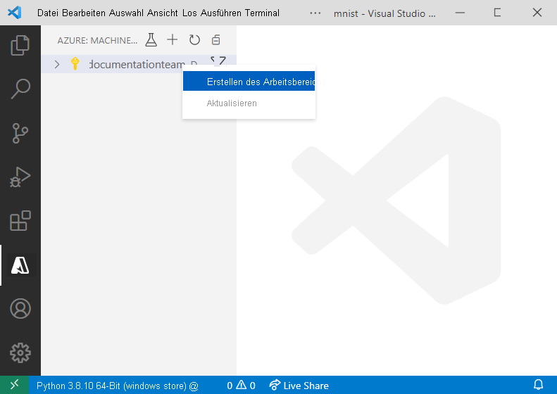
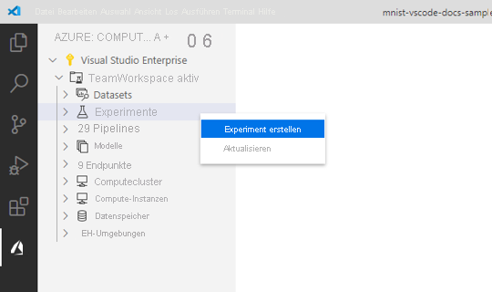
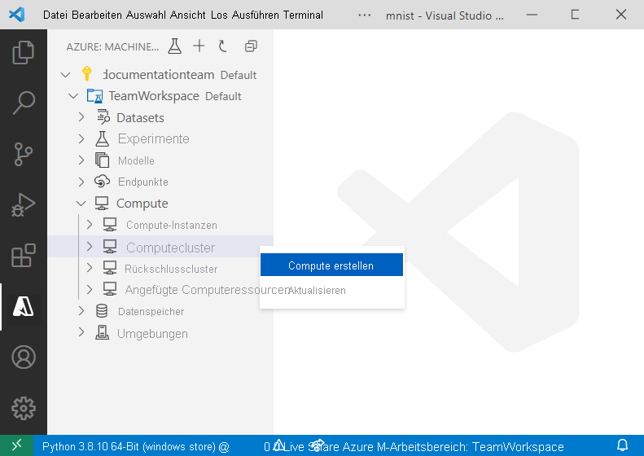
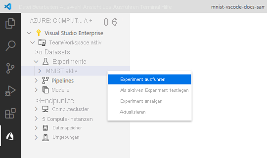
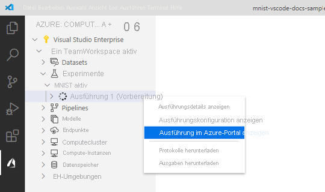
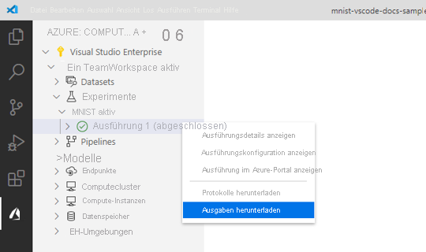
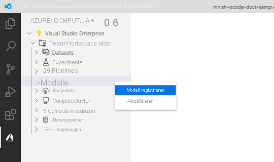

# <a name="train-and-deploy-an-image-classification-tensorflow-model-using-the-azure-machine-learning-visual-studio-code-extension-preview"></a>Trainieren und Bereitstellen eines TensorFlow-Modells für die Bildklassifizierung mit der Azure Machine Learning-Erweiterung für Visual Studio Code (Vorschauversion)

Hier erfahren Sie, wie Sie mit TensorFlow und der Azure Machine Learning-Erweiterung für Visual Studio Code ein Bildklassifizierungsmodell für die Erkennung handgeschriebener Ziffern trainieren und bereitstellen.

In diesem Tutorial lernen Sie Folgendes:

> [!div class="checklist"]
> * Grundlegendes zum Code
> * Erstellen eines Arbeitsbereichs
> * Erstellen eines Experiments
> * Konfigurieren von Computezielen
> * Ausführen einer Konfigurationsdatei
> * Trainieren eines Modells
> * Registrieren eines Modells
> * Bereitstellen eines Modells

## <a name="prerequisites"></a>Voraussetzungen

- Azure-Abonnement. Wenn Sie keins besitzen, können Sie sich für die [kostenlose oder kostenpflichtige Version von Azure Machine Learning](https://aka.ms/AMLFree) registrieren.
- Installieren Sie [Visual Studio Code](https://code.visualstudio.com/docs/setup/setup-overview). Hierbei handelt es sich um einen einfachen plattformübergreifenden Code-Editor.
- Azure Machine Learning Studio-Erweiterung für Visual Studio Code. Eine Installationsanleitung finden Sie im Tutorial [Einrichten der Azure Machine Learning-Erweiterung für Visual Studio Code](./tutorial-setup-vscode-extension.md).

## <a name="understand-the-code"></a>Grundlegendes zum Code

Der Code für dieses Tutorial verwendet TensorFlow zum Trainieren eines Machine Learning-Modells für die Bildklassifizierung, das handgeschriebene Ziffern von 0 bis 9 kategorisiert. Dazu wird ein neuronales Netzwerk erstellt, das die Pixelwerte eines Bilds mit 28 px × 28 px als Eingabe verwendet und eine Liste mit zehn Wahrscheinlichkeiten ausgibt, eine für jede der zu klassifizierenden Ziffern. Im Folgenden finden Sie ein Beispiel dafür, wie diese Daten aussehen:  


Rufen Sie den Code für dieses Tutorial ab, indem Sie das [Repository mit den VS Code Tools für KI](https://github.com/microsoft/vscode-tools-for-ai/archive/master.zip) herunterladen und an einem beliebigen Speicherort auf Ihrem Computer entpacken.

## <a name="create-a-workspace"></a>Erstellen eines Arbeitsbereichs

Als Erstes müssen Sie einen Arbeitsbereich erstellen, damit Sie eine Anwendung in Azure Machine Learning erstellen können. Ein Arbeitsbereich enthält die Ressourcen zum Trainieren von Modellen sowie die trainierten Modelle selbst. Weitere Informationen finden Sie unter [Was ist ein Arbeitsbereich?](./concept-workspace.md). 

1. Wählen Sie auf der Aktivitätsleiste von Visual Studio Code das **Azure**-Symbol aus, um die Azure Machine Learning-Ansicht zu öffnen.
1. Klicken Sie mit der rechten Maustaste auf Ihr Azure-Abonnement, und wählen Sie **Arbeitsbereich erstellen** aus. 
    
    > [!div class="mx-imgBorder"]
    > 

1. Standardmäßig wird ein Name mit dem Datum und der Uhrzeit der Erstellung generiert. Ändern Sie im Texteingabefeld den Namen in **TeamWorkspace**, und drücken Sie die EINGABETASTE.
1. Wählen Sie **Eine neue Ressourcengruppe erstellen** aus. 
1. Nennen Sie Ihre Ressourcengruppe **TeamWorkspace-rg**, und drücken Sie die EINGABETASTE. 
1. Wählen Sie einen Standort für Ihren Arbeitsbereich aus. Wählen Sie am besten einen Standort aus, der dem Standort, an dem Sie Ihr Modell bereitstellen möchten, am nächsten gelegen ist. Beispiel: „USA, Westen 2“.
1. Wenn Sie aufgefordert werden, den Typ des Arbeitsbereichs auszuwählen, wählen Sie **Einfach** aus.

Jetzt wird eine Anforderung an Azure zum Erstellen eines neuen Arbeitsbereichs in Ihrem Konto gesendet. Nach einigen Minuten wird der neue Arbeitsbereich in Ihrem Abonnementknoten angezeigt. 

## <a name="create-an-experiment"></a>Erstellen eines Experiments

In Ihrem Arbeitsbereich können Experimente erstellt werden, um einzelne Modelltrainingsausführungen zu verfolgen und zu analysieren. Ausführungen können in der Azure-Cloud oder auf Ihrem lokalen Computer erfolgen.

1. Wählen Sie auf der Aktivitätsleiste von Visual Studio Code das **Azure**-Symbol aus. Die Azure Machine Learning-Ansicht wird angezeigt.
1. Erweitern Sie Ihren Abonnementknoten.
1. Erweitern Sie den Knoten **TeamWorkspace**. 
1. Klicken Sie mit der rechten Maustaste auf den Knoten **Experimente**.
1. Wählen Sie im Kontextmenü **Create Experiment** (Experiment erstellen) aus.

    > [!div class="mx-imgBorder"]
    > 

1. Nennen Sie Ihr Experiment **MNIST**, und drücken Sie die EINGABETASTE, um das neue Experiment zu erstellen. 

Wie bei Arbeitsbereichen wird eine Anforderung an Azure gesendet, um ein Experiment mit den bereitgestellten Konfigurationen zu erstellen. Nach einigen Minuten wird das neue Experiment im Knoten *Experimente* Ihres Arbeitsbereichs angezeigt. 

## <a name="configure-compute-targets"></a>Konfigurieren von Computezielen

Ein Computeziel ist die Computeressource oder Umgebung, in der Sie Skripts ausführen und trainierte Modelle bereitstellen. Weitere Informationen finden Sie in der Dokumentation zu [Azure Machine Learning-Computezielen](./concept-compute-target.md).

Erstellen eines Computeziels:

1. Wählen Sie auf der Aktivitätsleiste von Visual Studio Code das **Azure**-Symbol aus. Die Azure Machine Learning-Ansicht wird angezeigt. 
1. Erweitern Sie Ihren Abonnementknoten. 
1. Erweitern Sie den Knoten **TeamWorkspace**. 
1. Klicken Sie unter dem Arbeitsbereichsknoten mit der rechten Maustaste auf den Knoten **Computecluster**, und wählen Sie **Create Compute** (Compute erstellen) aus. 

    > [!div class="mx-imgBorder"]
    > 

1. Wählen Sie **Azure Machine Learning Compute (AmlCompute)** aus. Azure Machine Learning Compute ist eine verwaltete Computeinfrastruktur, die Benutzern das einfache Erstellen von Computezielen mit einem oder mehreren Knoten ermöglicht, die Sie gemeinsam mit anderen Benutzern in Ihrem Arbeitsbereich verwenden können.
1. Wählen Sie eine VM-Größe aus. Wählen Sie in der Optionenliste **Standard_F2s_v2** aus. Die Größe Ihrer VM wirkt sich auf die Zeitspanne aus, die zum Trainieren der Modelle erforderlich ist. Weitere Informationen zu VM-Größen finden Sie unter [Größen für virtuelle Linux-Computer in Azure](../virtual-machines/sizes.md).
1. Nennen Sie Ihr Computeziel **TeamWkspc-com**, und drücken Sie die EINGABETASTE, um Ihr Computeziel zu erstellen.

    In VS Code wird eine Datei geöffnet, deren Inhalt dem folgenden ähnelt:

    ```json
    {
        "location": "westus2",
        "tags": {},
        "properties": {
            "computeType": "AmlCompute",
            "description": "",
            "properties": {
                "vmSize": "Standard_F2s_v2",
                "vmPriority": "dedicated",
                "scaleSettings": {
                    "maxNodeCount": 4,
                    "minNodeCount": 0,
                    "nodeIdleTimeBeforeScaleDown": "PT120S"
                }
            }
        }
    }
    ```

1. Wenn Sie mit der Konfiguration zufrieden sind, öffnen Sie die Befehlspalette, indem Sie **Ansicht > Befehlspalette** auswählen.
1. Geben Sie in der Befehlspalette den folgenden Befehl ein, um die Konfigurationsdatei der Laufzeit zu speichern:

    ```text
    Azure ML: Save and Continue
    ```

Nach einigen Minuten wird das neue Computeziel im Knoten *Computecluster* Ihres Arbeitsbereichs angezeigt.

## <a name="create-a-run-configuration"></a>Erstellen einer Laufzeitkonfiguration

Wenn Sie eine Trainingsausführung an ein Computeziel übermitteln, übermitteln Sie auch die Konfiguration, die zum Ausführen des Trainingsauftrags erforderlich ist. Dazu zählt beispielsweise das Skript, das den Trainingscode und die Python-Abhängigkeiten enthält, die zum Ausführen erforderlich sind.

So erstellen Sie eine Laufzeitkonfiguration:

1. Wählen Sie auf der Aktivitätsleiste von Visual Studio Code das **Azure**-Symbol aus. Die Azure Machine Learning-Ansicht wird angezeigt. 
1. Erweitern Sie Ihren Abonnementknoten. 
1. Erweitern Sie den Knoten **TeamWorkspace > Computecluster**. 
1. Klicken Sie unter dem Knoten „Compute“ mit der rechten Maustaste auf den Computeknoten **TeamWkspc-com**, und wählen Sie **Laufzeitkonfiguration erstellen** aus.

    > [!div class="mx-imgBorder"]
    > 

1. Nennen Sie Ihre Laufzeitkonfiguration **MNIST-rc**, und drücken Sie die EINGABETASTE, um Ihre Laufzeitkonfiguration zu erstellen.
1. Wählen Sie danach **Neue Azure ML-Umgebung erstellen** aus. Umgebungen definieren die Abhängigkeiten, die zur Ausführung Ihrer Skripts erforderlich sind.
1. Nennen Sie Ihre Umgebung „MNIST-env“, und drücken Sie die **EINGABETASTE**.
1. Wählen Sie die **Conda-Abhängigkeitsdatei** aus der Liste aus.
1. Drücken Sie die **EINGABETASTE**, um die Conda-Abhängigkeitsdatei zu durchsuchen. In diesem Fall ist die Abhängigkeitsdatei die Datei `env.yml` im Verzeichnis `vscode-tools-for-ai/mnist-vscode-docs-sample`.

    In VS Code wird eine Datei geöffnet, deren Inhalt dem folgenden ähnelt:

    ```json
    {
        "name": "MNIST-env",
        "version": "1",
        "python": {
            "interpreterPath": "python",
            "userManagedDependencies": false,
            "condaDependencies": {
                "name": "vs-code-azure-ml-tutorial",
                "channels": [
                    "defaults"
                ],
                "dependencies": [
                    "python=3.6.2",
                    "tensorflow=1.15.0",
                    "pip",
                    {
                        "pip": [
                            "azureml-defaults"
                        ]
                    }
                ]
            },
            "baseCondaEnvironment": null
        },
        "environmentVariables": {},
        "docker": {
            "baseImage": "mcr.microsoft.com/azureml/base:intelmpi2018.3-ubuntu16.04",
            "baseDockerfile": null,
            "baseImageRegistry": {
                "address": null,
                "username": null,
                "password": null
            },
            "enabled": false,
            "arguments": []
        },
        "spark": {
            "repositories": [],
            "packages": [],
            "precachePackages": true
        },
        "inferencingStackVersion": null
    }
    ```

1. Wenn Sie mit Ihrer Konfiguration zufrieden sind, speichern Sie sie, indem Sie die Befehlspalette öffnen und den folgenden Befehl eingeben:

    ```text
    Azure ML: Save and Continue
    ```

1. In diesem Beispiel wird kein in Azure Machine Learning registriertes Dataset verwendet. Stattdessen wird es bei der Ausführung von *train.py* geladen. Wenn Sie zur Erstellung eines Datenverweises für Ihre Trainingsausführung aufgefordert werden, geben Sie „n“ in der Aufforderung ein, und drücken Sie die **EINGABETASTE**.
1. Drücken Sie die **EINGABETASTE**, um die Skriptdatei für die Ausführung auf dem Computeziel zu suchen. In diesem Fall ist die Datei `train.py` im Verzeichnis `vscode-tools-for-ai/mnist-vscode-docs-sample` das Skript zum Trainieren des Modells.

    Eine Datei mit dem Namen `MNIST-rc.runconfig` wird in VS Code angezeigt, deren Inhalt dem folgenden ähnelt:

    ```json
    {
        "script": "train.py",
        "arguments": [],
        "framework": "Python",
        "communicator": "None",
        "target": "TeamWkspc-com",
        "environment": {
            "name": "MNIST-env",
            "version": "1",
            "python": {
                "interpreterPath": "python",
                "userManagedDependencies": false,
                "condaDependencies": {
                    "name": "vs-code-azure-ml-tutorial",
                    "channels": [
                        "defaults"
                    ],
                    "dependencies": [
                        "python=3.6.2",
                        "tensorflow=1.15.0",
                        "pip",
                        {
                            "pip": [
                                "azureml-defaults"
                            ]
                        }
                    ]
                },
                "baseCondaEnvironment": null
            },
            "environmentVariables": {},
            "docker": {
                "baseImage": "mcr.microsoft.com/azureml/base:intelmpi2018.3-ubuntu16.04",
                "baseDockerfile": null,
                "baseImageRegistry": {
                    "address": null,
                    "username": null,
                    "password": null
                },
                "enabled": false,
                "arguments": []
            },
            "spark": {
                "repositories": [],
                "packages": [],
                "precachePackages": true
            },
            "inferencingStackVersion": null
        },
        "history": {
            "outputCollection": true,
            "snapshotProject": false,
            "directoriesToWatch": [
                "logs"
            ]
        }
    }
    ```

1. Wenn Sie mit Ihrer Konfiguration zufrieden sind, speichern Sie sie, indem Sie die Befehlspalette öffnen und den folgenden Befehl eingeben:

    ```text
    Azure ML: Save and Continue
    ```

Die Laufzeitkonfiguration `MNIST-rc` wird unter dem Computeknoten *TeamWkspc-com* hinzugefügt, die Umgebungskonfiguration `MNIST-env` unter dem Knoten *Umgebungen*.

## <a name="train-the-model"></a>Trainieren des Modells

Während des Trainingsprozesses wird ein TensorFlow-Modell erstellt, indem die darin eingebetteten Trainingsdaten und Lernmuster für die einzelnen zu klassifizierenden Ziffern verarbeitet werden. 

So führen Sie ein Azure Machine Learning-Experiment aus

1. Wählen Sie auf der Aktivitätsleiste von Visual Studio Code das **Azure**-Symbol aus. Die Azure Machine Learning-Ansicht wird angezeigt. 
1. Erweitern Sie Ihren Abonnementknoten. 
1. Erweitern Sie den Knoten **TeamWorkspace > Experimente**. 
1. Klicken Sie mit der rechten Maustaste auf das Experiment **MNIST**.
1. Wählen Sie **Run Experiment** (Experiment ausführen) aus.

    > [!div class="mx-imgBorder"]
    > 

1. Wählen Sie in der Liste mit den Computezieloptionen das Computeziel **TeamWkspc-com** aus.
1. Wählen Sie anschließend die Laufzeitkonfiguration **MNIST-rc** aus.
1. Jetzt wird eine Anforderung zum Ausführen Ihres Experiments auf dem ausgewählten Computeziel in Ihrem Arbeitsbereich an Azure gesendet. Dieser Vorgang dauert einige Minuten. Die Zeitspanne für die Ausführung des Trainingsauftrags ist von mehreren Faktoren abhängig, wie z. B. dem Computetyp und der Größe der Trainingsdaten. Wenn Sie den Status des Experiments nachverfolgen möchten, klicken Sie mit der rechten Maustaste auf den aktuellen Ausführungsknoten, und wählen Sie **View Run in Azure portal** (Ausführung im Azure-Portal anzeigen) aus.
1. Wenn das Dialogfeld mit der Anforderung zum Öffnen einer externen Website angezeigt wird, wählen Sie **Öffnen** aus.

    > [!div class="mx-imgBorder"]
    > 

Wenn das Modell mit dem Training fertig ist, wird die Statusbezeichnung neben dem Ausführungsknoten in „Abgeschlossen“ geändert.

## <a name="register-the-model"></a>Registrieren des Modells

Nachdem Sie Ihr Modell nun trainiert haben, können Sie es in Ihrem Arbeitsbereich registrieren. 

Registrieren des Modells:

1. Wählen Sie auf der Aktivitätsleiste von Visual Studio Code das **Azure**-Symbol aus. Die Azure Machine Learning-Ansicht wird angezeigt.
1. Erweitern Sie Ihren Abonnementknoten. 
1. Erweitern Sie den Knoten **TeamWorkspace > Experimente > MNIST**.
1. Rufen Sie die Modellausgaben ab, die beim Trainieren des Modells generiert werden. Klicken Sie mit der rechten Maustaste auf den Ausführungsknoten **Run 1** (Ausführung 1), und wählen Sie **Download outputs** (Ausgaben herunterladen) aus. 

    > [!div class="mx-imgBorder"]
    > 

1. Wählen Sie das Verzeichnis aus, in dem die heruntergeladenen Ausgaben gespeichert werden sollen. Standardmäßig werden die Ausgaben in das Verzeichnis eingefügt, das momentan in Visual Studio Code geöffnet ist.
1. Klicken Sie mit der rechten Maustaste auf den Knoten **Modelle**, und wählen Sie **Modell registrieren** aus.

    > [!div class="mx-imgBorder"]
    > 

1. Nennen Sie Ihr Modell **MNIST-TensorFlow-model**, und drücken Sie die EINGABETASTE.
1. Ein TensorFlow-Modell besteht aus mehreren Dateien. Wählen Sie in der Optionenliste die Option **Model folder** (Modellordner) als Modellpfadformat aus. 
1. Wählen Sie das Verzeichnis `azureml_outputs/Run_1/outputs/outputs/model` aus.

    Eine Datei, die Ihre Modellkonfigurationen enthält, wird mit etwa folgendem Inhalt in Visual Studio Code angezeigt:

    ```json
    {
        "modelName": "MNIST-TensorFlow-model",
        "tags": {
            "": ""
        },
        "modelPath": "c:\\Dev\\vscode-tools-for-ai\\mnist-vscode-docs-sample\\azureml_outputs\\Run_1\\outputs\\outputs\\model",
        "description": ""
    }
    ```

1. Wenn Sie mit Ihrer Konfiguration zufrieden sind, speichern Sie sie, indem Sie die Befehlspalette öffnen und den folgenden Befehl eingeben:

    ```text
    Azure ML: Save and Continue
    ```

Nach einigen Minuten wird das Modell unter dem Knoten *Modelle* angezeigt.

## <a name="deploy-the-model"></a>Bereitstellen des Modells

In Visual Studio Code können Sie Ihr Modell als Webdienst für Folgendes bereitstellen:

+ Azure Container Instances (ACI)
+ Azure Kubernetes Service (AKS)

Sie müssen zum Testen nicht vorab einen ACI-Container erstellen, da ACI-Container nach Bedarf erstellt werden. AKS-Cluster müssen allerdings im Voraus konfiguriert werden. Weitere Informationen zu Bereitstellungsoptionen finden Sie unter [Bereitstellen von Modellen mit Azure Machine Learning](how-to-deploy-and-where.md).

So stellen Sie einen Webdienst als ACI bereit:

1. Wählen Sie auf der Aktivitätsleiste von Visual Studio Code das **Azure**-Symbol aus. Die Azure Machine Learning-Ansicht wird angezeigt.
1. Erweitern Sie Ihren Abonnementknoten. 
1. Erweitern Sie den Knoten **TeamWorkspace > Modelle**. 
1. Klicken Sie mit der rechten Maustaste auf **MNIST-TensorFlow-model**, und wählen Sie **Deploy Service from Registered Model** (Dienst aus registriertem Modell bereitstellen) aus.

    > [!div class="mx-imgBorder"]
    > 

1. Wählen Sie **Azure Container Instances** aus.
1. Nennen Sie Ihren Dienst **mnist-tensorflow-svc**, und drücken Sie die EINGABETASTE.
1. Wählen Sie das Skript aus, das im Container ausgeführt werden soll. Drücken Sie hierzu im Eingabefeld die **EINGABETASTE**, und navigieren Sie im Verzeichnis `mnist-vscode-docs-sample` zur Datei `score.py`.
1. Geben Sie die Abhängigkeiten an, die zum Ausführen des Skripts erforderlich sind. Drücken Sie hierzu im Eingabefeld die **EINGABETASTE**, und navigieren Sie im Verzeichnis `mnist-vscode-docs-sample` zur Datei `env.yml`.

    Eine Datei, die Ihre Modellkonfigurationen enthält, wird mit etwa folgendem Inhalt in Visual Studio Code angezeigt:

    ```json
    {
        "name": "mnist-tensorflow-svc",
        "imageConfig": {
            "runtime": "python",
            "executionScript": "score.py",
            "dockerFile": null,
            "condaFile": "env.yml",
            "dependencies": [],
            "schemaFile": null,
            "enableGpu": false,
            "description": ""
        },
        "deploymentConfig": {
            "cpu_cores": 1,
            "memory_gb": 10,
            "tags": {
                "": ""
            },
            "description": ""
        },
        "deploymentType": "ACI",
        "modelIds": [
            "MNIST-TensorFlow-model:1"
        ]
    }
    ```

1. Wenn Sie mit Ihrer Konfiguration zufrieden sind, speichern Sie sie, indem Sie die Befehlspalette öffnen und den folgenden Befehl eingeben:

    ```text
    Azure ML: Save and Continue
    ```

Jetzt wird eine Anforderung zum Bereitstellen des Webdiensts an Azure gesendet. Dieser Vorgang dauert einige Minuten. Nach der Bereitstellung wird der neue Dienst unter dem Knoten *Endpunkte* angezeigt.

## <a name="next-steps"></a>Nächste Schritte

* Eine exemplarische Vorgehensweise zum Trainieren mit Azure Machine Learning außerhalb von Visual Studio Code finden Sie in [Tutorial: Trainieren von Modellen mit Azure Machine Learning](tutorial-train-models-with-aml.md).
* Eine exemplarische Vorgehensweise zum lokalen Bearbeiten, Ausführen und Debuggen von Code finden Sie im [Python-Hello World-Tutorial](https://code.visualstudio.com/docs/Python/Python-tutorial).