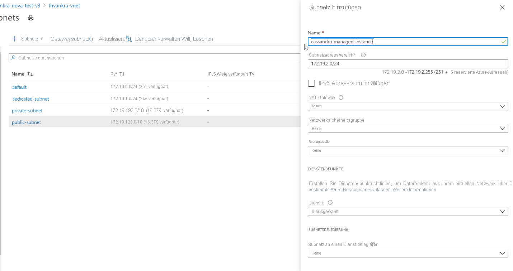

# <a name="quickstart-configure-a-hybrid-cluster-with-azure-managed-instance-for-apache-cassandra-preview"></a>Schnellstart: Konfigurieren eines Hybridclusters mit Azure Managed Instance for Apache Cassandra (Vorschauversion)

Azure Managed Instance for Apache Cassandra verfügt über automatisierte Bereitstellungs- und Skalierungsvorgänge für verwaltete Open-Source-basierte Apache Cassandra-Rechenzentren. Dieser Dienst unterstützt Sie dabei, Hybridszenarien zu beschleunigen und den Aufwand für die laufende Wartung zu verringern.

> [!IMPORTANT]
> Azure Managed Instance for Apache Cassandra befindet sich derzeit in der öffentlichen Vorschauphase.
> Diese Vorschauversion wird ohne Vereinbarung zum Servicelevel bereitgestellt und ist nicht für Produktionsworkloads vorgesehen. Manche Features werden möglicherweise nicht unterstützt oder sind nur eingeschränkt verwendbar.
> Weitere Informationen finden Sie unter [Zusätzliche Nutzungsbestimmungen für Microsoft Azure-Vorschauen](https://azure.microsoft.com/support/legal/preview-supplemental-terms/).

In dieser Schnellstartanleitung wird veranschaulicht, wie Sie die Azure CLI-Befehle zum Konfigurieren eines Hybridclusters verwenden. Wenn Sie über vorhandene Rechenzentren in einer lokalen oder selbstgehosteten Umgebung verfügen, können Sie diesem Cluster mit Azure Managed Instance for Apache Cassandra weitere Rechenzentren hinzufügen und diese verwalten.

[!INCLUDE [azure-cli-prepare-your-environment.md](../../includes/azure-cli-prepare-your-environment.md)]

* Für diesen Artikel ist die Azure CLI-Version 2.12.1 oder höher erforderlich. Wenn Sie Azure Cloud Shell verwenden, ist die neueste Version bereits installiert.

* [Azure Virtual Network](../virtual-network/virtual-networks-overview.md) mit einer Verbindung mit Ihrer selbstgehosteten bzw. lokalen Umgebung. Weitere Informationen zum Herstellen einer Verbindung für lokale Umgebungen mit Azure finden Sie im Artikel [Verbinden eines lokalen Netzwerks mit Azure](https://docs.microsoft.com/azure/architecture/reference-architectures/hybrid-networking/).

## <a name="configure-a-hybrid-cluster"></a><a id="create-account"></a>Konfigurieren eines Hybridclusters

1. Melden Sie sich beim [Azure-Portal](https://portal.azure.com/) an, und navigieren Sie zu Ihrer VNET-Ressource.

1. Öffnen Sie die Registerkarte **Subnetze**, und erstellen Sie ein neues Subnetz. Weitere Informationen zu den Feldern des Formulars **Subnetz hinzufügen** finden Sie im Artikel zu [virtuellen Netzwerken](../virtual-network/virtual-network-manage-subnet.md#add-a-subnet):

   :::image type="content" source="./media/configure-hybrid-cluster/subnet.png" alt-text="Hinzufügen eines neuen Subnetzes zu Ihrem virtuellen Netzwerk" lightbox="./media/configure-hybrid-cluster/subnet.png" border="true":::
    <!--  -->

1. Als Nächstes wenden wir über die Azure CLI einige spezielle Berechtigungen auf das VNET und das Subnetz an, die für die Cassandra Managed Instance benötigt werden. Zunächst müssen wir die `Resource ID` für Ihr vorhandenes VNET ermitteln. Kopieren Sie den von diesem Befehl ausgegebenen Wert zur späteren Verwendung. Dies ist die `Resource ID`.

   ```azurecli-interactive
    # discover the vnet id
    az network vnet show -n <your VNet name> -g <Resource Group Name> --query "id" --output tsv
   ```

1. Nun wenden wir die speziellen Berechtigungen an, indem wir die Ausgabe des vorherigen Befehls als Bereichsparameter (scope) übergeben:

   ```azurecli-interactive
    az role assignment create --assignee e5007d2c-4b13-4a74-9b6a-605d99f03501 --role 4d97b98b-1d4f-4787-a291-c67834d212e7 --scope <Resource ID>
   ```
    > [!NOTE]
    > Die obigen Werte `assignee` und `role` sind feststehende Dienstprinzipal- bzw. Rollenbezeichner. 

1. Als Nächstes konfigurieren wir Ressourcen für unseren Hybridcluster. Da Sie bereits über einen Cluster verfügen, dient der Clustername hier nur als logische Ressource zum Identifizieren des Namens Ihres vorhandenen Clusters. Achten Sie darauf, dass Sie den Namen Ihres vorhandenen Clusters verwenden, wenn Sie die Variablen `clusterName` und `clusterNameOverride` im folgenden Skript definieren.

   Darüber hinaus benötigen Sie die Startknoten, öffentlichen Clientzertifikate (falls Sie auf Ihrem Cassandra-Endpunkt einen öffentlichen/privaten Schlüssel konfiguriert haben) und Gossipzertifikate Ihres vorhandenen Clusters. Sie müssen auch die oben kopierte Ressourcen-ID verwenden, um die Variable `delegatedManagementSubnetId` zu definieren.

   ```azurecli-interactive
   resourceGroupName='MyResourceGroup'
   clusterName='cassandra-hybrid-cluster-legal-name'
   clusterNameOverride='cassandra-hybrid-cluster-illegal-name'
   location='eastus2'
   delegatedManagementSubnetId='<Resource ID>'
    
   # You can override the cluster name if the original name is not legal for an Azure resource:
   # overrideClusterName='ClusterNameIllegalForAzureResource'
   # the default cassandra version will be v3.11
    
   az managed-cassandra cluster create \
      --cluster-name $clusterName \
      --resource-group $resourceGroupName \
      --location $location \
      --delegated-management-subnet-id $delegatedManagementSubnetId \
      --external-seed-nodes 10.52.221.2,10.52.221.3,10.52.221.4
      --client-certificates 'BEGIN CERTIFICATE-----\n...PEM format..\n-----END CERTIFICATE-----','BEGIN CERTIFICATE-----\n...PEM format...\n-----END CERTIFICATE-----' \
      --external-gossip-certificates 'BEGIN CERTIFICATE-----\n...PEM format 1...\n-----END CERTIFICATE-----','BEGIN CERTIFICATE-----\n...PEM format 2...\n-----END CERTIFICATE-----'
   ```

    > [!NOTE]
    > Sie sollten wissen, wo sich Ihre vorhandenen öffentlichen bzw. Gossipzertifikate befinden. Falls Sie sich nicht sicher sind, sollten Sie `keytool -list -keystore <keystore-path> -rfc -storepass <password>` ausführen können, um die Zertifikate auszugeben. 

1. Führen Sie nach dem Erstellen der Clusterressource den folgenden Befehl aus, um die Details zur Clustereinrichtung anzuzeigen:

   ```azurecli-interactive
   resourceGroupName='MyResourceGroup'
   clusterName='cassandra-hybrid-cluster'
    
   az managed-cassandra cluster show \
       --cluster-name $clusterName \
       --resource-group $resourceGroupName \
   ```

1. Mit dem obigen Befehl werden Informationen zur Umgebung der verwalteten Instanz zurückgegeben. Sie benötigen die Gossipzertifikate für die Installation auf den Knoten in Ihrem vorhandenen Rechenzentrum. Im folgenden Screenshot ist die Ausgabe des vorherigen Befehls und das Format der Zertifikate dargestellt:

   :::image type="content" source="./media/configure-hybrid-cluster/show-cluster.png" alt-text="Abrufen der Zertifikatdetails aus dem Cluster" lightbox="./media/configure-hybrid-cluster/show-cluster.png" border="true":::
    <!--  -->

1. Erstellen Sie als Nächstes im Hybridcluster ein neues Rechenzentrum. Achten Sie darauf, dass Sie die Variablenwerte durch die Details für Ihren Cluster ersetzen:

   ```azurecli-interactive
   resourceGroupName='MyResourceGroup'
   clusterName='cassandra-hybrid-cluster'
   dataCenterName='dc1'
   dataCenterLocation='eastus2'
   delegatedSubnetId= '<Resource ID>'
    
   az managed-cassandra datacenter create \
       --resource-group $resourceGroupName \
       --cluster-name $clusterName \
       --data-center-name $dataCenterName \
       --data-center-location $dataCenterLocation \
       --delegated-subnet-id $delegatedSubnetId \
       --node-count 9 
   ```

1. Führen Sie nach Abschluss der Erstellung des neuen Rechenzentrums den Befehl „datacenter show“ aus, um die zugehörigen Details anzuzeigen:

   ```azurecli-interactive
   resourceGroupName='MyResourceGroup'
   clusterName='cassandra-hybrid-cluster'
   dataCenterName='dc1'
    
   az managed-cassandra datacenter show \
       --resource-group $resourceGroupName \
       --cluster-name $clusterName \
       --data-center-name $dataCenterName 
   ```

1. Mit dem obigen Befehl werden die Startknoten des neuen Rechenzentrums ausgegeben. Fügen Sie die Startknoten des neuen Rechenzentrums in der Datei *cassandra.yaml* der Konfiguration Ihres vorhandenen Rechenzentrums hinzu. Installieren Sie auch die Gossipzertifikate für die verwaltete Instanz, die Sie weiter oben abgerufen haben:

   :::image type="content" source="./media/configure-hybrid-cluster/show-datacenter.png" alt-text="Abrufen der Details zum Rechenzentrum" lightbox="./media/configure-hybrid-cluster/show-datacenter.png" border="true":::
    <!--  -->

    > [!NOTE]
    > Falls Sie weitere Rechenzentren hinzufügen möchten, können Sie die obigen Schritte wiederholen, aber Sie benötigen hierfür nur die Startknoten. 

1. Verwenden Sie abschließend die folgende CQL-Abfrage, um die Replikationsstrategie in den einzelnen Keyspaces so zu aktualisieren, dass alle Rechenzentren des gesamten Clusters eingebunden sind:

   ```bash
   ALTER KEYSPACE "ks" WITH REPLICATION = {'class': 'NetworkTopologyStrategy', ‘on-premise-dc': 3, ‘managed-instance-dc': 3};
   ```
   Darüber hinaus müssen Sie auch die Kennworttabellen aktualisieren:

   ```bash
    ALTER KEYSPACE "system_auth" WITH REPLICATION = {'class': 'NetworkTopologyStrategy', ‘on-premise-dc': 3, ‘managed-instance-dc': 3}
   ```

## <a name="clean-up-resources"></a>Bereinigen von Ressourcen

Falls Sie diesen Managed Instance-Cluster nicht weiterverwenden möchten, sollten Sie ihn wie folgt löschen:

1. Wählen Sie im linken Menü des Azure-Portals die Option **Ressourcengruppen** aus.
1. Wählen Sie in der Liste die Ressourcengruppe aus, die Sie für diesen Schnellstart erstellt haben.
1. Wählen Sie im Ressourcengruppenbereich **Übersicht** die Option **Ressourcengruppe löschen** aus.
3. Geben Sie in dem nächsten Fenster den Namen der zu löschenden Ressourcengruppe ein, und wählen Sie dann **Löschen** aus.

## <a name="next-steps"></a>Nächste Schritte

In dieser Schnellstartanleitung wurde beschrieben, wie Sie mit der Azure CLI und Azure Managed Instance for Apache Cassandra einen Hybridcluster erstellen. Sie können nun mit der Nutzung des Clusters beginnen.

> [!div class="nextstepaction"]
> [Verwalten von Azure Managed Instance for Apache Cassandra-Ressourcen mit der Azure CLI](manage-resources-cli.md)