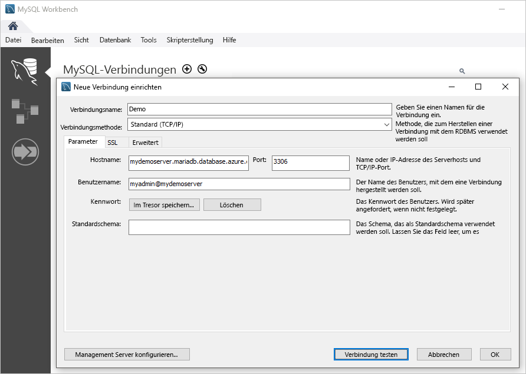

# <a name="quickstart-create-an-azure-database-for-mariadb-server-using-powershell"></a>Schnellstart: Erstellen eines Servers für Azure Database for MariaDB mithilfe von PowerShell

In diesem Schnellstart wird die Verwendung von PowerShell zum Erstellen eines Azure Database for MariaDB-Servers in einer Azure-Ressourcengruppe beschrieben. Sie können PowerShell verwenden, um Azure-Ressourcen interaktiv oder in Skripts zu erstellen und zu verwalten.

## <a name="prerequisites"></a>Voraussetzungen

Wenn Sie kein Azure-Abonnement besitzen, können Sie ein [kostenloses Konto](https://azure.microsoft.com/free/) erstellen, bevor Sie beginnen.

Falls Sie PowerShell lokal verwenden möchten, müssen Sie für diesen Artikel das Az PowerShell-Modul installieren und mit dem Cmdlet [Connect-AzAccount](/powershell/module/az.accounts/connect-azaccount) eine Verbindung mit Ihrem Azure-Konto herstellen. Weitere Informationen zum Installieren des Az PowerShell-Moduls finden Sie unter [Installieren von Azure PowerShell](/powershell/azure/install-az-ps).

> [!IMPORTANT]
> Solange nur eine Vorschauversion des PowerShell-Moduls Az.MariaDb verfügbar ist, müssen Sie es separat über das Az-PowerShell-Modul installieren. Verwenden Sie dazu den folgenden Befehl: `Install-Module -Name Az.MariaDb -AllowPrerelease`.
> Sobald das PowerShell-Modul Az.MariaDb allgemein verfügbar ist, wird es in zukünftige Releases des Az-PowerShell-Moduls integriert und in Azure Cloud Shell nativ zur Verfügung gestellt.

Falls Sie den Dienst Azure Database for MariaDB erstmals verwenden, müssen Sie den Ressourcenanbieter **Microsoft.DBforMariaDB** registrieren.

```azurepowershell-interactive
Register-AzResourceProvider -ProviderNamespace Microsoft.DBforMariaDB
```

[!INCLUDE [cloud-shell-try-it](../../includes/cloud-shell-try-it.md)]

Wenn Sie über mehrere Azure-Abonnements verfügen, müssen Sie das entsprechende Abonnement auswählen, in dem die Ressourcen fakturiert werden sollen. Wählen Sie mit dem Cmdlet [Set-AzContext](/powershell/module/az.accounts/set-azcontext) eine bestimmte Abonnement-ID aus.

```azurepowershell-interactive
Set-AzContext -SubscriptionId 00000000-0000-0000-0000-000000000000
```

## <a name="create-a-resource-group"></a>Erstellen einer Ressourcengruppe

Erstellen Sie mit dem Cmdlet [New-AzResourceGroup](/powershell/module/az.resources/new-azresourcegroup) eine [Azure-Ressourcengruppe](../azure-resource-manager/management/overview.md). Eine Ressourcengruppe ist ein logischer Container, in dem Azure-Ressourcen als Gruppe bereitgestellt und verwaltet werden.

Im folgenden Beispiel wird eine Ressourcengruppe mit dem Namen **myresourcegroup** in der Region **USA, Westen** erstellt.

```azurepowershell-interactive
New-AzResourceGroup -Name myresourcegroup -Location westus
```

## <a name="create-an-azure-database-for-mariadb-server"></a>Erstellen eines Azure Database for MariaDB-Servers

Erstellen Sie mit dem Cmdlet `New-AzMariaDbServer` einen Azure Database for MariaDB-Server. Ein Server kann mehrere Datenbanken verwalten. In der Regel wird für jedes Projekt oder jeden Benutzer eine separate Datenbank verwendet.

Die folgende Tabelle enthält eine Liste mit den häufig verwendeten Parametern und Beispielwerten für das Cmdlet `New-AzMariaDbServer`.

|        **Einstellung**         | **Beispielwert** |                                                                                                                                                             **Beschreibung**                                                                                                                                                              |
| -------------------------- | ---------------- | ---------------------------------------------------------------------------------------------------------------------------------------------------------------------------------------------------------------------------------------------------------------------------------------------------------------------------------------- |
| Name                       | mydemoserver     | Wählen Sie einen in Azure global eindeutigen Namen aus, mit dem Ihr Azure Database for MariaDB-Server identifiziert wird. Der Servername darf nur Buchstaben, Zahlen und den Bindestrich (-) enthalten. Beim Erstellungsvorgang werden alle angegebenen Großbuchstaben automatisch in Kleinbuchstaben konvertiert. Es muss zwischen drei und 63 Zeichen lang sein. |
| ResourceGroupName          | myresourcegroup  | Geben Sie den Namen der Azure-Ressourcengruppe an.                                                                                                                                                                                                                                                                                            |
| Sku                        | GP_Gen5_2        | Der Name der SKU. Für die Benennung wird das Format **Tarif\_Computegeneration\_V-Kerne** in Kurzform verwendet. Weitere Informationen zum SKU-Parameter finden Sie in den Informationen, die auf diese Tabelle folgen.                                                                                                                                           |
| BackupRetentionDay         | 7                | Gibt die Aufbewahrungsdauer für eine Sicherung an. Die Einheit ist Tage. Der Bereich umfasst 7 bis 35.                                                                                                                                                                                                                                                                       |
| GeoRedundantBackup         | Aktiviert          | Gibt an, ob georedundante Sicherungen für diesen Server aktiviert werden sollen. Dieser Wert kann für Server mit dem Tarif „Basic“ nicht aktiviert und nach der Erstellung des Servers nicht mehr geändert werden. Zulässige Werte: „Aktiviert“, „Deaktiviert“                                                                                                      |
| Standort                   | westus           | Die Azure-Region für den Server.                                                                                                                                                                                                                                                                                                         |
| SslEnforcement             | Aktiviert          | Gibt an, ob SSL für diesen Server aktiviert werden soll. Zulässige Werte: „Aktiviert“, „Deaktiviert“                                                                                                                                                                                                                                                 |
| StorageInMb                | 51.200            | Die Speicherkapazität des Servers (Einheit: MB). Für „Valid StorageInMb“ gilt ein Mindestwert von 5.120 MB, der in Schritten von jeweils 1.024 MB erhöht werden kann. Weitere Informationen zu Grenzwerten für die Speichergröße finden Sie unter [Azure Database for MariaDB – Tarife](./concepts-pricing-tiers.md).                                                                               |
| Version                    | 5.7              | Die Hauptversion von MariaDB.                                                                                                                                                                                                                                                                                                                 |
| AdministratorUserName      | myadmin          | Der Benutzername für die Administratoranmeldung. Dieser darf nicht **azure_superuser**, **admin**, **administrator**, **root**, **guest** oder **public** lauten.                                                                                                                                                                                            |
| AdministratorLoginPassword | `<securestring>` | Das Kennwort des Administratorbenutzers in Form einer sicheren Zeichenfolge. Es muss zwischen acht und 128 Zeichen lang sein. Das Kennwort muss Zeichen aus drei der folgenden Kategorien enthalten: Englische Großbuchstaben, englische Kleinbuchstaben, Zahlen und nicht alphanumerische Zeichen.                                       |

Für den Parameterwert **Sku** wird das Format **Tarif\_Computegeneration\_V-Kerne** verwendet. Dies ist in den folgenden Beispielen dargestellt.

- `-Sku B_Gen5_1` ist „Basic“, „Gen 5“ und „1 virtueller Kern“ zugeordnet. Bei dieser Option handelt es sich um die kleinste verfügbare SKU.
- `-Sku GP_Gen5_32` ist „Universell“, „Gen 5“ und „32 V-Kerne“ zugeordnet.
- `-Sku MO_Gen5_2` ist „Arbeitsspeicheroptimiert“, „Gen 5“ und „2 V-Kerne“ zugeordnet.

Informationen zu den gültigen Werten für **Sku** nach Region sowie Tarife finden Sie unter [Azure Database for MariaDB – Tarife](./concepts-pricing-tiers.md).

Im folgenden Beispiel wird ein MariaDB-Server in der Region **USA, Westen** mit dem Namen **mydemoserver** in der Ressourcengruppe **myresourcegroup** und mit dem Benutzernamen **myadmin** für den Serveradministrator erstellt. Es handelt sich um einen Gen 5-Server im Tarif „Universell“ mit zwei virtuellen Kernen und Aktivierung von georedundanten Sicherungen. Notieren Sie sich das Kennwort, das in der ersten Zeile des Beispiels verwendet wird, da dies das Kennwort für das Administratorkonto des MariaDB-Servers ist.

> [!TIP]
> Ein Servername wird einem DNS-Namen zugeordnet und muss in Azure global eindeutig sein.

```azurepowershell-interactive
$Password = Read-Host -Prompt 'Please enter your password' -AsSecureString
New-AzMariaDbServer -Name mydemoserver -ResourceGroupName myresourcegroup -Sku GP_Gen5_2 -GeoRedundantBackup Enabled -Location westus -AdministratorUsername myadmin -AdministratorLoginPassword $Password
```

Ziehen Sie die Verwendung des Tarifs „Basic“ in Betracht, wenn eine geringe Compute- und E/A-Leistung für Ihre Workload ausreichend ist.

> [!IMPORTANT]
> Server, die unter dem Tarif „Basic“ erstellt wurden, können später nicht auf „Universell“ oder „Arbeitsspeicheroptimiert“ skaliert und nicht georepliziert werden.

## <a name="configure-a-firewall-rule"></a>Konfigurieren einer Firewallregel

Erstellen Sie eine Firewallregel auf der Ebene des Azure Database for MariaDB-Servers mit dem Cmdlet `New-AzMariaDbFirewallRule`. Eine Firewallregel auf Serverebene ermöglicht es einer externen Anwendung, z. B. dem Befehlszeilentool `mysql` oder MariaDB Workbench, über die Firewall des Azure Database for MariaDB-Diensts eine Verbindung mit Ihrem Server herzustellen.

Im folgenden Beispiel wird eine Firewallregel mit dem Namen **AllowMyIP** erstellt, die Verbindungen über eine bestimmte IP-Adresse (192.168.0.1) zulässt. Geben Sie gemäß dem Standort, von dem aus Sie eine Verbindung herstellen, eine IP-Adresse oder einen Bereich mit IP-Adressen an.

```azurepowershell-interactive
New-AzMariaDbFirewallRule -Name AllowMyIP -ResourceGroupName myresourcegroup -ServerName mydemoserver -StartIPAddress 192.168.0.1 -EndIPAddress 192.168.0.1
```

> [!NOTE]
> Die Kommunikation für Verbindungen mit Azure Database for MariaDB erfolgt über Port 3306. Wenn Sie versuchen, eine Verbindung über ein Unternehmensnetzwerk herzustellen, wird ausgehender Datenverkehr über Port 3306 unter Umständen nicht zugelassen. In diesem Szenario können Sie nur dann eine Verbindung mit dem Server herstellen, wenn Ihre IT-Abteilung Port 3306 öffnet.

## <a name="configure-ssl-settings"></a>Konfigurieren der SSL-Einstellungen

Standardmäßig werden SSL-Verbindungen zwischen Ihrem Server und Clientanwendungen erzwungen. Mit dieser Standardeinstellung wird die Sicherheit von Daten _während des Betriebs_ gewährleistet, indem der Datenstrom über das Internet verschlüsselt wird. Für diesen Schnellstart deaktivieren Sie SSL-Verbindungen für Ihren Server. Weitere Informationen finden Sie unter [Konfigurieren von SSL-Verbindungen in der Anwendung für eine sichere Verbindung mit Azure Database for MariaDB](./howto-configure-ssl.md).

> [!WARNING]
> Das Deaktivieren von SSL ist für Produktionsserver aber nicht zu empfehlen.

Im folgenden Beispiel wird SSL auf Ihrem Azure Database for MariaDB-Server deaktiviert.

```azurepowershell-interactive
Update-AzMariaDbServer -Name mydemoserver -ResourceGroupName myresourcegroup -SslEnforcement Disabled
```

## <a name="get-the-connection-information"></a>Abrufen der Verbindungsinformationen

Zum Herstellen einer Verbindung zum Server müssen Sie Hostinformationen und Anmeldeinformationen für den Zugriff angeben. Verwenden Sie das folgende Beispiel, um die Verbindungsinformationen zu ermitteln. Notieren Sie sich die Werte für **FullyQualifiedDomainName** und **AdministratorLogin**.

```azurepowershell-interactive
Get-AzMariaDbServer -Name mydemoserver -ResourceGroupName myresourcegroup |
  Select-Object -Property FullyQualifiedDomainName, AdministratorLogin
```

```Output
FullyQualifiedDomainName                    AdministratorLogin
------------------------                    ------------------
mydemoserver.mariadb.database.azure.com       myadmin
```

## <a name="connect-to-the-server-using-the-mysql-command-line-tool"></a>Herstellen einer Verbindung mit dem Server mit dem Befehlszeilentool „mysql“

Stellen Sie mit dem Befehlszeilentool `mysql` eine Verbindung mit Ihrem Server her. Informationen zum Herunterladen und Installieren des Befehlszeilentools finden Sie unter [MySQL Community Downloads](https://dev.mysql.com/downloads/shell/). Sie können auch auf eine vorinstallierte Version des Befehlszeilentools `mysql` in Azure Cloud Shell zugreifen, indem Sie in einem Codebeispiel dieses Artikels die Schaltfläche **Jetzt ausprobieren** auswählen. Weitere Möglichkeiten zum Zugreifen auf Azure Cloud Shell sind das Auswählen der Schaltfläche **>_** auf der Symbolleiste oben rechts im Azure-Portal oder das Navigieren zu [shell.azure.com](https://shell.azure.com/).

1. Stellen Sie mit dem Befehlszeilentool `mysql` eine Verbindung mit dem Server her.

   ```azurepowershell-interactive
   mysql -h <servername>.mariadb.database.azure.com -u myadmin@<servername> -p
   ```

1. Zeigen Sie den Serverstatus an.

   ```sql
   mysql> status
   ```

   ```Output
   C:\Users\>mysql -h mydemoserver.mariadb.database.azure.com -u myadmin@mydemoserver -p
   Enter password: *************
   Welcome to the MySQL monitor.  Commands end with ; or \g.
   Your MySQL connection id is 64793
   Server version: 5.6.42.0 MariaDB Server

   Copyright (c) 2000, 2020, Oracle and/or its affiliates. All rights reserved.

   Oracle is a registered trademark of Oracle Corporation and/or its
   affiliates. Other names may be trademarks of their respective
   owners.

   Type 'help;' or '\h' for help. Type '\c' to clear the current input statement.

   mysql> status
   --------------
   /usr/bin/mysql  Ver 14.14 Distrib 5.7.29, for Linux (x86_64) using  EditLine wrapper

   Connection id:          64793
   Current database:
   Current user:           myadmin@myipaddress
   SSL:                    Cipher in use is ECDHE-RSA-AES256-GCM-SHA384
   Current pager:          stdout
   Using outfile:          ''
   Using delimiter:        ;
   Server version:         5.6.42.0 MariaDB Server
   Protocol version:       10
   Connection:             mydemoserver.mariadb.database.azure.com via TCP/IP
   Server characterset:    latin1
   Db     characterset:    latin1
   Client characterset:    utf8
   Conn.  characterset:    utf8
   TCP port:               3306
   Uptime:                 17 min 4 sec

   Threads: 19  Questions: 482  Slow queries: 0  Opens: 50  Flush tables: 3  Open tables: 12  Queries per second avg: 0.470
   --------------

   mysql>
   ```

Zusätzliche Befehle finden Sie unter [MySQL 5.7-Referenzhandbuch – Kapitel 4.5.1](https://dev.mysql.com/doc/refman/5.7/en/mysql.html).

## <a name="connect-to-the-server-using-mariadb-workbench"></a>Herstellen einer Verbindung mit dem Server unter Verwendung von MariaDB Workbench

1. Starten Sie die Anwendung MySQL Workbench auf dem Clientcomputer. Informationen zum Herunterladen und Installieren von MySQL Workbench finden Sie unter [Download MySQL Workbench](https://dev.mysql.com/downloads/workbench/).

1. Geben Sie im Dialogfeld **Setup New Connection** (Neue Verbindung einrichten) auf der Registerkarte **Parameter** folgende Informationen ein:

   

    |    **Einstellung**    |            **Empfohlener Wert**            |                      **Beschreibung**                       |
    | ----------------- | ----------------------------------------- | ---------------------------------------------------------- |
    | Verbindungsname   | Eigene Verbindung                             | Geben Sie eine Bezeichnung für diese Verbindung an.                        |
    | Verbindungsmethode | Standard (TCP/IP)                         | Verwenden des TCP/IP-Protokolls zum Herstellen einer Verbindung mit Azure Database for MariaDB |
    | Hostname          | `mydemoserver.mariadb.database.azure.com` | Der zuvor notierte Servername.                           |
    | Port              | 3306                                      | Der Standardport für MariaDB                                 |
    | Username          | myadmin@mydemoserver                      | Der zuvor notierte Benutzername für den Serveradministrator.                |
    | Kennwort          | *************                             | Verwenden Sie das Kennwort des Administratorkontos, das Sie zuvor konfiguriert haben.      |

1. Klicken Sie auf die Schaltfläche **Verbindung testen**, um zu testen, ob die Parameter richtig konfiguriert sind.

1. Wählen Sie die Verbindung aus, die für die Verbindungsherstellung mit dem Server verwendet werden soll.

## <a name="clean-up-resources"></a>Bereinigen von Ressourcen

Wenn Sie die in dieser Schnellstartanleitung erstellten Ressourcen nicht für eine andere Schnellstartanleitung oder ein anderes Tutorial benötigen, können Sie sie löschen, indem Sie das folgende Beispiel ausführen.

> [!CAUTION]
> Im folgenden Beispiel werden die angegebene Ressourcengruppe und alle darin enthaltenen Ressourcen gelöscht.
> Falls in der angegebenen Ressourcengruppe Ressourcen enthalten sind, die nicht zum Umfang dieser Schnellstartanleitung gehören, werden sie ebenfalls gelöscht.

```azurepowershell-interactive
Remove-AzResourceGroup -Name myresourcegroup
```

Verwenden Sie das Cmdlet `Remove-AzMariaDbServer`, um nur den in dieser Schnellstartanleitung erstellten Server ohne die Ressourcengruppe zu löschen.

```azurepowershell-interactive
Remove-AzMariaDbServer -Name mydemoserver -ResourceGroupName myresourcegroup
```

## <a name="next-steps"></a>Nächste Schritte

> [!div class="nextstepaction"]
> [Entwerfen einer Azure Database for MariaDB-Instanz mithilfe von PowerShell](tutorial-design-database-using-powershell.md)