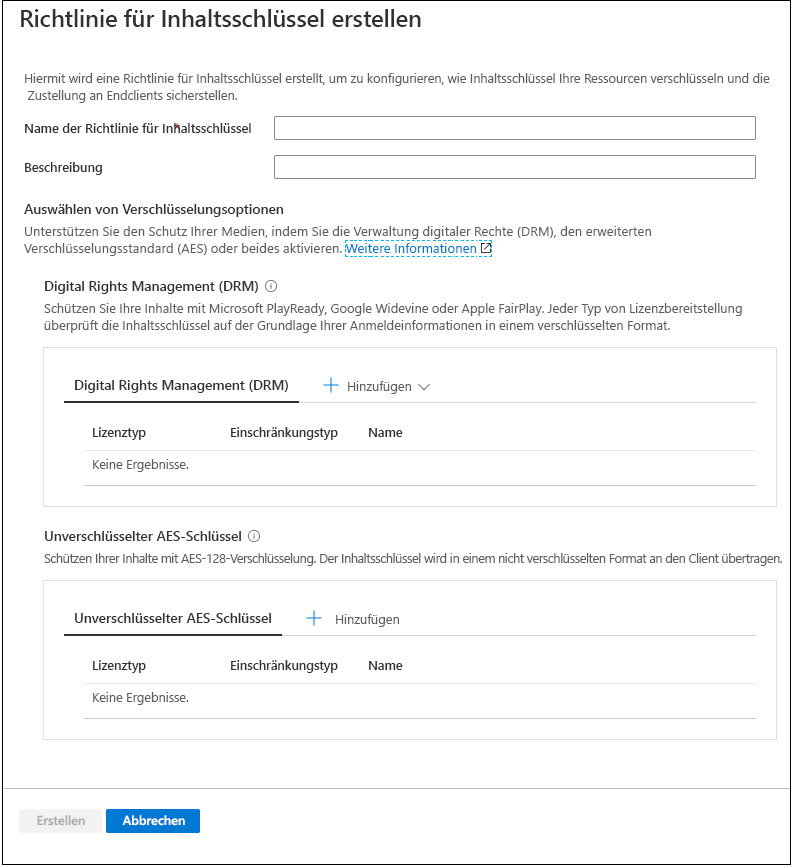
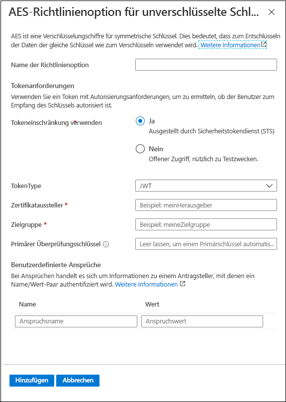
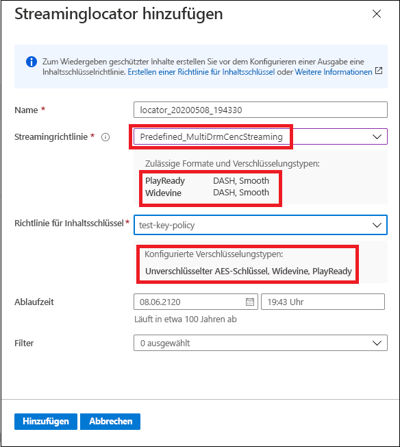

# Schnellstart: Verschlüsseln von Inhalten mithilfe des Portals

[!INCLUDE [media services api v3 logo](./includes/v3-hr.md)]

Verwenden Sie Azure Media Services, um Ihre Medien ab dem Zeitpunkt, an dem sie Ihren Computer verlassen, während des gesamten Prozesses der Speicherung, Verarbeitung und Übermittlung sichern. Mit Media Services können Sie Ihre zu übermittelnden Live- und On-Demand-Inhalte dynamisch mit Advanced Encryption Standard (AES-128) oder einem der drei wichtigsten DRM-Systeme verschlüsseln: Microsoft PlayReady, Google Widevine und Apple FairPlay. Media Services bietet auch einen Dienst für die Übermittlung von AES-Schlüsseln und DRM-Lizenzen (PlayReady, Widevine und FairPlay) an autorisierte Clients. 
 
Zum Festlegen von Verschlüsselungsoptionen für Ihren Datenstrom wird eine **Streamingrichtlinie** verwendet und Ihrem Streaminglocator zugeordnet. Sie erstellen die **Richtlinie für symmetrische Schlüssel**, um zu konfigurieren, wie der symmetrische Schlüssel (der den sicheren Zugriff auf Ihre **Medienobjekte** ermöglicht) an Endclients übermittelt wird. Sie müssen die Anforderungen (Einschränkungen) für die Richtlinie für symmetrische Schlüssel festlegen, die erfüllt sein müssen, damit Schlüssel mit der angegebenen Konfiguration an Clients übermittelt werden. 

> [!NOTE]
> Die Richtlinie für symmetrische Schlüssel ist beim unverschlüsselten Streamen oder Herunterladen nicht erforderlich.

Wenn ein Player einen Stream anfordert, verwendet Media Services den angegebenen Schlüssel, um den Inhalt dynamisch mit einem unverschlüsselten AES-Schlüssel oder per DRM-Verschlüsselung zu verschlüsseln. Um den Stream zu entschlüsseln, fordert der Player den Schlüssel vom Media Services-Schlüsselübermittlungsdienst oder dem von Ihnen angegebenen Schlüsselübermittlungsdienst an. Um zu entscheiden, ob der Benutzer berechtigt ist, den Schlüssel zu erhalten, wertet der Dienst die **Richtlinie für symmetrische Schlüssel** aus, die Sie für den Schlüssel angegeben haben.

In dieser Schnellstartanleitung erfahren Sie, wie Sie eine Richtlinie für symmetrische Schlüssel erstellen, um anzugeben, welche Verschlüsselung beim Streamen auf Ihr Medienobjekt angewendet werden soll. Darüber hinaus wird in dieser Schnellstartanleitung gezeigt, wie Sie die konfigurierte Verschlüsselung für Ihr Medienobjekt festlegen.

### Empfohlene Lektüre zur Vorbereitung

* [Dynamische Verschlüsselung und Schlüsselübermittlung](content-protection-overview.md)
* [Streaminglocators](streaming-locators-concept.md)
* [Streamingrichtlinien](streaming-policy-concept.md)
* [Richtlinien für symmetrische Schlüssel](content-key-policy-concept.md)

## Voraussetzungen

Laden Sie Ihren Inhalt hoch, und verarbeiten Sie ihn, wie unter [Schnellstart: Hochladen, Codieren und Streamen von Inhalten mithilfe des Portals](manage-assets-quickstart.md) beschrieben.

## Erstellen einer Richtlinie für symmetrische Schlüssel

Erstellen Sie die **Richtlinie für symmetrische Schlüssel**, um zu konfigurieren, wie der symmetrische Schlüssel (der den sicheren Zugriff auf Ihre **Medienobjekte** ermöglicht) an Endclients übermittelt wird.

1. Melden Sie sich beim [Azure-Portal](https://portal.azure.com/) an.
1. Navigieren Sie zu Ihrem Media Services-Konto, und klicken Sie darauf.
1. Wählen Sie **Inhaltsschlüsselrichtlinien (neu)** aus.
1. Klicken Sie im oberen Bereich des Fensters auf **+ Add content key policy** (+ Richtlinie für symmetrischen Schlüssel hinzufügen). 

Das Fenster **Richtlinie für Inhaltsschlüssel erstellen** wird angezeigt. In diesem Fenster können Sie Verschlüsselungsoptionen auswählen. Zum Schutz Ihrer Medien können Sie DRM (Digital Rights Management, Verwaltung digitaler Rechte), AES (Advanced Encryption Standard, erweiterter Verschlüsselungsstandard) oder beides aktivieren.  

Sowohl bei Verwendung einer der DRM-Optionen als auch bei Verwendung einer Option mit unverschlüsseltem Schlüssel mit AES-128 wird empfohlen, die gewünschte Einschränkungskonfiguration anzugeben. Sie haben die Wahl zwischen einer offenen Einschränkung und einer Tokeneinschränkung. Ausführliche Informationen finden Sie unter [Steuern der Inhaltszugriffs](content-protection-overview.md#controlling-content-access).

### Hinzufügen eines symmetrischen DRM-Schlüssels

Sie können Ihren Inhalt mit Microsoft PlayReady und/oder mit Google Widevine oder Apple FairPlay schützen. Bei jeder Art von Lizenzbereitstellung werden die symmetrischen Schlüssel auf der Grundlage Ihrer Anmeldeinformationen in einem verschlüsselten Format überprüft.

#### Lizenzvorlagen

Ausführliche Informationen zu Lizenzvorlagen finden Sie hier:

* [Übersicht zu Media Services v3 mit Widevine-Lizenzvorlage](widevine-license-template-overview.md)

    > [!NOTE]
    > Sie können eine leere Lizenzvorlage ohne Werte erstellen, die einfach nur „{}“ enthält. Dann wird eine Lizenzvorlage mit Standardeinstellungen erstellt. Die Standardeinstellungen funktionieren in den meisten Fällen.
* [Anforderungen und Konfiguration der Apple FairPlay-Lizenz](fairplay-license-overview.md)
* [PlayReady-Lizenzvorlage](playready-license-template-overview.md)

### Hinzufügen eines unverschlüsselten AES-Schlüssels

Sie können Ihrem Inhalt auch eine Verschlüsselung mit unverschlüsseltem AES-128-Schlüssel hinzufügen. Der symmetrische Schlüssel wird in einem unverschlüsselten Format an den Client übertragen.

## Erstellen eines Streaminglocators für Ihr Medienobjekt

1. Navigieren Sie zu Ihrem Media Services-Konto, und klicken Sie darauf.
1. Wählen Sie **Medienobjekte (neu)** aus.
1. Wählen Sie in der Liste mit den Medienobjekten das zu verschlüsselnde Medienobjekt aus.  
1. Klicken Sie im Abschnitt **Streaminglocator** für das ausgewählte Medienobjekt auf **+ Streaminglocator hinzufügen**. 
1. Wählen Sie eine geeignete **Streamingrichtlinie** für die von Ihnen konfigurierte **Richtlinie für symmetrische Schlüssel** aus.

    Ausführliche Informationen dazu, welche Streamingrichtlinie zu welcher Richtlinie für symmetrische Schlüssel passt, finden Sie im Thema [Streamingrichtlinien](streaming-policy-concept.md).
1. Nachdem Sie eine geeignete Streamingrichtlinie ausgewählt haben, können Sie in der Dropdownliste die Richtlinie für symmetrische Schlüssel auswählen.
1. Klicken Sie auf **Hinzufügen**, um den Streaminglocator Ihrem Medienobjekt hinzuzufügen.

    Dadurch wird das Medienobjekt veröffentlicht, und die Streaming-URLs werden generiert.

## Bereinigen von Ressourcen

Wenn Sie die anderen Schnellstarts durcharbeiten möchten, sollten Sie die erstellten Ressourcen behalten. Wechseln Sie andernfalls zum Azure-Portal, navigieren Sie zu Ihren Ressourcengruppen, wählen Sie die Ressourcengruppe aus, unter der Sie diese Schnellstartanleitung ausgeführt haben, und löschen Sie alle Ressourcen.

## Nächste Schritte

[Schnellstart: Hochladen, Codieren und Streamen von Inhalten mithilfe des Portals](manage-assets-quickstart.md)
