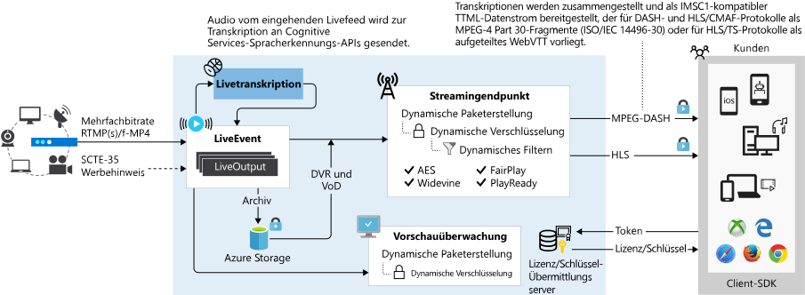

# Liveereignisse und Liveausgaben in Media Services

[!INCLUDE [media services api v3 logo](./includes/v3-hr.md)]

Mit Azure Media Services können Sie Ihren Kunden Liveereignisse in der Azure Cloud anbieten. Um Ihre Livestreamingereignisse in Media Services v3 zu konfigurieren, müssen Sie die in diesem Artikel erläuterten Konzepte verstehen.

> [!TIP]
> Bei Kunden, die von APIs für Version 2 von Media Services migrieren, wird **Kanal** aus Version 2 durch die **Liveereignis** -Entität ersetzt und **Programm** durch die **Liveausgabe**.

## Liveereignisse

[Liveereignisse](/rest/api/media/liveevents) sorgen für das Erfassen und Verarbeiten von Livevideofeeds. Wenn Sie ein Liveereignis erstellen, werden ein primärer und ein sekundärer Eingabeendpunkt erstellt, mit denen Sie ein Livesignal von einem Remoteencoder senden können. Der Remoteliveencoder sendet den Beitragsfeed an diesen Eingabeendpunkt, entweder über [RTMP](https://www.adobe.com/devnet/rtmp.html) oder über das [Smooth Streaming](/openspecs/windows_protocols/ms-sstr/8383f27f-7efe-4c60-832a-387274457251)-Eingabeprotokoll (fragmentiertes MP4). Der Inhalt für das RTMP-Erfassungsprotokoll kann ohne Verschlüsselung (`rtmp://`) oder sicher verschlüsselt über das Netzwerk (`rtmps://`) gesendet werden. Für das Smooth Streaming-Erfassungsprotokoll werden die URL-Schemas `http://` und `https://` unterstützt.  

## Liveereignistypen

Ein [Liveereignis](/rest/api/media/liveevents) kann entweder auf *Passthrough* (ein lokaler Liveencoder sendet einen Stream mit mehreren Bitraten) oder *Livecodierung* (ein lokaler Liveencoder sendet einen Stream mit Einzelbitrate) festgelegt werden. Die Typen werden während der Erstellung mit [LiveEventEncodingType](/rest/api/media/liveevents/create#liveeventencodingtype) festgelegt:

* **LiveEventEncodingType.None** : Ein lokaler Liveencoder sendet einen Stream mit mehreren Bitraten. Der erfasste Stream durchläuft das Liveereignis ohne weitere Verarbeitung. Wird auch als Pass-Through-Modus bezeichnet.
* **LiveEventEncodingType.Standard** : Ein lokaler Liveencoder sendet einen Stream mit Einzelbitrate an das Liveereignis, und Media Services erstellt Streams mit mehreren Bitraten. Wenn der Beitragsfeed eine Auflösung von 720p oder höher hat, bewirkt die Voreinstellung **Default720p** , dass eine Reihe von 6 Auflösungs-/Bitrate-Paaren codiert wird.
* **LiveEventEncodingType.Premium1080p** : Ein lokaler Liveencoder sendet einen Stream mit Einzelbitrate an das Liveereignis, und Media Services erstellt Streams mit mehreren Bitraten. Die Voreinstellung „Default1080p“ gibt den Ausgabesatz von Auflösungs-/Bitrate-Paaren an.

### Pass-Through

Wenn Sie das Passthrough- **Liveereignis** verwenden, erzeugen Sie mit Ihrem lokalen Liveencoder einen Videostream mit mehreren Bitraten und senden diesen als Beitragsfeed an das Liveereignis (über RTMP oder das Protokoll für fragmentiertes MP4). Das Liveereignis leitet dann die eingehenden Videostreams ohne weitere Verarbeitung weiter. Ein solches Passthrough-Liveereignis ist für lang andauernde Liveereignisse oder lineares Livestreaming rund um die Uhr optimiert. Geben Sie beim Erstellen dieser Art von Liveereignis „None“ an (LiveEventEncodingType.None).

Sie können den Beitragsfeed mit einer Auflösung von bis zu 4K und einer Bildrate von 60 Bildern/Sekunde senden, entweder mit H.264/AVC- oder H.265/HEVC-Videocodecs und AAC-Audiocodec (AAC-LC, HE-AACv1 oder HE-AACv2). Weitere Informationen finden Sie unter [Vergleich von Liveereignistypen](live-event-types-comparison.md).

> [!NOTE]
> Die Verwendung der Pass-Through-Methode ist die wirtschaftlichste Form des Livestreamings, wenn mehrere Ereignisse über einen längeren Zeitraum gestreamt werden und Sie bereits in lokale Encoder investiert haben. Die Preisdetails finden Sie [hier](https://azure.microsoft.com/pricing/details/media-services/).
>

Ein .NET-Codebeispiel finden Sie in [MediaV3LiveApp](https://github.com/Azure-Samples/media-services-v3-dotnet-core-tutorials/blob/master/NETCore/Live/MediaV3LiveApp/Program.cs#L126).

### Live Encoding  

Wenn Sie die Livecodierung mit Media Services verwenden, konfigurieren Sie Ihren lokalen Liveencoder so, dass er ein Video mit Einzelbitrate als Beitragsfeed an das Liveereignis sendet (über RTMP oder das Protokoll für fragmentiertes MP4). Anschließend richten Sie ein Liveereignis ein, das den eingehenden Stream mit Einzelbitrate in einen [Videostream mit mehreren Bitraten](https://en.wikipedia.org/wiki/Adaptive_bitrate_streaming) codiert und die Ausgabe über Protokolle wie MPEG-DASH, HLS und Smooth Streaming für Wiedergabegeräte zur Verfügung stellt.

Bei Verwendung der Livecodierung können Sie den Beitragsfeed nur mit einer Auflösung von bis zu 1080p und einer Bildfrequenz von 30 Bildern/Sekunde senden (mit den H.264/AVC-Videocodecs und dem AAC-Audiocodec (AAC-LC, HE-AACv1 oder HE-AACv2)). Beachten Sie, dass Passthrough-Liveereignisse Auflösungen bis zu 4K und 60 Frames/Sekunde unterstützen. Weitere Informationen finden Sie unter [Vergleich von Liveereignistypen](live-event-types-comparison.md).

Die Auflösungen und Bitraten, die in der Ausgabe vom Liveencoder enthalten sind, werden durch die Voreinstellung bestimmt. Wird ein **Standard** -Liveencoder (LiveEventEncodingType.Standard) verwendet, gibt die Voreinstellung *Default720p* sechs Auflösungs-/Bitrate-Paare an, die von 720p und 3,5 MBit/s bis 192p und 200 KBit/s reichen. Bei Verwendung eines **Premium1080p** -Liveencoders (LiveEventEncodingType.Premium1080p) gibt die Voreinstellung *Default1080p* sechs Auflösungs-/Bitrate-Paare an, die von 1080p und 3,5 MBit/s bis 180p und 200 KBit/s reichen. Weitere Informationen finden Sie auf der Seite mit den [Systemvoreinstellungen](live-event-types-comparison.md#system-presets).

> [!NOTE]
> Wenn Sie die Voreinstellung für die Livecodierung anpassen müssen, öffnen Sie ein Supportticket über das Azure-Portal. Geben Sie hierbei eine Tabelle mit den gewünschten Auflösungen und Bitraten an. Stellen Sie sicher, dass nur eine Ebene mit 720p (bei Anforderung einer Voreinstellung für einen Standard-Liveencoder) oder mit 1080p (bei Anforderung einer Voreinstellung für einen Premium1080p-Liveencoder) und höchstens sechs Ebenen vorhanden sind.

## Erstellen von Liveereignissen

### Tastatur

Beim Erstellen eines Liveereignisses können Sie Folgendes festlegen:

* Sie können einen Namen und eine Beschreibung für das Liveereignis angeben.
* Für „Cloudcodierung“ können Sie „Passthrough – keine Cloudcodierung“, „Standard (bis zu 720p)“ oder „Premium (bis zu 1080p)“ auswählen. Bei den Codierungsoptionen Standard und Premium können Sie den Streckmodus für das codierte Video auswählen.
  * Keine: Die in der Codierungsvoreinstellung angegebene Ausgabeauflösung wird strikt eingehalten, ohne das Pixelseitenverhältnis oder das Anzeigeseitenverhältnis des Eingabevideos zu berücksichtigen.
  * AutoSize:  Mit dieser Option wird die Ausgabeauflösung außer Kraft gesetzt und so geändert, dass Sie dem Anzeigeseitenverhältnis der Eingabe ohne Rand entspricht. Wenn die Auflösung der Eingabe beispielsweise 1920 × 1080 ist und die Codierungsvoreinstellung 1280 × 1280 fordert, wird der Wert in der Voreinstellung außer Kraft gesetzt, und die Ausgabe erfolgt in 1280 × 720, sodass das Eingabeseitenverhältnis von 16 : 9 beibehalten wird.
  * AutoFit: Hiermit wird die Ausgabe mit einem Rand versehen (im Letterbox- oder Pillarboxformat), um die gewünschte Ausgabeauflösung zu erzielen und gleichzeitig sicherzustellen, dass der aktive Videobereich in der Ausgabe das gleiche Seitenverhältnis wie die Eingabe aufweist. Wenn die Auflösung der Eingabe z. B. 1920 × 1080 ist und die Codierungsvoreinstellung 1280 × 1280 fordert, erfolgt die Ausgabe in 1280 × 1280 und besteht aus einem Rechteck mit 1280 × 720 im Seitenverhältnis 16 : 9 und einem jeweils 280 Pixel breiten Rand links und rechts im Pillarboxformat.
* Sie können das Streamingprotokoll angeben (momentan unterstützte Protokolle: RTMP und Smooth Streaming). Die Protokolloption kann nicht geändert werden, während das Liveereignis oder die zugehörigen Liveausgaben aktiv sind. Sollten Sie verschiedene Protokolle benötigen, erstellen Sie für jedes Streamingprotokoll ein separates Liveereignis.
* Sie können die Eingabe-ID festlegen, bei der es sich um einen global eindeutigen Bezeichner für den Eingabestream eines Liveereignisses handelt.
* Sie können für „Static hostname prefix“ (Statisches Hostnamenpräfix) „Keines“ (in diesem Fall wird eine zufällige hexadezimale Zeichenfolge mit einer Größe von 128 Bit verwendet), „Use live event name“ (Name des Liveereignisses verwenden) oder „Use custom name“ (Benutzerdefinierten Namen verwenden) festlegen.  Wenn Sie sich für die Verwendung eines benutzerdefinierten Namens entscheiden, ist dieser Wert das benutzerdefinierte Hostnamenpräfix.
* Sie können die End-to-End-Latenz zwischen der Liveübertragung und der Wiedergabe verringern, indem Sie das Intervall des Eingabekeyframes festlegen, bei dem es sich um die Dauer der einzelnen Mediensegmente in der HLS-Ausgabe (in Sekunden) handelt. Der Wert muss eine ganze Zahl ungleich 0 (null) zwischen 0,5 und 20 Sekunden sein.  Der Standardwert ist 2 Sekunden, wenn *weder* das Intervall des Eingabekeyframes noch das des Ausgabekeyframes festgelegt ist. Das Keyframeintervall ist nur bei Passthroughereignissen zulässig.
* Bei der Ereigniserstellung können Sie angeben, dass das Ereignis automatisch gestartet werden soll. Wenn für den automatischen Start „true“ festgelegt ist, wird das Liveereignis nach der Erstellung gestartet. Die Abrechnung beginnt, sobald das Liveereignis startet. Sie müssen für die Liveereignisressource explizit „Beenden“ auswählen, damit keine Gebühren mehr anfallen. Alternativ können Sie das Ereignis starten, wenn Sie zum Starten des Streamings bereit sind.

> [!NOTE]
> Die maximale Framerate für die Codierungsoptionen Standard und Premium ist 30 fps.

## Standbymodus

Wenn Sie ein Liveereignis erstellen, können Sie es in den Standbymodus versetzen. Während sich das Ereignis im Standbymodus befindet, können Sie die Beschreibung und das statische Hostnamenpräfix bearbeiten und die Einstellungen für die Eingabe und den Vorschauzugriff einschränken.  Der Standbymodus ist dennoch ein abrechenbarer Modus. Der Preis unterscheidet sich jedoch von dem beim Starten eines Livestreams.

Weitere Informationen finden Sie unter [Zustandswerte von Liveereignissen und Abrechnung](live-event-states-billing.md).

* IP-Einschränkungen für Erfassung und Vorschau. Sie können die IP-Adressen definieren, die ein Video für dieses Liveereignis erfassen dürfen. Zulässige IP-Adressen können als einzelne IP-Adresse (Beispiel: 10.0.0.1), als IP-Adressbereiche mit einer IP-Adresse und einer CIDR-Subnetzmaske (Beispiel: 10.0.0.1/22) oder als IP-Adressbereiche mit einer IP-Adresse und einer Subnetzmaske in Punkt-Dezimalschreibweise (Beispiel: 10.0.0.1(255.255.252.0)) angegeben werden.
  
Wenn keine IP-Adressen angegeben sind und es keine Regeldefinition gibt, sind keine IP-Adressen zulässig. Um alle IP-Adressen zuzulassen, erstellen Sie eine Regel und legen 0.0.0.0/0 fest. Die IP-Adressen müssen in einem der folgenden Formate vorliegen: IPv4-Adresse mit vier Ziffern oder CIDR-Adressbereich
  
Wenn Sie bestimmte IP-Adressen für Ihre eigenen Firewalls aktivieren oder Eingaben für Ihre Liveereignisse auf Azure-IP-Adressen einschränken möchten, laden Sie eine JSON-Datei von [Azure Datacenter IP address ranges](https://www.microsoft.com/download/details.aspx?id=41653) (IP-Adressbereiche für Azure Datacenter) herunter. Details zu dieser Datei erhalten Sie, indem Sie auf den Bereich **Details** der Seite klicken.

* Beim Erstellen des Ereignisses können Sie, wenn gewünscht, Livetranskriptionen aktivieren. Standardmäßig ist die Livetranskription deaktiviert. Weitere Informationen zur Livetranskription finden Sie unter [Livetranskription (Preview)](live-transcription.md).

### Benennungsregeln

* Die maximale Länge des Namens von Liveereignissen beträgt 32 Zeichen.
* Der Name sollte diesem [regex](/dotnet/standard/base-types/regular-expression-language-quick-reference)-Muster folgen: `^[a-zA-Z0-9]+(-*[a-zA-Z0-9])*$`.

Mehr dazu erfahren Sie unter [Benennungskonventionen für Streamingendpunkte](streaming-endpoint-concept.md#naming-convention).

> [!TIP]
> Um die Eindeutigkeit des Namens Ihres Liveereignisses sicherzustellen, können Sie eine GUID generieren und dann alle Bindestriche und runden Klammern entfernen (falls vorhanden). Die Zeichenfolge ist dann unter allen Liveereignissen eindeutig und ihre Länge beträgt garantiert 32 Zeichen.

## Erfassungs-URLs für Liveereignisse

Sobald das Liveereignis erstellt wurde, können Sie Erfassungs-URLs abrufen, die Sie dem lokalen Liveencoder zur Verfügung stellen. Diese URLs werden vom Liveencoder zur Eingabe eines Livestreams verwendet. Weitere Informationen finden Sie unter [Empfohlene lokale Liveencoder](recommended-on-premises-live-encoders.md).

>[!NOTE]
> Ab dem API-Release 2020-05-01 werden Vanity-URLs als „Static Host Names“ (statische Hostnamen) bezeichnet.

Sie können Nicht-Vanity-URLs oder Vanity-URLs verwenden.

> [!NOTE]
> Damit eine Erfassungs-URL vorhersagbar ist, legen Sie den Vanitymodus fest.

* Nicht-Vanity-URL

    Die Nicht-Vanity-URL ist der Standardmodus in Media Services v3. Sie erhalten das Liveereignis potenziell schnell, aber die Erfassungs-URL ist erst bekannt, wenn das Liveereignis gestartet wurde. Die URL ändert sich, wenn Sie das Liveereignis starten/beenden. Nicht-Vanity-URLs sind in Szenarien nützlich, in denen ein Endbenutzer das Streaming mithilfe einer App durchführen möchte, die App auf ein Liveereignis wartet und eine dynamische Erfassungs-URL kein Problem darstellt.

    Wenn eine Client-App die Erfassungs-URL nicht vor dem Erstellen des Liveereignisses generieren muss, lassen Sie Media Services das Zugriffstoken für das Liveereignis automatisch generieren.

* Vanity-URL

    Der Vanitymodus wird von großen Medienanstalten bevorzugt, die Hardware-Rundfunkencoder verwenden und diese nicht beim Starten des Liveereignisses neu konfigurieren möchten. Diese Medienanstalten wünschen eine vorhersagbare Erfassungs-URL, die sich im Laufe der Zeit nicht ändert.

    > [!NOTE]
    > Im Azure-Portal heißt die Vanity-URL *Static hostname prefix* (Statisches Hostnamenpräfix).

    Zum Festlegen dieses Modus in der API legen Sie `useStaticHostName` zum Zeitpunkt der Erstellung auf `true` fest (der Standardwert ist `false`). Wenn `useStaticHostname` auf „true“ festgelegt ist, gibt `hostnamePrefix` den ersten Teil des Hostnamens an, der der Liveereignisvorschau und den Erfassungsendpunkten zugewiesen wurde. Der endgültige Hostname ist dann eine Kombination aus diesem Präfix, dem Media Services-Kontonamen und einem kurzen Code für das Azure Media Services-Rechenzentrum.

    Sie müssen bei der Erstellung auch Ihr eigenes Zugriffstoken (`LiveEventInput.accessToken`) übergeben, um ein zufälliges Token in der URL zu vermeiden.  Das Zugriffstoken muss eine gültige GUID-Zeichenfolge (mit oder ohne Bindestriche) sein. Sobald der Modus festgelegt ist, kann er nicht mehr aktualisiert werden.

    Das Zugriffstoken muss in Ihrem Rechenzentrum eindeutig sein. Wenn Ihre App eine Vanity-URL verwenden muss, wird empfohlen, immer eine neue GUID-Instanz für das Zugriffstoken zu erstellen (statt vorhandene GUIDs wiederzuverwenden).

    Verwenden Sie die folgenden APIs, um die Vanity-URL zu aktivieren, und legen Sie für das Zugriffstoken eine gültige GUID-Zeichenfolge fest (zum Beispiel `"accessToken": "1fce2e4b-fb15-4718-8adc-68c6eb4c26a7"`).  

    |Sprache|Aktivieren der Vanity-URL|Festlegen des Zugriffstokens|
    |---|---|---|
    |REST|[properties.vanityUrl](/rest/api/media/liveevents/create#liveevent)|[LiveEventInput.accessToken](/rest/api/media/liveevents/create#liveeventinput)|
    |Befehlszeilenschnittstelle (CLI)|[--vanity-url](/cli/azure/ams/live-event?view=azure-cli-latest#az-ams-live-event-create)|[--access-token](/cli/azure/ams/live-event?view=azure-cli-latest#optional-parameters)|
    |.NET|[LiveEvent.VanityUrl](/dotnet/api/microsoft.azure.management.media.models.liveevent.vanityurl?view=azure-dotnet#Microsoft_Azure_Management_Media_Models_LiveEvent_VanityUrl)|[LiveEventInput.AccessToken](/dotnet/api/microsoft.azure.management.media.models.liveeventinput.accesstoken?view=azure-dotnet#Microsoft_Azure_Management_Media_Models_LiveEventInput_AccessToken)|

### Benennungsregeln für Liveerfassungs-URLs

* Die nachstehende *zufällige* Zeichenfolge ist eine 128-Bit-Hexadezimalzahl (sie umfasst 32 Zeichen von 0 bis 9 und a bis f).
* *auto-generated access token* : Die von Ihnen festgelegte gültige GUID-Zeichenfolge bei Verwendung des Vanity-Modus. Beispiel: `"1fce2e4b-fb15-4718-8adc-68c6eb4c26a7"`.
* *stream name* : Gibt den Streamnamen für eine bestimmte Verbindung an. Der Wert des Datenstromnamens wird in der Regel von dem von Ihnen verwendeten Liveencoder hinzugefügt. Sie können den Liveencoder so konfigurieren, dass Sie zum Beschreiben der Verbindung einen beliebigen Namen verwenden können. Beispiel: „video1_audio1“, „video2_audio1“ oder „stream“.

#### Nicht-Vanity-URL

##### RTMP

`rtmp://<random 128bit hex string>.channel.media.azure.net:1935/live/<auto-generated access token>/<stream name>` 
`rtmp://<random 128bit hex string>.channel.media.azure.net:1936/live/<auto-generated access token>/<stream name>` 
`rtmps://<random 128bit hex string>.channel.media.azure.net:2935/live/<auto-generated access token>/<stream name>` 
`rtmps://<random 128bit hex string>.channel.media.azure.net:2936/live/<auto-generated access token>/<stream name>` 

##### Smooth Streaming

`http://<random 128bit hex string>.channel.media.azure.net/<auto-generated access token>/ingest.isml/streams(<stream name>)` 
`https://<random 128bit hex string>.channel.media.azure.net/<auto-generated access token>/ingest.isml/streams(<stream name>)` 

#### Vanity-URL

In den folgenden Pfaden steht `<live-event-name>` entweder für den für das Ereignis festgelegten Namen oder den benutzerdefinierten Namen, der beim Erstellen des Liveereignisses verwendet wird.

##### RTMP

`rtmp://<live event name>-<ams account name>-<region abbrev name>.channel.media.azure.net:1935/live/<your access token>/<stream name>` 
`rtmp://<live event name>-<ams account name>-<region abbrev name>.channel.media.azure.net:1936/live/<your access token>/<stream name>` 
`rtmps://<live event name>-<ams account name>-<region abbrev name>.channel.media.azure.net:2935/live/<your access token>/<stream name>` 
`rtmps://<live event name>-<ams account name>-<region abbrev name>.channel.media.azure.net:2936/live/<your access token>/<stream name>` 

##### Smooth Streaming

`http://<live event name>-<ams account name>-<region abbrev name>.channel.media.azure.net/<your access token>/ingest.isml/streams(<stream name>)` 
`https://<live event name>-<ams account name>-<region abbrev name>.channel.media.azure.net/<your access token>/ingest.isml/streams(<stream name>)` 

## Vorschau-URL für Liveereignisse

Sobald das Liveereignis beginnt, Daten aus dem Beitragsfeed zu empfangen, können Sie über den zugehörigen Vorschauendpunkt eine Vorschau anzeigen und sicherstellen, dass Sie den Livestream empfangen, bevor Sie mit der Veröffentlichung fortfahren. Nachdem Sie sich von der Qualität des Vorschaustreams überzeugt haben, können Sie das Liveereignis verwenden, um den Livestream durch einen oder mehrere (vorab erstellte) Streamingendpunkte für die Übertragung verfügbar zu machen. Hierzu erstellen Sie eine neue [Liveausgabe](/rest/api/media/liveoutputs) für das Liveereignis.

> [!IMPORTANT]
> Vergewissern Sie sich, dass das Video an die Vorschau-URL übertragen wird, bevor Sie fortfahren.

## Zeitintensive Vorgänge für Liveereignisse

Weitere Informationen finden Sie unter [Zeitintensive Vorgänge](media-services-apis-overview.md#long-running-operations).

## Liveausgaben

Sobald der Stream an das Liveereignis übertragen wird, können Sie das Streamingereignis starten, indem Sie ein [Medienobjekt](/rest/api/media/assets), eine [Liveausgabe](/rest/api/media/liveoutputs) und einen [Streaminglocator](/rest/api/media/streaminglocators) erstellen. Die Liveausgabe archiviert den Stream und macht ihn über den [Streamingendpunkt](/rest/api/media/streamingendpoints) für Zuschauer verfügbar.  

Ausführliche Informationen zu Liveausgaben finden Sie unter [Verwenden von Timeshift und Liveausgaben zum Erstellen der bedarfsgesteuerten Videowiedergabe](live-event-cloud-dvr.md).

## Häufig gestellte Fragen

Lesen Sie den Artikel mit [häufig gestellten Fragen](frequently-asked-questions.md#live-streaming).

## Stellen von Fragen und Abrufen von Updates

Im Artikel [Azure Media Services-Community](media-services-community.md) finden Sie verschiedene Möglichkeiten, Fragen zu stellen, Feedback zu geben und Updates zu Media Services zu bekommen.

## Nächste Schritte

[Tutorial zu Livestreaming](stream-live-tutorial-with-api.md)
