# Erstellen eines Azure Media Services-Livestreams

[!INCLUDE [media services api v3 logo](./includes/v3-hr.md)]

In dieser Schnellstartanleitung wird beschrieben, wie Sie einen Azure Media Services-Livestream erstellen, indem Sie das Azure-Portal und Telestream Wirecast verwenden. Hierbei wird vorausgesetzt, dass Sie über ein Azure-Abonnement verfügen und ein Media Services-Konto erstellt haben.

Wenn Sie kein Azure-Abonnement besitzen, können Sie ein [kostenloses Konto](https://azure.microsoft.com/free/) erstellen, bevor Sie beginnen.

## Melden Sie sich auf dem Azure-Portal an.

Öffnen Sie Ihren Webbrowser, und navigieren Sie zum [Microsoft Azure-Portal](https://portal.azure.com/). Geben Sie Ihre Anmeldeinformationen ein, um sich beim Portal anzumelden. Die Standardansicht ist Ihr Dienstdashboard.

In dieser Schnellstartanleitung wird Folgendes behandelt:

- Einrichten eines lokalen Encoders mit einer kostenlosen Testversion von Telestream Wirecast
- Einrichten eines Livestreams
- Einrichten von Livestreamausgaben
- Ausführen eines Standard-Streamingendpunkts
- Anzeigen des Livestreams und der On-Demand-Ausgabe in Azure Media Player

Der Einfachheit halber verwenden wir eine Codierungsvoreinstellung für Azure Media Services in Wirecast, Passthrough-Cloudcodierung und RTMP.

## Einrichten eines lokalen Encoders mit Wirecast

1. Führen Sie über die [Telestream-Website](https://www.telestream.net) den Download und die Installation von Wirecast für Ihr Betriebssystem durch.
1. Starten Sie die Anwendung, und registrieren Sie das Produkt mit Ihrer bevorzugten E-Mail-Adresse. Lassen Sie die Anwendung geöffnet.
1. Verifizieren Sie Ihre E-Mail-Adresse über die erhaltene E-Mail. Anschließend beginnt der Zeitraum für die kostenlose Testversion der Anwendung.
1. Empfohlen: Sehen Sie sich das Videotutorial auf dem Startbildschirm der Anwendung an.

## Einrichten eines Azure Media Services-Livestreams

1. Greifen Sie im Portal auf das Azure Media Services-Konto zu, und wählen Sie anschließend in der Liste **Media Services** die Option **Livestreaming** aus.

   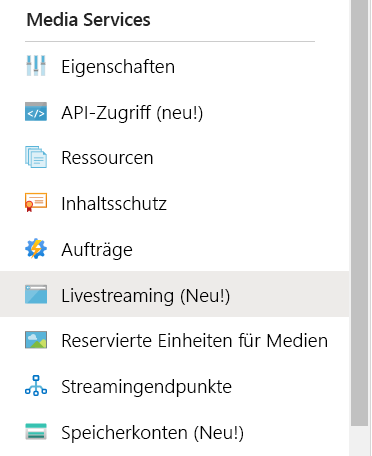
1. Wählen Sie **Liveereignis hinzufügen** aus, um ein neues Livestreamingereignis zu erstellen.

   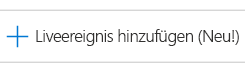
1. Geben Sie im Feld **Name des Liveereignisses** einen Namen für Ihr neues Ereignis ein (z. B. *TestLiveEvent*).

   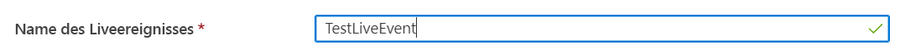
1. Geben Sie im Feld **Beschreibung** eine optionale Beschreibung des Ereignisses ein.
1. Aktivieren Sie die Option **Passthrough – keine Cloudcodierung**.

   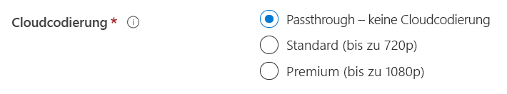
1. Wählen Sie die Option **RTMP** aus.
1. Vergewissern Sie sich, dass für **Liveereignis starten** die Option **Nein** ausgewählt ist. So vermeiden Sie, dass für das Liveereignis Kosten anfallen, bevor es bereit ist. (Die Abrechnung beginnt, nachdem das Liveereignis gestartet wurde.)

   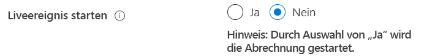
1. Wählen Sie die Schaltfläche **Bewerten + erstellen** aus, um die Einstellungen zu überprüfen.
1. Wählen Sie die Schaltfläche **Erstellen** aus, um das Liveereignis zu erstellen. Nun wird wieder die Liste mit den Liveereignissen angezeigt.
1. Wählen Sie den Link zum Liveereignis aus, das Sie soeben erstellt haben. Beachten Sie, dass Ihr Ereignis beendet ist.
1. Lassen Sie diese Seite in Ihrem Browser geöffnet. Wir werden später darauf zurückkommen.

## Einrichten eines Livestreams mit Wirecast Studio

1. Wählen Sie in der Wirecast-Anwendung im Hauptmenü die Option **Create Empty Document** (Leeres Dokument erstellen) und dann **Continue** (Weiter) aus.

   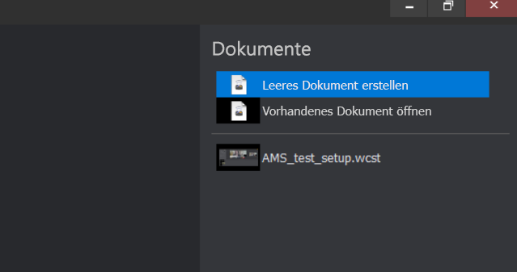
1. Zeigen Sie im Bereich **Wirecast layers** (Wirecast-Ebenen) auf die erste Ebene.  Wählen Sie das eingeblendete Symbol **Hinzufügen** und dann die Videoeingabe aus, die Sie streamen möchten.

   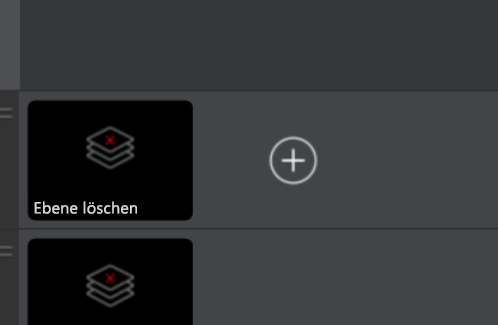

   Das Dialogfeld **Master Layer 1** (Masterebene 1) wird geöffnet.
1. Wählen Sie im Menü die Option **Video capture** (Videoaufnahme) und anschließend die gewünschte Kamera aus.

   

   Im Vorschaubereich wird das Kamerabild angezeigt.
1. Zeigen Sie im Bereich **Wirecast layers** (Wirecast-Ebenen) auf die zweite Ebene. Wählen Sie das eingeblendete Symbol **Hinzufügen** und dann die Audioeingabe aus, die Sie streamen möchten. Das Dialogfeld **Master Layer 2** (Masterebene 2) wird geöffnet.
1. Wählen Sie im Menü die Option **Audio capture** (Audioaufnahme) und anschließend die gewünschte Audioeingabe aus.

   
1. Wählen Sie im Hauptmenü die Option **Output settings** (Ausgabeeinstellungen) aus. Das Dialogfeld **Select an Output Destination** (Ausgabeziel auswählen) wird angezeigt.
1. Wählen Sie in der Dropdownliste **Destination** (Ziel) die Option **Azure Media Services** aus. Aufgrund der Ausgabeeinstellung für Azure Media Services werden die *meisten* Ausgabeeinstellungen automatisch eingefügt.

   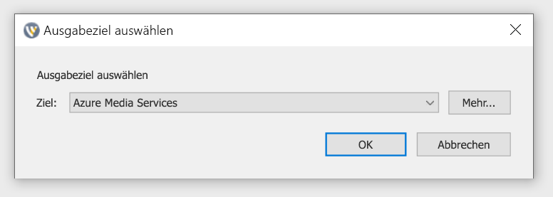

In den nächsten Schritten kehren Sie zu Azure Media Services in Ihrem Browser zurück, um die Eingabe-URL zu kopieren, damit Sie sie in die Ausgabeeinstellungen eingeben können:

1. Wählen Sie im Portal auf der Seite „Azure Media Services“ die Option **Starten** aus, um das Livestreamereignis zu starten. (Die Abrechnung beginnt.)

   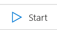
2. Legen Sie den Umschalter **Sicher/Nicht sicher** auf **Nicht sicher** fest. Hierdurch wird das Protokoll auf „RTMP“ (anstelle von RTMPS) festgelegt.
3. Kopieren Sie die URL aus dem Feld **Eingabe-URL** in die Zwischenablage.

   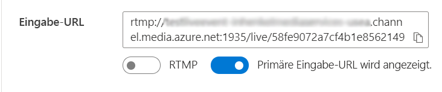
4. Wechseln Sie zur Wirecast-Anwendung, und fügen Sie die **Eingabe-URL** in den Ausgabeeinstellungen in das Feld **Address** (Adresse) ein.

   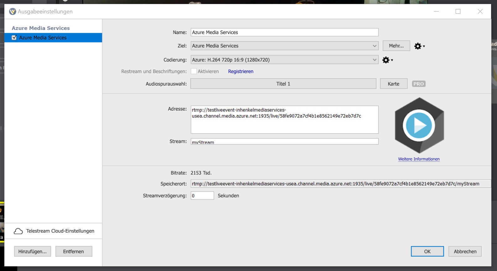
5. Klicken Sie auf **OK**.

## Einrichten von Ausgaben

In diesem Teil werden Ihre Ausgaben und eine Möglichkeit zum Aufzeichnen Ihres Livestreams eingerichtet.  

> [!NOTE]
> Zum Streamen dieser Ausgabe muss der Streamingendpunkt aktiv sein. Weitere Informationen finden Sie unten im Abschnitt [Ausführen des Standard-Streamingendpunkts](#run-the-default-streaming-endpoint).

1. Wählen Sie unter der Videoansicht **Ausgaben** den Link **Ausgaben erstellen** aus.
1. Der Name der Ausgabe kann im Feld **Name** auf Wunsch in einen benutzerfreundlicheren Wert geändert werden, damit die Ausgabe später leichter zu finden ist.
   
   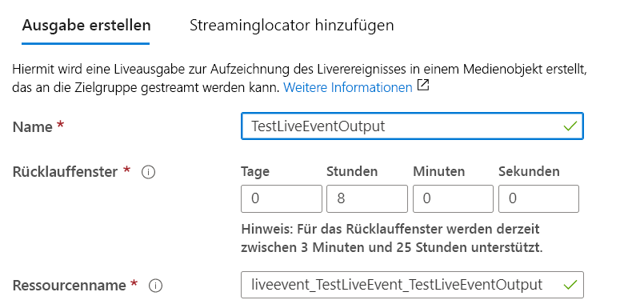
1. Lassen Sie alle anderen Felder vorerst unverändert.
1. Wählen Sie **Weiter** aus, um einen Streaminglocator hinzuzufügen.
1. Ändern Sie den Namen des Locators in einen benutzerfreundlicheren Namen, falls dies gewünscht ist.
   
   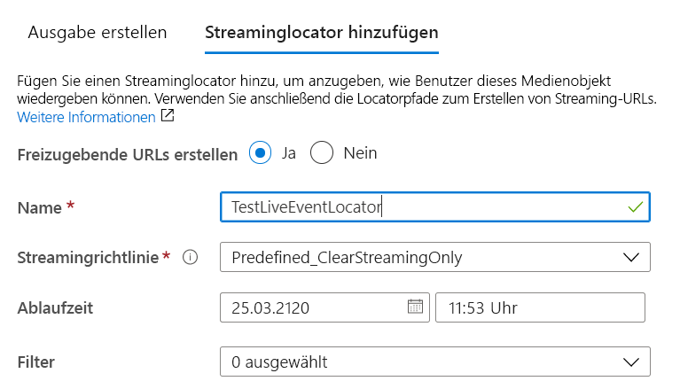
1. Lassen Sie alle anderen Angaben unverändert.
1. Klicken Sie auf **Erstellen**.

## Starten der Übertragung

1. Wählen Sie in Wirecast im Hauptmenü Folgendes aus: **Output** > **Start/Stop Broadcasting** > **Start Azure Media Services: Azure Media Services** (Ausgabe > Übertragung starten/beenden > Azure Media Services starten: Azure Media Services).

   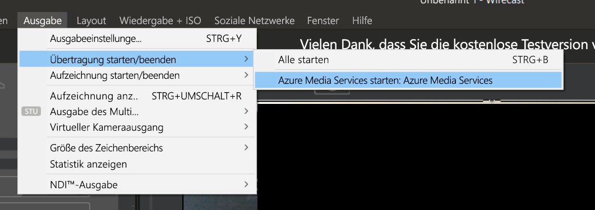

   Wenn der Stream an das Liveereignis gesendet wurde, wird das Fenster **Live** von Wirecast im Videoplayer auf der Liveereignisseite in Azure Media Services angezeigt.

1. Wählen Sie unter dem Vorschaufenster die Schaltfläche **Go** (Los) aus, um die Übertragung der Video- und Audiodaten zu starten, die Sie für die Wirecast-Ebenen ausgewählt haben.

   

   > [!TIP]
   > Versuchen Sie im Falle eines Fehlers, den Player neu zu laden, indem Sie über dem Player den Link **Reload player** (Player neu laden) auswählen.

## Ausführen des Standard-Streamingendpunkts

1. Wählen Sie in der Media Services-Liste die Option **Streamingendpunkte** aus.

   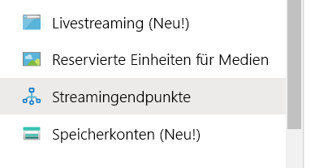
1. Wählen Sie den Standard-Streamingendpunkt aus, wenn sein Status „Beendet“ lautet. Mit diesem Schritt gelangen Sie auf die Seite des Endpunkts.
1. Wählen Sie **Starten** aus.
   
   

## Wiedergeben der Ausgabeübertragung mit Azure Media Player

1. Kopieren Sie die Streaming-URL unter dem Videoplayer für die **Ausgabe**.
1. Öffnen Sie in einem Webbrowser die [Demoversion für Azure Media Player](https://ampdemo.azureedge.net/azuremediaplayer.html).
1. Fügen Sie die Streaming-URL in das Feld **URL** von Azure Media Player ein.
1. Wählen Sie die Schaltfläche **Player aktualisieren** aus.
1. Wählen Sie für das Video das Symbol **Wiedergeben** aus, um Ihren Livestream anzuzeigen.

## Beenden der Übertragung

Beenden Sie die Übertragung, wenn Sie genügend Inhalt gestreamt haben.

1. Wählen Sie in Wirecast die Schaltfläche **Broadcast** (Übertragen) aus. Hiermit wird die Übertragung aus Wirecast beendet.
1. Wählen Sie im Portal die Option **Beenden** aus. Es wird eine Warnmeldung mit dem Hinweis angezeigt, dass der Livestream beendet und die Ausgabe nun als On-Demand-Medienobjekt bereitgestellt wird.
1. Wählen Sie in der Warnmeldung die Option **Beenden** aus. In Azure Media Player wird ein Fehler angezeigt, weil der Livestream nicht mehr verfügbar ist.

## Wiedergeben der On-Demand-Ausgabe mit Azure Media Player

Die von Ihnen erstellte Ausgabe steht nun für On-Demand-Streaming zur Verfügung, solange Ihr Streamingendpunkt aktiv ist.

1. Navigieren Sie zur Media Services-Liste, und wählen Sie **Medienobjekte** aus.
1. Suchen Sie nach der von Ihnen erstellten Ereignisausgabe, und wählen Sie den Link zum Medienobjekt aus. Die Seite für die Medienobjektausgabe wird geöffnet.
1. Kopieren Sie die Streaming-URL unter dem Videoplayer für das Medienobjekt.
1. Wechseln Sie zurück zu Azure Media Player im Browser, und fügen Sie die Streaming-URL in das Feld „URL“ ein.
1. Wählen Sie **Player aktualisieren**.
1. Wählen Sie im Video das Symbol **Wiedergeben** aus, um das On-Demand-Medienobjekt anzuzeigen.

## Bereinigen von Ressourcen

> [!IMPORTANT]
> Beenden Sie die Dienste. Nach Abschluss der Schritte in dieser Schnellstartanleitung sollten Sie das Liveereignis und den Streamingendpunkt unbedingt beenden, da Ihnen ansonsten die weitere Ausführungszeit in Rechnung gestellt wird. Informationen zum Beenden des Liveereignisses finden Sie unter [Beenden der Übertragung](#stop-the-broadcast) (Schritt 2 und 3).

Beenden Sie den Streamingendpunkt wie folgt:

1. Wählen Sie in der Media Services-Liste die Option **Streamingendpunkte** aus.
2. Wählen Sie den Standard-Streamingendpunkt aus, den Sie weiter oben gestartet haben. Durch diesen Schritt wird die Seite des Endpunkts geöffnet.
3. Wählen Sie **Stop** (Beenden) aus.

> [!TIP]
> Wenn Sie die Medienobjekte dieses Ereignisses nicht mehr benötigen, sollten Sie sie löschen, damit keine Kosten für die Speicherung mehr anfallen.

## Nächste Schritte
> [!div class="nextstepaction"]
> [Liveereignisse und Liveausgaben in Media Services](./live-events-outputs-concept.md)
