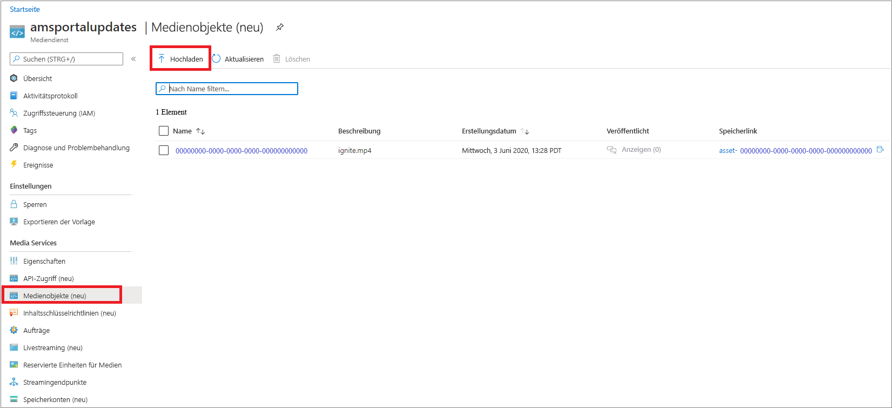
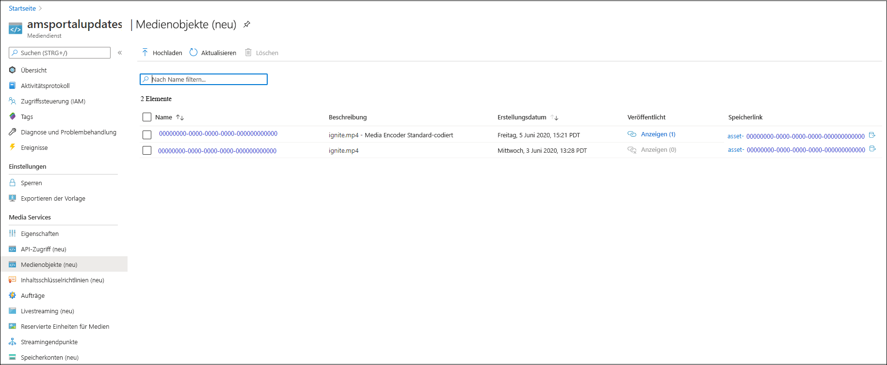
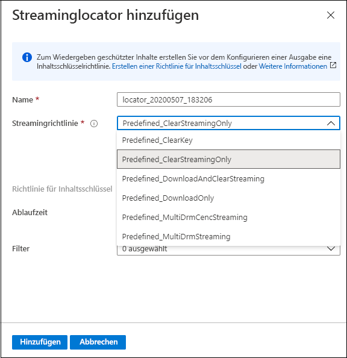
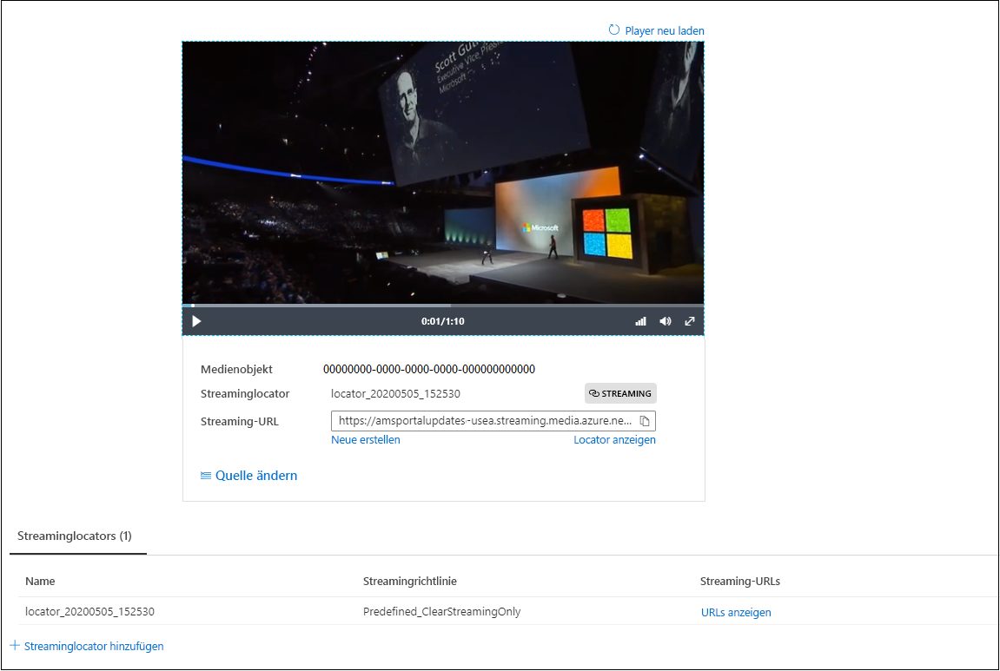

# Schnellstart: Hochladen, Codieren und Streamen von Inhalten mithilfe des Portals

[!INCLUDE [media services api v3 logo](./includes/v3-hr.md)]

In dieser Schnellstartanleitung erfahren Sie, wie Sie das Azure-Portal verwenden, um Inhalte mit Azure Media Services hochzuladen, zu codieren und zu streamen.

> [!NOTE]
> Machen Sie sich mit den [Einschränkungen des Azure-Portals im Zusammenhang mit Media Services v3](frequently-asked-questions.md#what-are-the-azure-portal-limitations-for-media-services-v3) vertraut.
  
## Übersicht

* Um Medieninhalte in Azure verwalten, verschlüsseln, codieren, analysieren und streamen zu können, müssen Sie ein Media Services-Konto erstellen und Ihre digitalen Dateien mit hoher Qualität in ein **Medienobjekt** hochladen. 
    
    > [!NOTE]
    > Wenn Ihr Video zuvor mithilfe der Media Services v3-API in das Media Services-Konto hochgeladen wurde oder der Inhalt basierend auf einer Liveausgabe generiert wurde, sind die Schaltflächen **Codieren**, **Analysieren** und **Verschlüsseln** im Azure-Portal nicht verfügbar. Verwenden Sie für diese Aufgaben die Media Services v3-APIs.

    Lesen Sie Folgendes: 

  * [Clouduploads und Cloudspeicherung](storage-account-concept.md)
  * [Medienobjektkonzept](assets-concept.md)
* Nachdem Sie Ihre digitale Mediendatei mit hoher Qualität in ein Medienobjekt (Eingabemedienobjekt) hochgeladen haben, können Sie es verarbeiten (also codieren oder analysieren). Der verarbeitete Inhalt wird in ein anderes Medienobjekt (Ausgabemedienobjekt) übertragen. 
    * [Codieren](encoding-concept.md) Sie Ihre hochgeladene Datei in Formate, die mit einer Vielzahl von Browsern und Geräten wiedergegeben werden können.
    * [Analysieren](analyzing-video-audio-files-concept.md) Sie Ihre hochgeladene Datei. 

        Bei Verwendung des Azure-Portals können Sie aktuell TTML- und WebVTT-Untertiteldateien generieren. Dateien in diesen Formaten können verwendet werden, um Hörgeschädigten Audio- und Videodateien zugänglich zu machen. Darüber hinaus können Sie Schlüsselwörter aus Ihrem Inhalt extrahieren.

        Für umfassende Funktionen zur Extrahierung von Erkenntnissen aus Video- und Audiodateien können Sie Media Services v3-Voreinstellungen verwenden, wie unter [Tutorial: Analysieren von Videos mit Media Services v3](analyze-videos-tutorial-with-api.md) beschrieben.  Wenn Sie detailliertere Erkenntnisse möchten, verwenden Sie [Video Indexer](../video-indexer/index.yml) direkt.    
* Nach der Verarbeitung Ihrer Inhalte können Sie Medieninhalte für Clientplayer bereitstellen. Wenn Sie Videos im Ausgabemedienobjekt für die Clientwiedergabe verfügbar machen möchten, müssen Sie einen **Streaminglocator** erstellen. Bei der Erstellung eines **Streaminglocators** muss eine **Streamingrichtlinie** angegeben werden. Mithilfe von **Streamingrichtlinien** können Sie Streamingprotokolle und ggf. Verschlüsselungsoptionen für Ihre **Streaminglocators** definieren.
    
    Überprüfung:

    * [Streaminglocators](streaming-locators-concept.md)
    * [Streamingrichtlinien](streaming-policy-concept.md)
    * [Paketerstellung und Bereitstellung](dynamic-packaging-overview.md)
    * [Filter](filters-concept.md)
* Sie können Ihre Inhalte schützen, indem Sie sie mit Advanced Encryption Standard (AES-128) und/oder mit einem der drei gängigsten DRM-Systeme verschlüsseln: Microsoft PlayReady, Google Widevine und Apple FairPlay. In der [Schnellstartanleitung zum Verschlüsseln von Inhalten mithilfe des Portals](encrypt-content-quickstart.md) erfahren Sie, wie Sie den Inhaltsschutz konfigurieren.
        
## Voraussetzungen

[!INCLUDE [quickstarts-free-trial-note](../../../includes/quickstarts-free-trial-note.md)]

[Erstellen eines Media Services-Kontos](create-account-howto.md)

## Upload

1. Melden Sie sich beim [Azure-Portal](https://portal.azure.com/) an.
1. Navigieren Sie zu Ihrem Media Services-Konto, und klicken Sie darauf.
1. Wählen Sie **Medienobjekte (neu)** aus.
1. Klicken Sie im oberen Bereich des Fensters auf **Hochladen**. 
1. Navigieren Sie zu einer hochzuladenden Datei, oder verwenden Sie Drag & Drop.

Im Fenster mit Ihren Medienobjekten sehen Sie, dass der Liste ein neues Medienobjekt hinzugefügt wurde:

## Codieren

1. Wählen Sie **Medienobjekte (neu)** aus.
1. Wählen Sie Ihr neues Medienobjekt aus, das Sie im letzten Schritt hinzugefügt haben.
1. Klicken Sie im oberen Bereich des Fensters auf **Codieren**.

    Durch Klicken auf diese Schaltfläche wird der Codierungsauftrag gestartet. Nach erfolgreichem Abschluss des Vorgangs wird ein Ausgabemedienobjekt mit dem codierten Inhalt generiert.

Im Fenster mit Ihren Medienobjekten sehen Sie, dass der Liste das Ausgabemedienobjekt hinzugefügt wurde:

## Überwachen des Auftragsfortschritts

Navigieren Sie zum Anzeigen des Auftragsstatus zu **Aufträge**. Der Auftrag durchläuft in der Regel die folgenden Zustände: „Geplant“, „In Warteschlange“, „Wird verarbeitet“, „Abgeschlossen“ (Endzustand). Sollte bei dem Auftrag ein Fehler aufgetreten sein, lautet der Zustand „Fehler“.

## Veröffentlichen und Streamen

Um ein Medienobjekt zu veröffentlichen, müssen Sie Ihrem Medienobjekt einen Streaminglocator hinzufügen.

### Streaminglocator 

1. Klicken Sie im Abschnitt **Streaminglocator** auf **+ Streaminglocator hinzufügen**.
    Dadurch wird das Medienobjekt veröffentlicht, und die Streaming-URLs werden generiert.

    > [!NOTE]
    > Soll der Datenstrom verschlüsselt werden, müssen Sie eine Richtlinie für symmetrische Schlüssel erstellen und auf den Streaminglocator festlegen. Ausführliche Informationen finden Sie in der [Schnellstartanleitung zum Verschlüsseln von Inhalten mithilfe des Portals](encrypt-content-quickstart.md).
1. Wählen Sie im Fenster **Streaminglocator hinzufügen** eine der vordefinierten Streamingrichtlinien aus. Ausführliche Informationen finden Sie unter [Streamingrichtlinien](streaming-policy-concept.md).

    

Das veröffentlichte Medienobjekt kann direkt im Portal gestreamt werden. 

Alternativ können Sie die Streaming-URL kopieren und in Ihrem Clientplayer verwenden.

> [!NOTE]
> Vergewissern Sie sich, dass der [Streamingendpunkt](streaming-endpoint-concept.md) aktiv ist. Bei der erstmaligen Erstellung eines Media Services-Kontos wird der standardmäßige Streamingendpunkt im Zustand „Beendet“ erstellt und muss erst gestartet werden, um Inhalte streamen zu können. Es fallen nur Gebühren an, wenn Ihr Streamingendpunkt aktiv ist.

## Bereinigen von Ressourcen

Wenn Sie die anderen Schnellstarts durcharbeiten möchten, sollten Sie die erstellten Ressourcen behalten. Wechseln Sie andernfalls zum Azure-Portal, navigieren Sie zu Ihren Ressourcengruppen, wählen Sie die Ressourcengruppe aus, unter der Sie diese Schnellstartanleitung ausgeführt haben, und löschen Sie alle Ressourcen.

## Nächste Schritte

[Schnellstart: Verschlüsseln von Inhalten mithilfe des Portals](encrypt-content-quickstart.md)
