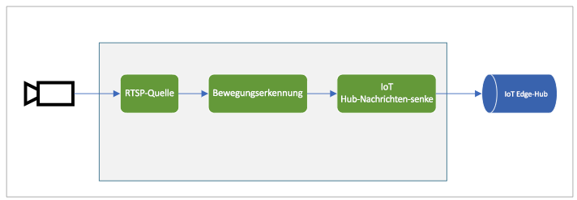

# <a name="quickstart-detect-motion-and-emit-events"></a>Schnellstart: Erkennen von Bewegung und Ausgeben von Ereignissen

In dieser Schnellstartanleitung werden die ersten Schritte mit Live Video Analytics in IoT Edge erläutert. Dabei werden ein virtueller Azure-Computer als IoT Edge-Gerät und ein simulierter Livevideostream verwendet. Nach dem Ausführen der Setupschritte können Sie einen simulierten Livevideostream über einen Mediengraphen ausführen, der Bewegungen in diesem Stream erkennt und meldet. Nachfolgend sehen Sie eine grafische Darstellung dieses Mediengraphs:

 

Dieser Artikel baut auf in C# geschriebenem[ Beispielcode](https://github.com/Azure-Samples/live-video-analytics-iot-edge-csharp) auf.

## <a name="prerequisites"></a>Voraussetzungen

* Ein Azure-Konto mit einem aktiven Abonnement. Sie können [kostenlos ein Konto erstellen](https://azure.microsoft.com/free/?WT.mc_id=A261C142F).
* [Visual Studio Code](https://code.visualstudio.com/) mit den folgenden Erweiterungen auf dem Computer:
    1. [Azure IoT-Tools](https://marketplace.visualstudio.com/items?itemName=vsciot-vscode.azure-iot-tools)
    2. [C#](https://marketplace.visualstudio.com/items?itemName=ms-dotnettools.csharp)
* [.NET Core 3.1 SDK](https://dotnet.microsoft.com/download/dotnet-core/3.1) auf dem System

> [!TIP]
> Bei der Installation der Azure IoT Tools-Erweiterung werden Sie möglicherweise aufgefordert, Docker zu installieren. Dies können Sie ignorieren.

## <a name="set-up-azure-resources"></a>Einrichten von Azure-Ressourcen

Für dieses Tutorial sind die folgenden Azure-Ressourcen erforderlich:

* IoT Hub
* Speicherkonto
* Azure Media Services-Konto
* Virtueller Linux-Computer in Azure mit installierter [IoT Edge-Runtime](https://docs.microsoft.com/azure/iot-edge/how-to-install-iot-edge-linux)

Für diese Schnellstartanleitung wird die Verwendung des [Setupskripts für Live Video Analytics-Ressourcen](https://github.com/Azure/live-video-analytics/tree/master/edge/setup) zum Bereitstellen der oben erwähnten Azure-Ressourcen in Ihrem Azure-Abonnement empfohlen. Führen Sie dazu die folgenden Schritte aus:

1. Navigieren Sie zu https://shell.azure.com.
1. Wenn Sie Cloud Shell zum ersten Mal verwenden, werden Sie zum Auswählen eines Abonnements aufgefordert, um ein Speicherkonto und eine Microsoft Azure Files-Freigabe zu erstellen. Wählen Sie „Speicher erstellen“ aus, um ein Speicherkonto zum Speichern der Cloud Shell-Sitzungsinformationen zu erstellen. Dieses Speicherkonto ist von dem Konto getrennt, das vom Skript für die Verwendung mit Ihrem Azure Media Services-Konto erstellt wird.
1. Wählen Sie im Dropdownmenü auf der linken Seite des Shell-Fensters als Umgebung „Bash“ aus.

    

1. Führen Sie den folgenden Befehl aus.

    ```
    bash -c "$(curl -sL https://aka.ms/lva-edge/setup-resources-for-samples)"
    ```

    Wenn das Skript erfolgreich abgeschlossen wurde, sollten alle oben erwähnten Ressourcen in Ihrem Abonnement angezeigt werden.

1. Klicken Sie nach Abschluss des Skripts auf die geschweiften Klammern, um die Ordnerstruktur verfügbar zu machen. Sie sehen, dass im Verzeichnis „~/clouddrive/lva-sample directory“ einige Dateien erstellt wurden. Folgende Dateien sind für diese Schnellstartanleitung von Interesse:

     * ~/clouddrive/lva-sample/edge-deployment/.env: Diese Datei enthält Eigenschaften, die Visual Studio Code zum Bereitstellen von Modulen auf einem Edgegerät verwendet.
     * ~/clouddrive/lva-sample/appsetting.json: Diese Datei wird von Visual Studio Code zum Ausführen des Beispielcodes verwendet.
     
Sie benötigen diese, um später in der Schnellstartanleitung die Dateien in Visual Studio Code zu aktualisieren. Sie können sie jetzt in eine lokale Datei kopieren.


 

## <a name="set-up-your-development-environment"></a>Einrichten der Entwicklungsumgebung

1. Klonen Sie das Repository unter folgendem Link: https://github.com/Azure-Samples/live-video-analytics-iot-edge-csharp.
1. Starten Sie Visual Studio Code, und öffnen Sie den Ordner, in den das Repository heruntergeladen wurde.
1. Navigieren Sie in Visual Studio Code zum Ordner „src/cloud-to-device-console-app“, und erstellen Sie eine Datei namens „appsettings.json“. Diese Datei enthält die Einstellungen, die zum Ausführen des Programms erforderlich sind.
1. Kopieren Sie den Inhalt aus der Datei „~/clouddrive/lva-sample/appsettings.json“, die im vorherigen Abschnitt generiert wurde (siehe Schritt 5).

    Der Text sollte wie folgt aussehen:

    ```
    {  
        "IoThubConnectionString" : "HostName=xxx.azure-devices.net;SharedAccessKeyName=iothubowner;SharedAccessKey=XXX",  
        "deviceId" : "lva-sample-device",  
        "moduleId" : "lvaEdge"  
    }
    ```
1. Navigieren Sie als Nächstes zum Ordner „src/edge“, und erstellen Sie eine Datei vom Typ „.env“.
1. Kopieren Sie den Inhalt aus der Datei „/clouddrive/lva-sample/edge-deployment/.env“. Der Text sollte wie folgt aussehen:

    ```
    SUBSCRIPTION_ID="<Subscription ID>"  
    RESOURCE_GROUP="<Resource Group>"  
    AMS_ACCOUNT="<AMS Account ID>"  
    IOTHUB_CONNECTION_STRING="HostName=xxx.azure-devices.net;SharedAccessKeyName=iothubowner;SharedAccessKey=xxx"  
    AAD_TENANT_ID="<AAD Tenant ID>"  
    AAD_SERVICE_PRINCIPAL_ID="<AAD SERVICE_PRINCIPAL ID>"  
    AAD_SERVICE_PRINCIPAL_SECRET="<AAD SERVICE_PRINCIPAL ID>"  
    INPUT_VIDEO_FOLDER_ON_DEVICE="/home/lvaadmin/samples/input"  
    OUTPUT_VIDEO_FOLDER_ON_DEVICE="/home/lvaadmin/samples/input"
    APPDATA_FOLDER_ON_DEVICE="/var/local/mediaservices"
    CONTAINER_REGISTRY_USERNAME_myacr="<your container registry username>"  
    CONTAINER_REGISTRY_PASSWORD_myacr="<your container registry username>"      
    ```

## <a name="examine-the-sample-files"></a>Erkunden der Beispieldateien

1. Navigieren Sie in Visual Studio Code zu „src/edge“. Hier befinden sich die erstellte ENV-Datei sowie einige Bereitstellungsvorlagendateien.

    Die Bereitstellungsvorlage verweist mit einigen Platzhalterwerten auf das Bereitstellungsmanifest für das Edgegerät. Die ENV-Datei enthält die Werte für diese Variablen.
1. Navigieren Sie dann zum Ordner „src/cloud-to-device-console-app“. Hier befindet sich die Datei „appsettings.json“, die Sie zusammen mit folgenden anderen Dateien erstellt haben:

    * c2d-console-app.csproj: die Projektdatei für Visual Studio Code
    * operations.json: In dieser Datei sind die verschiedenen Vorgänge aufgelistet, die vom Programm ausgeführt werden sollen.
    * Program.cs: Dies ist der Beispielprogrammcode, mit dem folgende Vorgänge ausgeführt werden:
    
        * Laden der App-Einstellungen
        * Aufrufen direkter Methoden, die vom Modul „Live Video Analytics in IoT Edge“ verfügbar gemacht werden. Sie können das Modul zum Analysieren von Livevideostreams verwenden, indem Sie die zugehörigen [direkten Methoden](direct-methods.md) aufrufen. 
        * Anhalten der Ausführung, damit Sie die Ausgabe des Programms im Terminalfenster und die vom Modul generierten Ereignisse im Ausgabefenster untersuchen können
        * Aufrufen direkter Methoden zur Bereinigung der Ressourcen   

## <a name="generate-and-deploy-the-iot-edge-deployment-manifest"></a>Generieren und Bereitstellen des IoT Edge-Bereitstellungsmanifests

Im Bereitstellungsmanifest werden die Module, die auf einem Edgegerät bereitgestellt werden, sowie Konfigurationseinstellungen für diese Module definiert. Führen Sie die folgenden Schritte aus, um ein solches Manifest auf der Grundlage der Vorlagendatei zu generieren, und stellen Sie es dann auf dem Edgegerät bereit:

1. Öffnen Sie Visual Studio Code.
1. Legen Sie die IoTHub-Verbindungszeichenfolge fest, indem Sie unten links neben dem Bereich „AZURE IOT HUB“ auf das Symbol „Weitere Aktionen“ klicken. Sie können die Zeichenfolge aus der Datei „src/cloud-to-device-console-app/appsettings.json“ kopieren. 

    
1. Klicken Sie als Nächstes mit der rechten Maustaste auf die Datei „src/edge/deployment.template.json“, und klicken Sie dann auf „Generate IoT Edge Deployment Manifest“ (IoT Edge-Bereitstellungsmanifest generieren).
    

    Dadurch sollte im Ordner „src/edge/config“ die Manifestdatei „deployment.amd64.json“ erstellt werden.
1. Klicken Sie mit der rechten Maustaste auf „src/edge/config/deployment.amd64.json“, klicken Sie auf „Create Deployment for Single Device“ (Bereitstellung für einzelnes Gerät erstellen), und wählen Sie dann den Namen Ihres Edgegeräts aus.

    
1. Anschließend werden Sie aufgefordert, ein IoT Hub-Gerät auszuwählen. Wählen Sie in der Dropdownliste das Gerät „lva-sample-device“ aus.
1. Aktualisieren Sie nach ungefähr 30 Sekunden im Abschnitt unten links Azure IoT Hub. Das Edgegerät sollte dann mit den folgenden Modulen bereitgestellt sein:

    * Live Video Analytics in IoT Edge (Modulname „lvaEdge“)
    * RTSP-Simulator (Modulname „rtspsim“)

Das RTSP-Simulatormodul simuliert einen Livevideostream. Dazu wird eine Videodatei verwendet, die beim Ausführen des [Setupskripts für Live Video Analytics-Ressourcen](https://github.com/Azure/live-video-analytics/tree/master/edge/setup) auf Ihr Edgegerät kopiert wurde. Zu diesem Zeitpunkt sind die Module bereitgestellt, es sind jedoch keine Mediengraphen aktiv.

## <a name="prepare-for-monitoring-events"></a>Vorbereiten der Überwachung von Ereignissen

Sie verwenden das Modul „Live Video Analytics in IoT Edge“, um Bewegungen im eingehenden Livevideostream zu erkennen und Ereignisse an IoT Hub zu senden. Führen Sie zum Anzeigen dieser Ereignisse die folgenden Schritte aus:

1. Öffnen Sie den Explorer-Bereich in Visual Studio Code, und suchen Sie unten links nach „Azure IoT Hub“.
1. Erweitern Sie den Knoten „Geräte“.
1. Klicken Sie mit der rechten Maustaste auf „lva-sample-device“, und wählen Sie die Option „Überwachung des integrierten Ereignisendpunkts starten“ aus.

    

## <a name="run-the-sample-program"></a>Ausführen des Beispielprogramms

Führen Sie die folgenden Schritte aus, um den Beispielcode auszuführen:
1. Navigieren Sie in Visual Studio Code zu „src/cloud-to-device-console-app/operations.json“.
1. Überprüfen Sie unter dem Knoten „GraphTopologySet“ Folgendes:

    ` "topologyUrl" : "https://raw.githubusercontent.com/Azure/live-video-analytics/master/MediaGraph/topologies/motion-detection/topology.json"`
1. Vergewissern Sie sich anschließend unter den Knoten „GraphInstanceSet“ und „GraphTopologyDelete“, dass der Wert für „topologyName“ mit dem Wert der Eigenschaft „name“ in der oben genannten Graphtopologie übereinstimmt:

    `"topologyName" : "MotionDetection"`
    
1. Starten Sie eine Debugsitzung (drücken Sie F5). Im Terminalfenster werden einige Nachrichten ausgegeben.
1. Die Datei „operations.json“ beginnt mit dem Aufruf für „GraphTopologyList“ und „GraphInstanceList“. Wenn Sie nach dem Abschließen vorheriger Schnellstarts Ressourcen bereinigt haben, werden leere Listen zurückgegeben. Dann wird die Ausführung angehalten, damit Sie die EINGABETASTE drücken können.

    ```
    --------------------------------------------------------------------------
    Executing operation GraphTopologyList
    -----------------------  Request: GraphTopologyList  --------------------------------------------------
    {
        "@apiVersion": "1.0"
    }
    ---------------  Response: GraphTopologyList - Status: 200  ---------------
    {
        "value": []
    }
    --------------------------------------------------------------------------
    Executing operation WaitForInput
    Press Enter to continue
    ```
1. Wenn Sie im Terminalfenster die EINGABETASTE drücken, werden die nächsten Aufrufe direkter Methoden durchgeführt:
     
     * Aufruf von „GraphTopologySet“ unter Verwendung des oben angegebenen Werts für „topologyUrl“
     * Aufruf von „GraphInstanceSet“ unter Verwendung des folgenden Textkörpers:
     
     ```
     {
       "@apiVersion": "1.0",
       "name": "Sample-Graph",
       "properties": {
         "topologyName": "MotionDetection",
         "description": "Sample graph description",
         "parameters": [
           {
             "name": "rtspUrl",
             "value": "rtsp://rtspsim:554/media/camera-300s.mkv"
           },
           {
             "name": "rtspUserName",
             "value": "testuser"
           },
           {
             "name": "rtspPassword",
             "value": "testpassword"
           }
         ]
       }
     }
     ```
     
     * Aufruf von „GraphInstanceActivate“ zum Starten der Graphinstanz und des Videoflows
     * Ein zweiter Aufruf von „GraphInstanceList“, um anzuzeigen, dass sich die Graphinstanz tatsächlich im Status „Wird ausgeführt“ befindet
1. Die Ausgabe im Terminalfenster wird nun an der Eingabeaufforderung „Drücken Sie die EINGABETASTE, um den Vorgang fortzusetzen.“ angehalten. Drücken Sie zu diesem Zeitpunkt nicht die EINGABETASTE. Sie können nach oben scrollen, um die JSON-Antwortnutzlasten für die aufgerufenen direkten Methoden anzuzeigen.
1. Wenn Sie nun zum Ausgabefenster in Visual Studio Code wechseln, werden die Nachrichten angezeigt, die vom Modul „Live Video Analytics in IoT Edge“ an IoT Hub gesendet werden.
     * Diese Nachrichten werden im Abschnitt weiter unten erläutert.
1. Der Mediengraph wird weiterhin ausgeführt und gibt die entsprechenden Ergebnisse aus – das Quellvideo wird vom RTSP-Simulator in einer Schleife wiedergegeben. Um den Mediengraphen zu beenden, wechseln Sie wieder zum Terminalfenster und drücken die EINGABETASTE. Die nächste Reihe von Aufrufen wird durchgeführt, um Ressourcen zu bereinigen:
     * Aufruf von „GraphInstanceDeactivate“ zum Deaktivieren der Graphinstanz
     * Aufruf von „GraphInstanceDelete“ zum Löschen der Instanz
     * Aufruf von „GraphTopologyDelete“ zum Löschen der Topologie
     * Abschließender Aufruf von „GraphTopologyList“, um anzuzeigen, dass die Liste jetzt leer ist

## <a name="interpret-results"></a>Interpretieren von Ergebnissen

Wenn Sie den Mediengraphen ausführen, werden die Ergebnisse aus dem Knoten des Bewegungserkennungsprozessors über den Knoten der IoT Hub-Senke an IoT Hub gesendet. Die im Ausgabefenster von Visual Studio Code angezeigten Nachrichten enthalten jeweils den Abschnitt „body“ und den Abschnitt „applicationProperties“. Informationen zu diesen Abschnitten finden Sie in [diesem Artikel](https://docs.microsoft.com/azure/iot-hub/iot-hub-devguide-messages-construct).

In den folgenden Nachrichten werden die Anwendungseigenschaften und der Inhalt von „body“ durch das Live Video Analytics-Modul definiert.

## <a name="mediasession-established-event"></a>Ereignis „MediaSessionEstablished“

Wenn ein Mediengraph instanziiert wird, versucht der Knoten der RTSP-Quelle eine Verbindung mit dem RTSP-Server herzustellen, der im Container „rtspsim-live555“ ausgeführt wird. Bei erfolgreicher Verbindungsherstellung wird folgendes Ereignis ausgegeben:

```
[IoTHubMonitor] [9:42:18 AM] Message received from [lvaedgesample/lvaEdge]:  
{  
"body": {
"sdp": "SDP:\nv=0\r\no=- 1586450538111534 1 IN IP4 xxx.xxx.xxx.xxx\r\ns=Matroska video+audio+(optional)subtitles, streamed by the LIVE555 Media Server\r\ni=media/camera-300s.mkv\r\nt=0 0\r\na=tool:LIVE555 Streaming Media v2020.03.06\r\na=type:broadcast\r\na=control:*\r\na=range:npt=0-300.000\r\na=x-qt-text-nam:Matroska video+audio+(optional)subtitles, streamed by the LIVE555 Media Server\r\na=x-qt-text-inf:media/camera-300s.mkv\r\nm=video 0 RTP/AVP 96\r\nc=IN IP4 0.0.0.0\r\nb=AS:500\r\na=rtpmap:96 H264/90000\r\na=fmtp:96 packetization-mode=1;profile-level-id=4D0029;sprop-parameter-sets={SPS}\r\na=control:track1\r\n"  
},  
"applicationProperties": {  
    "dataVersion": "1.0",  
    "topic": "/subscriptions/{subscriptionID}/resourceGroups/{name}/providers/microsoft.media/mediaservices/hubname",  
    "subject": "/graphInstances/GRAPHINSTANCENAMEHERE/sources/rtspSource",  
    "eventType": "Microsoft.Media.MediaGraph.Diagnostics.MediaSessionEstablished",  
    "eventTime": "2020-04-09T16:42:18.1280000Z"  
    }  
}
```

* Die Nachricht betrifft das Diagnoseereignis „MediaSessionEstablished“ und gibt an, dass der Knoten der RTSP-Quelle (subject) eine Verbindung mit dem RTSP-Simulator herstellen und der Empfang eines (simulierten) Livefeeds beginnen konnte.
* „subject“ in „applicationProperties“ verweist auf den Knoten in der Graphtopologie, über den die Nachricht generiert wurde. In diesem Fall stammt die Nachricht vom RTSP-Quellknoten.
* „eventType“ in „applicationProperties“ gibt an, dass es sich um ein Diagnoseereignis handelt.
* „eventTime“ gibt den Zeitpunkt an, zu dem das Ereignis eingetreten ist.
* „body“ enthält Daten zum Diagnoseereignis, in diesem Fall die [SDP](https://en.wikipedia.org/wiki/Session_Description_Protocol)-Details.


## <a name="motion-detection-event"></a>Bewegungserkennungsereignis

Wenn Bewegung erkannt wird, sendet das Live Video Analytics-Edge-Modul ein Rückschlussereignis. „type“ wird auf „motion“ festgelegt, um anzugeben, dass es sich um ein Ergebnis des Bewegungserkennungsprozessors handelt. „eventTime“ gibt an, zu welcher Zeit (UTC) Bewegungen erfolgt sind. Unten ist ein Beispiel aufgeführt:

```
  {  
  "body": {  
    "timestamp": 142843967343090,
    "inferences": [  
      {  
        "type": "motion",  
        "motion": {  
          "box": {  
            "l": 0.573222,  
            "t": 0.492537,  
            "w": 0.141667,  
            "h": 0.074074  
          }  
        }  
      }  
    ]  
  },  
  "applicationProperties": {  
    "topic": "/subscriptions/{subscriptionID}/resourceGroups/{name}/providers/microsoft.media/mediaservices/hubname",  
    "subject": "/graphInstances/GRAPHINSTANCENAME/processors/md",  
    "eventType": "Microsoft.Media.Graph.Analytics.Inference",  
    "eventTime": "2020-04-17T20:26:32.7010000Z",
    "dataVersion": "1.0"  
  }  
}  
```

* „subject“ in „applicationProperties“ verweist auf den Knoten im Mediengraphen, über den die Nachricht generiert wurde. In diesem Fall stammt die Nachricht aus dem Knoten des Bewegungserkennungsprozessors.
* „eventType“ in „applicationProperties“ gibt an, dass es sich um ein Analyseereignis handelt.
* „eventTime“ gibt den Zeitpunkt an, zu dem das Ereignis eingetreten ist.
„body“ enthält Daten zu dem Analyseereignis. In diesem Fall ist das Ereignis ein Rückschlussereignis. Daher enthält „body“ Daten für „timestamp“ und „inferences“.
* Die Daten für „inferences“ geben an, dass „type“ den Wert „motion“ aufweist, und enthalten zusätzliche Details zum Ereignis „motion“.
* Der Abschnitt „box“ enthält die Koordinaten für einen Begrenzungsrahmen um das sich bewegende Objekt. Die Werte werden anhand der Breite und Höhe des Videos in Pixeln normalisiert (z. B. Breite von 1920 und Höhe von 1080).

    ```
    l - distance from left of image
    t - distance from top of image
    w - width of bounding box
    h - height of bounding box
    ```
    
## <a name="cleanup-resources"></a>Bereinigen von Ressourcen

Wenn Sie die anderen Schnellstarts durcharbeiten möchten, sollten Sie die erstellten Ressourcen behalten. Wechseln Sie andernfalls zum Azure-Portal, navigieren Sie zu Ihren Ressourcengruppen, wählen Sie die Ressourcengruppe aus, unter der Sie diese Schnellstartanleitung ausgeführt haben, und löschen Sie alle Ressourcen.

## <a name="next-steps"></a>Nächste Schritte

Führen Sie die anderen Schnellstarts aus, etwa den Schnellstart zum Erkennen eines Objekts in einem Livevideofeed.        
