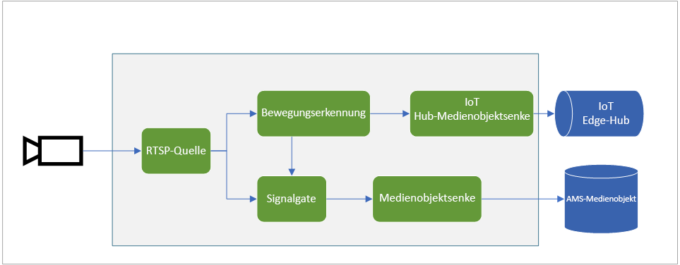
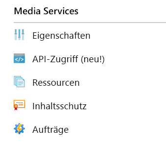

# <a name="quickstart-detect-motion-record-video-to-media-services"></a>Schnellstart: Erkennen von Bewegung, Aufzeichnen von Video in Media Services

In diesem Artikel werden die Schritte zur Verwendung von Live Video Analytics in IoT Edge für die [ereignisbasierte Aufzeichnung](event-based-video-recording-concept.md) beschrieben. Dabei werden ein virtueller Linux-Computer in Azure als IoT Edge-Gerät und ein simulierter Livevideostream verwendet. Der Videostream wird auf das Vorhandensein sich bewegender Objekte analysiert. Wenn Bewegungen erkannt werden, werden Ereignisse an Azure IoT Hub gesendet, und der relevante Teil des Videostreams wird als Medienobjekt in Azure Media Services aufgezeichnet.

Dieser Artikel baut auf dem [Schnellstart zu den ersten Schritten](get-started-detect-motion-emit-events-quickstart.md) auf.

## <a name="prerequisites"></a>Voraussetzungen

* Ein Azure-Konto mit einem aktiven Abonnement. Sie können [kostenlos ein Konto erstellen](https://azure.microsoft.com/free/?WT.mc_id=A261C142F).
* [Visual Studio Code](https://code.visualstudio.com/) mit der [Azure IoT Tools-Erweiterung](https://marketplace.visualstudio.com/items?itemName=vsciot-vscode.azure-iot-tools) auf dem Computer.
* Wenn Sie den [Schnellstart zu den ersten Schritten](get-started-detect-motion-emit-events-quickstart.md) noch nicht abgeschlossen haben, führen Sie die folgenden Schritte aus:
    * [Einrichten von Azure-Ressourcen](get-started-detect-motion-emit-events-quickstart.md#set-up-azure-resources)
    * [Bereitstellen von Modulen](get-started-detect-motion-emit-events-quickstart.md#deploy-modules-on-your-edge-device)
    * [Konfigurieren von Visual Studio Code](get-started-detect-motion-emit-events-quickstart.md#configure-the-azure-iot-tools-extension)

## <a name="review-the-sample-video"></a>Überprüfen des Beispielvideos

Als Teil der Schritte oben zum Einrichten der Azure-Ressourcen wird ein (kurzes) Video eines Parkplatzes auf den virtuellen Linux-Computer in Azure kopiert, der als IoT Edge-Gerät verwendet wird. Diese Videodatei wird zum Simulieren eines Livestreams für dieses Tutorial verwendet.

Sie können eine Anwendung wie [VLC Media Player](https://www.videolan.org/vlc/) starten, STRG+N drücken und [diesen](https://lvamedia.blob.core.windows.net/public/lots_015.mkv) Link zum Parkplatz-Video einfügen, um mit der Wiedergabe zu beginnen. Etwa bei der 5-Sekunden-Marke fährt ein weißes Fahrzeug über den Parkplatz.

Nach Abschluss der nachfolgenden Schritte haben Sie mithilfe von Live Video Analytics in IoT Edge die Bewegung des Fahrzeugs erkannt und einen Videoclip aufgezeichnet, der ungefähr bei dieser 5-Sekunden-Marke beginnt. In der Abbildung unten ist der gesamte Ablauf visuell dargestellt.



## <a name="use-direct-methods"></a>Verwenden direkter Methoden

Sie können das Modul zum Analysieren von Livevideostreams verwenden, indem Sie direkte Methoden aufrufen. Ausführliche Informationen zu allen mit dem Modul bereitgestellten direkten Methoden finden Sie unter [Direkte Methoden für Live Video Analytics in IoT Edge](direct-methods.md). 

### <a name="invoke-graphtopologylist"></a>Aufrufen von GraphTopologyList
In diesem Schritt werden alle [Graphtopologien](media-graph-concept.md#media-graph-topologies-and-instances) im Modul aufgelistet.

1. Klicken Sie mit der rechten Maustaste auf das Modul „lvaEdge“, und wählen Sie im Kontextmenü die Option „Invoke Module Direct Method“ (Direkte Methode des Moduls aufrufen) aus.
1. Oben in der Mitte des Visual Studio Code-Fensters wird ein Bearbeitungsfeld angezeigt. Geben Sie „GraphTopologyList“ im Bearbeitungsfeld ein, und drücken Sie die EINGABETASTE.
1. Kopieren Sie die folgende JSON-Nutzlast, fügen Sie sie im Bearbeitungsfeld ein, und drücken Sie die EINGABETASTE.
    
    ```
    {
        "@apiVersion" : "1.0"
    }
    ```

    Innerhalb weniger Sekunden wird im Visual Studio Code-Fenster das Ausgabefenster mit der folgenden Antwort angezeigt.
    
    ```
    [DirectMethod] Invoking Direct Method [GraphTopologyList] to [lva-sample-device/lvaEdge] ...
    [DirectMethod] Response from [lva-sample-device/lvaEdge]:
    {
      "status": 200,
      "payload": {
        "value": []
      }
    }
    ```
    
    Die Antwort oben wird erwartet, da keine Graphtopologien erstellt wurden.

### <a name="invoke-graphtopologyset"></a>Aufrufen von „GraphTopologySet“

Mithilfe der gleichen Schritte wie zum Aufrufen von GraphTopologyList können Sie GraphTopologySet aufrufen, um eine [Graphtopologie](media-graph-concept.md#media-graph-topologies-and-instances) mit dem folgenden JSON-Code als Nutzlast festzulegen. Sie erstellen die Graphtopologie „EVRtoAssetsOnMotionDetecion“.

```
{
    "@apiVersion": "1.0",
    "name": "EVRtoAssetsOnMotionDetecion",
    "properties": {
      "description": "Event-based video recording to Assets based on motion events",
      "parameters": [
        {
            "name": "rtspUserName",
            "type": "String",
            "description": "rtsp source user name.",
            "default": "dummyUserName"
        },
        {
            "name": "rtspPassword",
            "type": "String",
            "description": "rtsp source password.",
            "default" : "dummyPassword"
        },
        {
            "name": "rtspUrl",
            "type": "String",
            "description": "rtsp Url"
        },
        {
            "name": "motionSensitivity",
            "type": "String",
            "description": "motion detection sensitivity",
            "default" : "medium"
        },
        {
            "name": "hubSinkOutputName",
            "type": "String",
            "description": "hub sink output name",
            "default" : "iothubsinkoutput"
        }                              
    ],         

      "sources": [
        {
          "@type": "#Microsoft.Media.MediaGraphRtspSource",
          "name": "rtspSource",
          "endpoint": {
            "@type": "#Microsoft.Media.MediaGraphUnsecuredEndpoint",
            "url": "${rtspUrl}",
            "credentials": {
              "@type": "#Microsoft.Media.MediaGraphUsernamePasswordCredentials",
              "username": "${rtspUserName}",
              "password": "${rtspPassword}"
            }
          }
        }
      ],
      "processors": [
        {
          "@type": "#Microsoft.Media.MediaGraphMotionDetectionProcessor",
          "name": "motionDetection",
          "sensitivity": "${motionSensitivity}",
          "inputs": [
            {
              "nodeName": "rtspSource"
            }
          ]
        },
        {
          "@type": "#Microsoft.Media.MediaGraphSignalGateProcessor",
          "name": "signalGateProcessor",
          "inputs": [
            {
              "nodeName": "motionDetection"
            },
            {
              "nodeName": "rtspSource"
            }
          ],
          "activationEvaluationWindow": "PT1S",
          "activationSignalOffset": "PT0S",
          "minimumActivationTime": "PT30S",
          "maximumActivationTime": "PT30S"
        }
      ],
      "sinks": [
        {
          "@type": "#Microsoft.Media.MediaGraphAssetSink",
          "name": "assetSink",
          "assetNamePattern": "sampleAssetFromEVR-LVAEdge-${System.DateTime}",
          "segmentLength": "PT0M30S",
          "localMediaCacheMaximumSizeMiB": "2048",
          "localMediaCachePath": "/var/lib/azuremediaservices/tmp/",
          "inputs": [
            {
              "nodeName": "signalGateProcessor"
            }
          ]
        },
        {
          "@type": "#Microsoft.Media.MediaGraphIoTHubMessageSink",
          "name": "hubSink",
          "hubOutputName": "${hubSinkOutputName}",
          "inputs": [
            {
              "nodeName": "motionDetection"
            }
          ]
        }
      ]
    }
}
```

Die oben verwendete JSON-Nutzlast bewirkt, dass eine Graphtopologie erstellt wird, mit der fünf Parameter (vier davon mit Standardwerten) definiert werden. Die Topologie umfasst einen Quellknoten ([RTSP-Quelle](media-graph-concept.md#rtsp-source)), zwei Prozessorknoten ([Bewegungserkennungsprozessor](media-graph-concept.md#motion-detection-processor) und [Signalgateprozessor](media-graph-concept.md#signal-gate-processor)) und zwei Senkenknoten (IoT Hub-Senke und [Medienobjektsenke](media-graph-concept.md#asset-sink)). Die visuelle Darstellung der Topologie ist oben abgebildet.

Innerhalb weniger Sekunden wird die folgende Antwort im Ausgabefenster angezeigt.

```
[DirectMethod] Invoking Direct Method [GraphTopologySet] to [lva-sample-device/lvaEdge] ...
[DirectMethod] Response from [lva-sample-device/lvaEdge]:
{
  "status": 201,
  "payload": {
    "systemData": {
      "createdAt": "2020-05-12T22:05:31.603Z",
      "lastModifiedAt": "2020-05-12T22:05:31.603Z"
    },
    "name": "EVRtoAssetsOnMotionDetecion",
    "properties": {
      "description": "Event-based video recording to assets based on motion events",
      "parameters": [
        {
          "name": "rtspUserName",
          "type": "String",
          "description": "rtsp source user name.",
          "default": "dummyUserName"
        },
        {
          "name": "rtspPassword",
          "type": "String",
          "description": "rtsp source password.",
          "default": "dummyPassword"
        },
        {
          "name": "rtspUrl",
          "type": "String",
          "description": "rtsp Url"
        },
        {
          "name": "motionSensitivity",
          "type": "String",
          "description": "motion detection sensitivity",
          "default": "medium"
        },
        {
          "name": "hubSinkOutputName",
          "type": "String",
          "description": "hub sink output name",
          "default": "iothubsinkoutput"
        }
      ],
      "sources": [
        {
          "@type": "#Microsoft.Media.MediaGraphRtspSource",
          "name": "rtspSource",
          "transport": "Tcp",
          "endpoint": {
            "@type": "#Microsoft.Media.MediaGraphUnsecuredEndpoint",
            "url": "${rtspUrl}",
            "credentials": {
              "@type": "#Microsoft.Media.MediaGraphUsernamePasswordCredentials",
              "username": "${rtspUserName}",
              "password": "${rtspPassword}"
            }
          }
        }
      ],
      "processors": [
        {
          "@type": "#Microsoft.Media.MediaGraphMotionDetectionProcessor",
          "sensitivity": "${motionSensitivity}",
          "name": "motionDetection",
          "inputs": [
            {
              "nodeName": "rtspSource",
              "outputSelectors": []
            }
          ]
        },
        {
          "@type": "#Microsoft.Media.MediaGraphSignalGateProcessor",
          "activationEvaluationWindow": "PT1S",
          "activationSignalOffset": "PT0S",
          "minimumActivationTime": "PT30S",
          "maximumActivationTime": "PT30S",
          "name": "signalGateProcessor",
          "inputs": [
            {
              "nodeName": "motionDetection",
              "outputSelectors": []
            },
            {
              "nodeName": "rtspSource",
              "outputSelectors": []
            }
          ]
        }
      ],
      "sinks": [
        {
          "@type": "#Microsoft.Media.MediaGraphAssetSink",
          "localMediaCachePath": "/var/lib/azuremediaservices/tmp/",
          "localMediaCacheMaximumSizeMiB": "2048",
          "segmentLength": "PT0M30S",
          "assetNamePattern": "sampleAssetFromEVR-LVAEdge-${System.DateTime}",
          "name": "assetSink",
          "inputs": [
            {
              "nodeName": "signalGateProcessor",
              "outputSelectors": []
            }
          ]
        },
        {
          "@type": "#Microsoft.Media.MediaGraphIoTHubMessageSink",
          "hubOutputName": "${hubSinkOutputName}",
          "name": "hubSink",
          "inputs": [
            {
              "nodeName": "motionDetection",
              "outputSelectors": []
            }
          ]
        }
      ]
    }
  }
}
```

Der zurückgegebene Status „201“ gibt an, dass eine neue Graphtopologie erstellt wurde. Probieren Sie als nächste Schritte die folgenden direkten Methoden aus:

* Rufen Sie wieder GraphTopologySet auf, und überprüfen Sie, ob „200“ als Statuscode zurückgegeben wird. Der Statuscode „200“ gibt an, dass eine vorhandene Graphtopologie erfolgreich aktualisiert wurde.
* Rufen Sie erneut GraphTopologySet auf, ändern Sie jedoch die Beschreibungszeichenfolge. Überprüfen Sie, ob in der Antwort der Statuscode „200“ zurückgegeben und die Beschreibung auf den neuen Wert aktualisiert wurde.
* Rufen Sie wie im vorherigen Abschnitt beschrieben GraphTopologyList auf, und überprüfen Sie, ob die Graphtopologie „EVRtoAssetsOnMotionDetecion“ in der zurückgegebenen Nutzlast angezeigt wird.

### <a name="invoke-graphtopologyget"></a>Aufrufen von GraphTopologyGet

Rufen Sie nun GraphTopologyGet mit der folgenden Nutzlast auf.
```

{
    "@apiVersion" : "1.0",
    "name" : "EVRtoAssetsOnMotionDetecion"
}
```

Innerhalb weniger Sekunden sollte die folgende Antwort im Ausgabefenster angezeigt werden.

```
[DirectMethod] Invoking Direct Method [GraphTopologyGet] to [lva-sample-device/lvaEdge] ...
[DirectMethod] Response from [lva-sample-device/lvaEdge]:
{
  "status": 200,
  "payload": {
    "systemData": {
      "createdAt": "2020-05-12T22:05:31.603Z",
      "lastModifiedAt": "2020-05-12T22:05:31.603Z"
    },
    "name": "EVRtoAssetsOnMotionDetecion",
    "properties": {
      "description": "Event-based video recording to Assets based on motion events",
      "parameters": [
        {
          "name": "rtspUserName",
          "type": "String",
          "description": "rtsp source user name.",
          "default": "dummyUserName"
        },
        {
          "name": "rtspPassword",
          "type": "String",
          "description": "rtsp source password.",
          "default": "dummyPassword"
        },
        {
          "name": "rtspUrl",
          "type": "String",
          "description": "rtsp Url"
        },
        {
          "name": "motionSensitivity",
          "type": "String",
          "description": "motion detection sensitivity",
          "default": "medium"
        },
        {
          "name": "hubSinkOutputName",
          "type": "String",
          "description": "hub sink output name",
          "default": "iothubsinkoutput"
        }
      ],
      "sources": [
        {
          "@type": "#Microsoft.Media.MediaGraphRtspSource",
          "name": "rtspSource",
          "transport": "Tcp",
          "endpoint": {
            "@type": "#Microsoft.Media.MediaGraphUnsecuredEndpoint",
            "url": "${rtspUrl}",
            "credentials": {
              "@type": "#Microsoft.Media.MediaGraphUsernamePasswordCredentials",
              "username": "${rtspUserName}",
              "password": "${rtspPassword}"
            }
          }
        }
      ],
      "processors": [
        {
          "@type": "#Microsoft.Media.MediaGraphMotionDetectionProcessor",
          "sensitivity": "${motionSensitivity}",
          "name": "motionDetection",
          "inputs": [
            {
              "nodeName": "rtspSource",
              "outputSelectors": []
            }
          ]
        },
        {
          "@type": "#Microsoft.Media.MediaGraphSignalGateProcessor",
          "activationEvaluationWindow": "PT1S",
          "activationSignalOffset": "PT0S",
          "minimumActivationTime": "PT30S",
          "maximumActivationTime": "PT30S",
          "name": "signalGateProcessor",
          "inputs": [
            {
              "nodeName": "motionDetection",
              "outputSelectors": []
            },
            {
              "nodeName": "rtspSource",
              "outputSelectors": []
            }
          ]
        }
      ],
      "sinks": [
        {
          "@type": "#Microsoft.Media.MediaGraphAssetSink",
          "localMediaCachePath": "/var/lib/azuremediaservices/tmp/",
          "localMediaCacheMaximumSizeMiB": "2048",
          "segmentLength": "PT0M30S",
          "assetNamePattern": "sampleAssetFromEVR-LVAEdge-${System.DateTime}",
          "name": "assetSink",
          "inputs": [
            {
              "nodeName": "signalGateProcessor",
              "outputSelectors": []
            }
          ]
        },
        {
          "@type": "#Microsoft.Media.MediaGraphIoTHubMessageSink",
          "hubOutputName": "${hubSinkOutputName}",
          "name": "hubSink",
          "inputs": [
            {
              "nodeName": "motionDetection",
              "outputSelectors": []
            }
          ]
        }
      ]
    }
  }
}
```

Beachten Sie die folgenden Eigenschaften in der Antwortnutzlast:

* Der Statuscode lautet „200“ und gibt somit die erfolgreiche Ausführung an.
* Die Nutzlast hat die Zeitstempel „created“ und „lastModified“.

### <a name="invoke-graphinstanceset"></a>Aufrufen von „GraphInstanceSet“

Erstellen Sie als Nächstes eine Graphinstanz, die auf die obige Graphtopologie verweist. Wie [hier](media-graph-concept.md#media-graph-topologies-and-instances) erläutert, können Sie mit Graphinstanzen Livevideostreams von vielen Kameras mit der gleichen Graphtopologie analysieren.

Rufen Sie nun die direkte Methode für GraphInstanceSet mit der folgenden Nutzlast auf:

```
{
    "@apiVersion" : "1.0",
    "name" : "Sample-Graph-2",
    "properties" : {
        "topologyName" : "EVRtoAssetsOnMotionDetecion",
        "description" : "Sample graph description",
        "parameters" : [
            { "name" : "rtspUrl", "value" : "rtsp://rtspsim:554/media/lots_015.mkv" }
        ]
    }
}
```

Beachten Sie Folgendes:

* Die Nutzlast oben gibt den Namen der Graphtopologie (EVRtoAssetsOnMotionDetecion) an, für die die Graphinstanz erstellt werden muss.
* Die Nutzlast enthält den Parameterwert für „rtspUrl“, da die Topologienutzlast dafür keinen Standardwert enthält.

Innerhalb weniger Sekunden wird die folgende Antwort im Ausgabefenster angezeigt:

```
[DirectMethod] Invoking Direct Method [GraphInstanceSet] to [lva-sample-device/lvaEdge] ...
[DirectMethod] Response from [lva-sample-device/lvaEdge]:
{
  "status": 201,
  "payload": {
    "systemData": {
      "createdAt": "2020-05-12T23:30:20.666Z",
      "lastModifiedAt": "2020-05-12T23:30:20.666Z"
    },
    "name": "Sample-Graph-2",
    "properties": {
      "state": "Inactive",
      "description": "Sample graph description",
      "topologyName": "EVRtoAssetsOnMotionDetecion",
      "parameters": [
        {
          "name": "rtspUrl",
          "value": "rtsp://rtspsim:554/media/lots_015.mkv"
        }
      ]
    }
  }
}
```

Beachten Sie die folgenden Eigenschaften in der Antwortnutzlast:

* Der Statuscode lautet „201“. Dadurch wird angegeben, dass eine neue Instanz erstellt wurde.
* Der Status ist „Inactive“ und gibt somit an, dass die Graphinstanz erstellt, jedoch nicht aktiviert wurde. Weitere Informationen finden Sie unter den Status des [Mediengraphen](media-graph-concept.md).

Probieren Sie als nächste Schritte die folgenden direkten Methoden aus:

* Rufen Sie wieder GraphInstanceSet mit der gleichen Nutzlast auf. Sie werden feststellen, dass nun „200“ als Statuscode zurückgegeben wird.
* Rufen Sie erneut GraphInstanceSet auf, jedoch mit einer anderen Beschreibung. Beachten Sie die aktualisierte Beschreibung in der Antwortnutzlast, durch die angegeben wird, dass die Graphinstanz erfolgreich aktualisiert wurde.
* Rufen Sie GraphInstanceSet auf, ändern Sie den Namen in „Sample-Graph-3“, und sehen Sie sich die Antwortnutzlast an. Hier werden Sie feststellen, dass eine neue Graphinstanz erstellt wurde (d. h., der Statuscode lautet „201“). Vergessen Sie nicht, diese doppelten Instanzen zu löschen, wenn Sie den Schnellstart abgeschlossen haben.

### <a name="prepare-for-monitoring-events"></a>Vorbereiten der Überwachung von Ereignissen

In dem erstellten Mediengraphen werden mithilfe des Knotens des Bewegungserkennungsprozessors Bewegungen erkannt. Diese Ereignisse werden an den IoT-Hub weitergeleitet. Führen Sie die folgenden Schritte aus, um die Überwachung dieser Ereignisse vorzubereiten.

1. Öffnen Sie den Explorer-Bereich in Visual Studio Code, und suchen Sie unten links nach „Azure IoT Hub“.
1. Erweitern Sie den Knoten „Geräte“.
1. Klicken Sie mit der rechten Maustaste auf „lva-sample-device“, und wählen Sie die Option „Überwachung des integrierten Ereignisendpunkts starten“ aus.

    
    
    Innerhalb von Sekunden werden die folgenden Nachrichten im Ausgabefenster angezeigt:

    ```
    [IoTHubMonitor] Start monitoring message arrived in built-in endpoint for all devices ...
    [IoTHubMonitor] Created partition receiver [0] for consumerGroup [$Default]
    [IoTHubMonitor] Created partition receiver [1] for consumerGroup [$Default]
    [IoTHubMonitor] Created partition receiver [2] for consumerGroup [$Default]
    [IoTHubMonitor] Created partition receiver [3] for consumerGroup [$Default]
    ```

### <a name="invoke-graphinstanceactivate"></a>Aufrufen von GraphInstanceActivate

Aktivieren Sie nun die Graphinstanz, die den Flow von Livevideos über das Modul startet. Rufen Sie die direkte Methode für GraphInstanceActivate mit der folgenden Nutzlast auf:

```
{
    "@apiVersion" : "1.0",
    "name" : "Sample-Graph-2"
}
```

Innerhalb weniger Sekunden sollte die folgende Antwort im Ausgabefenster angezeigt werden.

```
[DirectMethod] Invoking Direct Method [GraphInstanceActivate] to [lva-sample-device/lvaEdge] ...
[DirectMethod] Response from [lva-sample-device/lvaEdge]:
{
  "status": 200,
  "payload": null
}
```

Der Statuscode „200“ in der Antwortnutzlast gibt an, dass die Graphinstanz erfolgreich aktiviert wurde.

### <a name="invoke-graphinstanceget"></a>Aufrufen von GraphInstanceGet

Rufen Sie nun die direkte Methode für GraphInstanceGet mit der folgenden Nutzlast auf:

```
{
    "@apiVersion" : "1.0",
    "name" : "Sample-Graph-2"
}
```

Innerhalb weniger Sekunden sollte die folgende Antwort im Ausgabefenster angezeigt werden.

```
[DirectMethod] Invoking Direct Method [GraphInstanceGet] to [lva-sample-device/lvaEdge] ...
[DirectMethod] Response from [lva-sample-device/lvaEdge]:
{
  "status": 200,
  "payload": {
    "systemData": {
      "createdAt": "2020-05-12T23:30:20.666Z",
      "lastModifiedAt": "2020-05-12T23:30:20.666Z"
    },
    "name": "Sample-Graph-2",
    "properties": {
      "state": "Active",
      "description": "Sample graph description",
      "topologyName": "EVRtoAssetsOnMotionDetecion",
      "parameters": [
        {
          "name": "rtspUrl",
          "value": "rtsp://rtspsim:554/media/lots_015.mkv"
        }
      ]
    }
  }
}
```

Beachten Sie die folgenden Eigenschaften in der Antwortnutzlast:

* Der Statuscode lautet „200“ und gibt somit die erfolgreiche Ausführung an.
* Der Status „Active“ gibt an, dass sich die Graphinstanz nun im aktiven Status befindet.

## <a name="observe-results"></a>Überprüfen der Ergebnisse

In der zuvor erstellten und aktivierten Graphinstanz wird der Knoten des Bewegungserkennungsprozessors verwendet, um Bewegungen im eingehenden Livevideostream zu erkennen. Dann werden Ereignisse an die IoT Hub-Senke gesendet. Diese Ereignisse werden anschließend an den IoT-Hub weitergeleitet. Dies lässt sich nun überprüfen. Im Ausgabefenster werden die folgenden Nachrichten angezeigt.

```
[IoTHubMonitor] [4:33:04 PM] Message received from [lva-sample-device/lvaEdge]:
{
  "body": {
    "sdp": "SDP:\nv=0\r\no=- 1589326384077235 1 IN IP4 XXX.XX.XX.XXX\r\ns=Matroska video+audio+(optional)subtitles, streamed by the LIVE555 Media Server\r\ni=media/lots_015.mkv\r\nt=0 0\r\na=tool:LIVE555 Streaming Media v2020.04.12\r\na=type:broadcast\r\na=control:*\r\na=range:npt=0-73.000\r\na=x-qt-text-nam:Matroska video+audio+(optional)subtitles, streamed by the LIVE555 Media Server\r\na=x-qt-text-inf:media/lots_015.mkv\r\nm=video 0 RTP/AVP 96\r\nc=IN IP4 0.0.0.0\r\nb=AS:500\r\na=rtpmap:96 H264/90000\r\na=fmtp:96 packetization-mode=1;profile-level-id=640028;sprop-parameter-sets=XXXXXXXXXXXXXXXXXXXXXXXXXXXXXXXXXXX\r\na=control:track1\r\n"
  },
  "applicationProperties": {
    "topic": "/subscriptions/{subscriptionId}/resourceGroups/{resourceGroupName}/providers/microsoft.media/mediaservices/{amsAccountName}",
    "subject": "/graphInstances/Sample-Graph-2/sources/rtspSource",
    "eventType": "Microsoft.Media.Graph.Diagnostics.MediaSessionEstablished",
    "eventTime": "2020-05-12T23:33:04.077Z",
    "dataVersion": "1.0"
  }
}
[IoTHubMonitor] [4:33:09 PM] Message received from [lva-sample-device/lvaEdge]:
{
  "body": {
    "timestamp": 143039375044290,
    "inferences": [
      {
        "type": "motion",
        "motion": {
          "box": {
            "l": 0.48954,
            "t": 0.140741,
            "w": 0.075,
            "h": 0.058824
          }
        }
      }
    ]
  },
  "applicationProperties": {
    "topic": "/subscriptions/{subscriptionId}/resourceGroups/{resourceGroupName}/providers/microsoft.media/mediaservices/{amsAccountName}",
    "subject": "/graphInstances/Sample-Graph-2/processors/md",
    "eventType": "Microsoft.Media.Graph.Analytics.Inference",
    "eventTime": "2020-05-12T23:33:09.381Z",
    "dataVersion": "1.0"
  }
}
```

Beachten Sie in diesen Nachrichten die folgenden Eigenschaften:

* Jede Nachricht enthält einen Abschnitt „body“ und einen Abschnitt „applicationProperties“. Informationen zu diesen Abschnitten finden Sie im Artikel [Erstellen und Lesen von IoT Hub-Nachrichten](https://docs.microsoft.com/azure/iot-hub/iot-hub-devguide-messages-construct).
* Die erste Nachricht betrifft das Diagnoseereignis MediaSessionEstablished und gibt an, dass der Knoten der RTSP-Quelle (subject) eine Verbindung mit dem RTSP-Simulator herstellen und der Empfang eines (simulierten) Livefeeds beginnen konnte.
* „subject“ in applicationProperties verweist auf den Knoten in der Graphtopologie, über den die Nachricht generiert wurde. In diesem Fall stammt die Nachricht vom RTSP-Quellknoten.
* „eventType“ in „applicationProperties“ gibt an, dass es sich um ein Diagnoseereignis handelt.
* „eventTime“ gibt den Zeitpunkt an, zu dem das Ereignis eingetreten ist.
* „body“ enthält Daten zum Diagnoseereignis, d. h. die [SDP](https://en.wikipedia.org/wiki/Session_Description_Protocol)-Nachricht.
* Die zweite Nachricht betrifft ein Analyseereignis. Sie können überprüfen, ob die Nachricht ungefähr 5 Sekunden nach der Nachricht „MediaSessionEstablished“ gesendet wird. Dies entspricht der Verzögerung zwischen dem Start des Videos und dem Zeitpunkt, zu dem das Fahrzeug durch den Parkplatz fährt.
* „subject“ in applicationProperties verweist auf den Knoten des Bewegungserkennungsprozessors im Graphen, über den die Nachricht generiert wird.
* Das Ereignis ist ein Rückschlussereignis. Daher enthält „body“ Daten für „timestamp“ und „inferences“.
* Der Abschnitt „inferences“ gibt an, dass „type“ den Wert „motion“ aufweist, und enthält zusätzliche Daten zum Ereignis „motion“.

Als Nächstes wird die folgende Nachricht angezeigt.

```
[IoTHubMonitor] [4:33:10 PM] Message received from [lva-sample-device/lvaEdge]:
{
  "body": {
    "outputType": "assetName",
    "outputLocation": "sampleAssetFromEVR-LVAEdge-20200512T233309Z"
  },
  "applicationProperties": {
    "topic": "/subscriptions/{subscriptionId}/resourceGroups/{resourceGroupName}/providers/microsoft.media/mediaservices/{amsAccountName}",
    "subject": "/graphInstances/Sample-Graph-2/sinks/assetSink",
    "eventType": "Microsoft.Media.Graph.Operational.RecordingStarted",
    "eventTime": "2020-05-12T23:33:10.392Z",
    "dataVersion": "1.0"
  }
}
```

* Die dritte Nachricht betrifft ein Betriebsereignis. Sie können überprüfen, ob diese Nachricht fast unmittelbar nach der Nachricht zur Bewegungserkennung gesendet wird, die als Trigger zum Starten der Aufzeichnung diente.
* „subject“ in applicationProperties verweist auf den Knoten der Medienobjektsenke im Graphen, über den die Nachricht generiert wird.
* „body“ enthält Informationen zum Ausgabespeicherort, in diesem Fall den Namen des Azure Media Services-Medienobjekts, in dem das Video aufgezeichnet wird. Notieren Sie sich diesen Wert: Sie verwenden ihn später in diesem Schnellstart.

In der Topologie wurde der Knoten des Signalgateprozessors mit Aktivierungszeiten von 30 Sekunden konfiguriert. Das heißt, dass die Graphtopologie Videoclips mit einer Länge von ungefähr 30 Sekunden im Medienobjekt aufzeichnet. Während der Aufzeichnung des Videos gibt der Knoten des Bewegungserkennungsprozessors weiterhin Rückschlussereignisse aus, die im Ausgabefenster angezeigt werden. Nach einiger Zeit wird die folgende Nachricht angezeigt.

```
[IoTHubMonitor] [4:33:31 PM] Message received from [lva-sample-device/lvaEdge]:
{
  "body": {
    "outputType": "assetName",
    "outputLocation": "sampleAssetFromEVR-LVAEdge-20200512T233309Z"
  },
  "applicationProperties": {
    "topic": "/subscriptions/{subscriptionId}/resourceGroups/{resourceGroupName}/providers/microsoft.media/mediaservices/{amsAccountName}",
    "subject": "/graphInstances/Sample-Graph-2/sinks/assetSink",
    "eventType": "Microsoft.Media.Graph.Operational.RecordingAvailable",
    "eventTime": "2020-05-12T23:33:31.051Z",
    "dataVersion": "1.0"
  }
}
```

* Auch diese Nachricht betrifft ein Betriebsereignis. Das Ereignis „RecordingAvailable“ gibt an, dass ausreichend Daten in das Medienobjekt geschrieben wurden, sodass die Wiedergabe des Videos in Playern und Clients initiiert werden kann.
* „subject“ in applicationProperties verweist auf den Knoten der Medienobjektsenke im Graphen, über den die Nachricht generiert wird.
* „body“ enthält Informationen zum Ausgabespeicherort, in diesem Fall den Namen des Azure Media Services-Medienobjekts, in dem das Video aufgezeichnet wird.

Wenn Sie die Graphinstanz weiterhin ausführen, wird die folgende Nachricht angezeigt.

```
[IoTHubMonitor] [4:33:40 PM] Message received from [lva-sample-device/lvaEdge]:
{
  "body": {
    "outputType": "assetName",
    "outputLocation": "sampleAssetFromEVR-LVAEdge-20200512T233309Z"
  },
  "applicationProperties": {
    "topic": "/subscriptions/{subscriptionId}/resourceGroups/{resourceGroupName}/providers/microsoft.media/mediaservices/{amsAccountName}",
    "subject": "/graphInstances/Sample-Graph-2/sinks/assetSink",
    "eventType": "Microsoft.Media.Graph.Operational.RecordingStopped",
    "eventTime": "2020-05-12T23:33:40.014Z",
    "dataVersion": "1.0"
  }
}
```

* Auch diese Nachricht betrifft ein Betriebsereignis. Das Ereignis „RecordingStopped“ gibt an, dass die Aufzeichnung beendet wurde.
* Beachten Sie, dass seit dem Ereignis „RecordingStarted“ ungefähr 30 Sekunden vergangen sind. Dies stimmt mit den Werten der Aktivierungszeiten im Knoten des Signalgateprozessors überein.
* „subject“ in applicationProperties verweist auf den Knoten der Medienobjektsenke im Graphen, über den die Nachricht generiert wird.
* „body“ enthält Informationen zum Ausgabespeicherort, in diesem Fall den Namen des Azure Media Services-Medienobjekts, in dem das Video aufgezeichnet wird.

Wenn die Graphinstanz weiterhin ausgeführt wird, erreicht der RTSP-Simulator das Ende der Videodatei und beendet bzw. trennt die Verbindung. Der Knoten der RTSP-Quelle stellt dann erneut eine Verbindung mit dem Simulator her, und der Prozess wird wiederholt.
    
## <a name="invoke-additional-direct-methods-to-clean-up"></a>Aufrufen zusätzlicher direkter Methoden zur Bereinigung

Rufen Sie nun direkte Methoden auf, um die Graphinstanz zu deaktivieren und zu löschen (in dieser Reihenfolge).

### <a name="invoke-graphinstancedeactivate"></a>Aufrufen von GraphInstanceDeactivate

Rufen Sie die direkte Methode für GraphInstanceDeactivate mit der folgenden Nutzlast auf:

```
{
    "@apiVersion" : "1.0",
    "name" : "Sample-Graph-2"
}
```

Innerhalb weniger Sekunden sollte die folgende Antwort im Ausgabefenster angezeigt werden.

```
[DirectMethod] Invoking Direct Method [GraphInstanceDeactivate] to [lva-sample-device/lvaEdge] ...
[DirectMethod] Response from [lva-sample-device/lvaEdge]:
{
  "status": 200,
  "payload": null
}
```

Der Statuscode „200“gibt an, dass die Graphinstanz erfolgreich deaktiviert wurde.

Testen Sie im nächsten Schritt Folgendes:

* Rufen Sie GraphInstanceGet wie in den vorherigen Abschnitten beschrieben auf, und überprüfen Sie den Wert für „state“.

### <a name="invoke-graphinstancedelete"></a>Aufrufen von „GraphInstanceDelete“

Rufen Sie die direkte Methode für „GraphInstanceDelete“ mit der folgenden Nutzlast auf:

```
{
    "@apiVersion" : "1.0",
    "name" : "Sample-Graph-2"
}
```

Innerhalb weniger Sekunden sollte die folgende Antwort im Ausgabefenster angezeigt werden:

```
[DirectMethod] Invoking Direct Method [GraphInstanceDelete] to [lva-sample-device/lvaEdge] ...
[DirectMethod] Response from [lva-sample-device/lvaEdge]:
{
  "status": 200,
  "payload": null
}
```

Der Statuscode „200“ in der Antwort gibt an, dass die Graphinstanz erfolgreich gelöscht wurde.

### <a name="invoke-graphtopologydelete"></a>Aufrufen von GraphTopologyDelete

Rufen Sie die direkte Methode für GraphTopologyDelete mit der folgenden Nutzlast auf:

```
{
    "@apiVersion" : "1.0",
    "name" : "EVRtoAssetsOnMotionDetecion"
}
```

Innerhalb weniger Sekunden sollte die folgende Antwort im Ausgabefenster angezeigt werden.

```
[DirectMethod] Invoking Direct Method [GraphTopologyDelete] to [lva-sample-device/lvaEdge] ...
[DirectMethod] Response from [lva-sample-device/lvaEdge]:
{
  "status": 200,
  "payload": null
}
```

Der Statuscode „200“gibt an, dass die Mediengraphtopologie erfolgreich deaktiviert wurde.

Probieren Sie als nächste Schritte die folgenden direkten Methoden aus:

* Rufen Sie GraphTopologyList auf, und Sie werden sehen, dass keine Graphtopologien im Modul vorhanden sind.
* Rufen Sie GraphInstanceList mit der gleichen Nutzlast wie GraphTopologyList auf, und Sie werden sehen, dass keine Graphinstanzen aufgelistet sind.

## <a name="playing-back-the-recorded-video"></a>Wiedergeben des aufgezeichneten Videos

Als Nächstes können Sie im Azure-Portal das aufgezeichnete Video wiedergeben.

1. Melden Sie sich beim [Azure-Portal](https://portal.azure.com/) an, und geben Sie „Media Services“ im Suchfeld ein.
1. Navigieren Sie zu Ihrem Azure Media Services-Konto, und öffnen Sie es.
1. Suchen Sie den Medienobjekteintrag in der Media Services-Liste, und wählen Sie ihn aus.

    
1. Wenn Sie Azure Media Services in diesem Schnellstart zum ersten Mal verwenden, sind nur die anhand dieser Anleitung generierten Medienobjekte aufgeführt, und Sie können das älteste auswählen.
1. Verwenden Sie andernfalls das Medienobjekt, dessen Name in den Betriebsereignissen weiter oben als Ausgabespeicherort (outputLocation) angegeben wurde.
1. Klicken Sie auf der dann geöffneten Detailseite auf den Link „Neu erstellen“ unterhalb des Textfelds „Streaming-URL“.

    
1. Übernehmen Sie im dann geöffneten Bereich die Standardwerte unter „Streaminglocator hinzufügen“, und klicken Sie unten im Bereich auf „Hinzufügen“.
1. Auf der Detailseite des Medienobjekts sollte nun im Videoplayer der erste Frame des Videos geladen werden. Sie können dann auf die Schaltfläche für die Wiedergabe klicken. Überprüfen Sie, ob der Teil des Videos gezeigt wird, in dem das Fahrzeug über den Parkplatz fährt.

    

> [!NOTE]
> Da das simulierte Livevideo gestartet wird, wenn Sie den Graphen aktivieren, sind die Zeitwerte nicht relevant und werden über diese Playerverknüpfung nicht angezeigt. Im Tutorial zur fortlaufenden Videoaufzeichnung und -wiedergabe wird beschrieben, wie Sie die Zeitstempel anzeigen können.

## <a name="clean-up-resources"></a>Bereinigen von Ressourcen

Wenn Sie diese Anwendung nicht weiterverwenden möchten, sollten Sie die in diesem Schnellstart erstellten Ressourcen löschen.

## <a name="next-steps"></a>Nächste Schritte

* Erfahren Sie, wie Sie die [direkten Methoden](direct-methods.md) von Live Video Analytics in IoT Edge programmgesteuert aufrufen können.
* Erfahren Sie mehr über Diagnosenachrichten.    
