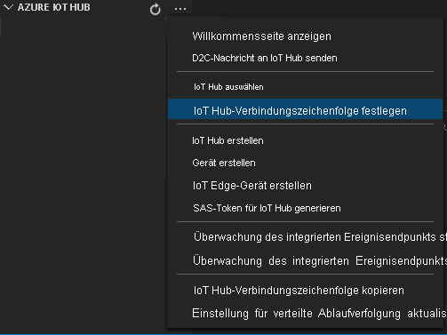

Mit dem Bereitstellungsmanifest wird definiert, welche Module auf einem Edgegerät bereitgestellt werden. Darüber hinaus werden auch die Konfigurationseinstellungen für diese Module definiert. 

Führen Sie die folgenden Schritte aus, um das Manifest auf der Grundlage der Vorlagendatei zu generieren und dann auf dem Edgegerät bereitzustellen.

1. Öffnen Sie Visual Studio Code.
1. Wählen Sie neben dem Bereich **AZURE IOT HUB** das Symbol **Weitere Aktionen** aus, um die IoT Hub-Verbindungszeichenfolge festzulegen. Sie können die Zeichenfolge aus der Datei *src/cloud-to-device-console-app/appsettings.json* kopieren. 

    

> [!NOTE]
> Unter Umständen werden Sie aufgefordert, für die IoT Hub-Instanz die Informationen zum integrierten Endpunkt anzugeben. Sie erhalten diese Informationen, indem Sie im Azure-Portal zu Ihrer IoT Hub-Instanz navigieren und im linken Navigationsbereich nach der Option **Integrierte Endpunkte** suchen. Klicken Sie darauf, und suchen Sie im Abschnitt **Event Hub-kompatibler Endpunkt** nach dem **Event Hub-kompatiblen Endpunkt**. Kopieren und verwenden Sie den im Feld enthaltenen Text. Der Endpunkt sieht in etwa wie folgt aus:  
    ```
    Endpoint=sb://iothub-ns-xxx.servicebus.windows.net/;SharedAccessKeyName=iothubowner;SharedAccessKey=XXX;EntityPath=<IoT Hub name>
    ```

1. Klicken Sie mit der rechten Maustaste auf **src/edge/deployment.template.json**, und klicken Sie dann auf **IoT Edge-Bereitstellungsmanifest generieren**.

    

    Mit dieser Aktion sollte eine Manifestdatei mit dem Namen *deployment.amd64.json* im Ordner *src/edge/config* erstellt werden.
1. Klicken Sie mit der rechten Maustaste auf **src/edge/config/deployment.amd64.json**, und wählen Sie **Create Deployment for Single Device** (Bereitstellung für einzelnes Gerät erstellen) und dann den Namen Ihres Edgegeräts aus.

    

1. Wählen Sie bei Anzeige der Aufforderung zum Auswählen eines IoT Hub-Geräts im Dropdownmenü die Option **lva-sample-device** aus.
1. Aktualisieren Sie nach ungefähr 30 Sekunden unten links im Fenster den Dienst „Azure IoT Hub“. Das Edgegerät zeigt nun die folgenden bereitgestellten Module an:

    * Live Video Analytics in IoT Edge (Modulname: `lvaEdge`)
    * RTSP-Simulator (Real-Time Streaming Protocol) (Modulname: `rtspsim`)

Das RTSP-Simulatormodul simuliert einen Livevideostream. Hierfür wird eine Videodatei verwendet, die beim Ausführen des [Setupskripts für Live Video Analytics-Ressourcen](https://github.com/Azure/live-video-analytics/tree/master/edge/setup) auf Ihr Edgegerät kopiert wurde. 

> [!NOTE]
> Wenn Sie anstelle des vom Setupskript bereitgestellten Edgegeräts Ihr eigenes Edgegerät verwenden, navigieren Sie zu diesem Gerät, und führen Sie die folgenden Befehle mit **Administratorrechten** aus, um die für diese Schnellstartanleitung verwendete Beispielvideodatei zu pullen und zu speichern.  

```
mkdir /home/lvaadmin/samples      
mkdir /home/lvaadmin/samples/input    
curl https://lvamedia.blob.core.windows.net/public/camera-300s.mkv > /home/lvaadmin/samples/input/camera-300s.mkv  
chown -R lvaadmin /home/lvaadmin/samples/  
```
An diesem Punkt werden die Module bereitgestellt, aber es sind keine Mediengraphen aktiv.
