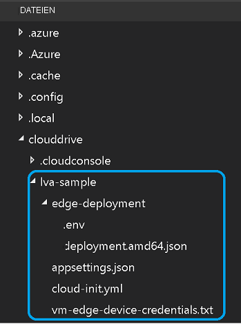

Für dieses Tutorial werden die folgenden Azure-Ressourcen benötigt:

* IoT Hub
* Speicherkonto
* Azure Media Services-Konto
* Virtueller Linux-Computer in Azure mit installierter [IoT Edge-Runtime](../../../../../iot-edge/how-to-install-iot-edge.md)

Für diese Schnellstartanleitung wird die Verwendung des [Setupskripts für Live Video Analytics-Ressourcen](https://github.com/Azure/live-video-analytics/tree/master/edge/setup) zum Bereitstellen der erforderlichen Ressourcen in Ihrem Azure-Abonnement empfohlen. Gehen Sie dazu folgendermaßen vor:

1. Öffnen Sie [Azure Cloud Shell](https://shell.azure.com).
1. Wenn Sie Cloud Shell zum ersten Mal verwenden, werden Sie aufgefordert, ein Abonnement auszuwählen, um ein Speicherkonto und eine Microsoft Azure Files-Freigabe zu erstellen. Wählen Sie **Speicher erstellen** aus, um ein Speicherkonto für die Cloud Shell-Sitzungsinformationen zu erstellen. Dieses Speicherkonto ist von dem Konto getrennt, das vom Skript für die Verwendung mit Ihrem Azure Media Services-Konto erstellt wird.
1. Wählen Sie auf der linken Seite des Cloud Shell-Fensters im Dropdownmenü **Bash** als Option für die Umgebung aus.

    
1. Führen Sie den folgenden Befehl aus.

    ```
    bash -c "$(curl -sL https://aka.ms/lva-edge/setup-resources-for-samples)"
    ```
    
    Wenn die Ausführung des Skripts erfolgreich abgeschlossen wird, sollten alle erforderlichen Ressourcen Ihres Abonnements angezeigt werden.
1. Wählen Sie nach Abschluss des Skripts die geschweiften Klammern aus, um die Ordnerstruktur verfügbar zu machen. Im Verzeichnis *~/clouddrive/lva-sample* werden einige Dateien angezeigt. Folgende Dateien sind für diese Schnellstartanleitung von Interesse:

     * * **~/clouddrive/lva-sample/edge-deployment/.env** _: Diese Datei enthält Eigenschaften, die von Visual Studio Code zum Bereitstellen von Modulen auf einem Edgegerät verwendet werden.
     _ ***~/clouddrive/lva-sample/appsetting.json***: Diese Datei wird von Visual Studio Code verwendet, um den Beispielcode auszuführen.
     
    Sie benötigen diese Dateien, wenn Sie im nächsten Abschnitt Ihre Entwicklungsumgebung in Visual Studio Code einrichten. Sie können sie bei Bedarf vorerst in eine lokale Datei kopieren.
    
    
