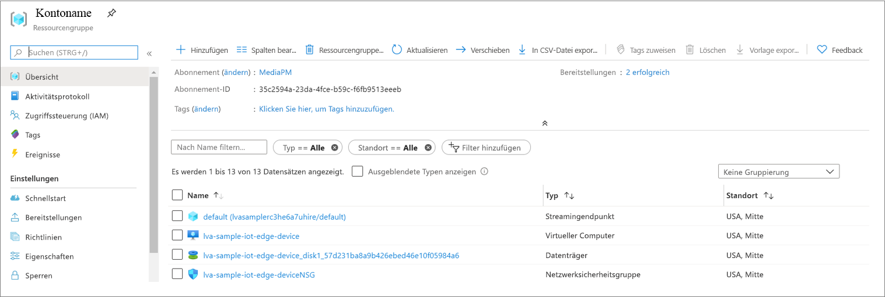
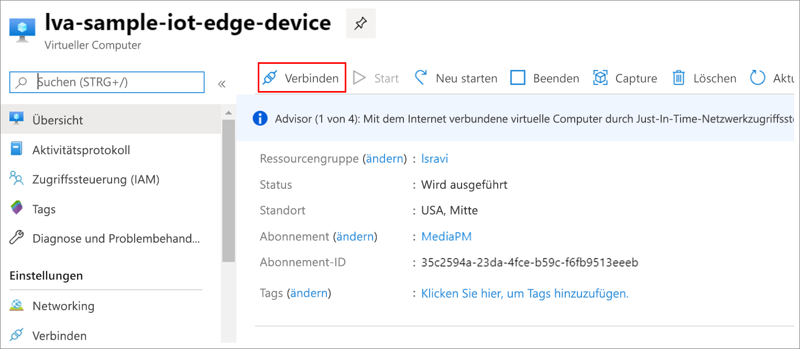

Die MP4-Dateien werden in ein Verzeichnis auf dem Edgegerät geschrieben, das Sie in der *ENV*-Datei mit dem Schlüssel OUTPUT_VIDEO_FOLDER_ON_DEVICE konfiguriert haben. Wenn Sie den Standardwert übernommen haben, befinden sich die Ergebnisse im Ordner */var/media/* .

Geben Sie den MP4-Clip wie folgt wieder:

1. Navigieren Sie zu Ihrer Ressourcengruppe, suchen Sie nach dem virtuellen Computer, und stellen Sie dann eine Verbindung per Azure Bastion her.

    
    
    
1. Melden Sie sich mit den Anmeldeinformationen an, die beim [Einrichten Ihrer Azure-Ressourcen](../../../detect-motion-emit-events-quickstart.md#set-up-azure-resources) generiert wurden. 
1. Navigieren Sie über die Eingabeaufforderung zum entsprechenden Verzeichnis. Der Standardspeicherort lautet */var/media*. Die MP4-Dateien sollten im Verzeichnis angezeigt werden.

     

1. Verwenden Sie [Secure Copy (SCP)](../../../../../virtual-machines/linux/copy-files-to-linux-vm-using-scp.md), um die Dateien auf Ihren lokalen Computer zu kopieren. 
1. Geben Sie die Dateien mit dem [VLC Media Player](https://www.videolan.org/vlc/) oder einem anderen MP4-Player wieder.
