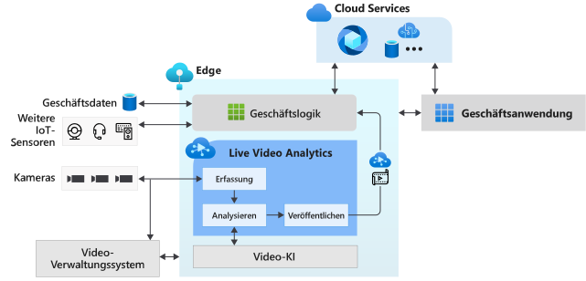

# Was ist Live Video Analytics in IoT Edge? (Vorschauversion)

Live Video Analytics in IoT Edge ist eine Plattform zum Erstellen intelligenter Videoanwendungen, die den Edge und die Cloud umfassen. Die Plattform bietet die Möglichkeit, Livevideos zu erfassen, aufzuzeichnen und zu analysieren sowie die Ergebnisse (Video und Videoanalyse) in Azure-Diensten (in der Cloud oder im Edge) zu veröffentlichen. Über die Plattform können IoT-Lösungen durch Videoanalyse verbessert werden. Die Live Video Analytics in IoT Edge-Funktionalität kann mit anderen Azure IoT Edge-Modulen, z. B. Stream Analytics in IoT Edge oder Cognitive Services in IoT Edge, sowie mit Azure-Diensten in der Cloud wie beispielsweise Media Services, Event Hub, Cognitive Services usw. kombiniert werden, um leistungsfähige Hybridanwendungen (z. B. Edge und Cloud) zu erstellen.

Live Video Analytics in IoT Edge ist als erweiterbare Plattform konzipiert und ermöglicht Ihnen die Verbindung mit verschiedenen Edgemodulen für die Videoanalyse (z. B. Cognitive Services-Container, von Ihnen entwickelte benutzerdefinierte Edgemodule mit Open-Source-Machine Learning-Modellen oder benutzerdefinierte Modelle, die mit Ihren eigenen Daten trainiert werden) und ihre Verwendung zum Analysieren von Livevideos, ohne dass Sie sich Gedanken über die komplexen Aufgaben zum Erstellen und Ausführen einer Livevideo-Pipeline machen müssen.

## Beschleunigte Entwicklung von IoT-Lösungen 

Mithilfe von IoT-Lösungen, bei denen Videoanalysen mit Signalen anderer IoT-Sensoren oder Geschäftsdaten kombiniert werden, können Sie Geschäftsentscheidungen vollständig oder teilweise automatisieren und dadurch Produktivitätsverbesserungen erzielen. Mit Live Video Analytics in IoT Edge können Sie solche Lösungen schneller erstellen. Sie können sich auf das Entwickeln der Module für die Videoanalyse und die unternehmensspezifische Logik konzentrieren, während die Komplexität der Verwaltung und Ausführung einer Videopipeline über die Plattform abstrahiert wird.

Mit Live Video Analytics in IoT Edge können Sie weiterhin Ihre [CCTV-Kameras](https://en.wikipedia.org/wiki/Closed-circuit_television_camera) mit den vorhandenen [Videomanagementsystemen (VMS)](https://en.wikipedia.org/wiki/Video_management_system) verwenden und Anwendungen für die Videoanalyse unabhängig entwickeln. Live Video Analytics in IoT Edge kann in Verbindung mit SDKs und Tools für maschinelles Sehen verwendet werden, um innovative IoT-Lösungen zu entwickeln. Dies wird im folgenden Diagramm verdeutlicht.

## Unterstützte Umgebungen

x86-64- und ARM64-Umgebungen von Linux werden unterstützt.
> [!NOTE]
> ARM64-Geräte werden ab Build `1.0.4` unterstützt.
> Die Unterstützung für die Ausführung der Azure IoT Edge-Runtime auf ARM64-Geräten ist in der [öffentlichen Vorschau](https://azure.microsoft.com/support/legal/preview-supplemental-terms/) verfügbar.

## Erste Schritte

Lesen Sie die folgenden Konzeptartikel, und führen Sie mithilfe eines Schnellstarts die Bewegungserkennung in einem Livevideofeed aus.

### Konzepte

* [Mediendiagramm](media-graph-concept.md)
* [Videoaufzeichnung](video-recording-concept.md)
* [Videowiedergabe](video-playback-concept.md)
* [Fortlaufende Videoaufzeichnung](continuous-video-recording-concept.md)
* [Ereignisbasierte Videoaufzeichnung](event-based-video-recording-concept.md)
* [Live Video Analytics ohne Videoaufzeichnung](analyze-live-video-concept.md)

## Nächste Schritte

* Führen Sie die Schritte unter [Schnellstart: Ausführen von Live Video Analytics mit Ihrem eigenen Modell](use-your-model-quickstart.md) aus, um zu erfahren, wie Sie die Bewegungserkennung in einem Livevideofeed ausführen können.
* Machen Sie sich mit der [Terminologie](terminology.md) vertraut.
* Sehen Sie sich das [Open-Source-Material zu Live Video Analytics](https://github.com/Azure/live-video-analytics) an.

