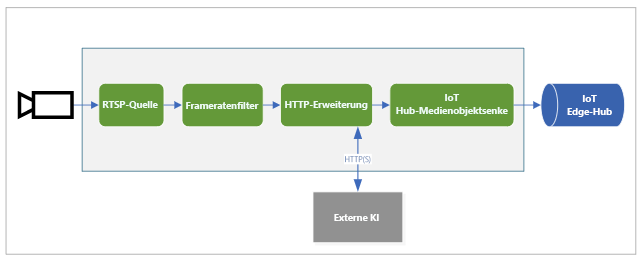

# <a name="quickstart-analyze-live-video-by-using-your-own-model"></a>Schnellstart: Analysieren von Livevideos mithilfe eines eigenen Modells

In dieser Schnellstartanleitung wird beschrieben, wie Sie mithilfe von Live Video Analytics in IoT Edge einen Livevideofeed einer (simulierten) IP-Kamera analysieren. Sie erfahren, wie Sie ein Modell für maschinelles Sehen anwenden, um Objekte zu erkennen. Eine Teilmenge der Einzelbilder des Livevideofeeds wird an einen Rückschlussdienst gesendet. Die Ergebnisse werden an IoT Edge Hub gesendet. 

Für diese Schnellstartanleitung werden ein virtueller Azure-Computer als IoT Edge-Gerät und ein simulierter Livevideostream verwendet. Es basiert auf Beispielcode, der in C# geschrieben ist, und baut auf der Schnellstartanleitung [Erkennen von Bewegung und Ausgeben von Ereignissen](detect-motion-emit-events-quickstart.md) auf. 

## <a name="prerequisites"></a>Voraussetzungen

* Ein Azure-Konto das ein aktives Abonnement beinhaltet. Sie können ein [kostenloses Konto erstellen](https://azure.microsoft.com/free/?WT.mc_id=A261C142F), falls Sie noch keins besitzen.
* [Visual Studio Code](https://code.visualstudio.com/) mit den folgenden Erweiterungen:
    * [Azure IoT-Tools](https://marketplace.visualstudio.com/items?itemName=vsciot-vscode.azure-iot-tools)
    * [C#](https://marketplace.visualstudio.com/items?itemName=ms-dotnettools.csharp)
* [.NET Core 3.1 SDK](https://dotnet.microsoft.com/download/dotnet-core/3.1).
* Wenn Sie den Schnellstart [Erkennen von Bewegung und Ausgeben von Ereignissen](detect-motion-emit-events-quickstart.md) nicht ausgeführt haben, achten Sie darauf, [Azure-Ressourcen einzurichten](detect-motion-emit-events-quickstart.md#set-up-azure-resources).

> [!TIP]
> Bei der Installation von Azure IoT Tools werden Sie unter Umständen aufgefordert, Docker zu installieren. Sie können diese Aufforderung ignorieren.

## <a name="review-the-sample-video"></a>Überprüfen des Beispielvideos
Beim Einrichten der Azure-Ressourcen wird ein kurzes Video von Verkehr auf einer Schnellstraße auf die Linux-VM in Azure kopiert, die Sie als IoT Edge-Gerät verwenden. In dieser Schnellstartanleitung wird die Videodatei verwendet, um einen Livestream zu simulieren.

Öffnen Sie eine Anwendung wie etwa den [VLC Media Player](https://www.videolan.org/vlc/). Drücken Sie STRG+N, und fügen Sie dann einen Link zum [Video](https://lvamedia.blob.core.windows.net/public/camera-300s.mkv) ein, um die Wiedergabe zu starten. Sie sehen das Videomaterial vieler Fahrzeuge, die sich im Verkehr einer Schnellstraße bewegen.

In dieser Schnellstartanleitung verwenden Sie Live Video Analytics in IoT Edge, um Objekte wie Fahrzeuge und Personen zu erkennen. Sie veröffentlichen zugeordnete Rückschlussereignisse auf IoT Edge Hub.

## <a name="overview"></a>Übersicht



In diesem Diagramm ist der Fluss der Signale in diesem Schnellstart dargestellt. Ein [Edge-Modul](https://github.com/Azure/live-video-analytics/tree/master/utilities/rtspsim-live555) simuliert eine IP-Kamera, die einen RTSP-Server (Real-Time Streaming Protocol) hostet. Der Knoten einer [RTSP-Quelle](media-graph-concept.md#rtsp-source) ruft den Videofeed von diesem Server ab und sendet Video-Einzelbilder an den Knoten des [Bildfrequenzfilterprozessors](media-graph-concept.md#frame-rate-filter-processor). Dieser Prozessor begrenzt die Bildfrequenz des Videostreams, der den Knoten des [HTTP-Erweiterungsprozessors](media-graph-concept.md#http-extension-processor) erreicht. 

Der HTTP-Erweiterungsknoten übernimmt dabei die Rolle eines Proxys. Er wandelt die Video-Einzelbilder in den angegebenen Bildtyp um. Anschließend leitet der das Bild über REST an ein anderes Edge-Modul weiter, das ein KI-Modell hinter einem HTTP-Endpunkt ausführt. In diesem Beispiel wird dieses Edge-Modul unter Verwendung des [YOLOv3](https://github.com/Azure/live-video-analytics/tree/master/utilities/video-analysis/yolov3-onnx)-Modells erstellt, mit dem viele Objekttypen erkannt werden können. Der Knoten des HTTP-Erweiterungsprozessors erfasst die Erkennungsergebnisse und veröffentlicht Ereignisse im Knoten der [IoT Hub-Senke](media-graph-concept.md#iot-hub-message-sink). Der Knoten sendet diese Ereignisse dann an den [IoT Edge Hub-](../../iot-edge/iot-edge-glossary.md#iot-edge-hub).

In diesem Schnellstart führen Sie folgende Schritte aus:

1. Erstellen und Bereitstellen des Mediengraphen
1. Interpretieren der Ergebnisse
1. Bereinigen der Ressourcen


## <a name="create-and-deploy-the-media-graph"></a>Erstellen und Bereitstellen des Mediengraphen
    
### <a name="examine-and-edit-the-sample-files"></a>Untersuchen und Bearbeiten der Beispieldateien

Als Teil der Voraussetzungen haben Sie den Beispielcode in einen Ordner heruntergeladen. Führen Sie die unten angegebenen Schritte aus, um die Beispieldateien zu überprüfen und zu bearbeiten.

1. Navigieren Sie in Visual Studio Code zu *src/edge*. Ihre *ENV*-Datei und einige Bereitstellungsvorlagendateien werden angezeigt.

    Die Bereitstellungsvorlage verweist auf das Bereitstellungsmanifest für das Edge-Gerät. Es enthält einige Platzhalterwerte. Die *ENV*-Datei enthält die Werte für diese Variablen.

1. Navigieren Sie zum Ordner *src/cloud-to-device-console-app*. Darin finden Sie Ihre Datei *appsettings.json* und einige andere Dateien:

    * ***c2d-console-app.csproj***: Die Projektdatei für Visual Studio Code.
    * ***operations.json***: Eine Liste mit den Vorgängen, die vom Programm ausgeführt werden sollen.
    * ***Program.cs***: Das Beispiel für den Programmcode. Für diesen Code gilt Folgendes:

        * Laden der App-Einstellungen
        * Aufrufen direkter Methoden, die vom Modul „Live Video Analytics in IoT Edge“ verfügbar gemacht werden. Sie können das Modul zum Analysieren von Livevideostreams verwenden, indem Sie die zugehörigen [direkten Methoden](direct-methods.md) aufrufen.
        * Anhalten der Ausführung, sodass Sie die Ausgabe des Programms im **Terminalfenster** und die vom Modul generierten Ereignisse im **Ausgabefenster** untersuchen können
        * Aufrufen direkter Methoden zur Bereinigung der Ressourcen


1. Bearbeiten Sie die Datei *operations.json*:
    * Ändern Sie den Link zur Graphtopologie:

        `"topologyUrl" : "https://raw.githubusercontent.com/Azure/live-video-analytics/master/MediaGraph/topologies/httpExtension/topology.json"`

    * Bearbeiten Sie unter `GraphInstanceSet` den Namen der Graphtopologie, damit er mit dem Wert im vorherigen Link übereinstimmt:

      `"topologyName" : "InferencingWithHttpExtension"`

    * Ändern Sie unter `GraphTopologyDelete` den Namen:

      `"name": "InferencingWithHttpExtension"`

### <a name="generate-and-deploy-the-iot-edge-deployment-manifest"></a>Generieren und Bereitstellen des IoT Edge-Bereitstellungsmanifests

1. Klicken Sie mit der rechten Maustaste auf die Datei *src/edge/deployment.yolov3.template.json*, und wählen Sie dann **IoT Edge-Bereitstellungsmanifest generieren** aus.

      

    Die Manifestdatei *deployment.yolov3.amd64.json* wird im Ordner *src/edge/config* erstellt.

1. Überspringen Sie diesen Schritt, wenn Sie die Schnellstartanleitung [Erkennen von Bewegung und Ausgeben von Ereignissen](detect-motion-emit-events-quickstart.md) abgeschlossen haben. 

    Wählen Sie andernfalls in der Nähe des Bereichs **AZURE IOT HUB** in der unteren linken Ecke das Symbol **Weitere Aktionen** und dann **Festlegen der IoT Hub-Verbindungszeichenfolge** aus. Sie können die Zeichenfolge aus der Datei *appsettings.json* kopieren. Um sicherzustellen, dass Sie den richtigen IoT Hub in Visual Studio Code konfiguriert haben, verwenden Sie alternativ den Befehl [IoT Hub auswählen](https://github.com/Microsoft/vscode-azure-iot-toolkit/wiki/Select-IoT-Hub).
    
    

1. Klicken Sie mit der rechten Maustaste auf *src/edge/config/ deployment.yolov3.amd64.json*, und wählen Sie **Bereitstellung für einzelnes Gerät erstellen** aus. 

    

1. Wenn Sie aufgefordert werden, ein IoT Hub-Gerät auszuwählen, wählen Sie **lva-sample-device** aus.
1. Aktualisieren Sie nach ungefähr 30 Sekunden unten links im Fenster den Dienst „Azure IoT Hub“. Das Edge-Gerät zeigt nun die folgenden bereitgestellten Module an:

    * Live Video Analytics-Modul mit dem Namen **lvaEdge**
    * Modul **rtspsim**, das einen RTSP-Server simuliert und als Quelle eines Livevideofeeds fungiert
    * Das Modul **yolov3**, bei dem es sich um das YOLOv3-Objekterkennungsmodell handelt, das maschinelles Sehen auf die Bilder anwendet und mehrere Klassen von Objekttypen zurückgibt.
 
      

### <a name="prepare-to-monitor-events"></a>Vorbereiten der Überwachung von Ereignissen

Klicken Sie mit der rechten Maustaste auf das Live Video Analytics-Gerät, und wählen Sie **Überwachung des integrierten Ereignisendpunkts starten** aus. Sie müssen diesen Schritt ausführen, um die IoT Hub-Ereignisse im **Ausgabefenster** von Visual Studio Code zu überwachen. 

 

### <a name="run-the-sample-program"></a>Ausführen des Beispielprogramms

1. Drücken Sie die F5-Taste, um eine Debugsitzung zu starten. Es werden dann Nachrichten im **Terminalfenster** ausgegeben.
1. Der Code von *operations.json* beginnt mit Aufrufen der direkten Methoden `GraphTopologyList` und `GraphInstanceList`. Wenn Sie nach dem Durcharbeiten vorheriger Schnellstartanleitungen eine Ressourcenbereinigung durchgeführt haben, werden bei diesem Prozess leere Listen zurückgegeben, und anschließend wird die Ausführung angehalten. Drücken Sie die EINGABETASTE, um den Vorgang fortzusetzen.

   ```
   --------------------------------------------------------------------------
   Executing operation GraphTopologyList
   -----------------------  Request: GraphTopologyList  --------------------------------------------------
   {
   "@apiVersion": "1.0"
   }
   ---------------  Response: GraphTopologyList - Status: 200  ---------------
   {
   "value": []
   }
   --------------------------------------------------------------------------
   Executing operation WaitForInput
   Press Enter to continue
   ```

    Im **Terminalfenster** werden die nächsten Aufrufe direkter Methoden angezeigt:

     * Ein Aufruf von `GraphTopologySet`, der die vorherige `topologyUrl` verwendet
     * Ein Aufruf von `GraphInstanceSet`, der den folgenden Textkörper verwendet:

         ```
         {
           "@apiVersion": "1.0",
           "name": "Sample-Graph-1",
           "properties": {
             "topologyName": "InferencingWithHttpExtension",
             "description": "Sample graph description",
             "parameters": [
               {
                 "name": "rtspUrl",
                 "value": "rtsp://rtspsim:554/media/camera-300s.mkv"
               },
               {
                 "name": "rtspUserName",
                 "value": "testuser"
               },
               {
                 "name": "rtspPassword",
                 "value": "testpassword"
               }
             ]
           }
         }
         ```

     * Ein Aufruf von `GraphInstanceActivate`, der die Graphinstanz und den Videodatenfluss startet
     * Zweiter Aufruf von `GraphInstanceList` mit der Anzeige, dass sich die Graphinstanz im ausgeführten Zustand befindet
1. Die Ausgabe im **Terminalfenster** wird mit der Aufforderung `Press Enter to continue` angehalten. Warten Sie noch mit dem Drücken der EINGABETASTE. Scrollen Sie nach oben, um die JSON-Antwortnutzlasten für die aufgerufenen direkten Methoden anzuzeigen.
1. Wechseln Sie in Visual Studio Code zum **Ausgabefenster**. Es werden Meldungen angezeigt, die vom Modul „Live Video Analytics in IoT Edge“ an den IoT-Hub gesendet werden. Im folgenden Abschnitt dieser Schnellstartanmeldung sind diese Meldungen beschrieben.
1. Der Mediengraph wird weiter ausgeführt, und es werden Ergebnisse ausgegeben. Der RTSP-Simulator führt das Quellvideo als Schleife aus. Wechseln Sie zum Beenden des Mediengraphs zurück zum **Terminalfenster**, und drücken Sie die EINGABETASTE. 

    Mit den nächsten Aufrufen wird die Ressourcenbereinigung durchgeführt:
      * Mit dem Aufruf von `GraphInstanceDeactivate` wird die Graphinstanz deaktiviert.
      * Mit dem Aufruf von `GraphInstanceDelete` wird die Instanz gelöscht.
      * Mit dem Aufruf von `GraphTopologyDelete` wird die Topologie gelöscht.
      * Ein abschließender Aufruf von `GraphTopologyList` zeigt, dass die Liste leer ist.

## <a name="interpret-results"></a>Interpretieren von Ergebnissen

Wenn Sie den Mediengraph ausführen, werden die Ergebnisse aus dem Knoten des HTTP-Erweiterungsprozessors über den Knoten der IoT Hub-Senke an den IoT-Hub übergeben. Die im **Ausgabefenster** angezeigten Meldungen enthalten jeweils die Abschnitte `body` und `applicationProperties`. Weitere Informationen finden Sie unter [Erstellen und Lesen von IoT Hub-Nachrichten](https://docs.microsoft.com/azure/iot-hub/iot-hub-devguide-messages-construct).

In den folgenden Meldungen werden vom Live Video Analytics-Modul die Anwendungseigenschaften und der Inhalt des Texts definiert. 

### <a name="mediasessionestablished-event"></a>MediaSessionEstablished-Ereignis

Wenn ein Mediengraph instanziiert wird, versucht der Knoten der RTSP-Quelle, eine Verbindung mit dem RTSP-Server herzustellen, der im Container „rtspsim-live55“ ausgeführt wird. Wenn die Verbindungsherstellung erfolgreich ist, wird das folgende Ereignis ausgegeben. Der Ereignistyp ist `Microsoft.Media.MediaGraph.Diagnostics.MediaSessionEstablished`.

```
[IoTHubMonitor] [9:42:18 AM] Message received from [lvaedgesample/lvaEdge]:
{
  "body": {
    "sdp": "SDP:\nv=0\r\no=- 1586450538111534 1 IN IP4 nnn.nn.0.6\r\ns=Matroska video+audio+(optional)subtitles, streamed by the LIVE555 Media Server\r\ni=media/camera-300s.mkv\r\nt=0 0\r\na=tool:LIVE555 Streaming Media v2020.03.06\r\na=type:broadcast\r\na=control:*\r\na=range:npt=0-300.000\r\na=x-qt-text-nam:Matroska video+audio+(optional)subtitles, streamed by the LIVE555 Media Server\r\na=x-qt-text-inf:media/camera-300s.mkv\r\nm=video 0 RTP/AVP 96\r\nc=IN IP4 0.0.0.0\r\nb=AS:500\r\na=rtpmap:96 H264/90000\r\na=fmtp:96 packetization-mode=1;profile-level-id=4D0029;sprop-parameter-sets=Z00AKeKQCgC3YC3AQEBpB4kRUA==,aO48gA==\r\na=control:track1\r\n"
  },
  "applicationProperties": {
    "dataVersion": "1.0",
    "topic": "/subscriptions/{subscriptionID}/resourceGroups/{name}/providers/microsoft.media/mediaservices/hubname",
    "subject": "/graphInstances/GRAPHINSTANCENAMEHERE/sources/rtspSource",
    "eventType": "Microsoft.Media.MediaGraph.Diagnostics.MediaSessionEstablished",
    "eventTime": "2020-04-09T16:42:18.1280000Z"
  }
}
```

Beachten Sie in dieser Meldung diese Details:

* Bei der Meldung handelt es sich um ein Diagnoseereignis. `MediaSessionEstablished` gibt an, dass vom RTSP-Quellknoten („subject“) eine Verbindung mit dem RTSP-Simulator hergestellt wurde und der Empfang eines (simulierten) Livefeeds begonnen hat.
* In `applicationProperties` wird mit `subject` angegeben, dass die Meldung über den Knoten der RTSP-Quelle im Mediengraph generiert wurde.
* In `applicationProperties` wird mit `eventType` angegeben, dass es sich um ein Diagnoseereignis handelt.
* Die `eventTime` gibt den Zeitpunkt des Ereignisses an.
* Der `body` enthält Daten zum Diagnoseereignis. In diesem Fall umfassen die Daten die Details zum [Session Description Protocol (SDP)](https://en.wikipedia.org/wiki/Session_Description_Protocol).

### <a name="inference-event"></a>Ereignis „Inference“

Der Knoten des HTTP-Erweiterungsprozessors empfängt Rückschlussergebnisse vom yolov3-Modul. Anschließend gibt er die Ergebnisse über den Knoten der IoT Hub-Senke als Rückschlussereignisse aus. 

In diesen Ereignissen ist der Typ auf `entity` festgelegt, um anzuzeigen, dass es sich um eine Entität wie etwa ein Auto oder einen LKW handelt. Der Wert von `eventTime` ist die UTC-Uhrzeit, zu der das Objekt erkannt wurde. 

Im folgenden Beispiel wurden zwei Autos auf dem gleichen Video-Einzelbild erkannt, mit unterschiedlichen Konfidenzwerten.

```
[IoTHubMonitor] [11:37:17 PM] Message received from [lva-sample-device/lvaEdge]:
{
  "body": {
    "inferences": [
      {
        "entity": {
          "box": {
            "h": 0.0344108157687717,
            "l": 0.5756940841674805,
            "t": 0.5929375966389974,
            "w": 0.04484643936157227
          },
          "tag": {
            "confidence": 0.8714089393615723,
            "value": "car"
          }
        },
        "type": "entity"
      },
      {
        "entity": {
          "box": {
            "h": 0.03960910373263889,
            "l": 0.2750667095184326,
            "t": 0.6102327558729383,
            "w": 0.031027007102966308
          },
          "tag": {
            "confidence": 0.7042660713195801,
            "value": "car"
          }
        },
        "type": "entity"
      }
    ]
  },
  "applicationProperties": {
    "topic": "/subscriptions/{subscriptionID}/resourceGroups/{name}/providers/microsoft.media/mediaservices/hubname",
    "subject": "/graphInstances/GRAPHINSTANCENAMEHERE/processors/inferenceClient",
    "eventType": "Microsoft.Media.Graph.Analytics.Inference",
    "eventTime": "2020-04-23T06:37:16.097Z"
  }
}
```

Beachten Sie in den Meldungen die folgenden Details:

* In `applicationProperties` wird von `subject` auf den Knoten in der Graphtopologie verwiesen, von dem die Meldung generiert wurde. 
* In `applicationProperties` wird unter `eventType` darauf hingewiesen, dass es sich hierbei um ein Analyseereignis handelt.
* Der Wert `eventTime` ist die Uhrzeit, zu der das Ereignis eingetreten ist.
* Der Abschnitt `body` enthält Daten zum Analyseereignis. Da es sich in diesem Fall um ein Rückschlussereignis handelt, enthält der Text Daten vom Typ `inferences`.
* Im Abschnitt `inferences` ist angegeben, dass `type` auf `entity` festgelegt ist. Dieser Abschnitt enthält zusätzliche Daten zur Entität.

## <a name="clean-up-resources"></a>Bereinigen von Ressourcen

Falls Sie weitere Schnellstartanleitungen durcharbeiten möchten, sollten Sie die von Ihnen erstellten Ressourcen beibehalten. Navigieren Sie andernfalls zum Azure-Portal, dort zu Ihren Ressourcengruppen, wählen Sie die Ressourcengruppe aus, unter der Sie diese Schnellstartanleitung ausgeführt haben, und löschen Sie alle Ressourcen.

## <a name="next-steps"></a>Nächste Schritte

Zusätzliches für fortgeschrittene Benutzer:

* Verwenden Sie eine [IP-Kamera](https://en.wikipedia.org/wiki/IP_camera) mit RTSP-Unterstützung anstelle des RTSP-Simulators. IP-Kameras, die RTSP unterstützen, finden Sie auf der [Seite mit den ONVIF-konformen Produkten](https://www.onvif.org/conformant-products/). Suchen Sie nach Geräten, die mit den Profilen G, S oder T konform sind.
* Verwenden Sie ein AMD64- oder x64-Linux-Gerät anstelle eines virtuellen Azure-Linux-Computers. Dieses Gerät muss sich im gleichen Netzwerk befinden wie die IP-Kamera. Sie können die Anleitungen unter [Installieren der Azure IoT Edge-Runtime unter Linux](https://docs.microsoft.com/azure/iot-edge/how-to-install-iot-edge-linux) befolgen. Registrieren Sie das Gerät anschließend beim Azure IoT Hub, indem Sie die Anweisungen in [Bereitstellen Ihres ersten IoT Edge-Moduls auf einem virtuellen Linux-Gerät](https://docs.microsoft.com/azure/iot-edge/quickstart-linux) ausführen.

