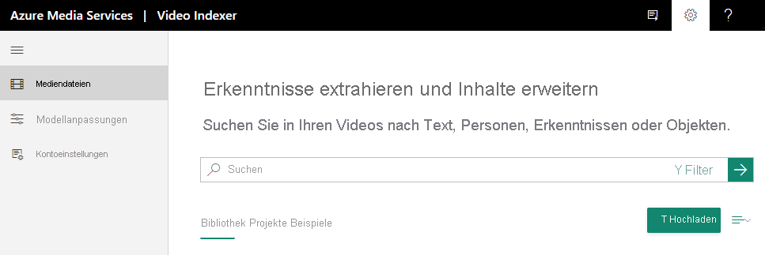

# Schnellstart: Registrieren und Hochladen Ihres ersten Videos

In diesem Tutorial zu den ersten Schritten wird veranschaulicht, wie Sie sich bei der Video Indexer-Website anmelden und Ihr erstes Video hochladen.

Beim Erstellen eines Video Indexer-Kontos können Sie ein kostenloses Testkonto (mit einer bestimmten Anzahl von kostenlosen Indizierungsminuten) oder eine kostenpflichtige Option wählen (ohne Einschränkung durch eine Kontingentvorgabe). Bei der kostenlosen Testversion stellt Video Indexer bis zu 600 Minuten an kostenloser Indizierungszeit für Websitebenutzer und bis zu 2.400 Minuten an kostenloser Indizierungszeit für API-Benutzer bereit. Bei der kostenpflichtigen Option erstellen Sie ein Video Indexer-Konto, [das mit Ihrem Azure-Abonnement und einem Azure Media Services-Konto verbunden ist](connect-to-azure.md). Die Indizierungszeit wird minutenweise abgerechnet. Außerdem fallen Gebühren für das Azure Media Services-Konto an. 

## Registrieren bei Video Indexer

Um mit der Entwicklung mit Video Indexer zu beginnen, müssen Sie sich bei der [Video Indexer](https://www.videoindexer.com)-Website registrieren.

## Hochladen eines Videos auf der Video Indexer-Website

> [!NOTE]
> Der Name des Videos darf nicht mehr als 80 Zeichen umfassen.

### Unterstützte Dateiformate für Video Indexer

Im Artikel [Eingabecontainer/Dateiformate](../latest/media-encoder-standard-formats.md#input-containerfile-formats) finden Sie eine Liste der Dateiformate, die Sie mit Video Indexer verwenden können.

### Hochladen eines Videos

1. Melden Sie sich bei der [Video Indexer](https://www.videoindexer.ai/)-Website an.
2. Klicken Sie auf die Schaltfläche bzw. den Link **Hochladen**, um ein Video hochzuladen.

    

    Nachdem Ihr Video hochgeladen wurde, beginnt Video Indexer mit dem Indizieren und Analysieren des Videos.

     

    Wenn Video Indexer die Analyse abgeschlossen hat, erhalten Sie eine Benachrichtigung mit einem Link zu Ihrem Video und einer kurzen Beschreibung dazu, was in Ihrem Video gefunden wurde. Beispiel: Personen, Themen, OCR-Daten.

## Weitere Informationen

Weitere Informationen finden Sie unter [Hochladen und Indizieren Ihrer Videos](upload-index-videos.md).

Nach dem Hochladen und Indizieren eines Videos können Sie die [Video Indexer-Website](video-indexer-view-edit.md) oder das [Video Indexer-Entwicklerportal](video-indexer-use-apis.md) verwenden, um die aus dem Video gewonnenen Erkenntnisse anzuzeigen. 

[Einstieg in APIs](video-indexer-use-apis.md)

## Nächste Schritte

Eine ausführliche Einführung erhalten Sie in unserem entsprechenden [Lab](https://github.com/Azure-Samples/media-services-video-indexer/blob/master/IntroToVideoIndexer.md). 

Am Ende des Workshops sind Sie gut darüber informiert, welche Arten von Informationen aus Video- und Audioinhalten extrahiert werden können. Sie sind dann besser vorbereitet, um Chancen in Bezug auf „Content Intelligence“ zu erkennen, KI-Funktionen für Videos in Azure vorzustellen und verschiedene Szenarien in Video Indexer zu demonstrieren.

