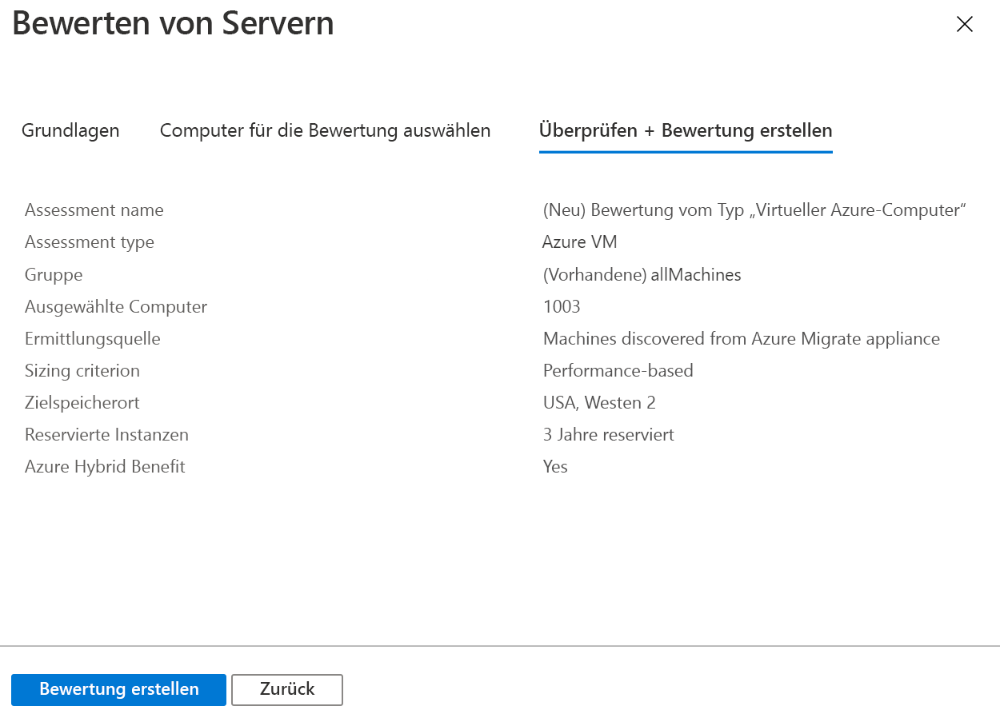

# <a name="assess-vmware-vms-by-using-azure-migrate-server-assessment"></a>Bewerten virtueller VMware-Computer unter Verwendung der Azure Migrate-Serverbewertung

In diesem Artikel erfahren Sie, wie Sie lokale virtuelle VMware-Computer (Virtual Machines, VMs) unter Verwendung des Serverbewertungstools in Azure Migrate bewerten.

[Azure Migrate](migrate-services-overview.md) stellt einen Hub mit Tools bereit, die Ihnen dabei helfen, Apps, Infrastrukturen und Workloads zu ermitteln, zu bewerten und zu Microsoft Azure zu migrieren. Der Hub umfasst Azure Migrate-Tools sowie ISV-Angebote (Independent Software Vendor, unabhängiger Softwarehersteller) von Microsoft-Partnern.

Dieses Tutorial ist das zweite in einer Reihe zur Bewertung und Migration von VMware-VMs zu Azure. In diesem Tutorial lernen Sie Folgendes:
> [!div class="checklist"]
> * Einrichten eines Azure Migrate-Projekts
> * Einrichten einer lokal ausgeführten Azure Migrate-Appliance zur Bewertung von VMs
> * Starten der kontinuierlichen Ermittlung lokaler VMs Die Appliance sendet Konfigurations- und Leistungsdaten für erkannte VMs an Azure.
> * Gruppieren erkannter VMs und Bewerten der VM-Gruppe
> * Überprüfen der Bewertung

> [!NOTE]
> In den Tutorials wird der einfachste Bereitstellungspfad für ein Szenario erläutert, damit Sie schnell einen Proof of Concept einrichten können. Die Tutorials verwenden nach Möglichkeit Standardoptionen und zeigen nicht alle möglichen Einstellungen und Pfade. Ausführliche Anweisungen finden Sie in den Anleitungsartikeln.

Wenn Sie kein Azure-Abonnement besitzen, können Sie ein [kostenloses Konto](https://azure.microsoft.com/pricing/free-trial/) erstellen, bevor Sie beginnen.

## <a name="prerequisites"></a>Voraussetzungen

[Absolvieren Sie das erste Tutorial](tutorial-prepare-vmware.md) dieser Reihe. Andernfalls funktionieren die Anweisungen in diesem Tutorial nicht.

Im ersten Tutorial müssen folgende Schritte ausgeführt werden:

- [Einrichten von Azure-Berechtigungen](tutorial-prepare-vmware.md#prepare-azure) für Azure Migrate
- [Vorbereiten von VMware](tutorial-prepare-vmware.md#prepare-for-vmware-vm-assessment) für die Bewertung:
   - Überprüfen der VMware-Einstellungen
   - Einrichten von Berechtigungen zum Erstellen eines virtuellen VMware-Computers mit einer OVA-Vorlage
   - Einrichten eines Kontos für die VM-Ermittlung 
   - Verfügbarmachen der erforderlichen Ports
   - Ermitteln der URLs, die für den Zugriff auf Azure erforderlich sind

## <a name="set-up-an-azure-migrate-project"></a>Einrichten eines Azure Migrate-Projekts

Richten Sie wie folgt ein neues Azure Migrate-Projekt ein:

1. Wählen Sie im Azure-Portal **Alle Dienste** aus, und suchen Sie nach **Azure Migrate**.
1. Wählen Sie unter **Dienste** die Option **Azure Migrate** aus.
1. Wählen Sie in der **Übersicht** unter **Server ermitteln, bewerten und migrieren** die Option **Server bewerten und migrieren** aus.

   

1. Wählen Sie unter **Erste Schritte** die Option **Tools hinzufügen** aus.
1. Wählen Sie unter **Projekt migrieren** Ihr Azure-Abonnement aus, und erstellen Sie bei Bedarf eine Ressourcengruppe.     
1. Geben Sie unter **Projektdetails** den Projektnamen und die geografische Region an, in der Sie das Projekt erstellen möchten. Unterstützt werden Asien, Europa, das Vereinigte Königreich und die USA.

   Die geografische Region des Projekts dient nur zum Speichern der Metadaten, die von den lokalen VMs erfasst werden. Beim Ausführen einer Migration kann eine beliebige Zielregion ausgewählt werden.

   

1. Wählen Sie **Weiter** aus.
1. Wählen Sie unter **Bewertungstool auswählen** Folgendes aus: **Azure Migrate: Server Assessment** (Azure Migrate-Serverbewertung) > **Weiter**.

   

1. Wählen Sie unter **Migrationstool auswählen** die Option **Hinzufügen eines Migrationstools vorerst überspringen** >  und anschließend **Weiter** aus.
1. Überprüfen Sie die Einstellungen unter **Überprüfen + Tools hinzufügen**, und wählen Sie **Tools hinzufügen** aus.
1. Warten Sie einige Minuten, bis das Azure Migrate-Projekt bereitgestellt wurde. Sie werden zur Projektseite weitergeleitet. Sollte das Projekt nicht angezeigt werden, können Sie auf dem Azure Migrate-Dashboard unter **Server** darauf zugreifen.

## <a name="set-up-the-appliance-vm"></a>Einrichten der Appliance-VM

Von der Azure Migrate-Serverbewertung wird eine einfache VMware-VM-Appliance ausgeführt. Diese Appliance sucht nach virtuellen Computern und sammelt entsprechende Meta- und Leistungsdaten.

Die Einrichtung der Appliance umfasst Folgendes:

- Herunterladen einer OVA-Vorlagendatei und Importieren der Datei in vCenter Server
- Erstellen der Appliance und Überprüfen der Verbindungsherstellung mit der Azure Migrate-Serverbewertung
- Durchführen der Erstkonfiguration für die Appliance und Registrieren der Appliance beim Azure Migrate-Projekt

Für ein einzelnes Azure Migrate-Projekt können mehrere Appliances eingerichtet werden. Über alle Appliances hinweg kann die Serverbewertung insgesamt bis zu 35.000 virtuelle Computer ermitteln. Pro Appliance können maximal 10.000 Server ermittelt werden.

### <a name="download-the-ova-template"></a>Herunterladen der OVA-Vorlage

1. Klicken Sie unter **Migrationsziele** > **Server** > **Azure Migrate: Server Assessment** (Azure Migrate-Serverbewertung) auf **Ermitteln**.
1. Wählen Sie unter **Computer ermitteln** > **Sind Ihre Computer virtualisiert?** die Option **Ja, mit VMware vSphere Hypervisor** aus.
1. Wählen Sie **Herunterladen** aus, um die OVA-Vorlagendatei herunterzuladen.

   

### <a name="verify-security"></a>Überprüfen der Sicherheit

Vergewissern Sie sich vor der Bereitstellung, dass die OVA-Datei sicher ist:

1. Öffnen Sie auf dem Computer, auf den Sie die Datei heruntergeladen haben, ein Administratorbefehlsfenster.
1. Führen Sie den folgenden Befehl aus, um den Hash für die OVA-Datei zu generieren:
  
   ```C:\>CertUtil -HashFile <file_location> [Hashing Algorithm]```
   
   Beispielverwendung: ```C:\>CertUtil -HashFile C:\AzureMigrate\AzureMigrate.ova SHA256```

Für die Version 2.19.07.30 muss der generierte Hash den folgenden Werten entsprechen:

**Algorithmus** | **Hashwert**
--- | ---
MD5 | c06ac2a2c0f870d3b274a0b7a73b78b1
SHA256 | 4ce4faa3a78189a09a26bfa5b817c7afcf5b555eb46999c2fad9d2ebc808540c

### <a name="create-the-appliance-vm"></a>Erstellen der Appliance-VM

Importieren Sie die heruntergeladene Datei, und erstellen Sie einen virtuellen Computer:

1. Klicken Sie in der vSphere-Clientkonsole auf **Datei** > **OVF-Vorlage bereitstellen**.

   

1. Geben Sie im Assistenten zum Bereitstellen der OVF-Vorlage unter **Quelle** den Speicherort der OVA-Datei an.
1. Geben Sie unter **Name** und **Standort** einen Anzeigenamen für die VM an. Wählen Sie das Inventarobjekt aus, in dem die VM gehostet wird.
1. Geben Sie unter **Host/Cluster** den Host oder Cluster an, auf bzw. in dem die VM ausgeführt wird.
1. Geben Sie unter **Speicher** das Speicherziel für die VM an.
1. Geben Sie unter **Datenträgerformat** den Typ und die Größe des Datenträgers an.
1. Geben Sie unter **Netzwerkzuordnung** das Netzwerk an, mit dem der virtuelle Computer eine Verbindung herstellt. Das Netzwerk muss über eine Internetverbindung verfügen, um Metadaten an die Azure Migrate-Serverbewertung senden zu können.
1. Überprüfen und bestätigen Sie die Einstellungen, und klicken Sie auf **Fertig stellen**.

### <a name="verify-appliance-access-to-azure"></a>Überprüfen des Appliancezugriffs auf Azure

Vergewissern Sie sich, dass die Appliance-VM eine Verbindung mit [Azure-URLs](migrate-support-matrix-vmware.md#assessment-url-access-requirements) herstellen kann.

### <a name="configure-the-appliance"></a>Konfigurieren der Appliance

Richten Sie die Appliance wie folgt ein:

1. Klicken Sie in der vSphere-Clientkonsole mit der rechten Maustaste auf den virtuellen Computer, und wählen Sie **Konsole öffnen** aus.
1. Geben Sie die Sprache, die Zeitzone und das Kennwort für die Appliance an.
1. Öffnen Sie in einem Browser auf einem beliebigen Computer, der eine Verbindung mit der VM herstellen kann, und öffnen Sie die URL der Appliance-Web-App: **https://*Appliancename oder IP-Adresse*: 44368**.

   Alternativ können Sie auch auf dem Appliancedesktop die App-Verknüpfung auswählen, um die App zu öffnen.
1. Gehen Sie in der Web-App unter **Erforderliche Komponenten einrichten** wie folgt vor:
   - **Lizenz**: Akzeptieren Sie die Lizenzbedingungen, und lesen Sie die Drittanbieterinformationen.
   - **Konnektivität**: Die App überprüft, ob die VM über Internetzugriff verfügt. Falls die VM einen Proxy verwendet, gehen Sie wie folgt vor:
     - Wählen Sie **Proxyeinstellungen** aus, und geben Sie die Proxyadresse und den Lauschport an (im Format http://ProxyIPAddress oder http://ProxyFQDN ).
     - Geben Sie die Anmeldeinformationen an, wenn der Proxy eine Authentifizierung erfordert.
     - Beachten Sie, dass nur HTTP-Proxys unterstützt werden.
   - **Uhrzeitsynchronisierung**: Die Uhrzeit der Appliance muss mit der Internetzeit synchronisiert werden, damit die Ermittlung ordnungsgemäß funktioniert.
   - **Updates installieren**: Die Appliance stellt sicher, dass die neuesten Updates installiert sind.
   - **Install VDDK** (VDDK installieren): Die Appliance überprüft, ob das VMware vSphere-VDDK (Virtual Disk Development Kit) installiert ist. Laden Sie bei Bedarf VDDK 6.7 von VMware herunter, und extrahieren Sie den Inhalt der heruntergeladenen ZIP-Datei am angegebenen Ort auf der Appliance.

     Das VDDK wird von der Azure Migrate-Servermigration verwendet, um Computer bei der Migration zu Azure zu replizieren.       

### <a name="register-the-appliance-with-azure-migrate"></a>Registrieren der Appliance bei Azure Migrate

1. Wählen Sie **Anmelden** aus. Sollte keine Anmeldung angezeigt werden, vergewissern Sie sich, dass Sie den Popupblocker im Browser deaktiviert haben.
1. Melden Sie sich auf dem neuen Tab mit Ihrem Azure-Benutzernamen und -Kennwort an.
   
   Die Anmeldung mit einer PIN wird nicht unterstützt.
1. Kehren Sie nach erfolgreicher Anmeldung zur Web-App zurück.
1. Wählen Sie das Abonnement aus, in dem das Azure Migrate-Projekt erstellt wurde, und wählen Sie anschließend das Projekt aus.
1. Geben Sie einen Namen für die Appliance an. Für den Namen können bis zu 14 alphanumerische Zeichen angegeben werden.
1. Wählen Sie **Registrieren**.

## <a name="start-continuous-discovery"></a>Starten der kontinuierlichen Ermittlung

Die Appliance muss eine Verbindung mit der vCenter Server-Instanz herstellen, um die Konfigurations- und Leistungsdaten der VMs zu ermitteln.

### <a name="specify-vcenter-server-details"></a>vCenter Server-Details angeben
1. Geben Sie unter **vCenter Server-Details angeben** den Namen (FQDN) oder die IP-Adresse der vCenter Server-Instanz an. Sie können den Standardport beibehalten oder einen benutzerdefinierten Port angeben, an dem vCenter Server lauscht.
1. Geben Sie unter **Benutzername** und **Kennwort** die Anmeldeinformationen für das vCenter Server-Konto an, über das die Appliance virtuelle Computer in der vCenter Server-Instanz ermittelt. 

   Vergewissern Sie sich, dass das Konto über die [erforderlichen Berechtigungen für die Ermittlung](migrate-support-matrix-vmware.md#assessment-vcenter-server-permissions) verfügt. Sie können [den Ermittlungsbereich festlegen](tutorial-assess-vmware.md#set-the-scope-of-discovery), indem Sie den Zugriff auf das vCenter-Konto einschränken.
1. Vergewissern Sie sich durch Auswählen von **Verbindung überprüfen**, dass die Appliance eine Verbindung mit vCenter Server herstellen kann.

### <a name="specify-vm-credentials"></a>Angeben der VM-Anmeldeinformationen
Zur Ermittlung von Anwendungen, Rollen und Features sowie zur Visualisierung von Abhängigkeiten der virtuellen Computer können Sie VM-Anmeldeinformationen mit Zugriff auf die virtuellen VMware-Computer angeben. Sie können Anmeldeinformationen für virtuelle Windows-Computer und Anmeldeinformationen für virtuelle Linux-Computer hinzufügen. Weitere Informationen zu den erforderlichen Zugriffsberechtigungen finden Sie [hier](https://docs.microsoft.com/azure/migrate/migrate-support-matrix-vmware#assessment-vcenter-server-permissions).

> [!NOTE]
> Diese Eingabe ist optional. Sie wird jedoch benötigt, wenn Sie die Anwendungsermittlung und die Visualisierung von Abhängigkeiten ohne Agent ermöglichen möchten.

1. Wählen Sie unter **Anwendungen und Abhängigkeiten auf VMs ermitteln** die Option **Anmeldeinformationen hinzufügen** aus.
1. Wählen Sie unter **Betriebssystem** eine Option aus.
1. Geben Sie einen Anzeigenamen für die Anmeldeinformationen an.
1. Geben Sie unter **Benutzername** und **Kennwort** ein Konto an, das mindestens über den Gastzugriff auf die virtuellen Computer verfügt.
1. Wählen Sie **Hinzufügen**.

Nachdem Sie die vCenter Server-Instanz und die VM-Anmeldeinformationen (optional) angegeben haben, wählen Sie **Speichern und Ermittlung starten** aus, um die Ermittlung der lokalen Umgebung zu starten.

Es dauert etwa 15 Minuten, bis Metadaten von ermittelten VMs im Portal angezeigt werden. Die Ermittlung installierter Anwendungen, Rollen und Features dauert etwas. Die Dauer hängt davon ab, wie viele virtuelle Computer ermittelt werden. Bei 500 VMs dauert es ungefähr 1 Stunde, bis der Anwendungsbestand im Azure Migrate-Portal angezeigt wird.

### <a name="set-the-scope-of-discovery"></a>Festlegen des Ermittlungsbereichs

Sie können den Ermittlungsbereich festlegen, indem Sie den Zugriff des für die Ermittlung verwendeten vCenter-Kontos einschränken. Sie können den Bereich auf vCenter Server-Rechenzentren, auf Cluster, auf einen Clusterordner, auf Hosts, auf einen Hostordner oder auf einzelne virtuelle Computer festlegen.

Führen Sie zum Festlegen des Bereichs die folgenden Schritte aus:

#### <a name="1-create-a-vcenter-user-account"></a>1. Erstellen eines vCenter-Benutzerkontos
1.  Melden Sie sich als vCenter Server-Administrator beim vSphere-Webclient an.
1.  Wählen Sie **Verwaltung** > **SSO users and Groups** (SSO-Benutzer und -Gruppen) und anschließend die Registerkarte **Benutzer** aus.
1.  Wählen Sie das Symbol für **Neuer Benutzer** aus.
1.  Geben Sie die erforderlichen Informationen für die Erstellung eines neuen Benutzers ein, und wählen Sie anschließend **OK** aus.

#### <a name="2-define-a-new-role-with-required-permission"></a>2. Definieren einer neuen Rolle mit der erforderlichen Berechtigung
Dieser Schritt ist für die Servermigration ohne Agent erforderlich.
1.  Melden Sie sich als vCenter Server-Administrator beim vSphere-Webclient an.
1.  Navigieren Sie zu **Verwaltung** > **Rollen-Manager**.
1.  Wählen Sie im Dropdownmenü Ihre vCenter Server-Instanz aus.
1.  Wählen Sie **Create role** (Rolle erstellen) aus.
1.  Geben Sie einen Namen für die neue Rolle ein (beispielsweise <em>Azure_Migrate</em>).
1.  Weisen Sie der neu definierten Rolle [Berechtigungen](https://docs.microsoft.com/azure/migrate/migrate-support-matrix-vmware#agentless-migration-vcenter-server-permissions) zu.
1.  Klicken Sie auf **OK**.

#### <a name="3-assign-permissions-on-vcenter-objects"></a>3. Zuweisen von Berechtigungen für vCenter-Objekte

Es gibt zwei Möglichkeiten, um Berechtigungen für Inventarobjekte in vCenter dem vCenter-Benutzerkonto mit zugewiesener Rolle zuzuweisen.

Bei der Serverbewertung muss die Rolle **Schreibgeschützt** auf das vCenter-Benutzerkonto für alle übergeordneten Objekte angewendet werden, von denen die zu ermittelnden virtuellen Computer gehostet werden. Alle übergeordneten Objekte werden einbezogen: Host, Hostordner, Cluster und Clusterordner in der Hierarchie bis hinauf zum Rechenzentrum. Diese Berechtigungen werden an die untergeordneten Objekte in der Hierarchie weitergegeben.

Analog dazu muss bei der Servermigration eine benutzerdefinierte Rolle mit [Berechtigungen](https://docs.microsoft.com/azure/migrate/migrate-support-matrix-vmware#agentless-migration-vcenter-server-permissions) auf das vCenter-Benutzerkonto für alle übergeordneten Objekte angewendet werden, von denen die zu migrierenden virtuellen Computer gehostet werden. Diese Rolle kann <em>Azure_Migrate</em> heißen.


Die alternative Vorgehensweise besteht darin, das Benutzerkonto und die Rolle auf Rechenzentrumsebene zuzuweisen und diese an die untergeordneten Objekte weiterzugeben. Weisen Sie dem Konto anschließend für alle Objekte (beispielsweise virtuelle Computer), die Sie nicht ermitteln bzw. migrieren möchten, eine Rolle vom Typ **Kein Zugriff** zu. 

Diese alternative Konfiguration ist umständlich. Dabei besteht das Risiko einer versehentlichen Preisgabe von Zugangsdaten, da jedem neuen untergeordneten Objekt auch automatisch die vom übergeordneten Objekt geerbten Zugangsrechte erteilt werden. Aus diesem Grund empfiehlt es sich, die erste Methode zu verwenden.

> [!NOTE]
> Die Serverbewertung kann aktuell keine virtuellen Computer ermitteln, wenn dem vCenter-Konto Zugriff auf der vCenter-VM-Ordnerebene gewährt wurde. Wenn Sie den Ermittlungsbereich mithilfe von VM-Ordnern festlegen möchten, können Sie dazu das folgende Verfahren verwenden. Dadurch wird sichergestellt, dass das vCenter-Konto über schreibgeschützten Zugriff auf der VM-Ebene verfügt.
>
> 1. Weisen Sie reine Leseberechtigungen für alle VMs in den VM-Ordnern zu, auf denen die Ermittlung basieren soll.
> 1. Erteilen Sie überall dort, wo die VMs gehostet werden, reinen Lesezugriff auf alle übergeordneten Objekte. Alle übergeordneten Objekte (Host, Hostordner, Cluster, Clusterordner) in der Hierarchie bis hinauf zum Rechenzentrum werden einbezogen. Die Berechtigungen müssen nicht an alle untergeordneten Objekte weitergegeben werden.
> 1. Verwenden Sie die Anmeldeinformationen für die Ermittlung, indem Sie das Rechenzentrum als **Sammlungsbereich** auswählen. Durch die eingerichtete rollenbasierte Zugriffssteuerung wird sichergestellt, dass der entsprechende vCenter-Benutzer nur Zugriff auf die mandantenspezifischen virtuellen Computer hat.
>
> Beachten Sie, dass Host- und Clusterordner unterstützt werden.

### <a name="verify-vms-in-the-portal"></a>Überprüfen virtueller Computer im Portal

Nach der Ermittlung können Sie überprüfen, ob die virtuellen Computer im Azure-Portal angezeigt werden:

1. Öffnen Sie das Azure Migrate-Dashboard.
1. Klicken Sie unter **Azure Migrate – Server** > **Azure Migrate: Server Assessment** (Azure Migrate-Serverbewertung) auf das Symbol mit der Anzahl für **Ermittelte Server**.

## <a name="set-up-an-assessment"></a>Einrichten einer Bewertung

Mit der Azure Migrate-Serverbewertung können zwei Arten von Bewertungen erstellt werden:

**Bewertung** | **Details** | **Daten**
--- | --- | ---
**Leistungsbasiert** | Bewertungen basierend auf gesammelten Leistungsdaten | **Empfohlene VM-Größe**: Basierend auf CPU- und Arbeitsspeicher-Nutzungsdaten<br/><br/> **Empfohlener Datenträgertyp (Verwalteter Datenträger vom Typ Standard oder Premium)** : Basierend auf IOPS und Durchsatz der lokalen Datenträger
**Wie lokal** | Bewertungen basierend auf lokaler Größenanpassung | **Empfohlene VM-Größe**: Basierend auf der Größe des lokalen virtuellen Computers<br/><br> **Empfohlener Datenträgertyp**: Basierend auf der für die Bewertung ausgewählten Speichertypeinstellung

## <a name="run-an-assessment"></a>Durchführen einer Bewertung

Führen Sie eine Bewertung wie folgt aus:

1. Machen Sie sich mit den [bewährten Methoden](best-practices-assessment.md) für die Bewertungserstellung vertraut.
1. Wählen Sie auf der Registerkarte **Server** auf der Kachel **Azure Migrate: Server Assessment** (Azure Migrate-Serverbewertung) die Option **Bewerten** aus.

   

1. Geben Sie unter **Server bewerten** einen Namen für die Bewertung an.
1. Wählen Sie **Alle anzeigen** aus, und überprüfen Sie anschließend die Bewertungseigenschaften.

   

1. Wählen Sie unter **Gruppe auswählen oder erstellen** die Option **Neu erstellen** aus, und geben Sie einen Namen für die Gruppe ein. Eine Gruppe enthält mindestens eine zu bewertende VM.
1. Wählen Sie unter **Computer zur Gruppe hinzufügen** die VMs aus, die der Gruppe hinzugefügt werden sollen.
1. Wählen Sie **Bewertung erstellen** aus, um die Gruppe zu erstellen und die Bewertung auszuführen.

   

1. Zeigen Sie die erstellte Bewertung unter **Server** > **Azure Migrate: Server Assessment** (Azure Migrate-Serverbewertung) > **Bewertungen** an.
1. Wählen Sie **Bewertung exportieren** aus, um sie als Excel-Datei herunterzuladen.

## <a name="review-an-assessment"></a>Überprüfen einer Bewertung

Eine Bewertung beschreibt Folgendes:

- **Azure-Bereitschaft**: Gibt an, ob VMs für die Migration zu Azure geeignet sind.
- **Geschätzte monatliche Kosten**: Die geschätzten monatlichen Compute- und Speicherkosten für die Ausführung der VMs in Azure.
- **Geschätzte monatliche Speicherkosten**: Die geschätzten Kosten für den Datenträgerspeicher nach der Migration.

So zeigen Sie eine Bewertung an:

1. Wählen Sie unter **Migrationsziele** > **Server** die Option **Bewertungen** unter **Azure Migrate: Serverbewertung** aus.
1. Wählen Sie unter **Bewertungen** eine Bewertung aus, um sie zu öffnen.

   

### <a name="review-azure-readiness"></a>Überprüfen der Azure-Bereitschaft

1. Überprüfen Sie unter **Azure-Bereitschaft**, ob VMs für die Migration zu Azure bereit sind.
1. Überprüfen Sie den VM-Status:
    - **Bereit für Azure**: Wird verwendet, wenn Azure Migrate in der Bewertung eine VM-Größe empfiehlt und Kostenschätzungen für virtuelle Computer angibt.
    - **Bereit mit Bedingungen**: Zeigt Probleme und eine vorgeschlagene Abhilfe an.
    - **Nicht bereit für Azure**: Zeigt Probleme und eine vorgeschlagene Abhilfe an.
    - **Bereitschaft unbekannt**: Wird verwendet, wenn Azure Migrate die Bereitschaft aufgrund von Problemen mit der Datenverfügbarkeit nicht bewerten kann.

1. Wählen Sie unter **Azure-Bereitschaft** einen Status aus. Sie können Details zur VM-Bereitschaft anzeigen. Darüber hinaus können Sie VM-Details wie Compute-, Speicher- und Netzwerkeinstellungen anzeigen.

### <a name="review-cost-details"></a>Überprüfen der Kostendetails

Die Zusammenfassung der Bewertung enthält die geschätzten Compute- und Speicherkosten für die VM-Ausführung in Azure. Die Kosten für alle VMs in der bewerteten Gruppe werden aggregiert. Sie können einen Drilldown ausführen, um Kostendetails für bestimmte virtuelle Computer anzuzeigen.

> [!NOTE]
> Kostenschätzungen basieren auf den Größenempfehlungen für einen Computer sowie auf seinen Datenträgern und Eigenschaften. Schätzungen gelten für die Ausführung der lokalen virtuellen Computer als virtuelle IaaS-Computer. PaaS- oder SaaS-Kosten werden von der Azure Migrate-Serverbewertung nicht berücksichtigt.

Die aggregierten Speicherkosten für die bewertete Gruppe verteilen sich auf verschiedene Arten von Speicherdatenträgern. 

### <a name="review-confidence-rating"></a>Prüfen der Zuverlässigkeitsstufe

Die Azure Migrate-Serverbewertung weist einer leistungsbasierten Bewertung eine Zuverlässigkeitsstufe zwischen einem und fünf Sternen zu.


Anhand der Zuverlässigkeitsstufe können Sie die Zuverlässigkeit der von der Bewertung abgegebenen Größenempfehlungen besser einschätzen. Die Stufe basiert auf der Verfügbarkeit von Datenpunkten, die zur Berechnung der Bewertung erforderlich sind:

**Verfügbarkeit von Datenpunkten** | **Zuverlässigkeitsstufe**
--- | ---
0 % bis 20 % | 1 Stern
21 % bis 40 % | 2 Sterne
41 % bis 60 % | 3 Sterne
61 % bis 80 % | 4 Sterne
81 % bis 100 % | 5 Sterne

Informationen zu Best Practices für Zuverlässigkeitsstufen finden Sie [hier](best-practices-assessment.md#best-practices-for-confidence-ratings).

## <a name="next-steps"></a>Nächste Schritte

In diesem Tutorial haben Sie eine Azure Migrate-Appliance eingerichtet. Außerdem haben Sie eine Bewertung erstellt und überprüft.

Im dritten Tutorial der Reihe erfahren Sie, wie Sie virtuelle VMware-Computer mithilfe der Azure Migrate-Servermigration zu Azure migrieren.

> [!div class="nextstepaction"]
> [Migrieren von VMware-VMs zu Azure (ohne Agent)](./tutorial-migrate-vmware.md)
