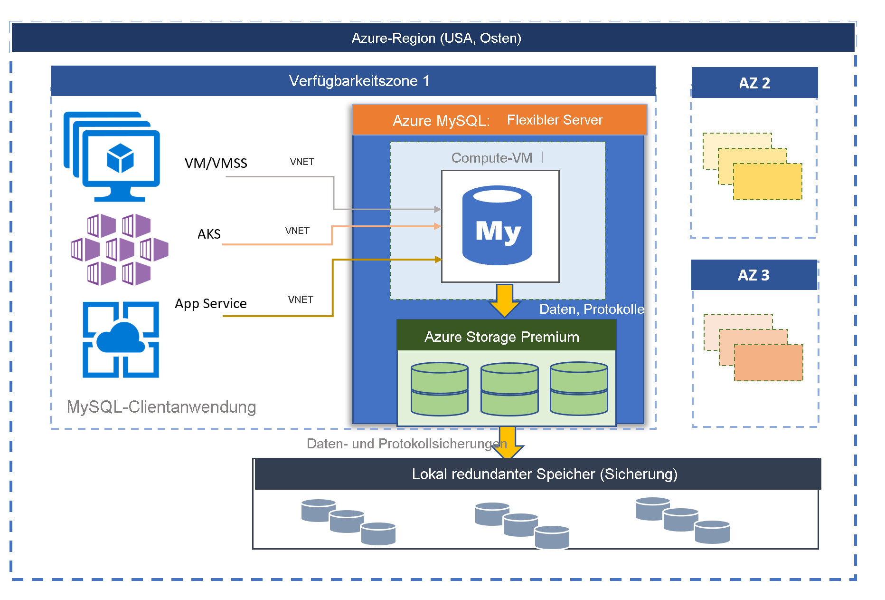

# Azure Database for MySQL-Server Flexible Server (Vorschau)

Azure Database for MySQL, ein Dienst, der auf MySQL Community Edition basiert, ist in zwei Bereitstellungsmodi verfügbar:
- Einzelner Server 
- Flexible Server (Vorschau)

In diesem Artikel erhalten Sie eine Übersicht und Einführung in die grundlegenden Konzepte des Modells zur Bereitstellung eines flexiblen Servers. Informationen dazu, wie Sie entscheiden, welche Bereitstellungsoption für ihre Workload geeignet ist, finden Sie unter [Auswählen der richtigen MySQL Server-Option in Azure](./../select-right-deployment-type.md).

## Übersicht

Azure Database for MySQL Flexible Server ist ein vollständig verwalteter Datenbankdienst, der eine differenziertere Steuerung und mehr Flexibilität bei den Verwaltungsfunktionen und Konfigurationseinstellungen der Datenbank bietet. Im Allgemeinen ermöglicht der Dienst mehr Flexibilität und die Anpassung der Serverkonfiguration an die Anforderungen der Benutzer. Mit der Flexible Server-Architektur können Benutzer Hochverfügbarkeit in einer einzelnen Verfügbarkeitszone sowie in mehreren Verfügbarkeitszonen auswählen. Flexible Server-Instanzen bieten außerdem bessere Steuerelemente für die Kostenoptimierung mit der Möglichkeit, den Server und burstfähige SKUs anzuhalten/zu starten. Dies eignet sich hervorragend für Workloads, die nicht durchgehend die gesamte Computekapazität benötigen. Der Dienst unterstützt derzeit die Community-Version von MySQL 5.7 und 8.0. Der Dienst ist derzeit in der Vorschauphase und in einer Vielzahl von [Azure-Regionen](https://azure.microsoft.com/global-infrastructure/services/) verfügbar.

Flexible Server-Implementierungen eignen sich am besten für folgende Szenarien: 
- Anwendungsentwicklungen, die bessere Steuerungs- und Anpassungsmöglichkeiten erfordern.
- Zonenredundante Hochverfügbarkeit
- Verwaltete Wartungsfenster

 

## Hochverfügbarkeit in Verfügbarkeitszonen und verfügbarkeitszonenübergreifend

Das Modell zur Bereitstellung flexibler Server ist so konzipiert, dass es Hochverfügbarkeit innerhalb einer einzigen Verfügbarkeitszone und in mehreren Verfügbarkeitszonen unterstützt. In der Architektur sind Compute und Speicher voneinander getrennt. Die Datenbank-Engine läuft auf einem virtuellen Computer, während sich die Datendateien im Azure-Speicher befinden. Der Speicher verwaltet drei lokal redundante synchrone Kopien der Datenbankdateien, sodass die Datenbeständigkeit jederzeit sichergestellt wird. 

Wenn der Server in einer einzelnen Verfügbarkeitszone aufgrund geplanter oder ungeplanter Ereignisse ausfällt, gewährleistet der Dienst die Hochverfügbarkeit der Server mit dem folgenden automatisierten Verfahren:

1. Eine neue Computeressource in Form einer VM wird bereitgestellt.
2. Der Speicher mit Datendateien wird dem neuen virtuellen Computer zugeordnet.
3. Die MySQL-Datenbank-Engine wird auf dem neuen virtuellen Computer online geschaltet.
4. Clientanwendungen können erneut eine Verbindung herstellen, sobald der Server für die Annahme von Verbindungen bereit ist.
   
:::image type="content" source="media/overview/2-flexible-server-architecture.png" alt-text="Konzeptdiagramm einer einzelnen Hochverfügbarkeitszone"::: 

Wenn zonenredundante Hochverfügbarkeit konfiguriert ist, wird vom Dienst ein unmittelbar betriebsbereiter Standbyserver in der Verfügbarkeitszone innerhalb derselben Azure-Region bereitgestellt und verwaltet. Die Datenänderungen auf dem Quellserver werden synchron auf den Standbyserver repliziert, damit kein Datenverlust entsteht. Bei zonenredundanter Hochverfügbarkeit geht der Standbyserver nach dem Auslösen des geplanten oder ungeplanten Failoverereignisses sofort online und steht für die Verarbeitung eingehender Transaktionen zur Verfügung. Für gewöhnlich dauert das Failover zwischen 60 und 120 Sekunden. Dies ermöglicht dem Dienst, Hochverfügbarkeit zu unterstützen, und bietet eine verbesserte Resilienz mit Toleranz für Ausfälle einzelner Verfügbarkeitszonen in einer bestimmten Azure-Region. 

Weitere Informationen finden Sie unter [Hochverfügbarkeit in Azure Database for PostgreSQL (Einzelserver)](concepts-high-availability.md).

:::image type="content" source="media/overview/3-flexible-server-overview-zone-redundant-ha.png" alt-text="Konzeptdiagramm der zonenredundanten Hochverfügbarkeit"::: 

## Automatisches Patchen mit verwaltetem Wartungsfenster

Der Dienst führt automatisches Patchen für die zugrunde liegende Hardware, das Betriebssystem und die Datenbank-Engine durch. Das Patchen umfasst Sicherheits- und Softwareupdates. Für die MySQL-Engine sind im Rahmen des geplanten Wartungsreleases auch kleinere Versionsupgrades enthalten. Benutzer können den Patchzeitplan so konfigurieren, dass er vom System verwaltet wird, oder einen eigenen Zeitplan definieren. Im Rahmen des Wartungszeitplans wird der Patch angewendet. Möglicherweise muss der Server als Teil des Patchprozesses neu gestartet werden, um das Update abzuschließen. Mithilfe des benutzerdefinierten Zeitplans können Benutzer ihren Patchzyklus überlegt gestalten und ein Wartungsfenster mit minimalen Auswirkungen auf das Unternehmen wählen. Im Allgemeinen gilt für den Dienst im Rahmen der kontinuierlichen Integration und Veröffentlichung ein monatlicher Releasezeitplan.

Weitere Informationen finden Sie unter [Geplante Wartung](concepts-maintenance.md). 

## Automatische Sicherungen

Für Azure Database for MySQL Flexible Server werden Sicherungen automatisch erstellt und in einem vom Benutzer konfigurierten lokal redundanten oder georedundanten Speicher gespeichert. Mithilfe von Sicherungen können Sie den Server zu einem beliebigen Zeitpunkt innerhalb des Aufbewahrungszeitraums der Sicherung wiederherstellen. Die Standardaufbewahrungsdauer für Sicherungen beträgt sieben Tage. Die Aufbewahrungsdauer kann optional auf bis zu 35 Tage festgelegt werden. Zur Verschlüsselung aller Sicherungen wird die AES-Verschlüsselung mit 256 Bit verwendet. 

Weitere Informationen finden Sie unter [Sicherungskonzepten](concepts-backup-restore.md).

## Netzwerkisolation

Um eine Verbindung mit Ihrer Azure Database for MySQL Flexible Server-Bereitstellung herzustellen, haben Sie zwei Netzwerkoptionen: den **privaten Zugriff** (VNET-Integration) und den **öffentlichen Zugriff (zugelassene IP-Adressen)** . 

* **Privater Zugriff (VNET-Integration):** Sie können Ihren flexiblen Server in Ihrer [Azure Virtual Network](../../virtual-network/virtual-networks-overview.md)-Instanz bereitstellen. Virtuelle Azure-Netzwerke ermöglichen eine private und sichere Netzwerkkommunikation. Ressourcen in einem virtuellen Netzwerk können über private IP-Adressen kommunizieren.

   Die VNET-Integration bietet sich an, wenn Sie die folgenden Funktionen benötigen:
   * Verbinden von Azure-Ressourcen im gleichen virtuellen Netzwerk mit Ihrem flexiblen Server über private IP-Adressen
   * Herstellen einer Verbindung von Azure-externen Ressourcen mit Ihrem flexiblen Server über ein VPN oder eine ExpressRoute-Verbindung
   * Kein öffentlicher Endpunkt

* **Öffentlicher Zugriff (zugelassene IP-Adressen)** : Sie können Ihren flexiblen Server mit einem öffentlichen Endpunkt bereitstellen. Der öffentliche Endpunkt ist eine öffentlich auflösbare DNS-Adresse. Der Ausdruck „zugelassene IP-Adressen“ bezieht sich auf einen Bereich von IP-Adressen, denen Sie die Berechtigung erteilen, auf den Server zuzugreifen. Diese Berechtigungen heißen **Firewallregeln**.

Weitere Informationen finden Sie unter [Netzwerkkonzepte](concepts-networking.md).

## Anpassen von Leistung und Skalierung in nur wenigen Sekunden

Der Flexible Server-Dienst ist in drei SKU-Tarifen verfügbar: „Burstfähig“, „Allgemeiner Zweck“ und „Arbeitsspeicheroptimiert“. Der Tarif „Burstfähig“ eignet sich am besten für die kostengünstige Entwicklung und Workloads mit geringer Parallelität, die nicht ständig die volle Computekapazität benötigen. Die Tarife „Universell“ und „Arbeitsspeicheroptimiert“ eignen sich besser für Produktionsworkloads, die eine hohe Parallelität, Skalierung und vorhersagbare Leistung erfordern. Sie können Ihre erste App mit einer kleinen Datenbank für wenige USD im Monat erstellen und die Skalierung dann nahtlos so ändern, dass sie den Anforderungen Ihrer Lösung entspricht. Die Speicherskalierung geschieht online und unterstützt das automatische Wachstum des Speichers. Durch die dynamische Skalierung kann Ihre Datenbank transparent auf schnell wechselnde Ressourcenanforderungen reagieren. Sie zahlen nur für die Ressourcen, die Sie verwenden. 

Weitere Informationen finden Sie unter [Compute- und Speicherkonzepte](concepts-compute-storage.md).

## Horizontale Skalierung Ihrer Leseworkload mit bis zu zehn Lesereplikaten

MySQL ist eine der beliebtesten Datenbank-Engines für die Ausführung von Web- und mobilen Anwendungen im Internet. Viele unserer Kunden verwenden es für ihre Onlinebildungsdienste, Videostreamingdienste, digitalen Zahlungslösungen, E-Commerce-Plattformen, Gamingdienste, Nachrichtenportale sowie für Websites für Behörden und das Gesundheitswesen. Diese Dienste müssen in dem Maße, wie der Datenverkehr im Web oder bei mobilen Anwendungen zunimmt, genutzt und skaliert werden.

Auf der Anwendungsseite wird die Anwendung typischerweise in Java oder PHP entwickelt und migriert, um in  [Azure-VM-Skalierungsgruppen](../../virtual-machine-scale-sets/overview.md) oder [Azure App Services](../../app-service/overview.md) ausgeführt zu werden, oder sie wird containerisiert, um unter [Azure Kubernetes Service (AKS)](../../aks/intro-kubernetes.md) ausgeführt zu werden. Mit VM-Skalierungsgruppen, App Service oder AKS als zugrunde liegende Infrastruktur wird die Anwendungsskalierung vereinfacht, indem neue virtuelle Computer sofort bereitgestellt und die zustandslosen Komponenten von Anwendungen repliziert werden, um die Anforderungen zu erfüllen, aber oft wird die Datenbank als zentrale zustandsbehaftete Komponente zum Engpass.

Mithilfe des Lesereplikatfeatures können Sie Daten von einer Azure Database for MySQL Flexible Server-Instanz auf einem schreibgeschützten Server replizieren. Sie können vom Quellserver auf **bis zu zehn Replikate** replizieren. Replikate werden asynchron mithilfe des auf der [Position der nativen, binären Protokolldatei (binlog) basierenden Replikationsverfahrens](https://dev.mysql.com/doc/refman/5.7/en/replication-features.html) der MySQL-Engine aktualisiert. Sie können eine Proxylösung für den Lastenausgleich wie [ProxySQL](https://techcommunity.microsoft.com/t5/azure-database-for-mysql/load-balance-read-replicas-using-proxysql-in-azure-database-for/ba-p/880042) verwenden, um Ihre Anwendungsworkload nahtlos horizontal auf Lesereplikate zu skalieren, ohne dass Refactoringkosten anfallen. 

Weitere Informationen finden Sie unter [Lesereplikate in Azure Database for MySQL – Flexible Server](concepts-read-replicas.md). 

## Anhalten/Starten des Servers zum Optimieren der Kosten

Der Flexible Server-Dienst ermöglicht Ihnen, Server bei Bedarf anzuhalten und zu starten, um Ihre Kosten zu optimieren. Die Abrechnung des Computetarifs wird sofort beendet, sobald der Server angehalten wird. Dies kann Ihnen erhebliche Kosteneinsparungen bei Entwicklung, Tests und zeitgebundenen, vorhersehbaren Produktionsworkloads ermöglichen. Der Server verbleibt sieben Tage im angehaltenen Zustand, es sei denn, er wird früher wieder gestartet. 

Weitere Informationen finden Sie unter [Serverkonzepte](concept-servers.md). 

## Sicherheit und Datenschutz auf Unternehmensniveau

Der flexible Serverdienst nutzt das FIPS 140-2-zertifizierte Kryptografiemodul für die Speicherverschlüsselung ruhender Daten. Daten wie Sicherungen und temporäre Dateien, die während der Ausführung von Abfragen erstellt wurden, werden verschlüsselt. Der Dienst verwendet das in der Azure Storage-Verschlüsselung enthaltene AES-256-Bit-Verschlüsselungsverfahren, wobei die Schlüssel (standardmäßig) vom System verwaltet werden. 

Der Dienst verschlüsselt Daten während der Übertragung mit der Transport Layer Security, was standardmäßig erzwungen wird. Flexible Server unterstützt nur verschlüsselte Verbindungen mit Transport Layer Security (TLS 1.2), und alle eingehenden Verbindungen mit TLS 1.0 und TLS 1.1 werden verweigert. 

Weitere Informationen finden Sie unter [Verwenden verschlüsselter Verbindungen mit flexiblen Servern](https://docs.mongodb.com/manual/tutorial/configure-ssl).

Flexible Server ermöglichen den vollständigen privaten Zugriff auf die Server eines [virtuellen Azure-Netzwerks](../../virtual-network/virtual-networks-overview.md) (VNET-Integration). Server im virtuellen Azure-Netzwerk können nur über private IP-Adressen erreicht und verbunden werden. Bei der VNET-Integration wird der öffentliche Zugriff verweigert, und Server können nicht über öffentliche Endpunkte erreicht werden. 

Weitere Informationen finden Sie unter [Netzwerkkonzepte](concepts-networking.md).

## Überwachung und Warnung

Der Flexible Server-Dienst verfügt über integrierte Funktionen für Leistungsüberwachung und Warnungen. Alle Azure-Metriken werden im Minutentakt erfasst, und für jede Metrik steht ein Verlauf von 30 Tagen zur Verfügung. Sie können Warnungen für die Metriken konfigurieren. Der Dienst macht Hostservermetriken verfügbar, um die Ressourcenauslastung zu überwachen, und ermöglicht die Konfiguration von Protokollen langsamer Abfragen. Mit diesen Tools können Sie Ihre Workloads schnell optimieren und Ihren Server für optimale Leistung konfigurieren. 

Weitere Informationen finden Sie unter [Überwachungskonzepte](concepts-monitoring.md).

## Migration

Der Dienst führt die MySQL-Community-Version aus. Dies ermöglicht vollständige Anwendungskompatibilität und erfordert minimale Refactoringkosten für die Migration vorhandener Anwendungen, die in der MySQL-Engine entwickelt wurden, zum Single Server-Dienst. Die Migration zum Single Server-Dienst kann mithilfe einer der folgenden Optionen durchgeführt werden:

- **Sichern und Wiederherstellen**: Für Offlinemigrationen, bei denen sich Benutzer einige Ausfallzeiten leisten können, kann das Sichern und Wiederherstellen mit Communitytools wie mysqldump/mydumper die schnellste Option für die Migration sein. Ausführliche Informationen finden Sie unter „Migrieren der MySQL-Datenbank auf Azure-Datenbank für MySQL durch Sicherungen und Wiederherstellungen“. 
- **Azure Database Migration Service**: Für eine nahtlose und einfachere Migration zum Single Server-Dienst mit minimalen Ausfallzeiten können Sie [Azure Database Migration Service](../../dms/tutorial-mysql-azure-mysql-online.md) verwenden. 

## Azure-Regionen

Ein Vorteil der Ausführung Ihrer Workload in Azure ist die globale Reichweite. Der flexible Server für Azure Database for MySQL ist derzeit in den folgenden Azure-Regionen verfügbar:

| Region | Verfügbarkeit | Zonenredundante Hochverfügbarkeit | 
| --- | --- | --- |
| Europa, Westen | :heavy_check_mark: | :heavy_check_mark: |
| Nordeuropa | :heavy_check_mark: | :heavy_check_mark: |
| UK, Süden | :heavy_check_mark: | :x: | 
| USA (Ost) 2 | :heavy_check_mark: | :heavy_check_mark: |
| USA, Westen 2 | :heavy_check_mark: | :heavy_check_mark: |
| USA (Mitte) | :heavy_check_mark: | :x: | 
| East US | :heavy_check_mark: | :heavy_check_mark: |
| Kanada, Mitte | :heavy_check_mark: | :x: | 
| Asien, Südosten | :heavy_check_mark: | :heavy_check_mark: |
| Korea, Mitte | :heavy_check_mark: | :x: | 
| Japan, Osten | :heavy_check_mark: | :x: | 
| Australien (Osten) | :heavy_check_mark: | :heavy_check_mark: |

Wir arbeiten daran, dass in Kürze neue Regionen hinzugefügt werden können.

## Kontakte
Sollten Sie Fragen oder Vorschläge im Zusammenhang mit der Verwendung eines flexiblen Servers für Azure Database for MySQL haben, können Sie eine E-Mail an das zuständige Team senden ([@Ask Azure DB for MySQL](mailto:AskAzureDBforMySQL@service.microsoft.com)). Bei dieser E-Mail-Adresse handelt es sich nicht um einen Alias für den technischen Support.

Weitere Kontaktmöglichkeiten:

- Wenn Sie den Azure-Support kontaktieren möchten, [fordern Sie im Azure-Portal ein Ticket an](https://portal.azure.com/?#blade/Microsoft_Azure_Support/HelpAndSupportBlade).
- Um ein Problem mit Ihrem Konto zu beheben, richten Sie im Azure-Portal eine [Anfrage an den Support](https://ms.portal.azure.com/#blade/Microsoft_Azure_Support/HelpAndSupportBlade/newsupportrequest).
- Wenn Sie Feedback abgeben oder Vorschläge für neue Features einreichen möchten, erstellen Sie einen Eintrag über [UserVoice](https://feedback.azure.com/forums/597982-azure-database-for-mysql).

## Nächste Schritte
Nachdem Sie nun die Grundlagen zum Bereitstellungsmodus Azure Database for MySQL Single Server kennen, können Sie mit den folgenden Themen fortfahren:

- Erstellen Sie Ihren ersten Server. 
  - [Erstellen einer Azure Database for MySQL Flexible Server-Instanz mit dem Azure-Portal](quickstart-create-server-portal.md)
  - [Erstellen einer Azure Database for MySQL Flexible Server-Instanz mithilfe der Azure CLI](quickstart-create-server-cli.md)
  - [Erstellen einer Azure Database for MySQL Flexible Server-Instanz mithilfe der Azure CLI](how-to-manage-server-portal.md)

- Erstellen Sie Ihre erste App in Ihrer bevorzugten Sprache:
  - [Python](connect-python.md)
  - [PHP](connect-php.md)
