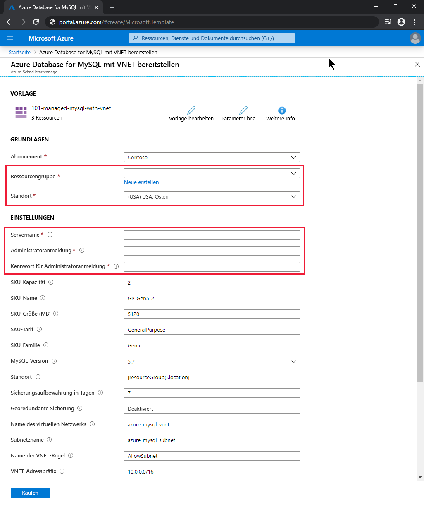

# <a name="quickstart-use-an-arm-template-to-create-an-azure-database-for-mysql-server"></a>Schnellstart: Erstellen eines Azure Database for MySQL-Servers mithilfe einer ARM-Vorlage

Azure Database for MySQL ist ein verwalteter Dienst, mit dem Sie hochverfügbare MySQL-Datenbanken in der Cloud ausführen, verwalten und skalieren können. In dieser Schnellstartanleitung verwenden Sie eine Azure Resource Manager-Vorlage (ARM-Vorlage), um einen Azure Database for MySQL-Server mit Integration in virtuelle Netzwerke zu erstellen. Sie können den Server im Azure-Portal, über die Azure-Befehlszeilenschnittstelle (Azure CLI) oder mithilfe von Azure PowerShell erstellen.

[!INCLUDE [About Azure Resource Manager](../../includes/resource-manager-quickstart-introduction.md)]

Wenn Ihre Umgebung die Voraussetzungen erfüllt und Sie mit der Verwendung von ARM-Vorlagen vertraut sind, klicken Sie auf die Schaltfläche **In Azure bereitstellen**. Die Vorlage wird im Azure-Portal geöffnet.

[](https://portal.azure.com/#create/Microsoft.Template/uri/https%3a%2f%2fraw.githubusercontent.com%2fAzure%2fazure-quickstart-templates%2fmaster%2f101-managed-mysql-with-vnet%2fazuredeploy.json)

## <a name="prerequisites"></a>Voraussetzungen

# <a name="portal"></a>[Portal](#tab/azure-portal)

Ein Azure-Konto mit einem aktiven Abonnement. [Erstellen Sie ein kostenloses Konto.](https://azure.microsoft.com/free/)

# <a name="powershell"></a>[PowerShell](#tab/PowerShell)

* Ein Azure-Konto mit einem aktiven Abonnement. [Erstellen Sie ein kostenloses Konto.](https://azure.microsoft.com/free/)
* Wenn Sie den Code lokal ausführen möchten, verwenden Sie [Azure PowerShell](/powershell/azure/).

# <a name="cli"></a>[BEFEHLSZEILENSCHNITTSTELLE (CLI)](#tab/CLI)

* Ein Azure-Konto mit einem aktiven Abonnement. [Erstellen Sie ein kostenloses Konto.](https://azure.microsoft.com/free/)
* Wenn Sie den Code lokal ausführen möchten, verwenden Sie die [Azure CLI](/cli/azure/).

---

## <a name="review-the-template"></a>Überprüfen der Vorlage

Ein Azure Database for MySQL-Server wird mit einer definierten Gruppe von Compute- und Speicherressourcen erstellt. Weitere Informationen finden Sie unter [Azure Database for MySQL – Tarife](concepts-pricing-tiers.md). Der Server wird in einer [Azure-Ressourcengruppe](../azure-resource-manager/management/overview.md) erstellt.

Die in dieser Schnellstartanleitung verwendete Vorlage stammt von der Seite mit den [Azure-Schnellstartvorlagen](https://azure.microsoft.com/resources/templates/101-managed-mysql-with-vnet/).

:::code language="json" source="~/quickstart-templates/101-managed-mysql-with-vnet/azuredeploy.json":::

Die Vorlage definiert fünf Azure-Ressourcen:

* [**Microsoft.Network/virtualNetworks**](/azure/templates/microsoft.network/virtualnetworks)
* [**Microsoft.Network/virtualNetworks/subnets**](/azure/templates/microsoft.network/virtualnetworks/subnets)
* [**Microsoft.DBforMySQL/servers**](/azure/templates/microsoft.dbformysql/servers)
* [**Microsoft.DBforMySQL/servers/virtualNetworkRules**](/azure/templates/microsoft.dbformysql/servers/virtualnetworkrules)
* [**Microsoft.DBforMySQL/servers/firewallRules**](/azure/templates/microsoft.dbformysql/servers/firewallrules)

Weitere Azure Database for MySQL-Vorlagenbeispiele finden Sie im [Schnellstartvorlagenkatalog](https://azure.microsoft.com/resources/templates/?resourceType=Microsoft.Dbformysql&pageNumber=1&sort=Popular).

## <a name="deploy-the-template"></a>Bereitstellen der Vorlage

# <a name="portal"></a>[Portal](#tab/azure-portal)

Wählen Sie den folgenden Link aus, um die Azure Database for MySQL-Servervorlage im Azure-Portal bereitzustellen:

[](https://portal.azure.com/#create/Microsoft.Template/uri/https%3a%2f%2fraw.githubusercontent.com%2fAzure%2fazure-quickstart-templates%2fmaster%2f101-managed-mysql-with-vnet%2fazuredeploy.json)

Gehen Sie auf der Seite **Deploy Azure Database for MySQL with VNet** (Azure Database for MySQL mit VNET bereitstellen) wie folgt vor:

1. Wählen Sie unter **Ressourcengruppe** die Option **Neu erstellen** aus, geben Sie einen Namen für die neue Ressourcengruppe ein, und wählen Sie **OK** aus.

2. Wenn Sie eine neue Ressourcengruppe erstellt haben, wählen Sie für die Ressourcengruppe und den neuen Server eine Angabe unter **Standort** aus.

3. Geben Sie Werte für **Servername**, **Administratoranmeldung** und **Kennwort für die Administratoranmeldung** ein.

    

4. Ändern Sie ggf. die anderen Standardeinstellungen:

    * **Abonnement**: das für den Server zu verwendende Azure-Abonnement
    * **SKU-Kapazität**: die Kapazität des virtuellen Kerns. Mögliche Werte: *2* (Standardeinstellung), *4*, *8*, *16*, *32* oder *64*
    * **SKU-Name**: Präfix des SKU-Tarifs, SKU-Familie und SKU-Kapazität, verbunden durch Unterstriche. Beispiele: *B_Gen5_1*, *GP_Gen5_2* (Standardeinstellung) oder *MO_Gen5_32*
    * **Sku Size MB** (SKU-Größe (MB)): Speichergröße des Azure Database for MySQL-Servers in Megabyte (Standardeinstellung: *5120*)
    * **SKU-Tarif**: der Bereitstellungstarif, etwa *Basic*, *GeneralPurpose* (Standardeinstellung) oder *MemoryOptimized*
    * **SKU-Familie**: *Gen4* oder *Gen5* (Standardeinstellung). Mit dieser Option wird die Hardwaregeneration für die Serverbereitstellung angegeben.
    * **MySQL-Version**: die Version des bereitzustellenden MySQL-Servers, etwa *5.6* oder *5.7* (Standardeinstellung)
    * **Backup Retention Days** (Sicherungsaufbewahrung in Tagen): der gewünschte Zeitraum für die Aufbewahrung georedundanter Sicherungen in Tagen (Standardeinstellung: *7*)
    * **Georedundante Sicherung**: *Aktiviert* oder *Deaktiviert* (Standardeinstellung), abhängig von den Anforderungen an die georedundante Notfallwiederherstellung (Geo-Disaster Recovery, Geo-DR)
    * **Name des virtuellen Netzwerks**: der Name des virtuellen Netzwerks (Standardeinstellung: *azure_mysql_vnet*)
    * **Subnetzname**: der Name des Subnetzes (Standardeinstellung: *azure_mysql_subnet*)
    * **Virtual Network Rule Name** (Name der VNET-Regel): der Name der VNET-Regel, die das Subnetz zulässt (Standardeinstellung: *AllowSubnet*)
    * **Vnet Address Prefix** (VNET-Adresspräfix): das Adresspräfix für das virtuelle Netzwerk (Standardeinstellung: *10.0.0.0/16*)
    * **Subnetzpräfix**: das Adresspräfix für das Subnetz (Standardeinstellung: *10.0.0.0/16*)

5. Lesen Sie die Geschäftsbedingungen, und wählen Sie anschließend die Option **Ich stimme den oben genannten Geschäftsbedingungen zu** aus.

6. Wählen Sie die Option **Kaufen**.

# <a name="powershell"></a>[PowerShell](#tab/PowerShell)

Verwenden Sie den folgenden interaktiven Code, um mithilfe der Vorlage einen neuen Azure Database for MySQL-Server zu erstellen. Vom Code werden Sie zur Eingabe des neuen Servernamens, des Namens und des Standorts einer neuen Ressourcengruppe sowie eines Administratorkontonamens und Kennworts aufgefordert.

Wählen Sie zum Ausführen des Codes in Azure Cloud Shell in der oberen Ecke eines beliebigen Codeblocks **Ausprobieren** aus.

```azurepowershell-interactive
$serverName = Read-Host -Prompt "Enter a name for the new Azure Database for MySQL server"
$resourceGroupName = Read-Host -Prompt "Enter a name for the new resource group where the server will exist"
$location = Read-Host -Prompt "Enter an Azure region (for example, centralus) for the resource group"
$adminUser = Read-Host -Prompt "Enter the Azure Database for MySQL server's administrator account name"
$adminPassword = Read-Host -Prompt "Enter the administrator password" -AsSecureString

New-AzResourceGroup -Name $resourceGroupName -Location $location # Use this command when you need to create a new resource group for your deployment
New-AzResourceGroupDeployment -ResourceGroupName $resourceGroupName `
    -TemplateUri https://raw.githubusercontent.com/Azure/azure-quickstart-templates/master/101-managed-mysql-with-vnet/azuredeploy.json `
    -serverName $serverName `
    -administratorLogin $adminUser `
    -administratorLoginPassword $adminPassword

Read-Host -Prompt "Press [ENTER] to continue ..."
```

# <a name="cli"></a>[BEFEHLSZEILENSCHNITTSTELLE (CLI)](#tab/CLI)

Verwenden Sie den folgenden interaktiven Code, um mithilfe der Vorlage einen neuen Azure Database for MySQL-Server zu erstellen. Vom Code werden Sie zur Eingabe des neuen Servernamens, des Namens und des Standorts einer neuen Ressourcengruppe sowie eines Administratorkontonamens und Kennworts aufgefordert.

Wählen Sie zum Ausführen des Codes in Azure Cloud Shell in der oberen Ecke eines beliebigen Codeblocks **Ausprobieren** aus.

```azurecli-interactive
echo "Enter a name for the new Azure Database for MySQL server:" &&
read serverName &&
echo "Enter a name for the new resource group where the server will exist:" &&
read resourceGroupName &&
echo "Enter an Azure region (for example, centralus) for the resource group:" &&
read location &&
echo "Enter the Azure Database for MySQL server's administrator account name:" &&
read adminUser &&
echo "Enter the administrator password:" &&
read adminPassword &&
params='serverName='$serverName' administratorLogin='$adminUser' administratorLoginPassword='$adminPassword &&
az group create --name $resourceGroupName --location $location &&
az deployment group create --resource-group $resourceGroupName --parameters $params --template-uri https://raw.githubusercontent.com/Azure/azure-quickstart-templates/master/101-managed-mysql-with-vnet/azuredeploy.json &&
echo "Press [ENTER] to continue ..."
```

---

## <a name="review-deployed-resources"></a>Überprüfen der bereitgestellten Ressourcen

# <a name="portal"></a>[Portal](#tab/azure-portal)

Führen Sie die folgenden Schritte aus, um eine Übersicht über Ihren neuen Azure Database for MySQL-Server anzuzeigen:

1. Suchen Sie im [Azure-Portal](https://portal.azure.com) nach **Azure Database for MySQL-Server**, und wählen Sie die Option aus.

2. Wählen Sie in der Datenbankliste den neuen Server aus. Die Seite **Übersicht** für den neuen Azure Database for MySQL-Server wird angezeigt.

# <a name="powershell"></a>[PowerShell](#tab/PowerShell)

Führen Sie den folgenden interaktiven Code aus, um Details zu Ihrem Azure Database for MySQL-Server anzuzeigen. Sie müssen den Namen des neuen Servers eingeben.

```azurepowershell-interactive
$serverName = Read-Host -Prompt "Enter the name of your Azure Database for MySQL server"
Get-AzResource -ResourceType "Microsoft.DBforMySQL/servers" -Name $serverName | ft
Write-Host "Press [ENTER] to continue..."
```

# <a name="cli"></a>[BEFEHLSZEILENSCHNITTSTELLE (CLI)](#tab/CLI)

Führen Sie den folgenden interaktiven Code aus, um Details zu Ihrem Azure Database for MySQL-Server anzuzeigen. Sie müssen den Namen und die Ressourcengruppe des neuen Servers eingeben.

```azurecli-interactive
echo "Enter your Azure Database for MySQL server name:" &&
read serverName &&
echo "Enter the resource group where the Azure Database for MySQL server exists:" &&
read resourcegroupName &&
az resource show --resource-group $resourcegroupName --name $serverName --resource-type "Microsoft.DbForMySQL/servers"
```

---

## <a name="clean-up-resources"></a>Bereinigen von Ressourcen

Wenn Sie die Ressourcen nicht mehr benötigen, löschen Sie die Ressourcengruppe. Dadurch werden die Ressourcen in der Ressourcengruppe gelöscht.

# <a name="portal"></a>[Portal](#tab/azure-portal)

1. Suchen Sie im [Azure-Portal](https://portal.azure.com) nach **Ressourcengruppen**, und wählen Sie die entsprechende Option aus.

2. Wählen Sie in der Liste der Ressourcengruppen den Namen Ihrer Ressourcengruppe aus.

3. Wählen Sie auf der Seite **Übersicht** der Ressourcengruppe die Option **Ressourcengruppe löschen** aus.

4. Geben Sie im Bestätigungsdialogfeld den Namen Ihrer Ressourcengruppe ein, und wählen Sie **Löschen** aus.

# <a name="powershell"></a>[PowerShell](#tab/PowerShell)

```azurepowershell-interactive
$resourceGroupName = Read-Host -Prompt "Enter the Resource Group name"
Remove-AzResourceGroup -Name $resourceGroupName
Write-Host "Press [ENTER] to continue..."
```

# <a name="cli"></a>[BEFEHLSZEILENSCHNITTSTELLE (CLI)](#tab/CLI)

```azurecli-interactive
echo "Enter the Resource Group name:" &&
read resourceGroupName &&
az group delete --name $resourceGroupName &&
echo "Press [ENTER] to continue ..."
```

---

## <a name="next-steps"></a>Nächste Schritte

Ein Tutorial mit Schritt-für-Schritt-Anleitungen zum Erstellen einer ARM-Vorlage finden Sie unter folgendem Link:

> [!div class="nextstepaction"]
> [Tutorial: Erstellen und Bereitstellen Ihrer ersten ARM-Vorlage](../azure-resource-manager/templates/template-tutorial-create-first-template.md)
