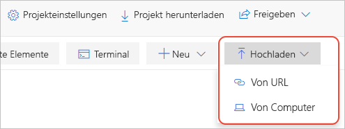

# Schnellstart: Migrieren eines lokalen Jupyter Notebooks zu Azure Notebooks (Vorschauversion)

In dieser Schnellstartanleitung migrieren Sie eine Jupyter Notebook-Instanz von Ihrem lokalen Computer oder einer anderen zugänglichen Datei-URL zu Azure Notebooks. 

Auf Jupyter Notebook-Instanzen auf Ihrem Computer haben nur Sie Zugriff. Sie können Ihre Dateien freigeben, Empfänger besitzen dann jedoch eigene lokale Kopien des Notebooks, und die Integration ihrer Änderungen wird erschwert. Auch wenn Sie Notebooks in einem freigegebenen Onlinerepository wie GitHub speichern, muss jeder Projektmitarbeiter über eine lokale Jupyter-Installation verfügen, die wie Ihre konfiguriert ist.

Durch Migrieren Ihrer lokalen oder auf Repositorys basierenden Notebooks zu Azure Notebooks können Sie sie sofort mit den Projektmitarbeitern teilen. Diese benötigen nur einen Browser zum Anzeigen und Ausführen Ihrer Notebooks. Wenn sie sich bei Azure Notebooks anmelden, können sie auch Änderungen vornehmen.

## Voraussetzungen

- Eine [Jupyter Notebook-Instanz](https://jupyter-notebook.readthedocs.io) auf Ihrem lokalen Computer oder unter einer anderen zugänglichen Datei-URL 

## Erstellen eines Projekts auf Azure Notebooks

Diese Schnellstartanleitung veranschaulicht die Migration für ein Notebook von Ihrem lokalen Computer oder einer sonstigen zugänglichen Datei-URL. Informationen zum Migrieren von Notebooks aus einem GitHub-Repository finden Sie unter [Schnellstart: Klonen eines Notebooks](quickstart-clone-jupyter-notebook.md).

[!INCLUDE [notebooks-status](../../includes/notebooks-status.md)]

1. Navigieren Sie zu [Azure Notebooks](https://notebooks.azure.com), und melden Sie sich an (ausführliche Informationen hierzu finden Sie unter [Schnellstart: Anmelden bei Azure Notebooks](quickstart-sign-in-azure-notebooks.md)).

1. Wählen Sie oben auf Ihrer öffentlichen Profilseite **Meine Projekte** aus:

    

1. Wählen Sie auf der Seite **Meine Projekte** die Option **Neues Projekt** aus (Tastenkombination: n). Ist das Browserfenster schmal, wird die Schaltfläche unter Umständen nur als **+** angezeigt:

    

1. Geben Sie im Popupfenster **Neues Projekt erstellen**, das dann angezeigt wird, passende Werte für das zu migrierende Notebook in den Feldern **Projektname** und **Projekt-ID** ein, deaktivieren Sie die Optionen für **Öffentliches Projekt** und **README.md-Datei erstellen**, und wählen Sie dann **Erstellen** aus.

## Hochladen des lokalen Notebooks

1. Wählen Sie auf der Projektseite **Hochladen** (was möglicherweise nur als Pfeil nach oben angezeigt wird, wenn Ihr Browserfenster klein ist) und dann „1“ aus. Wählen Sie im angezeigten Popupfenster **Von Computer** aus, wenn sich Ihr Notebook in Ihrem lokalen Dateisystem befindet, oder **Von URL**, wenn Ihr Notebook online gespeichert ist:

    

   Nur zur Erinnerung: Falls sich Ihr Notebook in einem GitHub-Repository befindet, führen Sie stattdessen die Schritte unter [Schnellstart: Klonen eines Notebooks](quickstart-clone-jupyter-notebook.md) aus.

   - Wenn Sie **Von Computer** verwenden, ziehen Sie Ihre *.ipynb*-Dateien auf das Popupfenster, und legen Sie sie dort ab, oder wählen Sie **Dateien auswählen**, navigieren Sie dann zu den zu importierenden Dateien, und wählen Sie sie aus. Wählen Sie dann die Option **Hochladen**. Die hochgeladenen Dateien erhalten die gleichen Namen wie die lokalen Dateien. Die Inhalte der Ordner vom Typ *.ipynb_checkpoints* müssen nicht hochgeladen werden.

     

   - Wenn Sie **Von URL** verwenden, geben Sie die Quelladresse im Feld **Datei-URL** und den Dateinamen, der dem Notebook in Ihrem Projekt zugewiesen werden soll, im Feld **Dateiname** ein. Wählen Sie dann die Option **Hochladen**. Wenn Sie über mehrere Dateien mit separaten URLs verfügen, verwenden Sie den Befehl **Datei hinzufügen**, um die erste eingegebene URL zu überprüfen. Anschließend stellt das Popup neue Felder für eine weitere Datei zur Verfügung.

     

1. Öffnen Sie Ihr neu hochgeladenes Notebook, und führen Sie es aus, um Inhalt und Betrieb zu prüfen. Wenn Sie fertig sind, wählen Sie **Datei** > **Beenden und schließen** aus, um das Notebook zu schließen.

1. Um einen Link zu Ihrem hochgeladenen Notebook zu teilen, klicken Sie mit der rechten Maustaste auf die Datei im Projekt, wählen Sie **Link kopieren** (Tastenkombination: y) aus, und fügen Sie diesen Link dann in die entsprechende Nachricht ein. Alternativ können Sie das Projekt mit dem Steuerelement **Freigabe** auf der Projektseite als Ganzes teilen.

1. Um andere Dateien als Notebooks zu bearbeiten, klicken Sie mit der rechten Maustaste auf die Datei im Projekt, und wählen Sie **Edit file** (Datei bearbeiten; Tastenkombination: i) aus. Mit der Standardaktion **Run** (Ausführen; Tastenkombination: r) wird nur der Dateiinhalt angezeigt, Bearbeiten ist nicht möglich.

## Nächste Schritte

> [!div class="nextstepaction"]
> [Tutorial: Erstellen und Ausführen einer Jupyter Notebook-Instanz für lineare Regression](tutorial-create-run-jupyter-notebook.md)
