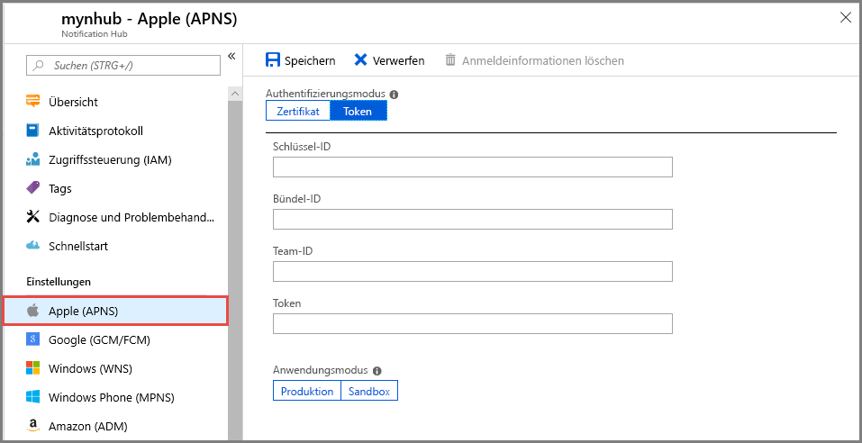
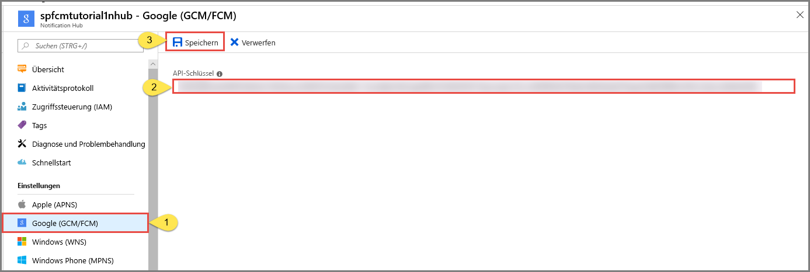

# <a name="quickstart-set-up-push-notifications-in-a-notification-hub"></a>Schnellstart: Einrichten von Pushbenachrichtigungen in einem Notification Hub

Azure Notification Hubs bietet ein Pushmodul, das einfach zu verwenden ist und horizontal hochskaliert. Mit Notification Hubs können Sie Benachrichtigungen an beliebige Plattformen (iOS, Android, Windows, Baidu) und von jedem Back-End (Cloud oder lokal) senden. Weitere Informationen finden Sie unter [Was ist Azure Notification Hubs?](notification-hubs-push-notification-overview.md).

In diesem Schnellstart verwenden Sie die Einstellungen des Plattformbenachrichtigungssystems (PNS) in Notification Hubs zum Einrichten von Pushbenachrichtigungen auf mehreren Plattformen. Der Schnellstart zeigt Ihnen die Schritte, die Sie im Azure-Portal ausführen müssen. [Google Firebase Cloud Messaging](?tabs=azure-cli#google-firebase-cloud-messaging-fcm) enthält eine Anleitung zur Verwendung der Azure CLI.

Wenn Sie noch keinen Notification Hub erstellt haben, erstellen Sie ihn jetzt. Weitere Informationen finden Sie unter [Erstellen einer Azure Notification Hub-Instanz über das Azure-Portal](create-notification-hub-portal.md) oder [Erstellen einer Azure Notification Hub-Instanz mithilfe der Azure-Befehlszeilenschnittstelle](create-notification-hub-azure-cli.md).

## <a name="apple-push-notification-service"></a>Apple Push Notification Service

So richten Sie einen Apple Push Notification Service (APNS) ein:

1. Wählen Sie im Azure-Portal auf der Seite **Notification Hub** im Menü auf der linken Seite die Option **Apple (APNS)** aus.

1. Wählen Sie für **Authentifizierungsmodus** entweder **Zertifikat** oder **Token** aus.

   a. Wenn Sie **Zertifikat** auswählen:
   * Wählen Sie das Dateisymbol und anschließend die hochzuladende *P12*-Datei aus.
   * Geben Sie ein Kennwort ein.
   * Wählen Sie den Modus **Sandbox** aus. Alternativ können Sie den Modus **Produktion** auswählen, um Pushbenachrichtigungen an Benutzer zu senden, die Ihre App im Store erworben haben.

     

   b. Wenn Sie **Token** auswählen:

   * Geben Sie die Werte für **Schlüssel-ID**, **Paket-ID**, **Team-ID** und **Token** ein.
   * Wählen Sie den Modus **Sandbox** aus. Alternativ können Sie den Modus **Produktion** auswählen, um Pushbenachrichtigungen an Benutzer zu senden, die Ihre App im Store erworben haben.

     

Weitere Informationen finden Sie unter [Senden von Pushbenachrichtigungen an iOS-Apps mit Azure Notification Hubs](ios-sdk-get-started.md).

## <a name="google-firebase-cloud-messaging-fcm"></a>Google Firebase Cloud Messaging (FCM)

# <a name="portal"></a>[Portal](#tab/azure-portal)

Richten Sie Pushbenachrichtigungen für Google FCM wie folgt ein:

1. Wählen Sie im Azure-Portal auf der Seite **Notification Hub** im Menü auf der linken Seite die Option **Google (GCM/FCM)** aus.
2. Fügen Sie den **API-Schlüssel** für das Google FCM-Projekt ein, das Sie zuvor gespeichert haben.
3. Wählen Sie **Speichern** aus.

   

Wenn Sie diese Schritte abgeschlossen haben, wird angezeigt, dass der Notification Hub erfolgreich aktualisiert wurde. Die Schaltfläche **Save** (Speichern) ist deaktiviert.

# <a name="azure-cli"></a>[Azure-Befehlszeilenschnittstelle](#tab/azure-cli)

### <a name="prerequisites"></a>Voraussetzungen

Bevor Sie mit diesem Lernprogramm beginnen können, benötigen Sie Folgendes:

* [Azure CLI](/cli/azure/install-azure-cli), Version 2.0.67 oder höher.

* Die Azure CLI-[Erweiterung für Notification Hubs](/cli/azure/ext/notification-hub/notification-hub).
* Den **API-Schlüssel** für ein Google Firebase Cloud Messaging-Projekt (FCM).

### <a name="set-up-push-notifications-for-google-fcm"></a>Einrichten von Pushbenachrichtigungen für Google FCM

1. Verwenden Sie den Befehl [az notification-hub credential gcm update](/cli/azure/ext/notification-hub/notification-hub/credential/gcm#ext-notification-hub-az-notification-hub-credential-gcm-update), um Ihren Google-API-Schlüssel dem Notification Hub hinzuzufügen.

   ```azurecli
   az notification-hub credential gcm update --resource-group spnhubrg --namespace-name spnhubns    --notification-hub-name spfcmtutorial1nhub --google-api-key myKey
   ```

2. Die Android-App benötigt für die Verbindung mit dem Notification Hub eine Verbindungszeichenfolge.  Verwenden Sie den Befehl [az notification-hub authorization-rule list](/cli/azure/ext/notification-hub/notification-hub/authorization-rule#ext-notification-hub-az-notification-hub-authorization-rule-list), um die verfügbaren Zugriffsrichtlinien aufzulisten.  Verwenden Sie den Befehl [az notification-hub authorization-rule list-keys](/cli/azure/ext/notification-hub/notification-hub/authorization-rule#ext-notification-hub-az-notification-hub-authorization-rule-list-keys), um die Verbindungszeichenfolgen für Zugriffsrichtlinien abzurufen.  Geben Sie **primaryConnectionString** oder **secondaryConnectionString** über den Parameter `--query` an, um die primäre Verbindungszeichenfolge direkt zu erhalten.

   ```azurecli
   #list access policies for a notification hub
   az notification-hub authorization-rule list --resource-group spnhubrg --namespace-name spnhubns --notification-hub-name spfcmtutorial1nhub --output table

   #list keys and connection strings for a notification hub access policy
   az notification-hub authorization-rule list-keys --resource-group spnhubrg --namespace-name spnhubns --notification-hub-name spfcmtutorial1nhub --name myAccessPolicyName --output json

   #get the primaryConnectionString for an access policy
   az notification-hub authorization-rule list-keys --resource-group spnhubrg --namespace-name spnhubns --notification-hub-name spfcmtutorial1nhub --name myAccessPolicyName --query primaryConnectionString
   ```

3. Verwenden Sie den Befehl [az notification-hub test-send](/cli/azure/ext/notification-hub/notification-hub#ext-notification-hub-az-notification-hub-test-send), um das Senden von Nachrichten an die Android-App zu testen.

   ```azurecli
   #test with message body
   az notification-hub test-send --resource-group spnhubrg --namespace-name spnhubns --notification-hub-name spfcmtutorial1nhub --notification-format gcm --message "my message body"

   #test with JSON string
   az notification-hub test-send --resource-group spnhubrg --namespace-name spnhubns --notification-hub-name spfcmtutorial1nhub --notification-format gcm --payload "{\"data\":{\"message\":\"my JSON string\"}}"
   ```

Rufen Sie Azure CLI-Referenzen für andere Plattformen mit dem Befehl [az notification-hub credential](/cli/azure/ext/notification-hub/notification-hub/credential) ab.

Weitere Informationen zum Senden von Benachrichtigungen an eine Android-Anwendung finden Sie unter [Senden von Pushbenachrichtigungen an Android-Geräte mit Firebase](notification-hubs-android-push-notification-google-fcm-get-started.md).

## <a name="windows-push-notification-service"></a>Windows-Pushbenachrichtigungsdienst (Windows Push Notification Service, WNS)

So richten Sie den Windows-Pushbenachrichtigungsdienst (WNS) ein:

1. Wählen Sie im Azure-Portal auf der Seite **Notification Hub** im Menü auf der linken Seite die Option **Windows (WNS)** aus.
2. Geben Sie Werte für **Paket-SID** und **Sicherheitsschlüssel** ein.
3. Wählen Sie **Speichern** aus.

   

Weitere Informationen finden Sie unter [Tutorial: Senden von Benachrichtigungen an Apps für die universelle Windows-Plattform mit Azure Notification Hubs](notification-hubs-windows-store-dotnet-get-started-wns-push-notification.md).

## <a name="microsoft-push-notification-service-for-windows-phone"></a>Microsoft-Pushbenachrichtigungsdienst für Windows Phone

So richten Sie den Microsoft-Pushbenachrichtigungsdienst (Microsoft Push Notification Service, MPNS) für Windows Phone ein:

1. Wählen Sie im Azure-Portal auf der Seite **Notification Hub** im Menü auf der linken Seite die Option **Windows Phone (MPNS)** aus.
1. Aktivieren Sie entweder nicht authentifizierte oder authentifizierte Pushbenachrichtigungen:

   a. Um nicht authentifizierte Pushbenachrichtigungen zu aktivieren, wählen Sie **Nicht authentifizierte Pushbenachrichtigungen zulassen** > **Speichern** aus.

      

   b. So aktivieren Sie authentifizierte Pushbenachrichtigungen:
      * Wählen Sie auf der Symbolleiste die Option **Zertifikat hochladen** aus.
      * Wählen Sie das Dateisymbol und anschließend die Zertifikatdatei aus.
      * Geben Sie das Kennwort für das Zertifikat ein.
      * Klicken Sie auf **OK**.
      * Wählen Sie auf der Seite **Windows Phone (MPNS)** die Option **Speichern** aus.

Weitere Informationen finden Sie unter [Tutorial: Senden von Pushbenachrichtigungen an Windows Phone-Apps mit Azure Notification Hubs](notification-hubs-windows-mobile-push-notifications-mpns.md).

## <a name="baidu-android-china"></a>Baidu (Android China)

So richten Sie Pushbenachrichtigungen für Baidu ein:

1. Wählen Sie im Azure-Portal auf der Seite **Notification Hub** im Menü auf der linken Seite die Option **Baidu (Android China)** aus.
2. Geben Sie den **API-Schlüssel** aus der Baidu-Konsole in das Baidu Cloud Push-Projekt ein.
3. Geben Sie den **Geheimen Schlüssel** aus der Baidu-Konsole in das Baidu Cloud Push-Projekt ein.
4. Wählen Sie **Speichern** aus.

    

Wenn Sie diese Schritte abgeschlossen haben, wird angezeigt, dass der Notification Hub erfolgreich aktualisiert wurde. Die Schaltfläche **Save** (Speichern) ist deaktiviert.

Weitere Informationen finden Sie unter [Erste Schritte mit Notification Hubs mit Baidu](notification-hubs-baidu-china-android-notifications-get-started.md).

## <a name="next-steps"></a>Nächste Schritte

In dieser Schnellstartanleitung haben Sie gelernt, wie Sie im Azure-Portal Benachrichtigungssystemeinstellungen für einen Notification Hub konfigurieren.

Weitere Informationen zum Senden von Pushbenachrichtigungen an verschiedene Plattformen finden Sie in diesen Tutorials:

* [Senden von Pushbenachrichtigungen an iOS-Apps mit Azure Notification Hubs](ios-sdk-get-started.md)
* [Senden von Benachrichtigungen an Android-Geräte mit Azure Notification Hubs und Google Firebase Cloud Messaging](notification-hubs-android-push-notification-google-fcm-get-started.md)
* [Senden von Benachrichtigungen an Apps für die universelle Windows-Plattform auf einem Windows-Gerät](notification-hubs-windows-store-dotnet-get-started-wns-push-notification.md)
* [Senden von Benachrichtigungen an eine Windows Phone 8-App mit MPNS](notification-hubs-windows-mobile-push-notifications-mpns.md)
* [Senden von Benachrichtigungen mit Azure Notification Hubs und Baidu Cloud Push](notification-hubs-baidu-china-android-notifications-get-started.md)
