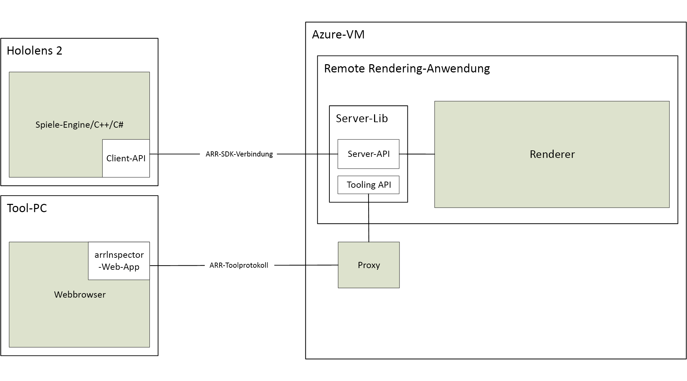

# Informationen zu Azure Remote Rendering

> [!IMPORTANT]
> **Azure Remote Rendering** befindet sich derzeit in der Vorschauphase.
> Diese Vorschauversion wird ohne Vereinbarung zum Servicelevel bereitgestellt und ist nicht für Produktionsworkloads vorgesehen. Manche Features werden möglicherweise nicht unterstützt oder sind nur eingeschränkt verwendbar. Weitere Informationen finden Sie unter [Zusätzliche Nutzungsbestimmungen für Microsoft Azure-Vorschauen](https://azure.microsoft.com/support/legal/preview-supplemental-terms/).

*Azure Remote Rendering* (ARR) ist ein Dienst, mit dem Sie interaktive 3D-Inhalte in der Cloud in hoher Qualität rendern und in Echtzeit an Geräte streamen können, z. B. HoloLens 2.

Unabhängige Geräte verfügen über eingeschränkte Rechenleistung zum Rendern von komplexen Modellen. Für viele Anwendungen ist es aber nicht akzeptabel, die Qualität der visuellen Darstellung zu reduzieren. Der folgende bietet einen Vergleich des vollständig detaillierten Modells mit einem Modell, das mit einem gängigen Inhaltserstellungstool vereinfacht wurde:

Das reduzierte Modell besteht aus ungefähr 200.000 Dreiecken (einschließlich der detaillierten inneren Teile) im Vergleich zu mehr als 18 Millionen Dreiecken im Originalmodell.

Bei *Remote Rendering* wird dieses Problem gelöst, indem die zu rendernde Workload auf High-End-GPUs in der Cloud verschoben wird. Mit einem in der Cloud gehosteten Grafikmodul wird das Bild gerendert, als Videostream codiert und in dieser Form an das Zielgerät gestreamt.

## Hybrid-Rendering

In den meisten Anwendungen reicht es nicht aus, nur ein komplexes Modell zu rendern. Sie benötigen zusätzlich eine benutzerdefinierte Benutzeroberfläche, um Funktionen für Benutzer zur Verfügung zu stellen. Bei Azure Remote Rendering wird nicht die Nutzung eines dedizierten Frameworks für Benutzeroberflächen erzwungen, sondern stattdessen wird das *Hybrid-Rendering* unterstützt. Dies bedeutet, dass Sie Elemente auf dem Gerät rendern können, indem Sie Ihr bevorzugtes Verfahren nutzen, z. B. [MRTK](https://microsoft.github.io/MixedRealityToolkit-Unity/Documentation/GettingStartedWithTheMRTK.html).

Am Ende eines Frames kombiniert Azure Remote Rendering Ihren lokal gerenderten Inhalt dann automatisch mit dem Remotebild. Dies ist sogar mit korrekter Verdeckung (Okklusion) möglich.

## Rendering mit mehreren GPUs

Einige Modelle sind zu komplex für das Rendern mit interaktiven Bildfrequenzen (auch bei Verwendung einer High-End-GPU). Dies ist besonders bei der industriellen Visualisierung ein häufiges Problem. Mit Azure Remote Rendering kann die Workload auch auf mehrere GPUs verteilt werden, um mehr Spielraum zu haben. Die Ergebnisse werden in einem zentralen Bild zusammengeführt, damit der Prozess für den Benutzer vollständig transparent ist.

## Allgemeine Architektur

In diesem Diagramm ist die Architektur für das Rendern per Remotezugriff dargestellt:

Ein vollständiger Zyklus zur Bilderstellung umfasst die folgenden Schritte:

1. Clientseitig: Frameeinrichtung
    1. Ihr Code: Benutzereingabe wird verarbeitet, Szenengraph wird aktualisiert
    1. ARR-Code: Szenengraph wird aktualisiert, und die vorhergesagte Position wird an den Server gesendet
1. Serverseitig: Rendering per Remotezugriff
    1. Renderingmodul verteilt die Renderingaufgaben auf verfügbare GPUs
    1. Ausgabe mehrerer GPUs wird in einem zentralen Bild zusammengefasst
    1. Bild wird als Videostream codiert und zurück an den Client gesendet
1. Clientseitig: Abschluss
    1. Ihr Code: Optionaler lokaler Inhalt (Benutzeroberfläche, Marker usw.) wird gerendert
    1. ARR-Code: Bei „present“ wird lokal gerenderter Inhalt automatisch mit dem Videostream zusammengeführt

Die Netzwerklatenz ist das Hauptproblem. Der Zeitraum zwischen dem Senden einer Anforderung und dem Empfangen des Ergebnisses ist für interaktive Bildfrequenzen normalerweise zu lang. Daher kann es sein, dass jeweils mehr als ein Frame aktiv ist.

## Nächste Schritte

* [Systemanforderungen](system-requirements.md)
* [Schnellstart: Rendern eines Modells mit Unity](../quickstarts/render-model.md)
