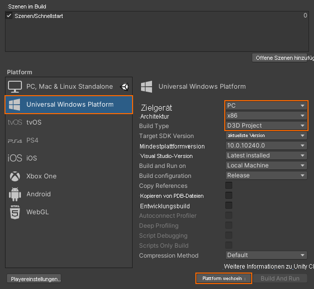

# Schnellstart: Bereitstellen des Unity-Beispiels für den Desktop

In dieser Schnellstartanleitung erfahren Sie, wie Sie die Schnellstartbeispiel-App für Unity auf einem Desktop-PC bereitstellen und ausführen.

In dieser Schnellstartanleitung wird Folgendes vermittelt:

> [!div class="checklist"]
>
>* Erstellen der Schnellstartbeispiel-App für den Desktop
>* Bereitstellen des Beispiels auf einem PC
>* Ausführen des Beispiels auf einem PC

## Voraussetzungen

In dieser Schnellstartanleitung stellen Sie das Beispielprojekt aus [Schnellstart: Rendern eines Modells mit Unity](render-model.md) bereit.

Stellen Sie sicher, dass Ihre Anmeldeinformationen ordnungsgemäß mit der Szene gespeichert werden und Sie über den Unity-Editor eine Verbindung mit einer Sitzung herstellen können.

## Deaktivieren der Virtual Reality-Unterstützung

Derzeit werden nur flache Desktop-Apps auf dem Desktop unterstützt. Die VR-Unterstützung muss daher deaktiviert werden.

1. Öffnen Sie *Edit > Project Settings...* (Bearbeiten > Projekteinstellungen).
1. Wählen Sie auf der linken Seite **Player** aus.
1. Wählen Sie die Registerkarte **Universal Windows Platform settings** (UWP-Einstellungen) aus.
1. Erweitern Sie den Eintrag **XR Settings** (XR-Einstellungen).
1. Deaktivieren Sie **Virtual Reality Supported** (Unterstützung für virtuelle Realität).
    
1. Erweitern Sie oberhalb von *XR Settings* (XR-Einstellungen) die Option **Publishing Settings** (Veröffentlichungseinstellungen).
1. Vergewissern Sie sich unter **Supported Device Families** (Unterstützte Gerätefamilien), ob **Desktop** aktiviert ist.

## Erstellen des Beispielprojekts

1. Öffnen Sie *File > Build Settings* (Datei > Buildeinstellungen).
1. Ändern Sie *Platform* (Plattform) in **Universal Windows Platform** (Universelle Windows-Plattform).
1. Legen Sie *Target Device* (Zielgerät) auf **PC** fest.
1. Legen Sie *Architecture* (Architektur) auf **x86** fest.
1. Legen Sie *Build Type* (Buildtyp) auf **D3D Project** (D3D-Projekt) fest.
  
1. Wählen Sie **Switch to Platform** (Zu Plattform wechseln) aus.
1. Wenn Sie auf **Build** (Erstellen) oder „Build And Rund“ (Erstellen und ausführen) klicken, werden Sie zur Auswahl eines Ordners aufgefordert, in dem die Projektmappe gespeichert werden soll.
1. Öffnen Sie die generierte Datei **Quickstart.sln** mit Visual Studio.
1. Ändern Sie die Konfiguration in **Release** und **x86**.
1. Ändern Sie den Debuggermodus in **Local Machine** (Lokaler Computer).
  
1. Erstellen Sie die Projektmappe (F7).

> [!WARNING]
> Wählen Sie unbedingt **x86** aus. **x64** wird derzeit nicht unterstützt. Informationen finden Sie unter [Plattformeinschränkungen](../reference/limits.md#platform-limitations).

## Starten des Beispielprojekts

Starten Sie den Debugger in Visual Studio (F5). Die App wird automatisch auf dem PC bereitgestellt.

Daraufhin sollte die Beispiel-App gestartet und anschließend eine neue Sitzung initiiert werden. Nach einer Weile ist die Sitzung bereit, und das remote gerenderte Modell wird vor Ihnen angezeigt.
Wenn Sie das Beispiel später ein zweites Mal starten möchten, ist das nun auch über das Startmenü möglich.

## Nächste Schritte

In der nächsten Schnellstartanleitung wird das Konvertieren eines benutzerdefinierten Modells erläutert.

> [!div class="nextstepaction"]
> [Schnellstart: Konvertieren eines Modells für das Rendering](convert-model.md)
