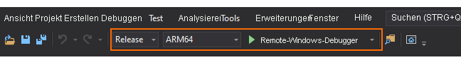

# Schnellstart: Bereitstellen des Unity-Beispiels für HoloLens

In dieser Schnellstartanleitung erfahren Sie, wie Sie die Schnellstartbeispiel-App für Unity auf einem HoloLens 2-Gerät bereitstellen und ausführen.

In dieser Schnellstartanleitung wird Folgendes vermittelt:

> [!div class="checklist"]
>
>* Erstellen der Schnellstartbeispiel-App für HoloLens
>* Bereitstellen des Beispiels auf dem Gerät
>* Ausführen des Beispiels auf dem Gerät

## Voraussetzungen

In dieser Schnellstartanleitung stellen Sie das Beispielprojekt aus [Schnellstart: Rendern eines Modells mit Unity](render-model.md) bereit.

Stellen Sie sicher, dass Ihre Anmeldeinformationen ordnungsgemäß mit der Szene gespeichert werden und Sie über den Unity-Editor eine Verbindung mit einer Sitzung herstellen können.

## Erstellen des Beispielprojekts

1. Öffnen Sie *File > Build Settings* (Datei > Buildeinstellungen).
1. Ändern Sie *Platform* (Plattform) in **Universal Windows Platform** (Universelle Windows-Plattform).
1. Legen Sie *Target Device* (Zielgerät) auf **HoloLens** fest.
1. Legen Sie *Architecture* (Architektur) auf **ARM64** fest.
1. Legen Sie *Build Type* (Buildtyp) auf **D3D Project**\ (D3D-Projekt) fest.
    
1. Wählen Sie **Switch to Platform** (Zu Plattform wechseln) aus.
1. Wenn Sie auf **Build** (Erstellen) oder „Build And Run“ (Erstellen und ausführen) klicken, werden Sie zur Auswahl eines Ordners aufgefordert, in dem die Projektmappe gespeichert werden soll.
1. Öffnen Sie die generierte Datei **Quickstart.sln** mit Visual Studio.
1. Ändern Sie die Konfiguration in **Release** und **ARM64**.
1. Ändern Sie den Debuggermodus in **Remote Machine**\ (Remotecomputer).
    
1. Erstellen Sie die Projektmappe (F7).
1. Navigieren Sie für das Projekt „Schnellstart“ zu *Properties > Debugging* (Eigenschaften > Debuggen).
    1. Stellen Sie sicher, dass die Konfiguration *Release* aktiv ist.
    1. Legen Sie *Debugger to Launch* (Zu startender Debugger) auf **Remote Machine** (Remotecomputer) fest.
    1. Ändern Sie *Machine Name* (Computername) in die **IP-Adresse Ihres HoloLens-Geräts**.

## Starten des Beispielprojekts

1. Schließen Sie das HoloLens-Gerät mit einem USB-Kabel an Ihren PC an.
1. Starten Sie den Debugger in Visual Studio (F5). Die App wird automatisch auf dem Gerät bereitgestellt.

Daraufhin sollte die Beispiel-App gestartet und anschließend eine neue Sitzung initiiert werden Nach einer Weile ist die Sitzung bereit, und das remote gerenderte Modell wird vor Ihnen angezeigt.
Wenn Sie das Beispiel später ein zweites Mal starten möchten, ist das nun auch über das HoloLens-Startmenü möglich.

## Nächste Schritte

In der nächsten Schnellstartanleitung wird das Konvertieren eines benutzerdefinierten Modells erläutert.

> [!div class="nextstepaction"]
> [Schnellstart: Konvertieren eines Modells für das Rendering](convert-model.md)
