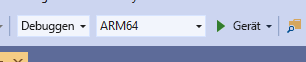

# <a name="quickstart-deploy-native-c-sample-to-hololens"></a>Schnellstart: Bereitstellen des nativen C++-Beispiels für HoloLens

In dieser Schnellstartanleitung erfahren Sie, wie Sie die native C++-Tutorialanwendung auf einem HoloLens 2-Gerät bereitstellen und ausführen.

In dieser Schnellstartanleitung wird Folgendes vermittelt:

> [!div class="checklist"]
>
>* Erstellen der Tutorialanwendung für HoloLens
>* Ändern der ARR-Anmeldeinformationen im Quellcode
>* Bereitstellen und Ausführen des Beispiels auf dem Gerät

## <a name="prerequisites"></a>Voraussetzungen

Sie müssen zunächst ein [Konto erstellen](../../../how-tos/create-an-account.md), um Zugriff auf Azure Remote Rendering zu erhalten.

Die folgende Software muss installiert werden:

* Windows SDK 10.0.18362.0 [(Download)](https://developer.microsoft.com/windows/downloads/windows-10-sdk)
* Aktuelle Version von Visual Studio 2019 [(herunterladen)](https://visualstudio.microsoft.com/vs/older-downloads/)
* [Visual Studio-Tools für Mixed Reality](/windows/mixed-reality/install-the-tools). Insbesondere sind die folgenden *Workloadinstallationen* obligatorisch:
  * **Desktopentwicklung mit C++**
  * **Entwicklung für die universelle Windows-Plattform (UWP)**
* Git [(herunterladen)](https://git-scm.com/downloads)

## <a name="clone-the-arr-samples-repository"></a>Klonen des ARR-Beispielrepositorys

Klonen Sie zuerst das Git-Repository mit den globalen Azure Remote Rendering-Beispielen. Öffnen Sie eine Eingabeaufforderung (`cmd` im Windows-Startmenü), und wechseln Sie in ein Verzeichnis, in dem Sie das ARR-Beispielprojekt speichern möchten.

Führen Sie die folgenden Befehle aus:

```cmd
mkdir ARR
cd ARR
git clone https://github.com/Azure/azure-remote-rendering
```

Mit dem letzten Befehl wird ein Unterverzeichnis im ARR-Verzeichnis erstellt, das die unterschiedlichen Beispielprojekte für Azure Remote Rendering enthält.

Das C++-HoloLens-Tutorial befindet sich im Unterverzeichnis *NativeCpp/HoloLens*.

## <a name="build-the-project"></a>Erstellen des Projekts

Öffnen Sie die Projektmappendatei *HolographicApp.sln* im Unterverzeichnis *NativeCpp/HoloLens* mit Visual Studio 2019.

Legen Sie die Buildkonfiguration auf *Debug* (oder *Release*) und *ARM64* fest. Stellen Sie außerdem sicher, dass der Debuggermodus auf *Gerät* und nicht auf *Remotecomputer* festgelegt ist:



Da die Kontoanmeldeinformationen im Quellcode des Tutorials hartcodiert sind, müssen sie in gültige Anmeldeinformationen geändert werden. Öffnen Sie dazu in Visual Studio die Datei `HolographicAppMain.cpp`, und ändern Sie den Teil, in dem der Client erstellt wird (innerhalb des Konstruktors der Klasse `HolographicAppMain`):

```cpp
// 2. Create Client
{
    // Users need to fill out the following with their account data and model
    RR::SessionConfiguration init;
    init.AccountId = "00000000-0000-0000-0000-000000000000";
    init.AccountKey = "<account key>";
    init.RemoteRenderingDomain = "westus2.mixedreality.azure.com"; // <change to the region that the rendering session should be created in>
    init.AccountDomain = "westus2.mixedreality.azure.com"; // <change to the region the account was created in>
    m_modelURI = "builtin://Engine";
    m_sessionOverride = ""; // If there is a valid session ID to re-use, put it here. Otherwise a new one is created
    m_client = RR::ApiHandle(RR::RemoteRenderingClient(init));
}
```

Ändern Sie die folgenden Werte:
* `init.AccountId`, `init.AccountKey` und `init.AccountDomain`, damit Ihre Kontodaten verwendet werden. Informationen zum Abrufen von Kontoinformationen finden Sie [hier](../../../how-tos/create-an-account.md#retrieve-the-account-information).
* Geben Sie an, wo die Remote Rendering-Sitzung erstellt werden soll, indem Sie den Regionsteil der Zeichenfolge `init.RemoteRenderingDomain` für andere Regionen als `westus2` ändern, z. B. `"westeurope.mixedreality.azure.com"`.
* Darüber hinaus kann `m_sessionOverride` in eine vorhandene Sitzungs-ID geändert werden. Sitzungen können außerhalb dieses Beispiels erstellt werden, beispielsweise mit dem [PowerShell-Skript](../../../samples/powershell-example-scripts.md#script-renderingsessionps1) oder durch direkte Verwendung der [REST-API für Sitzungen](../../../how-tos/session-rest-api.md).
Die Erstellung einer Sitzung außerhalb des Beispiels wird empfohlen, wenn das Beispiel mehrmals ausgeführt werden soll. Wird keine Sitzung übergeben, wird bei jedem Start eine neue Sitzung erstellt, was mehrere Minuten dauern kann.

Nun kann die Anwendung kompiliert werden.

## <a name="launch-the-application"></a>Starten der Anwendung

1. Schließen Sie das HoloLens-Gerät mit einem USB-Kabel an Ihren PC an.
1. Schalten Sie das HoloLens-Gerät ein, und warten Sie, bis das Startmenü angezeigt wird.
1. Starten Sie den Debugger in Visual Studio (F5). Die App wird automatisch auf dem Gerät bereitgestellt.

Die Beispiel-App sollte gestartet und ein Textbereich mit Informationen zum aktuellen Anwendungszustand sollte angezeigt werden. Beim Start wird entweder eine neue Sitzung gestartet oder eine Verbindung mit einer vorhandenen Sitzung hergestellt. Nachdem das Modell geladen wurde, erscheint das integrierte Motorenmodell direkt an ihrer Kopfposition. Im Hinblick auf die Okklusion interagiert das Motorenmodell korrekt mit dem sich drehenden Würfel, der lokal gerendert wird.

 Wenn Sie das Beispiel später ein zweites Mal starten möchten, steht es auch im HoloLens-Startmenü zur Verfügung. Beachten Sie jedoch, dass darin möglicherweise eine abgelaufene Sitzungs-ID kompiliert ist.

## <a name="next-steps"></a>Nächste Schritte

Diese Schnellstartanleitung basiert auf dem Ergebnis eines Tutorials, in dem die Integration der einzelnen Remote Rendering-bezogenen Komponenten in eine *Holographic-App* erläutert wird. Informationen zu den erforderlichen Schritten finden Sie im folgenden Tutorial:

> [!div class="nextstepaction"]
> [Tutorial: Integrieren von Remote Rendering in eine HoloLens Holographic-App](../../../tutorials/native-cpp/hololens/integrate-remote-rendering-into-holographic-app.md)